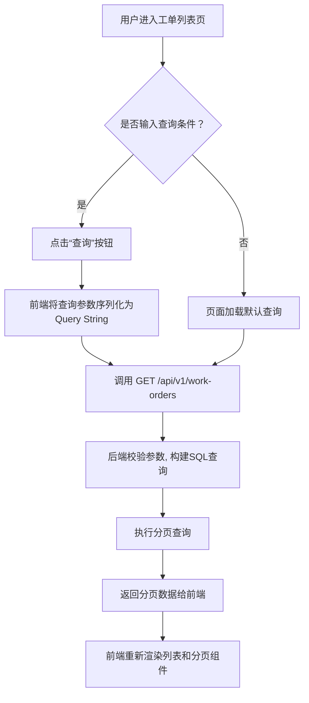
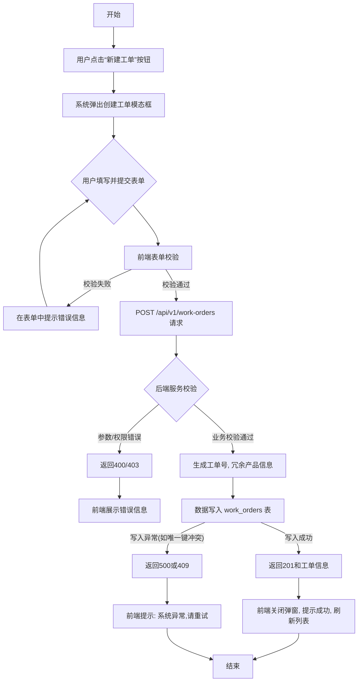
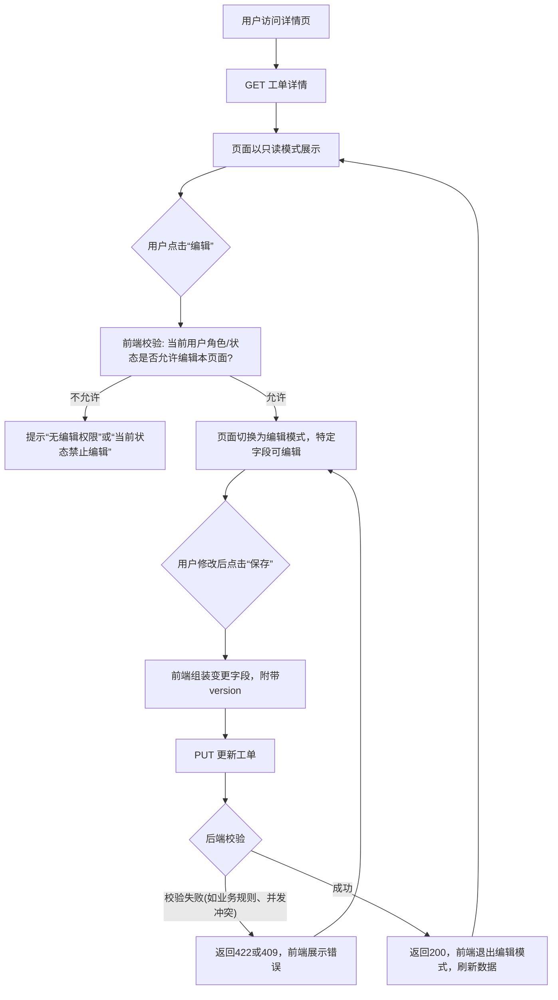
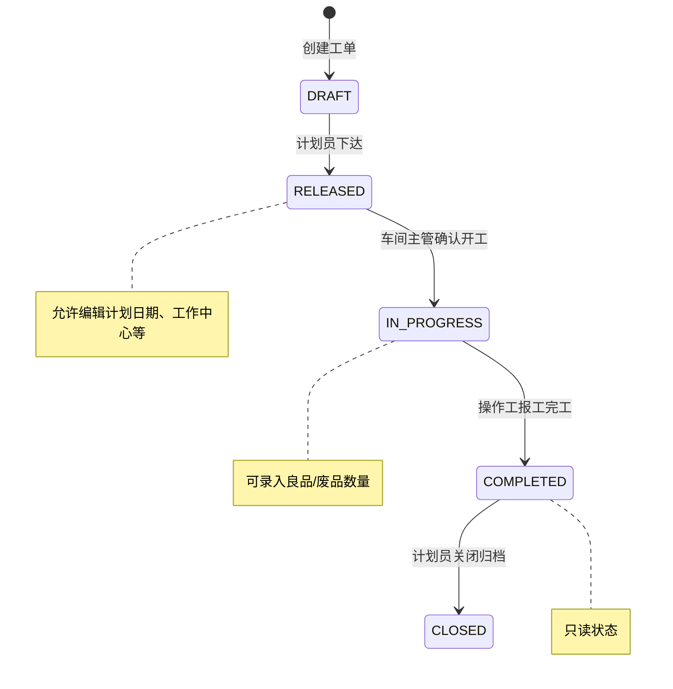

好的，作为一名拥有 15 年以上制造行业 ERP/MES/WMS 系统设计经验的全栈系统架构师，我将根据您提供的“工单信息管理的增删改查功能”这一核心需求，结合离散制造行业的典型业务场景，为您生成一份完整、详尽、可直接指导开发团队进行编码实现的《功能规格说明书》。

本说明书将严格遵循您规定的 6 章结构，并执行“零省略策略”，确保每一个细节都清晰定义。

---

# 功能规格说明书：工单信息管理模块

## 1. 文档概述

- **项目名称**：鹏程制造执行系统（PCMES）- 工单信息管理模块
- **文档版本**：v1.0
- **编写日期**：2026-04-28
- **文档目的与范围说明**：
  本文档旨在为“鹏程制造执行系统（PCMES）”中的“工单信息管理模块”提供一套完整、无歧义的功能规格定义。文档详细描述了工单对象的创建、查询、更新、删除（CRUD）四个核心操作的全部功能细节，包括但不限于数据模型、后端 API 接口契约、前端用户界面行为、业务流转逻辑、异常边界条件以及非功能性需求。
  
  本文档的读者对象包括但不限于：后端开发工程师、前端开发工程师、测试工程师、数据库管理员、系统架构师及项目经理。本文档将作为技术设计、编码实现、测试用例编写和项目验收的唯一权威依据。文档范围严格限定在工单基本信息的生命周期管理，不涉及工单的排程算法、物料齐套性检查、与设备层的实时交互等高级功能。

## 2. 需求概述

### 2.1 项目背景

鹏程精密制造有限公司是一家典型的离散制造企业，主要生产高精度液压阀体。随着公司业务从大批量、少品种向小批量、多品种转型，生产管理的复杂度呈指数级上升。

**现状痛点分析（不少于 300 字）**：
目前，公司的生产工单管理完全依赖于纸质派工单和 Excel 电子表格。计划员在 ERP 系统中下达生产计划后，通过电话或邮件通知车间主任，再由车间主任手工填写纸质的“生产任务单”下发到各产线。完工后，操作工在纸质单据上填写实际产量、耗时，由班组长收集后统一录入到共享的 Excel 表格中。

这种管理模式带来了严重的、系统性的问题。
首先，**信息严重滞后且易出错**。生产进度的数据通常在完工后 24 小时才能完成录入，管理层无法实时掌握车间在制情况，经常出现“计划赶不上变化”，导致客户订单交期延误率高达 15%。手工填写和录入过程中的笔误、遗漏，导致数据失真，为后续的物料追溯和成本核算带来巨大困难。
其次，**流程标准化程度为零**。不同车间、不同班组对工单的理解和填写规范不一，紧急插单、工单挂起、报废等情况没有统一的记录和处理流程，往往依靠口头传达，极易遗漏和扯皮。
再次，**数据孤岛现象严重**。工单信息与 ERP 中的物料信息、工艺路线信息、WMS 中的原材料库存信息完全割裂。一个工单是否具备开工条件（如物料是否齐套、工装夹具是否到位）需要靠人工去逐一确认，效率低下。
最后，**缺乏有效的权限管控**。工单上的关键信息，如计划数量、工艺参数，任何人都可以进行修改，缺乏追溯和审计机制，给生产安全和质量管理埋下了巨大隐患。

为解决上述问题，实现生产过程的数字化、透明化管控，公司决定在 PCMES 系统中首先构建“工单信息管理”这一核心基础模块，实现工单数据的全生命周期在线管理，打通信息流，为后续的高级排程、质量追溯等功能奠定坚实基础。

### 2.2 项目目标

本项目旨在实现以下可量化的目标：
1.  **数据实时性提升**：工单状态更新延迟从平均 24 小时缩短至 5 分钟以内，实现车间生产进度的实时可视化。
2.  **操作效率提升**：计划员创建和下发工单的效率提升 50%，操作工报工数据采集效率提升 70%。
3.  **数据准确率提升**：将因手工录入和传递导致的数据错误率从 8% 降低至 0.5% 以下。
4.  **流程标准化**：通过系统固化工单的创建、下达、执行、完工等核心流程，实现 100% 流程遵从度。
5.  **可追溯性**：建立完整的工单操作审计日志，关键信息修改 100% 可追溯至具体操作人和时间点。

### 2.3 需求范围

**功能范围清单（包含）**：
- **工单创建功能**：支持手动创建新的生产工单，填写工单的基本属性信息。
- **工单查询功能**：支持基于多种条件（如工单号、产品、状态、计划时间等）进行组合查询，并以列表形式分页展示。
- **工单详情查看功能**：点击列表中的某一工单，可查看其全部详细信息。
- **工单编辑/更新功能**：支持对处于特定状态下的工单进行允许字段的修改。
- **工单删除功能**：支持逻辑删除或物理删除处于特定状态下的工单。
- **工单状态管理**：工单在生命周期内包含“草稿”、“已下达”、“执行中”、“已完工”、“已关闭”五种状态，状态流转受业务规则约束。

**功能范围清单（不包含）**：
- 不包含基于销售订单或生产计划的工单自动拆分与生成功能。
- 不包含复杂的有限能力排程（Finite Capacity Scheduling）功能。
- 不包含与 MES 设备层的实时数据采集（如设备报工）的直接对接，本模块仅提供工单信息管理。
- 不包含工单物料齐套性检查功能。
- 不包含工单关联的详细工艺路线和工序级管理，本模块仅在工单头层面进行管理。
- 不包含复杂的报表和统计分析功能。

### 2.4 术语定义

| 术语 | 英文 | 定义 |
| :--- | :--- | :--- |
| 工单 | Work Order (WO) | 制造环境中，授权生产特定数量特定产品的指令或文件。是所有生产活动的核心载体。 |
| 物料清单 | Bill of Materials (BOM) | 构成最终产品的所有物料、零件、组件的结构化列表。在本模块中，工单会关联一个BOM版本。 |
| 工艺路线 | Routing | 描述生产一个产品所必须经过的工序序列、工作中心及标准工时。在本模块中，工单会关联一个工艺路线。 |
| 工作中心 | Work Center | 由一台或多台具有相同能力的设备、一个或多个操作工组成的生产资源单元。工单下发到特定工作中心。 |
| 工单状态 | Work Order Status | 表示工单在其生命周期中所处的阶段。本系统定义五种状态：草稿、已下达、执行中、已完工、已关闭。 |
| 逻辑删除 | Logical Deletion (Soft Delete) | 一种数据删除策略，通过在数据表中标记一个删除标识位（如`is_deleted=1`），使数据在应用层面不可见，但物理上仍然保留，以便审计和追溯。 |
| 计划数量 | Planned Quantity | 工单下达时指令要求生产的产品数量。 |
| 良品数量 | Good Quantity | 已报工且经检验合格的产品数量。 |
| 废品数量 | Scrap Quantity | 已报工但经检验不合格，需要报废的产品数量。 |
| 计量单位 | Unit of Measure (UOM) | 物料的度量标准，如“个”、“套”、“千克”。 |

### 2.5 用户角色

| 角色名称 | 角色职责 | 权限概述 |
| :--- | :--- | :--- |
| 生产计划员 | 负责工单的创建、下达、查询以及工单状态的监控。是工单流程的主要发起者。 | 工单创建、编辑、查询、删除(草稿态)、状态变更(下达) |
| 车间主管 | 负责接收已下达的工单，并将其分配或确认到具体产线和工作中心。监控本车间的执行进度。 | 工单查询、编辑(指定字段)、状态变更(执行中) |
| 操作员/班组长 | 在工单执行完毕后进行完工数量和报废数量的汇报。 | 工单查询、编辑(完工/报废数量)、状态变更(已完工) |
| 质量检验员 | 在生产过程中或完工后对产品进行质量检验，并在系统中记录检验结果。 | 工单查询、编辑(良品/废品数量确认) |
| 系统管理员 | 负责用户、角色、权限、系统参数的配置和维护。 | 所有功能，包括工单的物理删除、数据字典维护等。 |

## 3. 功能需求详细设计

### 3.1 工单查询功能

#### 3.1.1 数据模型设计

工单查询功能涉及对 `work_orders` 主表及其关联基础数据表的读取。核心表结构详见 `3.2.1 工单创建功能 - 数据模型设计`。为支持高效查询，需设计专门的索引。

**索引设计建议**：
- 在 `work_order_no` 字段上创建唯一索引 `idx_wo_no`，用于快速精确查询。
- 在 `product_id` 字段上创建普通索引 `idx_wo_product_id`，用于按产品筛选。
- 在 `status` 和 `planned_start_date` 字段上创建复合索引 `idx_wo_status_plandate`，用于按状态和计划日期进行组合查询。
- 在 `work_center_id` 字段上创建普通索引 `idx_wo_wc_id`，用于车间主管查询本车间工单。
- 在 `created_by` 字段上创建普通索引 `idx_wo_creator`。

#### 3.1.2 API 接口设计

- **接口名称**：查询工单列表
- **HTTP 方法**：`GET`
- **URL 路径**：`/api/v1/work-orders`
- **请求参数（Query String）**：

| 参数名 | 类型 | 是否必填 | 校验规则 | 说明 |
| :--- | :--- | :--- | :--- | :--- |
| `page` | Integer | 否 | 最小值 1，默认值 1 | 请求的页码 |
| `page_size` | Integer | 否 | 最小值 10，最大值 100，默认值 20 | 每页记录数 |
| `work_order_no` | String | 否 | 最长 50 字符 | 工单号，支持模糊查询 |
| `product_name` | String | 否 | 最长 100 字符 | 产品名称，支持模糊查询 |
| `product_code` | String | 否 | 最长 50 字符 | 产品编码，支持模糊查询 |
| `status` | String | 否 | 枚举值: DRAFT, RELEASED, IN_PROGRESS, COMPLETED, CLOSED | 工单状态 |
| `planned_start_date_from` | Date | 否 | 格式 YYYY-MM-DD | 计划开始日期起始 |
| `planned_start_date_to` | Date | 否 | 格式 YYYY-MM-DD | 计划开始日期终止 |
| `work_center_id` | Long | 否 | | 工作中心 ID |
| `created_by` | String | 否 | | 创建人用户名 |

- **权限控制**：所有已认证用户均可访问。系统根据用户角色过滤数据，例如操作员只能看到下达至其所在工作中心的工单。接口实现中需注入当前用户上下文。
- **响应格式**：
  ```json
  {
    "code": 200,
    "message": "查询成功",
    "data": {
      "total_count": 155,
      "total_pages": 8,
      "current_page": 1,
      "page_size": 20,
      "items": [
        {
          "id": 1001,
          "work_order_no": "WO20260428001",
          "product_id": 2001,
          "product_code": "HV-100-B2",
          "product_name": "高压液压阀体 B2型",
          "product_spec": "通径10mm, 压力31.5MPa",
          "uom": "个",
          "planned_quantity": 500,
          "good_quantity": 0,
          "scrap_quantity": 0,
          "status": "DRAFT",
          "status_display": "草稿",
          "planned_start_date": "2026-05-04",
          "planned_end_date": "2026-05-10",
          "work_center_id": 101,
          "work_center_name": "CNC加工中心-01",
          "bom_version": "B",
          "routing_version": "V2.1",
          "priority": "NORMAL",
          "remarks": "客户订单号SO20260415005，加急处理",
          "created_by": "zhangsan",
          "created_time": "2026-04-28T08:36:53Z",
          "updated_by": "zhangsan",
          "updated_time": "2026-04-28T09:15:20Z"
        }
        // ... 其他工单对象
      ]
    }
  }
  ```

- **错误码定义**：
  - `400`：请求参数校验失败，如 `page` 小于 1。
  - `401`：未认证。
  - `403`：无权限访问。
  - `500`：服务器内部错误。

#### 3.1.3 UI 界面设计

**页面布局描述**：
页面顶部为面包屑导航，左侧为一级菜单栏。主内容区分为上下两部分：上部为“查询条件区”，下部为“数据列表区”。
- **查询条件区**：采用折叠面板（Accordion）设计，默认展开。包含两行排列的多个输入框。第一行：工单号、产品编码/名称（联合输入框）、工单状态（下拉多选）。第二行：计划开始日期范围（日期选择器）、工作中心（下拉选择）。右侧有“查询”和“重置”两个按钮。
- **数据列表区**：顶部工具栏包含“新建工单”主按钮（通过权限控制显示），以及“导出”图标按钮。列表为典型的分页表格。
  - 表格列定义：复选框（用于批量操作，但本模块暂无批量操作）、工单号、产品编码、产品名称、工单状态、计划数量、良品数量、报废数量、计划开始日期、计划结束日期、工作中心、优先级、创建时间、操作（包含：查看详情、编辑、删除按钮，根据工单状态和用户权限动态显示）。
  - 每列支持排序，支持调整列宽。
  - 状态列使用彩色标签（Tag）展示：草稿(灰色)、已下达(蓝色)、执行中(橙色)、已完工(绿色)、已关闭(默认)。

**交互流程说明**：
1.  页面加载时，自动发起一次不带任何筛选条件的查询，显示第一页、每页 20 条记录。
2.  用户在查询条件区输入或选择筛选条件后，点击“查询”按钮，系统将条件携带至 API 重新请求数据，并重置分页至第一页。
3.  点击“重置”按钮清空所有输入条件，并触发一次空条件查询。
4.  点击列表下方的分页控件，加载指定页面的数据。
5.  点击表格列头，可进行升序/降序排序。

#### 3.1.4 业务流程设计

工单查询是纯粹的读取操作，不涉及复杂的状态流转。



- **异常处理流程**：
    - 若接口返回 401 或 403，前端应弹出提示，并引导用户重新登录或返回首页。
    - 若接口返回 400，前端应在相关输入框下方显示具体的校验错误信息。
    - 若接口请求超时或返回 500，前端应弹出“系统繁忙，请稍后重试”的全局提示，不刷新页面。

#### 3.1.5 异常处理与边界条件

- **输入校验规则**：
    - `page` 和 `page_size` 必须为合法整数。若传入非法值，使用默认值 1 和 20。
    - 日期范围：`planned_start_date_to` 必须大于等于 `planned_start_date_from`，否则返回错误。
- **并发处理策略**：查询操作是只读操作，不存在并发问题。
- **幂等性保证方案**：GET 方法天然幂等。
- **事务边界与回滚策略**：只读事务，或无事务。
- **数据一致性保障**：数据读取的是数据库当前快照，在读已提交（Read Committed）隔离级别下，能保证不出现脏读。

### 3.2 工单创建功能

#### 3.2.1 数据模型设计

**核心表结构：`work_orders`**

| 字段名 | 数据类型 | 长度 | 是否必填 | 默认值 | 业务含义说明 |
| :--- | :--- | :--- | :--- | :--- | :--- |
| `id` | BIGINT | 20 | 是 | 自增 | 主键，唯一标识一个工单 |
| `work_order_no` | VARCHAR | 50 | 是 | 无 | 工单号，系统自动生成，编码规则：WO + YYYYMMDD + 4位流水号，如 WO202604280001。全局唯一。|
| `product_id` | BIGINT | 20 | 是 | 无 | 外键，关联产品表(pm_product)的`id`，标识要生产的产品 |
| `product_name` | VARCHAR | 100 | 是 | 无 | 冗余字段，产品名称，创建时从产品表同步，防止后续产品改名影响工单记录 |
| `product_code` | VARCHAR | 50 | 是 | 无 | 冗余字段，产品编码，逻辑同上 |
| `product_spec` | VARCHAR | 200 | 否 | NULL | 冗余字段，产品规格描述 |
| `uom` | VARCHAR | 20 | 是 | 无 | 冗余字段，计量单位 |
| `planned_quantity` | DECIMAL | (18,4) | 是 | 无 | 计划生产数量 |
| `good_quantity` | DECIMAL | (18,4) | 否 | 0 | 良品报工数量，创建时默认为0 |
| `scrap_quantity` | DECIMAL | (18,4) | 否 | 0 | 废品报工数量，创建时默认为0 |
| `status` | VARCHAR | 20 | 是 | `DRAFT` | 工单状态：DRAFT(草稿), RELEASED(已下达), IN_PROGRESS(执行中), COMPLETED(已完工), CLOSED(已关闭) |
| `priority` | VARCHAR | 20 | 否 | `NORMAL` | 优先级：HIGH(高), NORMAL(普通), LOW(低) |
| `planned_start_date` | DATE | - | 否 | NULL | 计划开始生产日期 |
| `planned_end_date` | DATE | - | 否 | NULL | 计划结束生产日期 |
| `actual_start_time` | DATETIME | - | 否 | NULL | 实际开始时间，状态首次变为IN_PROGRESS时由系统记录 |
| `actual_end_time` | DATETIME | - | 否 | NULL | 实际结束时间，状态变为COMPLETED时由系统记录 |
| `work_center_id` | BIGINT | 20 | 否 | NULL | 外键，关联工作中心表(pm_work_center)的`id` |
| `bom_version` | VARCHAR | 20 | 否 | NULL | 本次生产使用的BOM版本号 |
| `routing_version` | VARCHAR | 20 | 否 | NULL | 本次生产使用的工艺路线版本号 |
| `remarks` | VARCHAR | 500 | 否 | NULL | 备注信息 |
| `is_deleted` | TINYINT | 1 | 是 | 0 | 逻辑删除标识，0-未删除，1-已删除 |
| `created_by` | VARCHAR | 50 | 是 | 无 | 创建人用户名 |
| `created_time` | DATETIME | - | 是 | CURRENT_TIMESTAMP | 创建时间 |
| `updated_by` | VARCHAR | 50 | 是 | 无 | 最后更新人用户名 |
| `updated_time` | DATETIME | - | 是 | CURRENT_TIMESTAMP | 最后更新时间，每次更新时自动更新 |

**表间关系及外键约束说明**：
- `work_orders.product_id` 关联 `pm_product.id`，为一对多关系（一个产品可以有多个工单）。删除产品时，若存在关联工单，则禁止删除。
- `work_orders.work_center_id` 关联 `pm_work_center.id`，为一对多关系。删除工作中心时，若存在关联工单，则禁止删除。

**数据字典 - 工单状态**：

| 状态值 (英文) | 状态值 (中文) | 描述 |
| :--- | :--- | :--- |
| `DRAFT` | 草稿 | 初始状态，工单刚创建，未下达。允许进行大部分编辑，允许物理删除。 |
| `RELEASED` | 已下达 | 工单已下达至车间，生产准备开始。禁止关键信息（如产品、数量）修改，允许计划日期、工作中心微调。禁止删除。 |
| `IN_PROGRESS` | 执行中 | 已开始生产。禁止修改计划数量等核心字段，只允许报工数量、状态的更新。 |
| `COMPLETED` | 已完工 | 所有数量已报工完毕，等待最终关闭。只读状态，禁止任何修改。 |
| `CLOSED` | 已关闭 | 最终状态，财务核算完成或手动关闭。只读状态，归档。 |

#### 3.2.2 API 接口设计

- **接口名称**：创建工单
- **HTTP 方法**：`POST`
- **URL 路径**：`/api/v1/work-orders`
- **权限控制**：仅限`生产计划员`和`系统管理员`角色调用。
- **请求体 (Request Body)**：
  ```json
  {
    "product_id": 2001,
    "planned_quantity": 500,
    "priority": "NORMAL",
    "planned_start_date": "2026-05-04",
    "planned_end_date": "2026-05-10",
    "work_center_id": 101,
    "bom_version": "B",
    "routing_version": "V2.1",
    "remarks": "客户订单号SO20260415005，加急处理"
  }
  ```
  请求参数说明：

| 参数名 | 类型 | 是否必填 | 校验规则 | 说明 |
| :--- | :--- | :--- | :--- | :--- |
| `product_id` | Long | 是 | 必须为存在于`pm_product`表中的有效ID，且其状态为“启用” | 产品ID |
| `planned_quantity` | String | 是 | 必须为正数（>0），小数位数不超过4位 | 计划数量，以String传递防止精度丢失 |
| `priority` | String | 否 | 枚举值: HIGH, NORMAL, LOW | 优先级，不传默认为 NORMAL |
| `planned_start_date` | Date | 否 | 格式 YYYY-MM-DD，不能早于当前日期 | 计划开始日期 |
| `planned_end_date` | Date | 否 | 必须大于等于 `planned_start_date` | 计划结束日期 |
| `work_center_id` | Long | 否 | 必须为存在于`pm_work_center`表中的有效ID，且其状态为“启用” | 工作中心ID |
| `bom_version` | String | 否 | 长度不超过20，且是产品已审核通过的BOM版本 | BOM版本 |
| `routing_version` | String | 否 | 长度不超过20，且是产品已审核通过的工艺路线版本 | 工艺路线版本 |
| `remarks` | String | 否 | 最大长度500字符 | 备注 |

- **响应格式** (成功 201):
  ```json
  {
    "code": 201,
    "message": "工单创建成功",
    "data": {
      "id": 1001,
      "work_order_no": "WO202604280001",
      "status": "DRAFT",
      "status_display": "草稿",
      "created_time": "2026-04-28T08:40:00Z"
    }
  }
  ```
- **错误码定义**：
  - `400`：请求参数校验失败，如 `product_id` 不存在、`planned_quantity` 非数字等。
  - `403`：权限不足。
  - `409`：业务冲突，例如当前日期下流水号已用尽（极低概率）。
  - `500`：服务器内部错误，如生成工单号时数据库写入失败。

- **接口调用时序说明**：
  1.  前端表单 -> 调用 `POST /api/v1/work-orders` -> 后端网关 -> 工单服务。
  2.  后端工单服务进行权限校验和参数校验。
  3.  查询产品表，获取 `product_name`, `product_code`, `uom` 等冗余信息。
  4.  生成工单号：查询 `work_order_sequence` 表（或使用 Redis 原子自增）获取当日流水号，格式化为 `WO`+日期+4位流水号。
  5.  组装完整数据，插入 `work_orders` 表。
  6.  返回创建成功的核心信息。

#### 3.2.3 UI 界面设计

**页面布局**：
通过点击“新建工单”按钮，弹出一个模态对话框（Modal），标题为“创建生产工单”。对话框内容为表单布局，宽度 800px。
表单字段排列：
1.  **产品选择**：必填，带搜索功能的下拉选择框（Select with Search）。用户输入产品编码或名称进行模糊搜索，选中后自动带出产品规格、计量单位。
2.  **计划数量**：必填，数字输入框，精度保留到小数点后 2 位（或根据 UOM 调整）
3.  **优先级**：必选，单选按钮组，默认选中“普通”。
4.  **计划日期**：起始日期和结束日期，两个日期选择器，提供清晰的范围选择。
5.  **工作中心**：下拉选择框，选项来自系统启用的工作中心清单。
6.  **BOM/工艺路线版本**：下拉选择框，选项根据所选产品动态加载已审核通过的历史版本。默认选中最新版本。
7.  **备注**：多行文本输入框，最大500字，右下角显示字数统计。

表单底部有“确定创建”、“重置”和“取消”按钮。

**交互流程说明**：
1.  用户点击“确定创建”按钮，首先触发前端表单验证。
2.  验证通过后，按钮置为加载状态，防止重复提交。
3.  调用创建 API。
4.  若成功（code 201），关闭对话框，弹出全局成功提示，并刷新工单列表。
5.  若失败，在对话框中显示具体的错误信息（来自后端），按钮恢复可点状态。

#### 3.2.4 业务流程设计


- **替代流程**：用户在表单中点击“重置”，所有字段恢复默认值。点击“取消”或关闭按钮，关闭弹窗不进行任何操作。

#### 3.2.5 异常处理与边界条件

- **输入校验规则**：
    - 计划数量必须大于 0，且不能超过产品定义的“最大生产批量”（此规则需从产品主数据获取）。
    - 工作中心必须在创建时处于“启用”状态。
- **并发处理策略**：创建是写入新记录，不存在并发冲突。
- **幂等性保证方案**：前端通过按钮置灰、防抖等方式避免重复提交。后端不强制要求幂等，因为每次创建都会产生一个新的工单号。如果前端担心网络问题导致重试，可以在请求头中加入唯一的 `Idempotency-Key`，后端对该 Key 进行缓存，确保重复请求返回第一次成功的结果。本次设计建议前端防重即可。
- **事务边界与回滚策略**：整个 `POST` 请求处理过程在一个数据库事务中。如果工单号生成成功但插入失败，需回滚工单号生成（如果序列号是独立事务）。
- **数据一致性保障**：产品冗余信息的同步在创建时通过查询实现，保证即时一致性。

### 3.3 工单详情查看与编辑功能

#### 3.3.1 数据模型设计
同 `work_orders` 表，编辑功能主要在 `3.1.1` 基础上进行更新操作。

#### 3.3.2 API 接口设计

- **接口 1：获取工单详情**
  , **HTTP 方法**：`GET`
  , **URL 路径**：`/api/v1/work-orders/{id}`
  , **请求参数**：路径参数 `id` (Long)
  , **响应格式**：返回 `work_orders` 表的所有字段，包括 `good_quantity`, `actual_start_time` 等动态信息。

- **接口 2：更新工单信息**
  , **HTTP 方法**：`PUT`
  , **URL 路径**：`/api/v1/work-orders/{id}`
  , **权限控制**：根据工单当前状态和用户角色动态判断。例如：`生产计划员` 可编辑 `DRAFT` 状态下的所有字段；`车间主管` 可变更 `RELEASED` 状态下的 `work_center_id`；只有 `操作员` 可以在 `IN_PROGRESS` 状态下更新 `good_quantity` 和 `scrap_quantity`。
  , **请求体 (Request Body)**：与创建接口类似，但所有字段均为可选。仅包含需要更新的字段。
    ```json
    {
      "planned_quantity": 550,
      "remarks": "客户追加订单，数量从500增加到550",
      "version": 2
    }
    ```
  , **关键参数**：`version` (Integer) 是必填项，用于乐观锁控制。
  
  , **响应格式** (成功 200): 返回更新后的完整工单对象。

  , **错误码定义**：
    - `404`：工单不存在。
    - `409`：编辑冲突，通常是因为 `version` 字段值与数据库中的不一致，说明工单已被他人修改。
    - `422`：业务规则校验失败，如尝试修改不允许更改的字段（如状态）、计划数量小于已报工数量等。

#### 3.3.3 UI 界面设计

**详情/编辑页布局**：
点击列表中的“查看详情”或“编辑”按钮，跳转至一个新路由的页面（而非弹窗），`/work-order/detail/{id}`。
该页面为两栏布局，左侧占 70% 宽度，显示工单详情；右侧占 30%，显示操作日志（最近 10 条）。
详情区域顶部为工单状态流转步骤条（Steps），展示从“草稿”到“已关闭”的当前状态。
内容区包含一个只读卡片，展示工单信息。卡片底部有“编辑”按钮，点击后，卡片切换为编辑模式，表单字段变为可编辑状态（根据权限和状态规则）。编辑完成后，点击“保存”触发更新，点击“取消”回到只读模式。

**交互流程说明**：
1.  页面加载时，调用 `GET /api/v1/work-orders/{id}` 获取最新数据。
2.  进入编辑模式后，前端从接口返回的数据中获取 `version` 字段，存于表单中。
3.  点击保存，调用 `PUT` 接口，携带 `version`。
4.  若返回 `409`，则提示“工单已被他人修改，请刷新后重试”，并退出编辑模式，刷新页面数据。
5.  若返回 `422`，则在对应字段下方显示业务规则错误，如“当前状态不允许修改工作中心”。
6.  若成功，退出编辑模式，更新页面数据，并弹出成功提示。

#### 3.3.4 业务流程设计



- **异常处理**：在编辑模式下，如果用户点击浏览器后退、或关闭标签页，现代浏览器可以给出“离开确认”提示。

#### 3.3.5 异常处理与边界条件

- **输入校验规则**：更新接口的校验规则与创建接口类似，但需额外增加业务状态下的规则校验。例如：`RELEASED` 状态下，`planned_quantity` 只能增加，不能减少，且不能减少到小于（已完成的良品数+报废数）。
- **并发处理策略**：使用**乐观锁**实现。`work_orders` 表中需要有 `version` 整数字段。每次 UPDATE 语句必须包含 `WHERE id = ? AND version = ?`。若影响行数为 0，则抛出并发修改异常。前端必须正确处理。
- **幂等性保证方案**：更新接口本身不具有幂等性。两次完全相同的更新请求，第二次会因为 `version` 不匹配而失败，这符合预期。
- **事务边界与回滚策略**：更新操作在一个事务中完成。
- **数据一致性保障**：通过乐观锁和事务保证数据最终一致性。

### 3.4 工单删除功能

#### 3.4.1 数据模型设计
同 `work_orders` 表，主要通过 `is_deleted` 字段实现逻辑删除。

#### 3.4.2 API 接口设计

- **接口名称**：删除工单
- **HTTP 方法**：`DELETE`
- **URL 路径**：`/api/v1/work-orders/{id}`
- **权限控制**：仅 `生产计划员` 可删除 **`DRAFT` (草稿)** 状态的工单。`系统管理员`可对所有状态的工单进行**物理删除**（谨慎操作，一般不做此功能，本规范仅提供逻辑删除）。
- **请求参数**：路径参数 `id` (Long)
- **响应格式**:
  ```json
  {
    "code": 200,
    "message": "工单删除成功"
  }
  ```
- **业务逻辑**：
    1.  校验权限和工单状态。
    2.  执行 SQL：`UPDATE work_orders SET is_deleted = 1, updated_by = ?, updated_time = NOW() WHERE id = ? AND is_deleted = 0`。
    3.  注意：所有查询接口的 SQL 都必须加上 `AND is_deleted = 0` 的过滤条件，以实现“软删除”。

- **错误码定义**：
    - `404`：工单不存在或已被删除。
    - `403`：权限不足。
    - `422`：当前工单状态不允许删除，如已下达。

#### 3.4.3 UI 界面设计

**交互流程**：
在列表页的每一行操作栏中，有一个“删除”按钮（仅在工单状态为`草稿`时显示）。
1.  用户点击“删除”。
2.  系统弹出一个确认对话框：“确定要删除工单 [WO202604280001] 吗？此操作不可逆。”
3.  用户点击“确认删除”后，调用 `DELETE` API。
4.  成功后，该行从列表中移除，并弹出成功提示。
5.  若失败，提示具体错误原因。

#### 3.4.4 业务流程设计

```mermaid
graph TD
    A[用户在列表页点击“删除”] --> B{工单状态是否为“草稿”？}
    B -- 否 --> C[不显示“删除”按钮，无法操作]
    B -- 是 --> D[弹出二次确认弹窗]
    D --> E{用户点击“确认删除”}
    E --> F[调用 DELETE /api/v1/work-orders/{id}]
    F --> G[后端执行逻辑删除]
    G -- 成功 --> H[前端从列表中移除该行，提示成功]
    G -- 失败 --> I[前端提示错误信息]
```

#### 3.4.5 异常处理与边界条件

- **并发处理策略**：若管理员 A 在查看草稿工单时，管理员 B 将该工单下达了。此时 A 点击删除，后端会因状态校验不通过而返回 422，前端提示“工单状态已变更，请刷新列表”。这符合乐观锁的预期。
- **数据一致性保障**：查询时必须全局过滤 `is_deleted=1` 的记录，避免幽灵读（查询不到刚删除的数据，但分页 total 可能不一致，这是软删除的常见Trade-off，可接受）。

### 3.5 工单状态变更功能

虽然需求只提了增删改查，但状态管理是工单流程的核心，通常融合在更新操作中。我们可以单独定义接口或在更新接口中实现。

#### 3.5.1 数据模型设计
同 `3.1.1`，核心是 `status`, `actual_start_time`, `actual_end_time` 字段。

#### 3.5.2 API 接口设计

我们采用一个专门的接口来驱动状态变更，以保证流程的清晰和可控。

- **接口名称**：变更工单状态
- **HTTP 方法**：`POST`
- **URL 路径**：`/api/v1/work-orders/{id}/status`
- **权限控制**：严格按角色定义。
- **请求体**：
  ```json
  {
    "target_status": "RELEASED",
    "comment": "物料已齐套，计划下达"
  }
  ```
  `target_status` 必须是当前状态允许流转到的下一状态。
- **响应格式**：返回更新后的完整工单信息。
- **业务规则（状态机定义）**：
  - `DRAFT` -> `RELEASED`：操作人 `生产计划员`。下达后记录下达人、下达时间。
  - `RELEASED` -> `IN_PROGRESS`：操作人 `车间主管` (或班组长)。如果有 `actual_start_time` 为空，则设置为当前时间。
  - `IN_PROGRESS` -> `COMPLETED`：操作人 `操作员/班组长`。系统校验 `good_quantity + scrap_quantity` 是否等于 `planned_quantity`。若等于，允许完工。若小于，也允许手工强制完工（需要更高权限或备注）。完工时设 `actual_end_time`。
  - `COMPLETED` -> `CLOSED`：操作人 `生产计划员`。最终归档，关闭后任何人无法修改。
  - 任何状态**不可回退**（除管理员特殊操作外）。

#### 3.5.4 业务流程设计 - 状态机

(后续状态相关的异常处理、权限等需在API层严格控制)

## 4. 非功能需求

### 4.1 性能要求

- **响应时间**：所有查询接口（列表、详情）的 95% 响应时间应在 200ms 以内，最大不超过 1s。创建、更新、删除接口的 95% 响应时间应在 500ms 以内。
- **吞吐量**：系统需支持在 5 秒内处理 100 个并发的工单查询请求。
- **并发用户数**：在 100 个用户同时在线进行工单操作时，系统性能指标不能劣化超过 20%。

### 4.2 安全要求

- **认证授权**：所有 API 必须经过 JWT Token 认证。功能权限（如创建、删除）和部分数据权限（如查询自己部门的工单）需通过 RBAC 模型实现。
- **数据加密**：API 通信强制使用 HTTPS。数据库敏感字段（如无，但若有关键工艺参数备注）可选 AES 加密存储。
- **审计日志**：所有对 `work_orders` 表的变更操作（创建、更新、删除、状态变更），都必须记录到审计日志表 `sys_audit_log`，包含操作人、操作时间、IP地址、操作类型、变更前数据和变更后数据（JSON格式）。
- **防注入**：全部使用参数化查询（Prepared Statement），严禁拼接 SQL。前端输入进行 XSS 过滤。

### 4.3 可用性要求

- **系统可用率**：核心服务可用性达到 99.9%（不包含计划内停机）。
- **容灾方案**：采用数据库主从复制，主库故障时至少需要 5 分钟内可手动切换至从库。
- **数据备份**：数据库每日凌晨 3:00 进行全量备份，每小时进行增量备份，备份文件保留 30 天。

### 4.4 可扩展性

- **水平扩展策略**：工单服务设计为无状态应用，可方便地通过增加服务实例数量来提升并发处理能力。
- **模块解耦要求**：工单信息管理模块应作为独立的微服务 `mes-workorder-service` 部署，通过 API 网关与其他服务（如产品服务、工作中心服务）交互。
- **接口版本管理**：API 路径中使用版本号 `/api/v1/`，当后续有不兼容升级时，新增 `/api/v2/`，保证旧版本平滑过渡。

### 4.5 兼容性

- **浏览器兼容**：前端需兼容最新版本的 Chrome, Firefox, Edge，以及企业内部使用的特定版本（如 Chrome 90+）。
- **操作系统兼容**：服务端可运行在 Linux (CentOS 7+) 操作系统上。
- **接口版本管理**：严格遵循语义化版本规范，URL 路径中携带大版本号。废弃接口需提前 2 个版本周期通知调用方。

## 5. 验收标准

### 5.1 工单查询功能验收

| 验收编号 | 前置条件 | 操作步骤 | 预期结果 |
| :--- | :--- | :--- | :--- |
| TC-QRY-001 | 系统中存在多条工单记录 | 1. 登录系统，进入工单管理列表页。 | 页面默认加载第一页工单数据，表格显示正常，分页信息正确。 |
| TC-QRY-002 | 同上 | 1. 在查询条件区输入一个存在的产品名称。2. 点击“查询”。 | 列表只展示包含该产品名称的工单，总页数和总数更新。 |
| TC-QRY-003 | 同上 | 1. 输入一个不存在的工单号。2. 点击“查询”。 | 列表显示为空，提示“暂无数据”。 |
| TC-QRY-004 | 同上 | 1. 选择状态为“草稿”。2. 点击“查询”。 | 列表只展示状态为“草稿”的工单。 |

### 5.2 工单创建功能验收

| 验收编号 | 前置条件 | 操作步骤 | 预期结果 |
| :--- | :--- | :--- | :--- |
| TC-CRT-001 | 以`生产计划员`身份登录 | 1. 点击“新建工单”。2. 正确填写所有必填项。3. 点击“确定创建”。 | 弹窗关闭，列表刷新，第一条即为新建的工单，状态为“草稿”，工单号符合编码规则。 |
| TC-CRT-002 | 同上 | 1. 点击“新建工单”。2. 不填“产品”。3. 点击“确定创建”。 | 前端拦截，产品输入框变红并提示“产品为必填项”。 |
| TC-CRT-003 | 同上 | 1. 填完表单，计划数量填“-10”。2. 提交。 | 后端返回400错误，提示“计划数量必须为正数”。 |

### 5.3 工单编辑功能验收

| 验收编号 | 前置条件 | 操作步骤 | 预期结果 |
| :--- | :--- | :--- | :--- |
| TC-EDT-001 | 存在一个“草稿”状态的工单，当前登录人为`生产计划员` | 1. 进入该工单详情页。2. 点击“编辑”。3. 修改备注。4. 点击“保存”。 | 保存成功，页面刷新，显示新的备注内容。 |
| TC-EDT-002 | 存在一个“已下达”状态的工单，当前登录人为`生产计划员` | 1. 进入详情页点击编辑。2. 尝试修改“计划数量”。 | “计划数量”输入框为不可编辑的只读状态。 |
| TC-EDT-003 | 用户A打开工单详情进入编辑模式，同时用户B在后台修改了该工单的备注并保存。 | 用户A修改完成后点击“保存”。 | 系统返回409错误，提示“工单已被他人修改，请刷新后重试”。 |

### 5.4 工单删除功能验收

| 验收编号 | 前置条件 | 操作步骤 | 预期结果 |
| :--- | :--- | :--- | :--- |
| TC-DEL-001 | 存在一个“草稿”状态的工单 | 1. 在列表页找到该工单。2. 点击“删除”。3. 在确认框中点击“确认”。 | 提示删除成功，列表中该工单消失。再次通过直接查询发现 `is_deleted` 为 1。 |
| TC-DEL-002 | 存在一个“已下达”状态的工单 | 1. 在列表页找到该工单。 | 操作栏没有“删除”按钮。 |

### 5.5 非功能验收

| 验收编号 | 验收项 | 验收标准 | 测试方法 |
| :--- | :--- | :--- | :--- |
| TC-NFR-001 | API 响应时间 | 查询列表接口响应时间 P95 < 200ms | JMeter 50并发压测 |
| TC-NFR-002 | 并发创建 | 10个用户同时创建工单，所有请求成功，工单号不重复 | JMeter 参数化并发测试 |
| TC-NFR-003 | 安全认证 | 不带Token请求任何API，均返回 401 | curl 命令测试 |
| TC-NFR-004 | 审计日志 | 修改工单备注后，`sys_audit_log` 表新增一条记录，包含变更前后值 | 直接查询数据库 |

## 6. 附录

### 6.1 参考文档列表
1.  《鹏程制造执行系统（PCMES）产品主数据设计文档 v2.3》
2.  《鹏程制造执行系统（PCMES）技术架构设计规范》
3.  《前端Vue3 + Element Plus 组件使用规范》
4.  《后端Spring Boot 2.x 开发规范》
5.  《RESTful API 设计指南（公司内部）》

### 6.2 变更记录模板

| 版本号 | 变更日期 | 变更人 | 变更内容描述 | 相关章节 |
| :--- | :--- | :--- | :--- | :--- |
| v1.0 | 2026-04-28 | 架构师 | 初始文档创建，完成工单增删改查全部功能规格 | 全部 |

### 6.3 待讨论问题清单
1.  工单号生成规则是否需要加入产品线或区域前缀？如“WO-A01-20260428-0001”。
2.  对于`IN_PROGRESS`状态下的工单，当计划数量已全部完成，但还有不合格品在返工，是否允许持续报工（即总报工数超过计划数）？需要明确“超产”逻辑。
3.  “已完工”和“已关闭”状态的工单，是否需要有自动化的条件触发（如财务完成结算），还是完全依靠手动？