# 业务场景

积累遇到的各类业务场景，遇到同类场景提供解决方案。

## 1、表单不同字段联动

需求：根据勾选状态，来控制 Linq 只读输入框动态变为 readonly
表单后端视图配置 bind_disabled
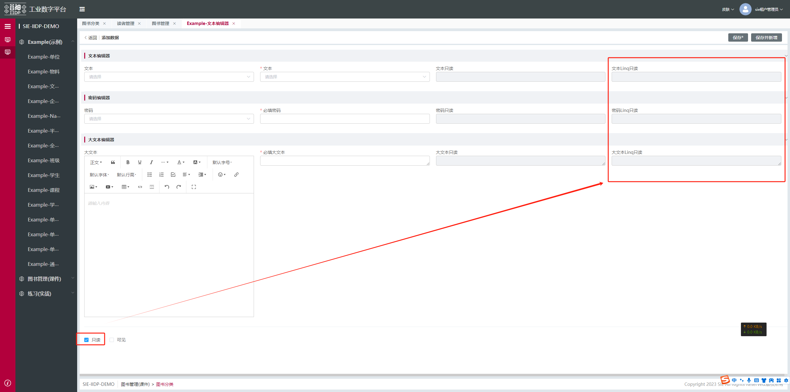

```js
{
   "displayName": "文本Linq只读",
           "name": "textLinqReadOnly",
           "groupConf": {
      "name": "文本编辑器",
              "id": "baseInfo1"
   },
   "bind_disabled": "${$ds.form.readOnly === true}"
}
```

## 2、扩展表格接口请求前和请求后的入参和出参

<a href="/iidpdoc/case_js/table_data_extend.js" target="_blank" download="table_data_extend.js">
  js 扩展案例下载
</a>

需求：扩展表格接口请求前和请求后的入参和出参<br>
实现：找到节点 模型名字+\_table_main
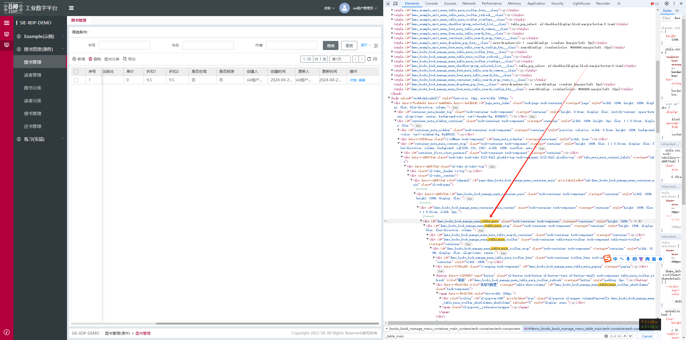

## 3、扩展保存表单出参和入参

<a href="/iidpdoc/case_js/form_update_extend.js" target="_blank" download="form_update_extend.js">
  js 扩展案例下载
</a>

需求：扩展保存表单出参和入参<br>
实现：找到节点 模型名 +\_form_main_detail_top_common
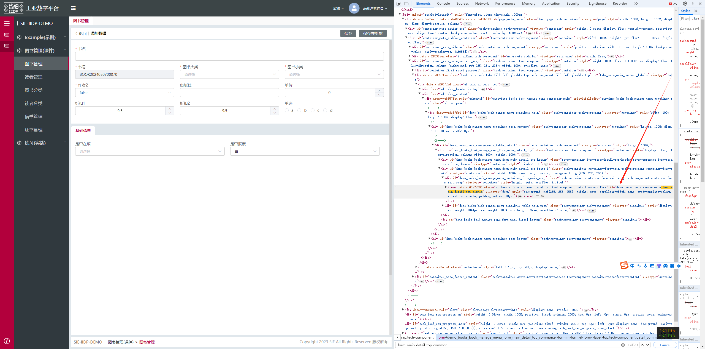

## 4、对子表的表格进行增删改

<a href="/iidpdoc/case_js/add_delete_update.js" target="_blank" download="add_delete_update.js">
  js 扩展案例下载
</a>

需求：对子表的表格进行增改删<br>
实现：找到节点 模型名 +\_table_main_table
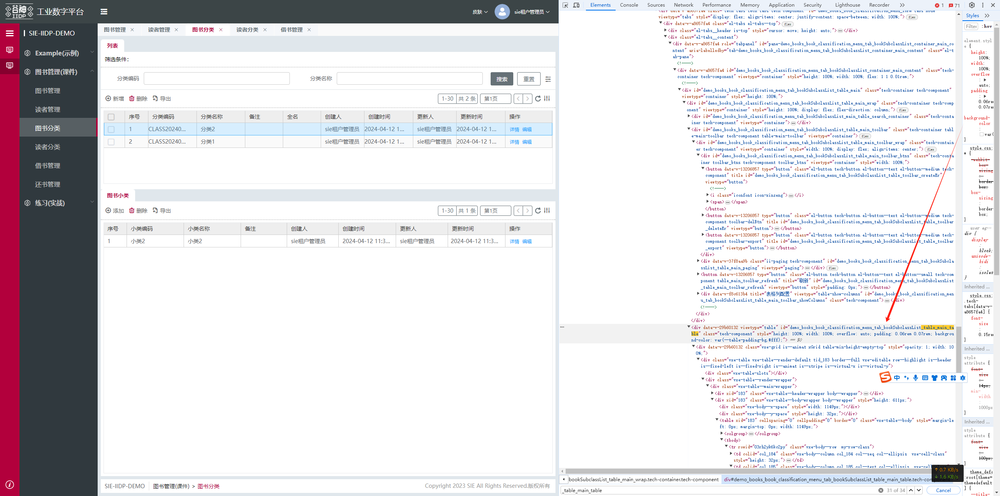

## 5、加载全部 tabs 的 dom 节点

<a href="/iidpdoc/case_js/tabs_node.js" target="_blank" download="tabs_node.js">
  js 扩展案例下载
</a>

需求：加载全部 tabs 的 dom 节点<br>
实现：找到节点 模型名 +\_form-tabs-node
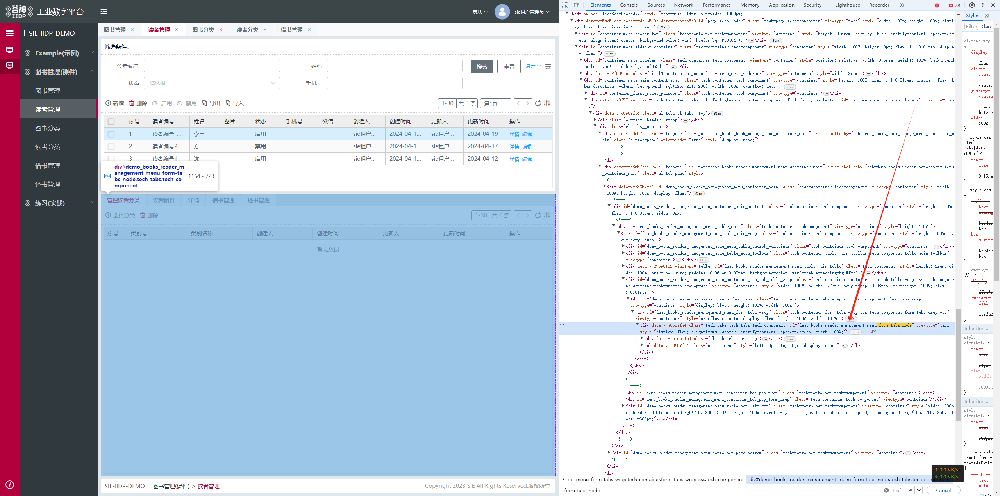

## 6、按钮原有的点击事件添加前置判断条件

<a href="/iidpdoc/case_js/before_click.js" target="_blank" download="before_click.js">
  js 扩展案例下载
</a>

需求：按钮原有的点击事件添加前置判断条件<br>
实现：找到按钮 id
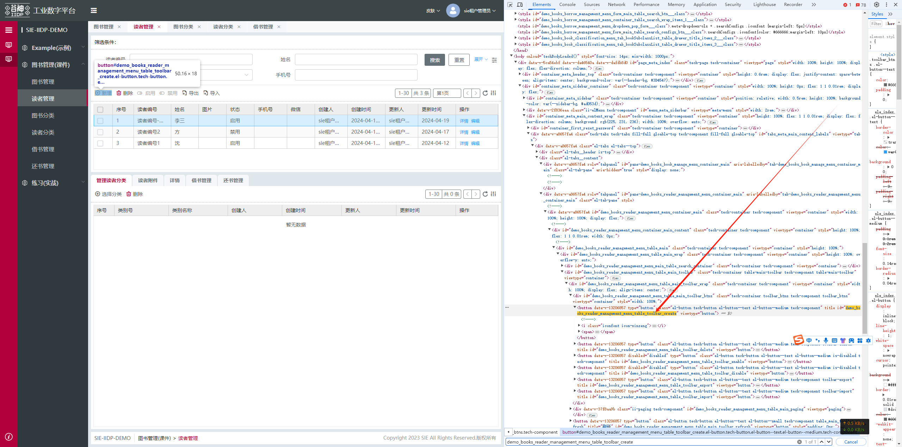

## 7、扩展导出按钮的请求参数

<a href="/iidpdoc/case_js/other_service.js" target="_blank" download="other_service.js">
  js 扩展案例下载
</a>

需求：扩展导出按钮的请求参数<br>
实现：找到导出按钮 id

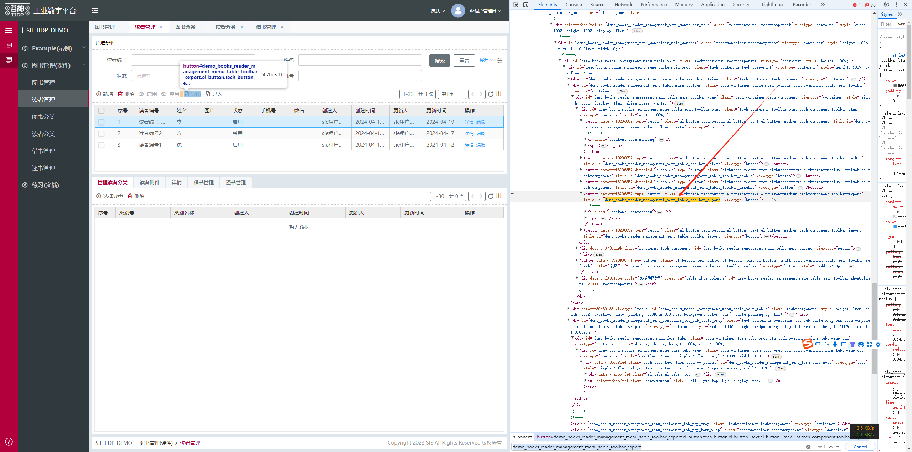

## 8、lookup 请求扩展

<a href="/iidpdoc/case_js/hanger.js" target="_blank" download="hanger.js">
  js 扩展案例下载
</a>

需求：扩展导出按钮的请求参数<br>
实现：如下<br>

1. 找到 lookup 节点 id
   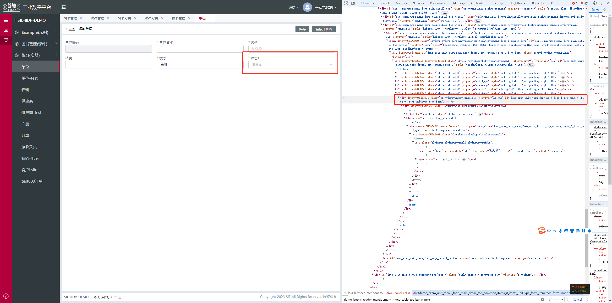
2. 在后端视图配置个钩子
   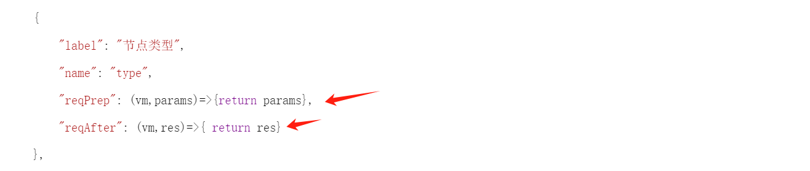

## 9、扩展弹窗的确定和关闭事件

<a href="/iidpdoc/case_js/view_customClick.js" target="_blank" download="view_customClick.js">
  js 扩展案例下载
</a>

需求：扩展导出按钮的请求参数<br>
实现：找到节点 id 后缀是 view_customClick 或者 view_click
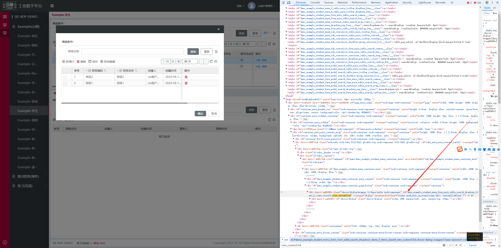

## 10、扩展表格增加展开行

<a href="/iidpdoc/case_js/enfoldmentTable.js" target="_blank" download="enfoldmentTable.js">
  js 扩展案例下载
</a>

需求：增加表格展开行<br>
实现：1、在对应下拉字段下添加 expand，2、找到弹窗 id 后缀 table_main_table
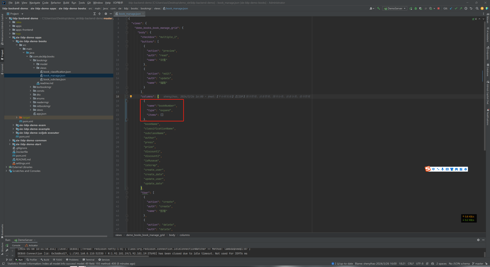
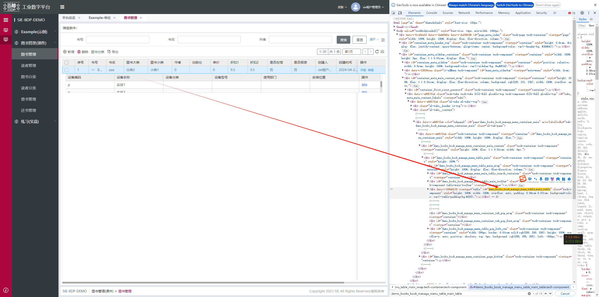

## 11、页面与平台之间的消息传递

```js
// 发送消息
window.parent.postMessage(
  {
    type: "PAGE_FN",
    fn: sendFn + "", // 需要传字符串方法
    params: {}, // sendFn方法的参数
  },
  "http://xxxx.com" // 平台地址
);
const sendFn = (params) => {
  console.log("iidp token", this.Tech.token.get()); // this指向平台window对象
};
```

## 12.修改浏览器页签图标

- 某个 app 的 apps\demo\common\common.js 文件中配置 logo
- 图标可放置在 static-resource 文件夹中

```js
export default {
  config: {
    logo: async () => {
      const v = await import("../static-resource/login.png");
      return v.default;
    },
  },
};
```

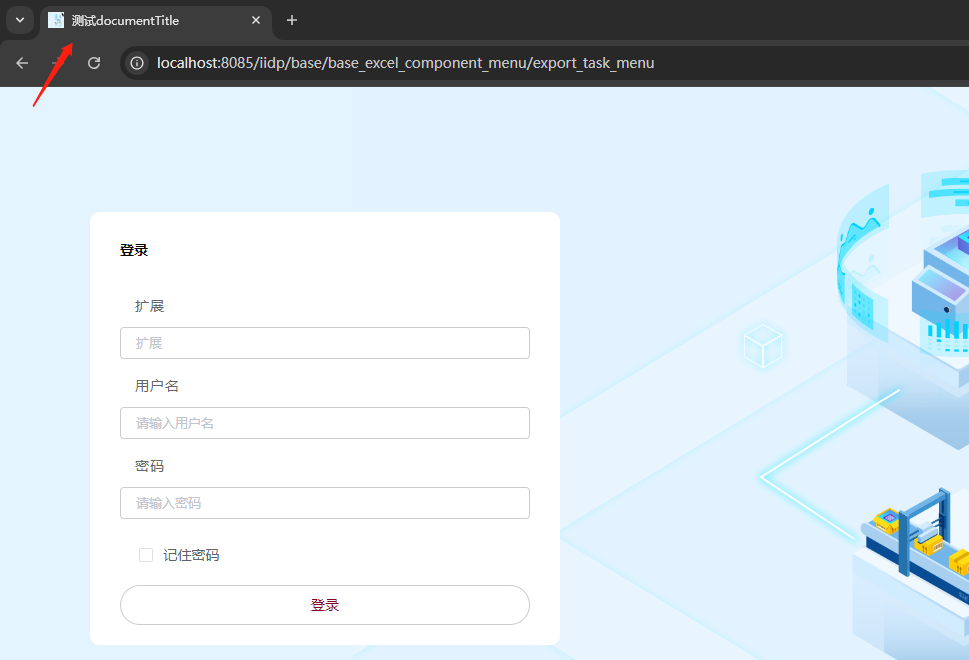

## 13.修改登录页浏览器页签标题

- 扩展设置 document.title

```js
// 修改登录页签title
  page_meta_login_extend: {
    type: 'custom',
    selector: {
      attr: 'id',
      value: 'page_meta_login'
    },
    beforeOperate: (app, operateItem, options) => {
      if (!options._page_meta_login_created) {
        options._page_meta_login_created = true;
        // 暂存原方法
        let srcFn = options.element.created;
        options.element.created = (vm) => {
          // 执行其他操作
          srcFn(vm); // 执行原方法
          document.title = '测试documentTitle';
        };
      }
    }
  }
```


## 14.修改平台 logo

```js
// 引入图片
import topLogoIcon from '../../static-resource/logo.png';

// 修改logo和名称
  iidp_container_meta_header_logo_extend_view: {
    selector: {
      attr: 'id',
      value: 'container_meta_header_logo' // 在app节点上扩展theme属性
    },
    type: 'merge',
    view: {
      created: (vm) => {
        // 修改名称
        vm.data.items[0].value = '数智制造平台';
        vm.data.items[0].style.lineHeight = '0.24rem';
        vm.data.items[0].style.marginLeft = '0.4rem';
        vm.data.items[0].style.fontSize = '0.18rem';
      },
      style: {
        height: '.26rem',
        marginLeft: '0.14rem',
        marginTop: '0.08rem',
        backgroundImage: topLogoIcon, // 可用本地图，也可用线上图片
        // 'https://gimg3.baidu.com/search/src=https%3A%2F%2Ffeed-image.baidu.com%2F0%2Fpic%2F-1481604605_-1950231128_-1883296566.jpg&refer=http%3A%2F%2Fwww.baidu.com&app=2021&size=f360,240&n=0&g=0n&q=75&fmt=auto?sec=1733504400&t=ba0d18df633264f042652c5ff73f4223',
        backgroundPosition: 0,
        backgroundRepeat: 'no-repeat',
        backgroundSize: 'contain',
        cursor: 'pointer'
      }
    }
  },
```

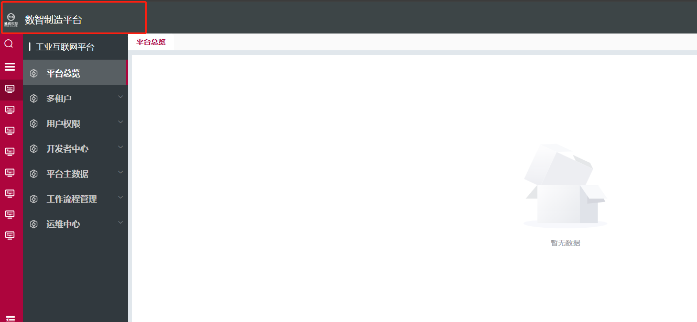
