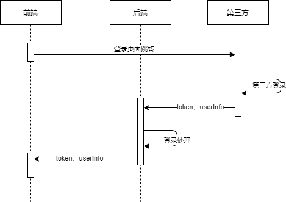

## 第三方登录

使用第三方网站登录，再跳转回自己的网站。

### 第三方登录流程

1. 用户进入登录页面，自动跳转到第三方的登录页面
2. 第三方登录成功，后端处理数据，携带 token，重定向到平台登录页面
3. 登录成功，正常使用



### 配置示例

该配置在`/config/apps.json`中

```json
{
  "self": {},
  "apps": {},
  "templateApp": "TechMetaPage",
  "SSO": {
    "loginUrl": "http://xxxx.xxx.com/login",
    "logoutType": "cas"
  }
}
```

### 配置说明

| 配置       | 描述                 |
| ---------- | -------------------- |
| loginUrl   | 第三方登录地址       |
| logoutType | 登出标识，与后端协商 |

### 注意事项

后端重定向返回 token 默认配置 setCookie，需要检查响应头是否带有`httpOnly`标记，有`httpOnly`标记的内容无法读取，即登录不成功。
解决方案，把需要的数据拼接到 url 中，一般携带 `token`、`userInfo`、`type='cas'`等参数
