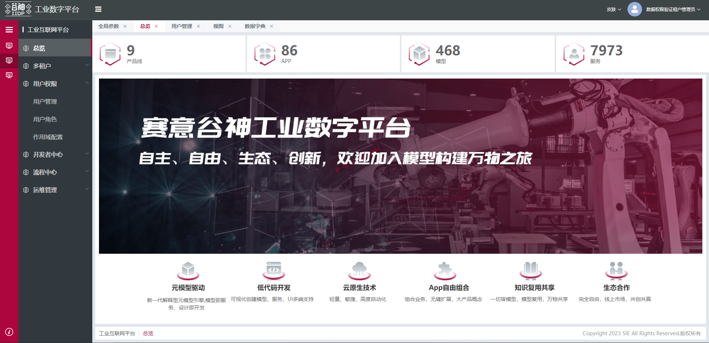

## 实现自定义页面

三种方式：

> 方式一： 
完全自定义整个页面，封装成组件，然后通过前端扩展能力嵌入菜单对应的页面内（不支持无源码二开）

> 方式二：
封装小颗粒度的组件，然后通过前端扩展能力将小组件拼接，最后嵌入菜单对应的页面内（支持二开）

> 方式三：
使用无界微前端，完全自定义，直接 **[配置菜单](/pages/718bde/#wujie)** 数据嵌入到页面  

如首页总览页面(方式二)
