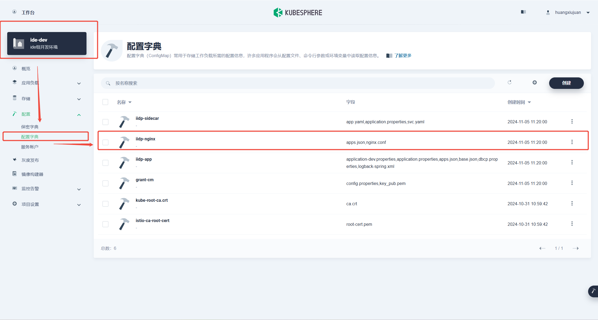
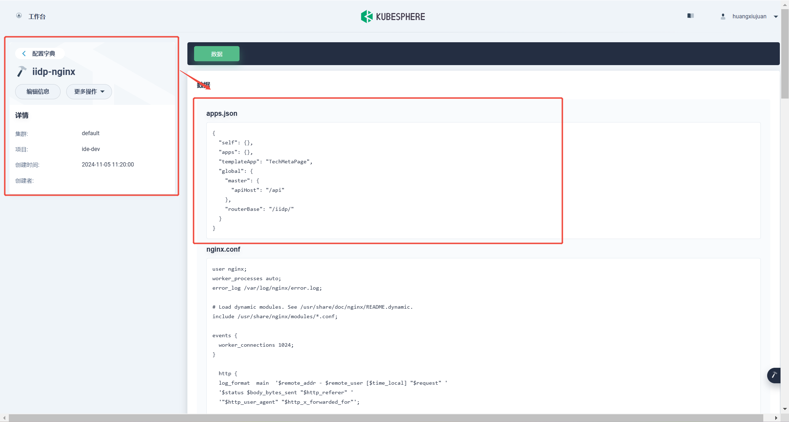
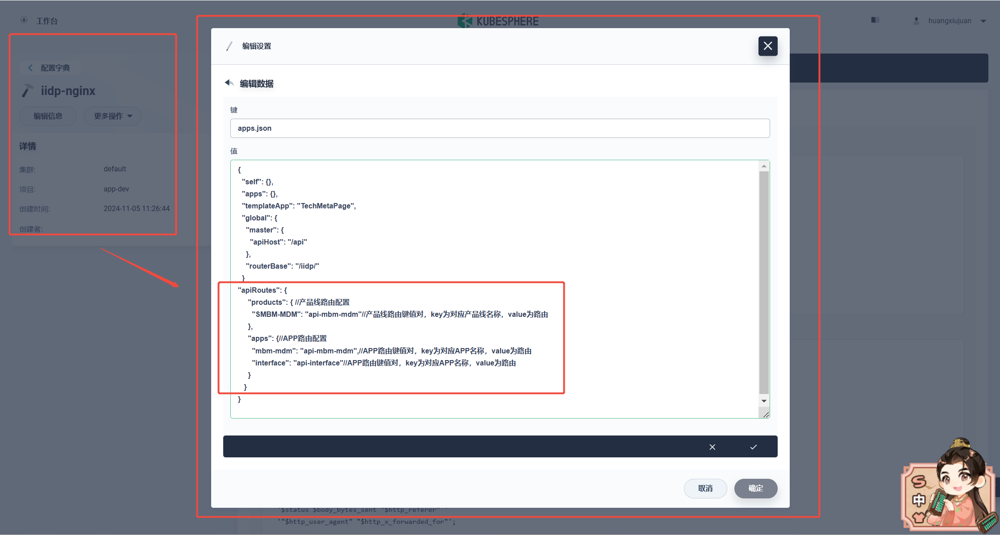
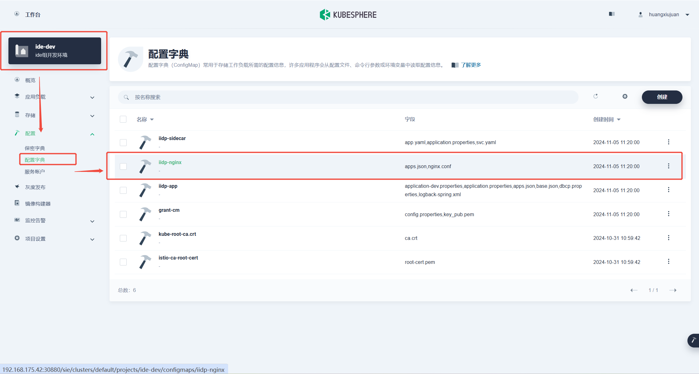
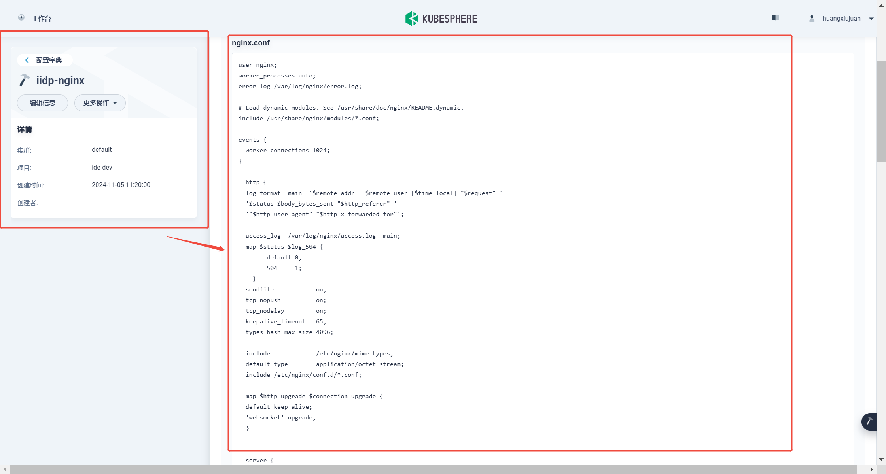
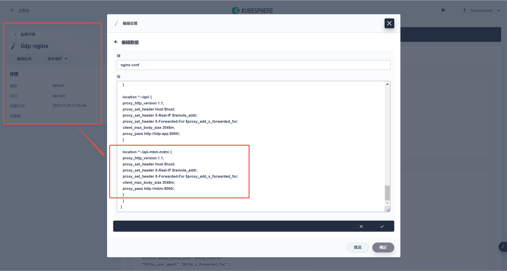
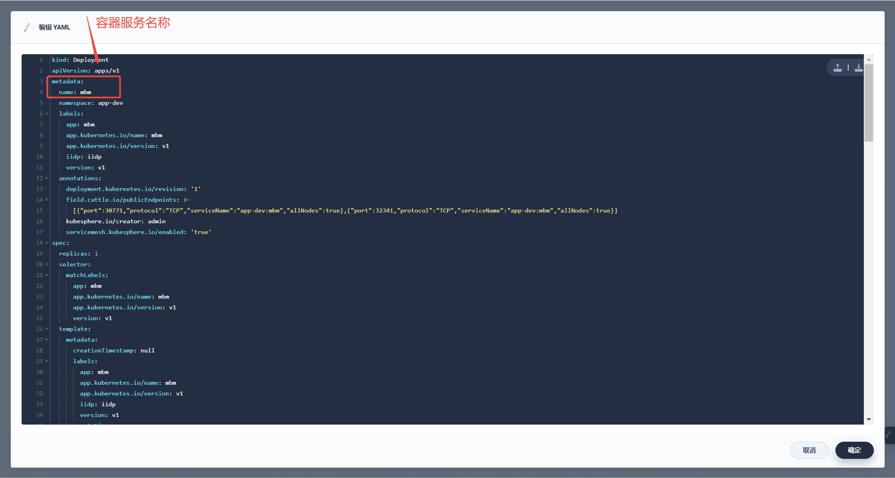
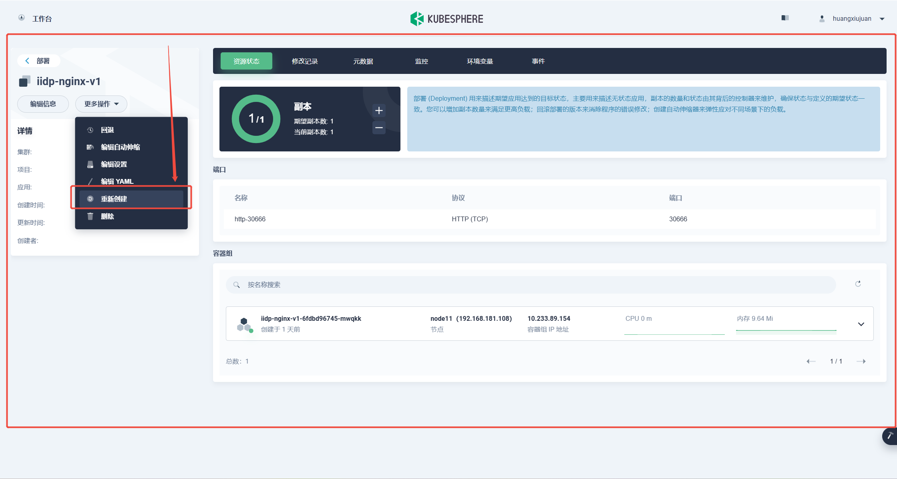
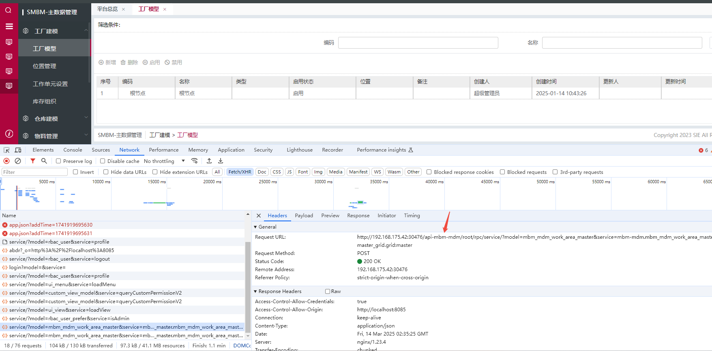

## 需求背景

前端apps.json增加配置，按产品线/APP配置路由，由后端的统一网关改为从nginx直接分流，通过上下文分发到各个产品线的容器，从入口上完全分流，达到按产品线/APP分流的目标。

- 注：在进行路由配之前请先把应用安装完成，保证容器是存在的，若先配置了路由再安装应用创建容器需再次重启Nginx服务

## 一、apps.json 配置调整 

1.1 进入K8s命名空间：首先，导航至Kubernetes控制台中你的项目所处的命名空间。

1.2 访问配置字典：在该命名空间下找到并点击“配置字典”选项。



1.3 编辑 `iidp-nginx` 的 `apps.json` 文件：

- 找到名为 `iidp-nginx` 的配置项。
- 点击“更多操作”，然后选择“修改 `apps.json`”。



1.4 添加或更新路由配置：
- 根据需要，在 `apps.json` 中添加或更新产品线/APP的路由配置。例如：（配置1.5）



1.5. apps.json配置范例：
```js
{
  "self": {},
  "apps": {},
  "templateApp": "TechMetaPage",
  "global": {
    "master": {
      "apiHost": "/api"
    },
    "routerBase": "/iidp/"
  }
"apiRoutes": {
     "products": { //产品线路由配置
       "SMBM-MDM": "api-mbm-mdm"//产品线路由键值对，key为对应产品线名称，value为路由
     },
     "apps": {//APP路由配置
       "mbm-mdm": "api-mbm-mdm",//APP路由键值对，key为对应APP名称，value为路由
       "interface": "api-interface"//APP路由键值对，key为对应APP名称，value为路由
     }
   }
}
```

## 二、nginx 配置调整

2.1. 重复步骤1和2：按照上述步骤，再次进入项目的K8s命名空间及配置字典。



2.2. 编辑 `iidp-nginx` 的 `nginx.conf` 文件：

- 同样地，找到 `iidp-nginx` 并选择“修改 `nginx.conf`”。



2.3. 根据需求添加转发规则：

- 确定需转发的路由及其对应的服务名称，然后在 `nginx.conf` 中添加相应的转发规则。（配置如下2.6）



2.4、确定路由转发服务名称



2.5、重启nginx

（点击重新创建iidp-nginx-v1）



2.6、nginx.conf 配置示例

（以下是一个简单的 `nginx.conf` 示例部分，用于展示如何设置转发规则）

```js
  location ^~/api-mbm-mdm/ {
  proxy_http_version 1.1;
  proxy_set_header Host $host;
  proxy_set_header X-Real-IP $remote_addr;
  proxy_set_header X-Forwarded-For $proxy_add_x_forwarded_for;
  client_max_body_size 2048m;
  proxy_pass http://mbm:8060/;
  }

```

## 三、页面效果展示

- 替换接口api前缀，成功分流请求



