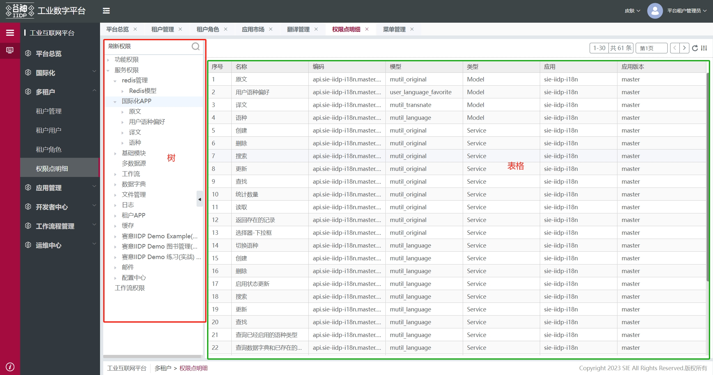

<!-- 查看节点属性信息方法: [跳转](/pages/ff8358/#打印节点属性信息) -->



## 树主要视图节点

下面是树的主要视图节点数据，包含左侧树、右侧表单、表格等节点

```js
{
  id: 'tree_main_wrap',
  name: 'tree-page',
  type: 'container',
  dataSource: {
    isEmpty: true, // 是否显示暂无数据
    showTable: false, // 显示表格
    showForm: false, // 显示表单
    showCancel: false, // 显示取消按钮
    clickType: 'preView',
    form: {},
    treeViewId: '',
    currentId: '', // 当前选中数据的id
    currentData: {}, // 当前选中数据
    treeDataList: { data: [] }, // 树数据
    treeViewRes: '', // 树视图
    expandNode: [] // 展开的节点
  },
  ds_config: {
    list: [
      {
        name: 'treeViewRes', // 树视图
        type: 'meta',
        method: 'service',
        autoRequest: false,
        options: {},
        reqAfter: (vm, res, config) => {
          // 树视图没有配置tree视图时，使用tableview的视图
          if (!res.data.views.tree) {
            res.data.views.tree = vm.$ds.tableView.data.views.tree
          }
          return res
        }
      },
      {
        name: 'otherService', // 方便类似buttons 调用其他服务
        type: 'meta',
        method: 'service',
        autoRequest: false,
        options: {}
      },
      {
        name: 'treeData', // 树数据
        type: 'meta',
        method: 'service',
        autoRequest: false,
        options: {},
        reqAfter: (vm, res, config) => {
          ...
          return res
        }
      },
      {
        name: 'formUpdate',
        type: 'meta',
        method: 'service',
        autoRequest: false,
        options: {}
      },
      {
        name: 'lookup',
        type: 'meta',
        method: 'service',
        autoRequest: false,
        options: {}
      }
    ]
  },
  created: (vm) => { ... },
  items: [
    {
        id: 'tree_main_wrap_toolbar',
        type: 'container',
        items: [ xxx ],
    },
    {
        type: 'tree', // 树组件
        id: 'tree_main_wrap_left',
        bind_data: '$ds.treeDataList.data',
        bind_defaultExpandedKeys: '$ds.expandNode',
        bind_curNodeKey: '$ds.currentId',
        created: async (vm) => { ... }
    },
    {
        id: 'tree_main_wrap_right',
        className: 'tree-main-wrap-right',
        type: 'container',
        items: [
            {
                type: 'empty',
                id: 'tree_main_wrap_right_empty',
                text: '暂无数据',
                bind_display: '$ds.isEmpty'
            },
            {
                type: 'container', // 右侧表单
                id: 'tree_main_wrap_right_straight',
                bind_display: '$ds.showForm',
                items: [
                    {
                        type: 'container',
                        id: 'form_main_detail_top_header',
                        items: [ xxx ] // 头部按钮等节点
                    },
                    {
                        // 表单
                        type: 'container',
                        id: 'tree_main_wrap_right_form_wrap',
                        items: [
                            {
                                type: 'form',
                                id: 'tree_main_wrap_right_form',
                                dataSource: {
                                    form: {},
                                    treeView: true
                                },
                                items: [ xxx ]
                            }
                        ]
                    }
                ]
            },
            {
                type: 'container', // 右侧表格
                id: 'tree_main_wrap_right_table',
                bind_display: '$ds.showTable',
                ds_config: {
                    list: [
                        {
                            name: 'tableView',
                            type: 'meta',
                            method: 'service',
                            autoRequest: false,
                            options: {},
                            reqAfter: (vm, res, config) => {
                                ...
                                return res
                            }
                        }
                    ]
                },
                // 子项更详细内容请看主表格模板
                items: [
                  {
                    type: 'container',
                    id: 'table_main_wrap',
                    ...
                    items: [ xxx ]
                  }
                ]
            }
        ]
    }
  ]
}
```

::: tip 提示
页面上节点 id 由菜单的 id 作为前缀+视图节点固定的 id 后缀 拼接而成，例如在线建模页面的表格 id='meta_model_menu'（动态前缀）+ 'table_main_table'（固定后缀）
:::

## 树属性与方法（vm.data）

```js
// const treeVm = tech_app.page.getNode('xxxx_tree_main_wrap_left')
// 以下是 treeVm.data 的部分属性和方法
{
    "type": "tree",
    "id": "xxxx_tree_main_wrap_left",
    "style": {...},
    "hideTreeButton": true, // 显示隐藏树按钮
    "treeConfig": { // 树配置项
        "highlightCurrent": true, // 是否高亮当前选中节点
        "showCheckbox": false, // 显示勾选框
        "expandOnClickNode": true // 是否在点击节点的时候展开或者收缩节点
    },
    "toolbarConfig": { // 工具栏配置
        "buttons": [
            {
                "type": "add",
                "text": "新增",
                "options": {...}
            },
            {
                "type": "delete",
                "text": "删除",
                "options": {...}
            },
            "@defaults"
        ],
        "search": true // 是否支持查询
    },
    "transformTotree": true, // 一维数组自动转换为树状数据
    "display": true,
    "defaultExpandedKeys": [], // 默认展开节点的数组
    "data": [], // 树数据
    "curNodeKey": "", // 当前节点id
    "bind_on_nodeExpand": () => {}, // 节点被展开时触发的事件
    "bind_on_nodeCollapse": () => {}, // 节点被关闭时触发的事件
    "bind_on_clickToolButton": () => {}, // 工具栏按钮点击触发的事件
    "bind_on_clickTreeNodeIcon": () => {}, // 节点后按钮点击触发的事件
    "bind_on_clickTreeNode": () => {}, // 节点点击触发的事件
    "bind_on_search": () => {}, // 搜索触发的事件
}
```

## 树主要节点的 id 后缀

选取节点方法：vm.$select(vm.$ds.idPre + 'id 后缀')

| id 后缀                       | 说明                   |
| ----------------------------- | ---------------------- |
| tree_main_wrap                | 树模板外层容器         |
| tree_main_wrap_left           | 左侧树节点             |
| tree_main_wrap_right          | 右侧节点               |
| tree_main_wrap_right_empty    | 右侧暂无数据节点       |
| tree_main_wrap_right_straight | 右侧表单外层容器       |
| form_main_detail_top_header   | 右侧表单头部按钮等节点 |
| tree_main_wrap_right_form     | 右侧表单容器           |
| tree_main_wrap_right_table    | 右侧表格容器           |

## 树常用 ds_config

| ds_config 名称 | 所在节点 id                    | 说明                          |
| -------------- | ------------------------------ | ----------------------------- |
| treeViewRes    | xxx_tree_main_wrap             | 获取树视图                    |
| treeData       | xxx_tree_main_wrap             | 获取树数据                    |
| formUpdate     | xxx_tree_main_wrap             | 保存表单数据                  |
| lookup         | xxx_tree_main_wrap             | 获取 lookup 下拉数据          |
| otherService   | xxx_tree_main_wrap             | 方便类似 buttons 调用其他服务 |
| tableView      | xxx_tree_main_wrap_right_table | 右侧表格视图                  |

## 树常用$ds

使用方法：vm.$select(vm.$ds.idPre + 'id 后缀').$ds.currentId

| $ds 名称     | 所在节点 id        | 说明                |
| ------------ | ------------------ | ------------------- |
| currentId    | xxx_tree_main_wrap | 树当前选中数据的 id |
| currentData  | xxx_tree_main_wrap | 树当前选中数据      |
| treeDataList | xxx_tree_main_wrap | 树数据              |
| treeViewRes  | xxx_tree_main_wrap | 树视图              |
| expandNode   | xxx_tree_main_wrap | 树展开的节点        |
| form         | xxx_tree_main_wrap | 表单数据            |

## 树方法（$cmd）

1、vm.$cmd.meta.treeFormat.initTreeButtons(vm, treeView, treeData) 树右侧 buttons 通过配置权限控制显示隐藏

```js
const { views, permissions } = vm.$ds.tableView.data;
const treeView = views.tree.body;
let treeData = vm.$ds.treeDataList;
vm.$cmd.meta.treeFormat.initTreeButtons(vm, treeView, treeData);
```

参数：

| 属性名   | 说明         | 类型   |
| -------- | ------------ | ------ |
| vm       | 当前视图实例 | Object |
| treeView | 树视图       | Object |
| treeData | 获取树形数据 | Array  |

2、vm.$cmd.meta.treeFormat.addAllNode(vm, treeView, treeData) 添加 ‘全部’ 节点

参数：

| 属性名   | 说明         | 类型   |
| -------- | ------------ | ------ |
| vm       | 当前视图实例 | Object |
| treeView | 树视图       | Object |
| treeData | 树数据       | Array  |

3、vm.$cmd.getSearchIds(vm, viewProps.subViewFilterValue)

保存默认筛选、设置树中的筛选，表格的筛选会合并 defaultFilter

参数：

| 属性名             | 说明                     | 类型   |
| ------------------ | ------------------------ | ------ |
| vm                 | 当前视图实例             | Object |
| subViewFilterValue | 菜单中获取的视图筛选条件 | Object |

4、 vm.$cmd.getTreeDataParams(treeView.views.tree.body,treeView.fields,vm) 获取树的筛选条件

参数：

| 属性名   | 说明                       | 类型   |
| -------- | -------------------------- | ------ |
| vm       | 当前视图实例               | Object |
| treeView | tree 视图                  | Object |
| fields   | loadView 接口返回的 fields | Object |

5、vm.$cmd.initTree(vm) 初始化树 请求树对应模型的数据 配置工具栏

参数：

| 属性名 | 说明         | 类型   |
| ------ | ------------ | ------ |
| vm     | 当前视图实例 | Object |

6、vm.$cmd.initTable(vm, vm.$ds.loadViewConfig) 初始化表格
初始化树时 currentId(树当前选中数据的 id) 有的话需要走 initTable
参数：

| 属性名         | 说明                   | 类型   |
| -------------- | ---------------------- | ------ |
| vm             | 当前视图实例           | Object |
| loadViewConfig | 指定右侧视图的请求参数 | Object |

7、vm.$cmd.initFormPop({ self: vm, value } = params, views.tree.body.model) 点击树节点后的图标显示表单的基础配置

```js
const { views } = params.self.$ds.tableView.data;
vm.$cmd.initFormPop(params, views.tree.body.model);
```

参数：

| 属性名 | 说明           | 类型   |
| ------ | -------------- | ------ |
| vm     | 当前视图实例   | Object |
| model  | 树视图的模型名 | String |

8、params.self.$cmd.saveForm(params, commonform) 保存编辑或新增数据节点的表单

```js
let commonform = params.self.$select(
  params.self.$ds.idPre + "tree_main_wrap_right_form"
);
params.self.$cmd.saveForm(params, commonform);
```

参数：

| 属性名     | 说明             | 类型   |
| ---------- | ---------------- | ------ |
| vm         | 当前视图实例     | Object |
| commonform | 右侧表单容器实例 | Object |

9、vm.$cmd.meta.tableFormat.formatTreeToolbarBtns(vm, {view,permissions}) 树视图上面 toolbar 渲染方法

```js
const { views, permissions } = vm.$ds.tableView.data;
const toolbarBtns = vm.$cmd.meta.tableFormat.formatTreeToolbarBtns(vm, {
  view: views.tree,
  permissions,
});
```
