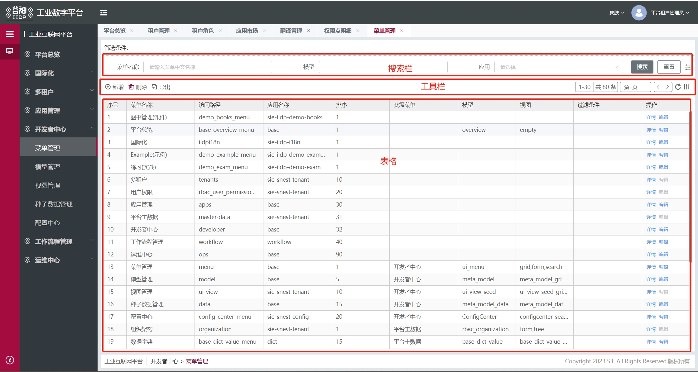

## 主表格页
下面是主表格页的主要视图节点数据，包含搜索栏、工具栏、主表格等节点

```js
{
    type: 'container',
    id: 'table_main', // '菜单id前缀_table_main'
    name: '表格主页',
    dataSource: {
		tableView: {}, // 视图
		tableData: [], // 表格数据
		tableFilter: [], // 表格数据筛选条件
		treeFilter: [] // 树带过来的筛选条件
	},
    ds_config: {
        list: [
            {
            name: 'tableView', // 用来查询视图
            type: 'meta',
            method: 'service',
            autoRequest: false,
            options: {},
            reqAfter: (vm, res, config) => {
                ...
                return res
            }
            },
            {
            name: 'tableData', // 用来查询表格数据
            type: 'meta',
            method: 'service',
            autoRequest: false,
            options: {
                params: {
                bind_model: '$ds.menuConfig.model',
                service: 'search',
                args: {
                    bind_filter: '$ds.tableFilter',
                    useDisplayForModel: true,
                    bind_limit: '${$ds.paging.pageSize + 1}',
                    bind_offset: '$ds.paging.pageStart',
                    bind_order: '$ds.orderBy'
                }
                }
            },
            reqPrep: (vm, options, config) => {
                ...
            },
            reqAfter: (vm, res, config) => {
                ...
                return res
            }
            },
            {
            name: 'tableDataCount', // 用来查询表格数据总条数
            type: 'meta',
            method: 'service',
            autoRequest: false,
            options: {
                params: {
                model: '$ds.menuConfig.model',
                service: 'count',
                args: {
                    bind_filter: '$ds.tableFilter',
                    useDisplayForModel: true
                }
                }
            },
            reqPrep: (vm, options, config) => {
                ...
                return options
            }
            },
            {
            name: 'delTableData', // 用来删除表格数据
            type: 'meta',
            method: 'service',
            autoRequest: false,
            options: {
                params: {
                    bind_model: '$ds.menuConfig.model',
                    service: 'delete'
                }
            }
            }
        ]
    },
    items: [{
        type: 'container',
        id: 'table_main_wrap', // 'xxxxx_table_main_wrap'
        name: 'tableRender',
        dataSource: {
            selectedTableData: [] // 选中行
            checkedDataList: [], // 勾选中的行数据
            checkedDataIds: [], // 勾选中的行数据id数组
            boxLinkSelected: [], // 关联子表选中行
            tableIsEdit: false // 表格编辑状态
        },
        items: [{
            // 主列表-搜索栏
            type: 'container',
            id: 'main_table_search_container',
            items: [ xxx ] // 子项会在搜索栏里详细展示
        }, {
            // 主列表-工具栏
            type: 'container',
            name: 'table_main_toolbar',
            id: 'table_main_toolbar',
        }, {
            // 主列表-表格
            type: 'table',
            id: 'table_main_table',
            created: async (vm) => { xxx },
            bind_on_select: async (data) => {}, // 如果需要看详细信息可使用tech_app.printObj方法打印
            ...
        }, {
            // 主列表-下表格
            type: 'container',
            id: 'container_tab_sub_table_wrap',
            className: 'container-tab-sub-table-wrap-css',
            dataSource: {
                btnDisabled: false
            },
            items: [ xxx ]
        }, {
            // 主列表-卡片模式
            type: 'container',
            id: 'table_main_card',
            items: [
                {
                    type: 'table-card',
                    id: 'table_card',
                    bind_tableData: '${$ds.tableData.data || []}',
                    bind_cardConfig: '${$ds.cardConfig}'
                }
            ]
        }, {
            // 主列表-删除确认弹框
            type: 'dialog',
            id: 'table_main_del_dialog',
            items: [ xxx ]
        }, ...]
    }]
}
```

## 搜索栏

下面是搜索栏的主要视图节点数据，包含筛选栏、表单、按钮等节点

```js
{
    // 主列表-搜索栏
    type: 'container',
    id: 'main_table_search_container',
    items: [
        {
            type: 'container',
            id: 'container_table_search',
            items: [
                {
                    type: 'container',
                    id: 'form_main_table_search',
                    className: 'form-main-table-search',
                    items: [
                        {
                            type: 'text',
                            value: '筛选条件：'
                        },
                        {
                            type: 'tags',
                            closable: true,
                            id: 'tag-list',
                            ...
                        }
                    ]
                },
                {
                    type: 'container',
                    className: 'container-table-search-items1',
                    items: [
                        {
                            // 上表单
                            type: 'form',
                            id: 'form_main_table_search_common',
                            dataSource: {
                                form: {}
                            },
                            ds_config: {
                                list: [
                                {
                                    name: 'tableSearch',
                                    type: 'meta',
                                    method: 'service',
                                    autoRequest: false,
                                    options: {}
                                }
                                ]
                            }
                        },
                        {
                            type: 'container',
                            id: 'container_table_search_wrap', // 搜索与重置按钮
                            items: [
                                {
                                    type: 'button',
                                    id: 'form_main_table_search_btn',
                                    value: '搜索',
                                    className: 'table_search_btn'
                                },
                                {
                                    type: 'button',
                                    value: '重置',
                                    className: 'table_reset_btn'
                                }
                            ]
                        },
                        {
                            type: 'meta-dropdown',
                            id: 'dropdown_pop_form',
                            items: [
                                {
                                    //第一个元素为按钮
                                    name: 'defaultBtn', //默认按钮
                                    buttonClose: {
                                        text: '展开',
                                        icon: 'el-icon-arrow-down'
                                    },
                                    buttonOpen: {
                                        text: '收起',
                                        icon: 'el-icon-arrow-up'
                                    }
                                },
                                {
                                    type: 'form', // 展开的表单
                                    id: 'form_main_table_search_dropdown',
                                    items: [ xxxx ]
                                }
                            ]
                        }
                    ]
                }
            ]
        }
    ]
}
```

## 工具栏

下面是工具栏的主要视图节点数据，包含按钮、分页、刷新等节点

```js
{
    // 主列表-工具栏
    type: 'container',
    name: 'table_main_toolbar',
    id: 'table_main_toolbar',
    className: 'table-main-toolbar',
    items: [
        {
            type: 'container',
            id: 'table_main_toolbar_wrap',
            items: [
                {
                    type: 'container', // 按钮
                    name: 'table_main_toolbar_btns',
                    id: 'table_main_toolbar_btns',
                    className: 'toolbar_btns'
                },
                {
                    type: 'paging', // 分页
                    name: 'table_main_paging',
                    id: 'table_main_paging'
                },
                {
                    type: 'button', // 刷新按钮
                    name: 'table_refresh',
                    id: 'table_main_toolbar_refresh',
                    title: '刷新'
                },
                {
                    type: 'table-show-columns', // 自定义表格列
                    id: 'table_main_toolbar_showColumns'
                },
                {
                    type: 'container', // 卡片列表切换按钮
                    name: 'table_main_toolbar_viewType',
                    id: 'table_main_toolbar_viewType',
                    items: [ xxx ]
                }
            ]
        }
    ]
}
```

## 表格属性与方法（vm.data）

```js
// const tableVm = tech_app.page.getNode('xxxx_table_main_table')
// 以下是 tableVm.data 的部分属性和方法
{
    "type": "table",
    "id": "xxxx_table_main_table",
    "tableEditMode": "multipleRow", // 行内编辑模式
    "tableEditRowBtns": ['update', 'delete', 'create'], // 行编辑操作按钮
    "arrowKeys": true, // 是否启用上下左右键控制正在编辑的单元格 默认开启
    "mergeRowList": [], // 需要合并行的列
    "loading": false, // 加载效果
    "checkType": "", // 勾选类型 bgSync：高亮背景色选中同步
    "selectedType": "", // linkSubTable：选中子表关联行，边框加粗
    "isEdit": false, // 是否正在编辑
    "checkbox": 'multiple_2', // 单选：'single_2'，多选：'multiple_2'
    "checkboxWidth": "55px", // 勾选列宽度
    "showEmpty": true, // 是否显示'空数据'提示文案
    "itemsOrigin": [], // 表格列备份数据
    "items": [], // 表格列
    "rules": {}, // 行内编辑校验规则
    "summaryMethod": () => {}, // 行末方法
    "mergeMethod": ({ row, _rowIndex, _columnIndex, column, visibleData }) => {}, // 合并单元格方法
    "gridOptions": {}, // 表格配置
    "autoHeight": true, // 默认按父级高度撑开
    "defaultCheck": [1,2,3], // 默认选中的数据 id数组
    "showSequenceNum": true, // 是否显示序号列
    "sequenceName": "序号", // 序号列标题文字
    "display": true,
    "dataSource": {},
    "curTableViewType": "list", // 显示类型 表格 or 卡片
    "cardModeConf": null, // 卡片配置
    "cardStyle":null,// 卡片样式配置
    "pagingIndexStart": 0, // 序号起点
    "userName": "admin", // 用户
    "tableData": [], // 表格数据
    "cellStyle": ({row}) => {}, // 单元格样式
    "headerCellStyle": () => {}, // 表头单元格样式
    "virtualScrollX": true, // 是否启用横向虚拟滚动
    "columnWidth": null, // 列宽
    "cancelAutoWidth": null, // 取消计算列宽
    "bind_on_cellClick": (params) => {}, // 单元格点击事件
    "bind_on_changeRowSelected": (params) => {}, // 选择行切换事件
    "bind_on_checkboxAll": (params) => {}, // 勾选框全选事件
    "bind_on_clickOptionBtn": (params) => {}, // 表格按钮点击事件
    "bind_on_rowDblclick": (params) => {}, // 行双击事件
    "bind_on_select": (params) => {}, // 勾选框选择事件
    "bind_on_toggleRowExpand": (params) => {}, // 行展开事件
}
```

## 主表格页主要节点的 id 后缀

选取节点方法：vm.$select(vm.$ds.idPre + 'id 后缀')

| id 后缀                         | 说明             |
| ------------------------------- | ---------------- |
| form_main_table_search_common   | 搜索栏上表单     |
| form_main_table_search_dropdown | 搜索栏展开的表单 |
| table_main_toolbar              | 工具栏容器       |
| table_main_table                | 表格             |

## 主表格页常用 ds_config

| ds_config 名称 | 所在节点 id    | 说明               |
| -------------- | -------------- | ------------------ |
| tableView      | xxx_table_main | 获取表格视图       |
| tableData      | xxx_table_main | 获取表格数据       |
| tableDataCount | xxx_table_main | 查询表格数据总条数 |
| delTableData   | xxx_table_main | 删除表格数据       |

## 主表格页常用$ds

使用方法：vm.$select(vm.$ds.idPre + 'id 后缀').$ds.tableView

| $ds 名称          | 所在节点 id         | 说明                   |
| ----------------- | ------------------- | ---------------------- |
| tableView         | xxx_table_main      | 视图                   |
| tableData         | xxx_table_main      | 表格数据               |
| tableFilter       | xxx_table_main      | 表格数据筛选条件       |
| treeFilter        | xxx_table_main      | 树带过来的筛选条件     |
| selectedTableData | xxx_table_main_wrap | 选中行                 |
| checkedDataList   | xxx_table_main_wrap | 勾选中的行数据         |
| checkedDataIds    | xxx_table_main_wrap | 勾选中的行数据 id 数组 |
| boxLinkSelected   | xxx_table_main_wrap | 关联子表选中行         |
| tableIsEdit       | xxx_table_main_wrap | 表格编辑状态           |

## 主表格方法（$cmd）

1、vm.$cmd.formmatRow(row) 格式化主表行数据

2、表格行内编辑情况下 点击表格保存按钮 vm.$cmd.singleRowEditSave(vm, value) 单行编辑保存  调用接口保存
    vm.$cmd.mergeErFiledValue(vm, value.row)详情页面根据 tabs 的 isAloneSave 为 false 暂存 er 关系子表 随详情页表单保存

3、vm.$cmd.subTableisEidt(vm) 判断子表是否被编辑

4、vm.$cmd.addRowEditSaveButton(vm, value) 添加编辑行的保存按钮

```js
const { self: vm, value } = params;
vm.$cmd.addRowEditSaveButton(vm, value);
```

5、vm.$cmd.rowEnableActionCondition(vm, value, action) 判断行内操作权限条件

参数：

| 属性名 | 说明         | 类型   | 可选项                              |
| ------ | ------------ | ------ | ----------------------------------- |
| vm     | 当前视图实例 | Object | -                                   |
| value  | 行数据信息   | Object | -                                   |
| action | 操作行为     | String | preview 进入详情,edit 编辑,add 新增 |

```js
//双击行 判断行内操作权限条件
const { self: vm, value } = res;
let enableActionCondition = vm.$cmd.rowEnableActionCondition(
  vm,
  value,
  "preview"
);
if (enableActionCondition == false) {
  //没有查看详情的权限
  return;
}
```

6、vm.$cmd.meta.tableFormat.formatColumns({view, fields, canMergeOps}, vm) 把数据转换成 table 的 columns 数据

```js
const { views, fields } = vm.$ds.tableView.data;
const columns = vm.$cmd.meta.tableFormat.formatColumns(
  { view: views.grid, fields, canMergeOps: false },
  vm
);
```

7、vm.$cmd.meta.tableFormat.formatToolbarBtns(vm, {view,permissions}) 格式化 table 的 toolbar 按钮

```js
const { views, permissions } = vm.$ds.tableView.data;
let toolbarBtns = vm.$cmd.meta.tableFormat.formatToolbarBtns(vm, {
  view: window.Tech._cloneDeep(views.grid),
  permissions: window.Tech._cloneDeep(permissions),
});
```
