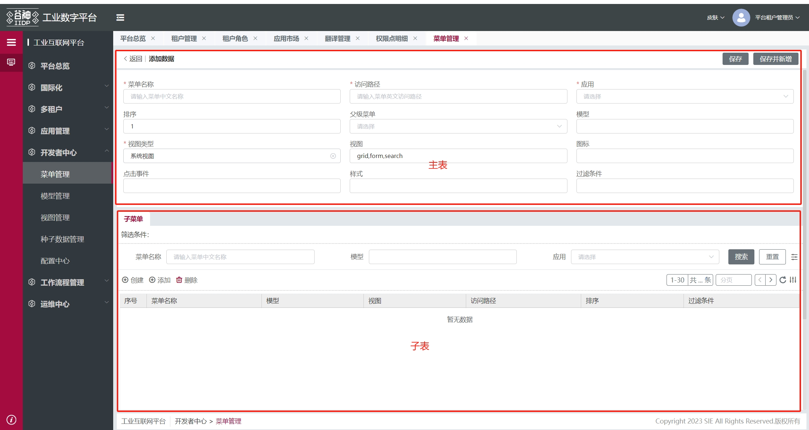

## 主表单

下面是主表单的主要视图节点数据，包含头部、表单等节点

```js
{
    type: 'container',
    id: 'table_detail',
    name: 'table_detail',
    dataSource: {
        // 点新增进详情页：clickType = add
		// 点编辑进详情页：clickType = edit
		// 点详情进详情页：clickType = preview
        clickType: '',
        mainTableRowData: {}, // 选中的主表格行数据
        curBtnInfo: {}, // 表格点击的按钮信息
        isNotSave: false, // 是否未保存
        isFormNotSave: false, // 是否主表单未保存
        showEditBtn: true, // 是否展示编辑按钮
        isDetail: true, // 是否是详情页
        isFromFormDetail: false // 是否从详情页返回
    },
    created: (vm) => {},
    items: [
        {
            id: 'form_main_detail_top',
            name: 'form-page',
            type: 'container',
            items: [
                {
                    // 头部
                    type: 'container',
                    id: 'form_main_detail_top_header',
                    className: 'form-main-detail-top-header',
                    dataSource: {
                        pageTitle: '详情页面',
                        mainTableAllData: { data: [] }
                    },
                    created: (vm) => { ... },
                    items: [ xxx ]
                },
                {
                    // 主表单（表单 + 子表格）
                    type: 'container',
                    className: 'container-form-main',
                    items: [
                        {
                            // 主表单
                            type: 'container',
                            id: 'container_form_main_wrap',
                            className: 'container-form-main-wrap',
                            ds_config: {
                                list: [
                                {
                                    name: 'lookup',
                                    type: 'meta',
                                    method: 'service',
                                    autoRequest: false,
                                    options: {}
                                }
                                ]
                            },
                            created: (vm) => {},
                            items: [
                                {
                                    type: 'form',
                                    id: 'form_main_detail_top_common',
                                    className: 'detail_common_form',
                                    items: [],
                                    created: async (vm) => { ... },
                                    ds_config: {
                                        list: [
                                        {
                                            name: 'formSearch',
                                            type: 'meta',
                                            method: 'service',
                                            autoRequest: false,
                                            options: {}
                                        },
                                        {
                                            // 提交表单数据  例如需要在表单保存前做某些操作，可以配置该数据源的 reqPrep 方法
                                            name: 'formUpdate',
                                            type: 'meta',
                                            method: 'service',
                                            autoRequest: false,
                                            options: {},
                                            reqAfter: (vm, res, config) => {
                                                ...
                                                return res
                                            }
                                        },
                                        {
                                            name: 'lookup',
                                            type: 'meta',
                                            method: 'service',
                                            autoRequest: false,
                                            options: {}
                                        }
                                        ]
                                    }
                                }
                            ]
                        },
                        {
                            // 子表格 后面详细展示
                        }
                    ]
                }
            ]
        }
    ]
}
```

## 子表格

```js
{
    type: 'container',
    display: true,
    id: 'container_table_main_wrap'，
    created: (vm) => { ... },
    items: [
        {
            id: 'form-tabs',
            name: 'form-tabs',
            type: 'container',
            className: 'form-tabs-wrap-ctn',
            items: [
                {
                    type: 'container',
                    id: 'form-tabs-wrap',
                    className: 'form-tabs-wrap-css',
                    items: [
                        {
                            type: 'tabs',
                            id: 'form-tabs-node',
                            close: false,
                            activeWork: true, //默认为true，点击切换到的tab才加载，false就是一次性加载
                            created: async (vm) => { ... },
                            ds_config: {
                                list: [
                                {
                                    name: 'lookup',
                                    type: 'meta',
                                    method: 'service',
                                    autoRequest: false,
                                    options: {}
                                }
                                ]
                            },
                            items: [
                                {
                                    type: 'container',
                                    id: 'container_main_content',
                                    items: [
                                        {
                                            type: 'empty',
                                            id: 'empty_main',
                                            name: '暂无数据',
                                            display: false
                                        },
                                        {
                                            type: 'container',
                                            id: 'table_main',
                                            name: 'tab表格',
                                            created: async (vm) => { ... },
                                            items: [
                                                {
                                                    type: 'container',
                                                    id: 'table_main_wrap',
                                                    // 子项参考主表格'table_main_wrap'节点
                                                    items: [ xxx ]
                                                }
                                            ],
                                            dataSource: {
                                                tableView: {}, // 子表视图
                                                paging: {
                                                    pageSize: 30,
                                                    pageStart: 0,
                                                    next: true
                                                },
                                                tableDataCount: { data: '...' },
                                                tableData: { // 子表数据
                                                    data: []
                                                },
                                                tableFilter: [],
                                                tableFilterTags: [],
                                                treeFilter: []
                                            },
                                            ds_config: {
                                                list: [
                                                {
                                                    name: 'tableView', // 子表视图
                                                    type: 'meta',
                                                    method: 'service',
                                                    autoRequest: false,
                                                    options: {},
                                                    reqAfter: (vm, res) => {
                                                    return vm.$cmd.loadViewAfter(vm, res)
                                                    }
                                                },
                                                {
                                                    name: 'tableData', // 查询子表数据
                                                    type: 'meta',
                                                    method: 'service',
                                                    autoRequest: false,
                                                    options: {
                                                    params: {
                                                        bind_model: '$ds.tabConfig.model',
                                                        service: 'search',
                                                        args: {
                                                        bind_filter: '$ds.tableFilter',
                                                        useDisplayForModel: true,
                                                        bind_limit: '${$ds.paging.pageSize + 1}',
                                                        bind_offset: '$ds.paging.pageStart',
                                                        order: ''
                                                        }
                                                    }
                                                    },
                                                    reqAfter: (vm, res, config) => {
                                                    ...
                                                    return res
                                                    }
                                                },
                                                {
                                                    name: 'tableDataCount', // 查询子表数据总条数
                                                    type: 'meta',
                                                    method: 'service',
                                                    autoRequest: false,
                                                    options: {
                                                    params: {
                                                        bind_model: '$ds.tabConfig.model',
                                                        service: 'count',
                                                        args: {
                                                        bind_filter: '$ds.tableFilter',
                                                        useDisplayForModel: true
                                                        }
                                                    }
                                                    },
                                                    reqPrep: (vm, options, config) => {
                                                    ...
                                                    return options
                                                    },
                                                    reqAfter: (vm, res) => {
                                                    ...
                                                    return res
                                                    }
                                                },
                                                {
                                                    name: 'delTableData', // 删除子表数据
                                                    type: 'meta',
                                                    method: 'service',
                                                    autoRequest: false,
                                                    options: {
                                                    params: {
                                                        bind_model: '$ds.tabConfig.model',
                                                        service: 'delete'
                                                    }
                                                    }
                                                },
                                                {
                                                    name: 'drawerFormView', // 获取抽屉表单视图
                                                    type: 'meta',
                                                    method: 'service',
                                                    autoRequest: false,
                                                    options: {
                                                    params: {
                                                    }
                                                    }
                                                },
                                                {
                                                    name: 'drawerFormData', // 获取抽屉表单数据
                                                    type: 'meta',
                                                    method: 'service',
                                                    autoRequest: false,
                                                    options: {
                                                    params: {
                                                        bind_model: '$ds.tabConfig.model',
                                                        service: 'search',
                                                        args: {
                                                            limit: 1,
                                                            offset: 0
                                                        }
                                                    }
                                                    }
                                                }
                                                ]
                                            }
                                        }
                                    ]
                                }
                            ]
                        }
                    ]
                }
            ]
        }
    ]
}
```

## 表单属性与方法（vm.data）

```js
// const formVm = tech_app.page.getNode('xxxxx_form_main_detail_top_common')
// 以下是 formVm.data 的部分属性和方法
{
    "type": "form",
    "id": "xxxx_form_main_detail_top_common",
    "className": "detail_common_form",
    "submitChanged": false, // 是否开启只提交改变的字段
    "changedFields": {}, // 改变过的字段对象 和里面的新旧值 格式例如 { fieldA: {oldValue: '', newValue: ''} }
    "formConfig": {
        "labelPosition": "top",
        "marginRight": "0.2rem",
        "disabled": false
    },
    "style": {...},
    "items": [], // 表单项
    "display": true,
    "commands": {},
}
```

## 表单实例（vm.instance）

以下是 formVm.instance 的常用方法和属性

```js
const formData = formVm.instance.submit(); // 获取表单数据
const validateRes = formVm.instance.validate(); // 校验表单项
const formConfig = formVm.instance.formConfig; // 表单配置项
```

## 主表单+子表主要节点的 id 后缀

选取节点方法：vm.$select(vm.$ds.idPre + 'id 后缀')

| id 后缀                     | 说明      |
| --------------------------- | --------- |
| table_detail                | 主表单页  |
| form_main_detail_top_common | 主表单    |
| form-tabs-node              | tabs 节点 |
| table_main                  | 子表容器  |

## 主表单+子表常用 ds_config

| ds_config 名称 | 所在节点 id                     | 说明                                                                         |
| -------------- | ------------------------------- | ---------------------------------------------------------------------------- |
| lookup         | xxx_container_form_main_wrap    | 获取 lookup 下拉数据                                                         |
| formSearch     | xxx_form_main_detail_top_common | 查询表单数据                                                                 |
| formUpdate     | xxx_form_main_detail_top_common | 提交表单数据 例如需要在表单保存前做某些操作，可以配置该数据源的 reqPrep 方法 |
| tableView      | xxx_table_main                  | 子表视图                                                                     |
| tableData      | xxx_table_main                  | 查询子表数据                                                                 |
| tableDataCount | xxx_table_main                  | 查询子表数据总条数                                                           |
| delTableData   | xxx_table_main                  | 删除子表数据                                                                 |
| drawerFormView | xxx_table_main                  | 获取抽屉表单视图                                                             |
| drawerFormData | xxx_table_main                  | 获取抽屉表单数据                                                             |

## 主表单+子表常用$ds

使用方法：vm.$select(vm.$ds.idPre + 'id 后缀').$ds.clickType

| $ds 名称         | 所在节点 id                     | 说明                                                                                                   |
| ---------------- | ------------------------------- | ------------------------------------------------------------------------------------------------------ |
| clickType        | xxx_table_detail                | 点新增进详情页：clickType = add；点编辑进详情页：clickType = edit；点详情进详情页：clickType = preview |
| mainTableRowData | xxx_table_detail                | 选中的主表格行数据                                                                                     |
| isDetail         | xxx_table_detail                | 是否是详情页                                                                                           |
| pageTitle        | xxx_form_main_detail_top_header | 表单页 title                                                                                           |
| mainTableAllData | xxx_form_main_detail_top_header | 主表格数据                                                                                             |
| tableView        | xxx_table_main                  | 子表视图                                                                                               |
| tableData        | xxx_table_main                  | 子表数据                                                                                               |
| tableFilter      | xxx_table_main                  | 子表数据筛选条件                                                                                       |

## 表单公共方法（$cmd）

1. vm.$cmd.meta.formFormat.initForm(`vm`,`view`,`fields`) 初始化表单， 获取 formItems

- 根据接口获取 formItems，默认外层添加 row 组件
- `vm`：当前调用此方法的视图实例，一般在视图生命周期方法中的到，或者 bind 事件中得到，例如`created:(vm)=>{}`,`bind_on_xxx:({self:vm}=params)=>{}`

```js
const formNode = vm.$cmd.meta.formFormat.initForm(
  vm,
  viewConfig?.views?.form,
  viewConfig?.fields
);
const formItems = formNode.items;
console.log("formItems:", formItems);
```

参数：
| 属性名 | 说明 | 类型 | 可选值 | 默认值 |
| ----- |----- |----- |----- |----- |
|vm |当前视图实例 |Object | | |
|view |loadView 接口返回的 form 视图（views.form） |Object | | |
|fields |loadView 接口返回的 fields |Object | | |

2. vm.$cmd.meta.formFormat.handleSearchData(`data`, `columns`) 拼接查询格式

```js
// data 为查询对象 例如 { name: '11' }
// columns 为列对象数据 例如 [{prop: 'name',dataType:'String'}]
const arr = vm.$cmd.meta.formFormat.handleSearchData({ name: "test" }, [
  { prop: "name", dataType: "String" },
]);
console.log("arr:", arr); // ["name","like","%test%"]
```

3. 从主表单返回主页面

```js
let node = vm.$select("xxx_form_main_detail_top_header");
node.$cmd.preBack(vm);
```

4. 主表单保存

```js
let node = vm.$select("xxx_form_main_detail_top_header");
node.$cmd.saveForm({ self: vm });
```

## 子表公共方法（$cmd）

1. 处理子表关系指令集缓存拼接

```js
// type: create: 新增、 add: 添加、update: 添加、delete: 删除
// data: 数据项 例 {id: 1, name: 'hhhh'}
// node: 挂载指令集的节点
// nodeDsName: 处理节点上面配置的数据源名
tableVm.$cmd.meta.dealTableErCatch(type, data, {
  node: tableObj,
  nodeDsName: tableDSName,
});
```

2. 检测处理子表关系入参 data 与表格数据是否有 unique 冲突

```js
// fields 元模型接口loadView返回的fields字段配置
// data 需要检测的数据项 格式例如 {id:xxx, name:xxx, ...}
// dataList 用以比较检测的列表数据 格式例如 [{id:xxx, name:xxx, ...},...]
// 若没有unique冲突则检测通过返回true，否则检测不通过返回false
tableVm.$cmd.meta.checkErUnique(fields, data, dataList);
```

3. 转换后端视图返回前端主表单下面 tabs 组件数组

```js
vm.$cmd.meta.formatTabs(vm, {
  view, // 后端views视图
  fields, // 字段对象
  permissions, // 元模型接口返回的权限数组
});
```

4. 转换后端视图 views.form.tabs 返回前端表格组件

```js
vm.$cmd.meta.formatTabsTable(vm, {
  view, // 后端views.form.tabs某项视图
  fields, // 字段对象
  permissions, // 元模型接口返回的权限数组
});
```

5. 后端 views.form.tabs 某项视图转换返回前端表单组件

```js
vm.$cmd.meta.formatTabsFormPart(vm, {
  view, // 后端views.form.tabs某项视图
  fields, // 字段对象
  permissions, // 元模型接口返回的权限数组
});
```
