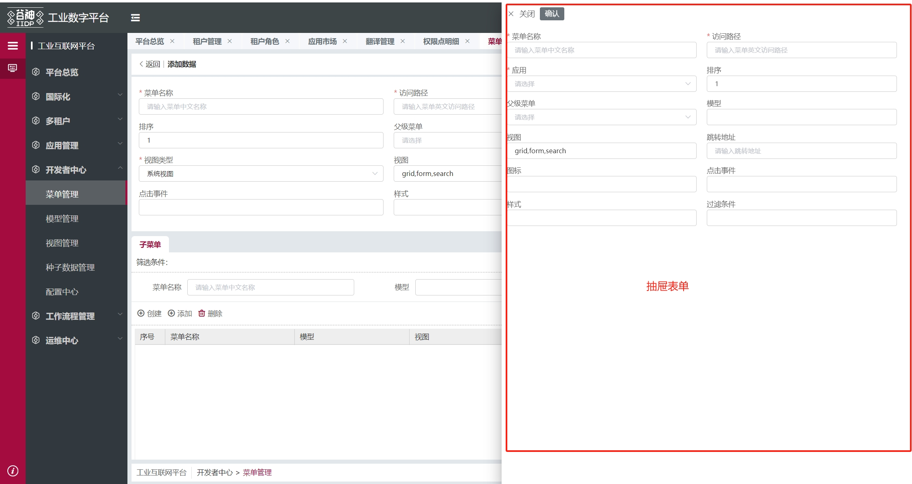

下面是抽屉表单的主要视图节点数据，包含头部、表单等节点

```js
{
    type: 'drawer',
    id: 'table_drawer',
    visible: true, // 显示或隐藏抽屉
    dataSource: {
        editId: '', // 选中的子表行id
        showDrawerBtn: true, // 是否显示按钮
        isEditDrawerForm: false, // 表单是否处于编辑态
        canEditForm: true // 编辑按钮是否可用
    },
    created: (vm) => { ... },
    items: [
        {
            type: 'container',
            id: 'table_drawer_title',
            items: [
                {
                    type: 'button',
                    value: '关闭'
                },
                {
                    type: 'pagetopsplit'
                },
                {
                    type: 'button',
                    value: '编辑',
                    bind_display: '${!$ds.isEditDrawerForm && $ds.showDrawerBtn && $ds.canEditForm}'
                },
                {
                    type: 'button',
                    value: '确认',
                    bind_display: '$ds.isEditDrawerForm && $ds.showDrawerBtn && $ds.canEditForm'
                }
            ]
        },
        {
            type: 'form', // 表单
            id: 'table_drawer_form',
            dataSource: {
                form: {}
            },
            items: [ xxx ],
            created: async (vm) => { ... }
        }
    ]
}
```

## 抽屉表单主要节点的 id 后缀

选取节点方法：vm.$select(vm.$ds.idPre + 'id 后缀')

| id 后缀            | 说明     |
| ------------------ | -------- |
| table_drawer       | 抽屉容器 |
| table_drawer_title | 抽屉头部 |
| table_drawer_form  | 抽屉表单 |

<!-- ## 抽屉表单常用 ds_config

| ds_config 名称 | 所在节点 id    | 说明         |
| -------------- | -------------- | ------------ |
| tableView      | xxx_table_main | 获取表格视图 | -->

## 抽屉表单常用$ds

使用方法：vm.$select(vm.$ds.idPre + 'id 后缀').$ds.editId

| $ds 名称 | 所在节点 id           | 说明            |
| -------- | --------------------- | --------------- |
| editId   | xxx_table_drawer      | 选中的子表行 id |
| form     | xxx_table_drawer_form | 表单值          |

## 抽屉表单方法（$cmd）

1、vm.$cmd.editBtnEnableCondition(vm) 根据子表操作列编辑按钮状态设置编辑按钮是否展示

2、vm.$cmd.removeMainTableColumns(vm, formValues)在抽屉表单里面移出 mainTableColumns
```js
const form = vm.$select(vm.$ds.idPreTab + 'table_drawer_form')
let formValues = await form.instance.submit() //获取表单数据
let mainTableVals = vm.$cmd.removeMainTableColumns(vm, formValues)
cconsole.log(mainTableVals)
```
参数：

|   属性名   | 说明              |    类型     |
| --------- | ------------------| ----------- |
| vm        | 当前视图实例       | Object      |
| formValues| 表单数据           | Object      |
