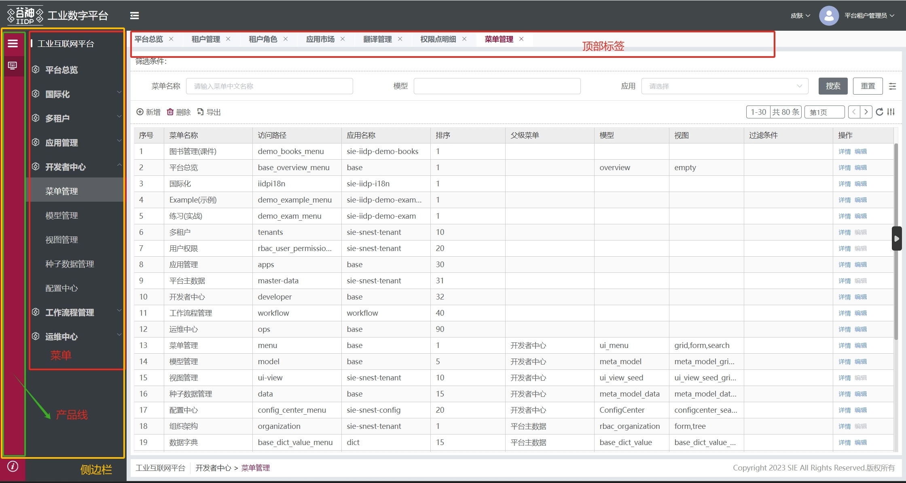

下面是侧边栏+主内容的主要视图节点数据，包含产品线、菜单、主内容顶部标签等节点

::: tip 提示
导航头、侧边栏、主内容顶部标签等节点不需要拼接前缀，可直接通过节点定义的 id 获取节点信息,例如 vm.$select('container_meta_sidebar_container')
:::

```js
{
    type: 'container',
    id: 'container_meta_sidebar_container',
    name: '容器',
    created: (vm) => { xxx },
    dataSource: {
        activeName: '',
        apps: []
    },
    ds_config: {
        name: 'appsMenus',
        type: 'meta',
        autoRequest: false,
        options: {
            params: { ... }
        },
        reqAfter: (vm, res) => {
            let appMenus = (res && res.data) || []
            vm.instance.$store.commit('App/setAppMenus', appMenus)
            return appMenus
        }
    },
    items: [
        // 产品线
        {
            type: 'container',
            id: 'container_meta_sidebar',
            created: (vm) => { xxx },
            name: '侧边栏',
            items: [ xxx ]
        },
        // 菜单
        {
            type: 'meta-menu',
            id: 'menu_meta_siderbar',
            name: '菜单',
            dataSource: {
                customPermission: {
                    permission: [],
                    permissionApi: {}
                }
            },
            items: [ xxx ]
        },
        {
            type: 'container',
            id: 'container_meta_main_content_wrap',
            name: '主内容外层容器',
            items: [
                {
                    type: 'tabs',
                    id: 'tabs_meta_main_content_labels',
                    name: '主内容顶部标签列表',
                    items: [ xxx ]
                },
                {
                    type: 'container',
                    id: 'container_meta_footer_content',
                    name: '脚部容器',
                    items: [ xxx ]
                }
            ]
        }
    ]
}
```

## 侧边栏+主内容主要节点的 id 后缀

选取节点方法：vm.$select('container_meta_sidebar')

| id 后缀                          | 说明           |
| -------------------------------- | -------------- |
| container_meta_sidebar           | 产品线         |
| menu_meta_siderbar               | 菜单           |
| container_meta_main_content_wrap | 主内容外层容器 |
| tabs_meta_main_content_labels    | 主内容顶部标签 |
| container_meta_footer_content    | 底部容器       |

## 侧边栏+主内容常用 ds_config

| ds_config 名称 | 所在节点 id                      | 说明     |
| -------------- | -------------------------------- | -------- |
| appsMenus      | container_meta_sidebar_container | 菜单数据 |

## 侧边栏+主内容常用$ds

使用方法：vm.$select('container_meta_sidebar_container').$ds.apps

| $ds 名称   | 所在节点 id                      | 说明       |
| ---------- | -------------------------------- | ---------- |
| activeName | container_meta_sidebar_container | 当前产品线 |
| apps       | container_meta_sidebar_container | 所有产品线 |


## 侧边栏方法（$cmd）

1、params.self.$cmd.toMenuFn(params) 跳转菜单

2、 transformMenusFn菜单多维数组转换成视图
```js
let searchForm = params.self.$select('menus_search_container_form')
//searchMenusFn搜索菜单
let resultData = vm.$cmd.searchMenusFn(
    vm.$ds.menusData,
    vm.$ds.form.menusKeyWork
)
let search_contaier = vm.$select('search_menus_pop_container')
vm.$cmd.transformMenusFn(resultData, search_contaier)
```