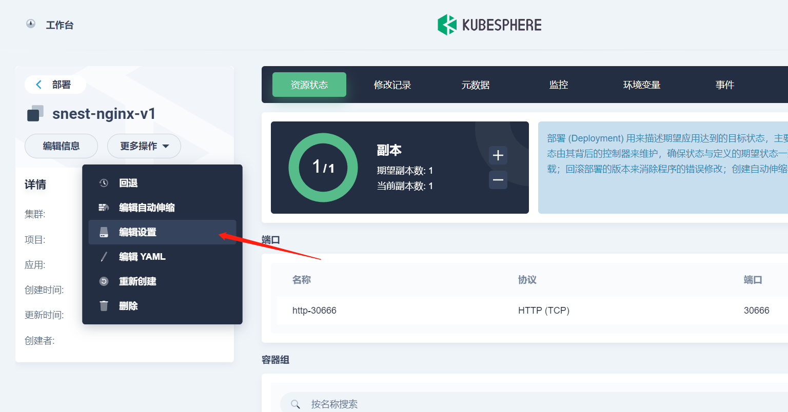
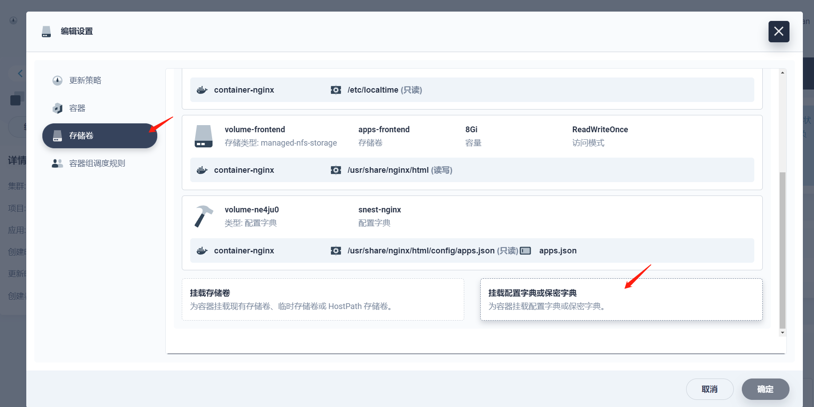
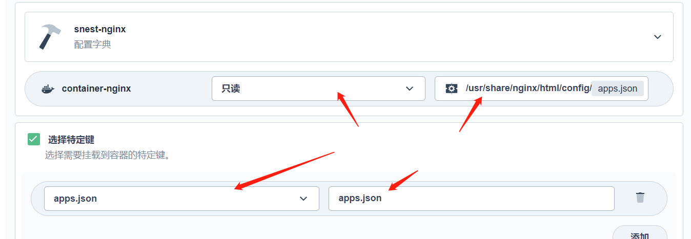
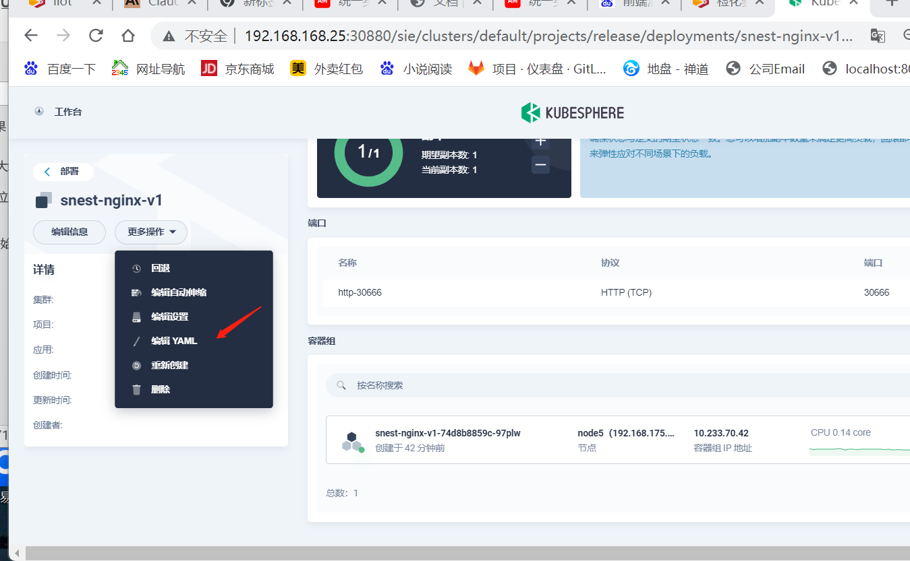
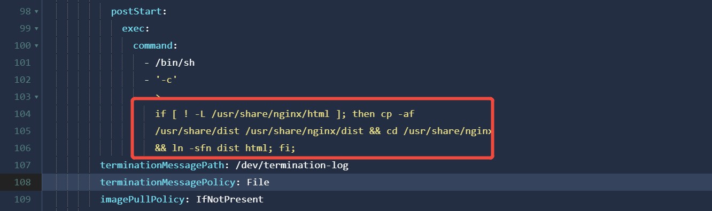
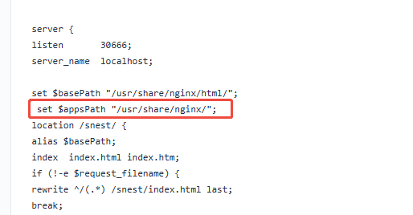
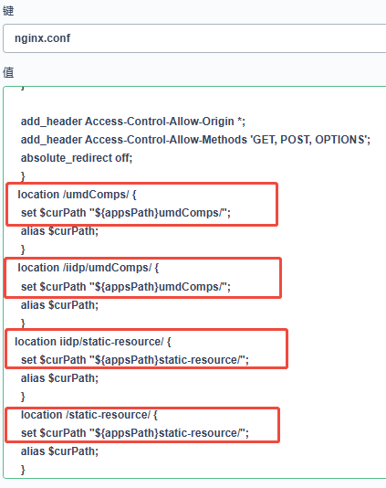

# 流水线配置
## iidp平台从2.8.1升级至2.9.0

/usr/share/nginx/html/config/apps.json

修改前端镜像启动后执行命令 
该命令作用是为了处理第一次没有安装任何app也没有更新前端底座时，将最小镜像的前端底座拷贝到工作目录，即将 /usr/share/dist 目录下的内容复制到 /usr/share/nginx/dist，并创建一个符号链接 /usr/share/nginx/html 指向 /usr/share/nginx/dist。这样前端就可以正常访问了。

 

Nginx.conf配置

 