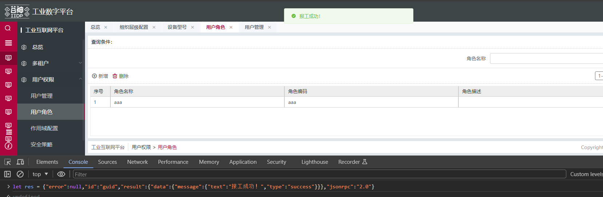
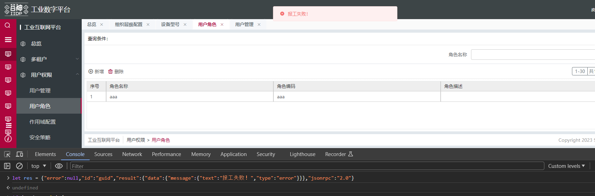
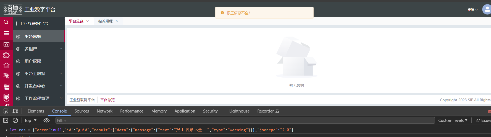
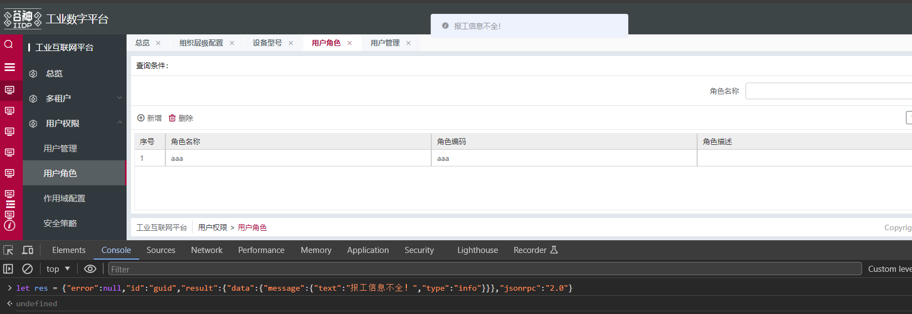

## 接口返回信息提示

- 前端根据接口返回的信息类型，以不同类型提示用户
- type：success-成功，error-错误，warning-警告，info-消息

```js
后端接口按规定形式返回信息即可

{"error":null,
    "id":"guid",
    "result":{
        "data":{
            "message":{
                "text":"报工成功！",
                "type":"success"
                }
            }
        },
    "jsonrpc":"2.0"
}
```



