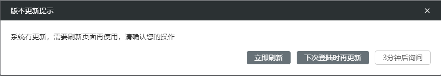

## 版本更新提示系统级配置
/config/apps.json
 - autoCheck：开启自动检查版本更新版本更新，必填
 - timeInterval：定时检查间隔时间(单位分钟)，非必填，默认3分钟
```js
{
  "self": {},
  "apps": {},
  "templateApp": "TechMetaPage",
  "global": {
    "master": {
      "apiHost": "/api"
    },
    "routerBase": "/iidp/"
  },
  "showSearch": true,
  "checkVersion": { // 版本更新检查并提示
    "autoCheck": true,
    "timeInterval": 3 // 定时检查间隔时间(单位分钟)默认3分钟
  }
}
```

提示弹窗效果, 点击 X 关闭弹窗等同于点击‘3分钟后询问’

