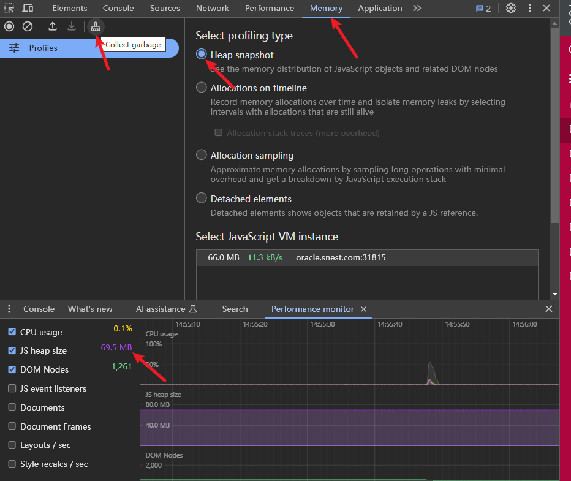

当使用自定义组件或比较复杂的业务组件时要注意内存溢出问题

当遇到前端内存溢出问题时，可以采取以下步骤来排查和解决问题：

1. 使用浏览器的开发者工具：打开浏览器的开发者工具，并切换到"Performance"或"Memory"选项卡，监控内存使用情况。观察内存使用量的变化和趋势。

2. 分析内存泄漏：在开发者工具中，使用"Memory"选项卡进行内存分析。可以使用"Take Heap Snapshot"功能来捕获堆内存快照，并查看对象的引用关系。检查是否有对象没有被正确释放，或者存在循环引用的情况。
开发模式下，在Windows系统快捷键'ctrl + r'刷新页面，可以用于获取最新的更新、重新加载缓存的内容或者重新执行页面中的脚本；Mac系统中，可以使用"Command + R"键来刷新页面。点击"Collect garbage" 是手动执行垃圾回收（Garbage Collection）操作，用于释放不再使用的内存资源，每次重新排查页面时清理一下。


3. 检查事件监听器：确保在不需要时，移除不再使用的事件监听器。未移除的事件监听器可能导致对象无法被垃圾回收，从而引发内存泄漏。特别注意在组件销毁时，移除相关的事件监听器。

```js
mounted(){
    this.$el.addEventListener('mouseup', this.mouseup)
    // 在组件销毁之前执行移除不再使用的事件监听器
    this.beforeDestroyCallback(() => {
      this.$el.removeEventListener('mouseup', this.mouseup)
    })
}
```

4. 优化大型数据结构：如果应用程序使用了大型数据结构（如长列表或树），可以考虑对其进行优化。可以使用分页加载、虚拟滚动等技术，减少一次性加载和渲染大量数据所带来的内存压力。
- 虚拟滚动
```js
// 假设有一个包含大量数据的列表
const dataList = [...];

function renderVisibleItems(startIndex, endIndex) {
  // 渲染可见区域的数据项
  for (let i = startIndex; i <= endIndex; i++) {
    // 渲染数据项
    // ...
  }
}

// 当滚动时，计算可见区域的索引范围
function handleScrollEvent() {
  const startIndex = calculateStartIndex();
  const endIndex = calculateEndIndex();
  renderVisibleItems(startIndex, endIndex);
}
```
- 使用数据结构的子集

```js
const bigArray = [...]; // 大型数组
// 只使用数组的前100个元素
const smallArray = bigArray.slice(0, 100);
// 对smallArray进行操作
```

5. 避免不必要的全局变量：全局变量在页面的整个生命周期中一直存在，如果使用过多的全局变量，可能会导致内存占用过高。尽量将变量限制在局部作用域内，及时释放不再使用的变量。
```js
function loopExample() {
  for (let i = 0; i < 10; i++) {
    let loopVar = "Loop variable";
    // 使用loopVar进行一些操作
    loopVar = null; // 及时释放不再使用的变量
  }
}
```
6. 检查异步操作：确保在异步操作完成后，及时释放相关的资源。例如，如果使用了定时器或异步请求，需要在不需要时取消定时器或中止请求。
```js
created(){
    this.timer = setTimeout(() => {
        // ...
    }, 500)
},
// 在组件销毁之前执行
beforeDestroy(){
    if (this.timer) {
        clearTimeout(this.timer);
        this.timer = null
    }
}
```

7. 代码审查和优化：仔细检查代码，寻找潜在的内存泄漏或不必要的内存占用情况。确保正确地释放资源、避免循环引用、合理使用缓存等。
```js
// 在组件销毁之前执行
beforeDestroy(){ 
    // 变量为对象或数组的且被引用需确保正确地释放资源，断开引用
    if(this.dataList?.length > 0){
        this.shadowArrayGC(this.dataList);
        this.dataList = [];
    }
},
methods: {
    // 浅层回收数组 数组里面赋值null
    shadowArrayGC(param) {
      if (Object.prototype.toString.call(param) === '[object Array]') {
        param.map(it => {
          for (let k in it) {
            // 解除引用：将引用数组的变量赋值为 null 或其他非数组的值。将断开引用，使得数组不再被引用
            it[k] = null
          }
          it = null
        })
      }
    }
}
```

8. 进行内存测试：在不同的设备和浏览器中进行内存测试，模拟真实的使用情况，以确保应用程序在各种情况下都能正常运行而不会导致内存溢出。

通过以上步骤，可以逐步排查和解决前端内存溢出问题。内存溢出问题可能由多个因素引起，因此可能需要结合多种方法和工具进行分析和调试。