# 调试工具技术文档

## 1. 概述

调试工具是一个用于技术开发和调试的工具组件，提供了页面、节点元素、应用列表等功能模块，帮助开发者高效地进行应用开发、调试和监控。

调试工具入口依附在页面最右侧，支持拖动更改位置，点击后会打开调试工具弹窗。

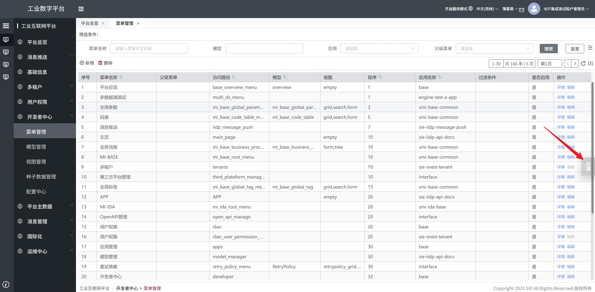

注意事项：

- 调试工具仅在前端版本 =2.8 ||  >=3.0.0-UAT.15 可用。
- 使用 chrome 浏览器。
- 前端工程启动开发态会 **`默认开启调试工具入口`**，线上环境需要手动追加 **`?iidpDev=true`** 才能开启调试入口 (线上环境调试入口里面不能使用代码来源和测试用例栏目)。
- chrome 浏览器开启 9222 端口否则代码来源模块不可用。在浏览器快捷方式右键选择属性，在目标后面加上` --remote-debugging-port=9222 --user-data-dir="D:\ChromeTemp"`。
- 下文提到的重写历史记录是指调用了`Tech.$set`全局方法的重写链路。

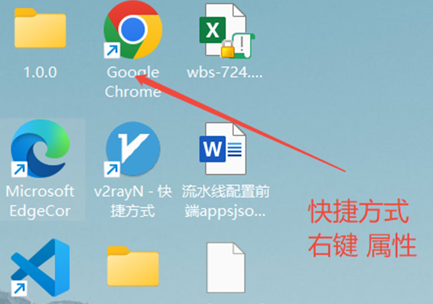
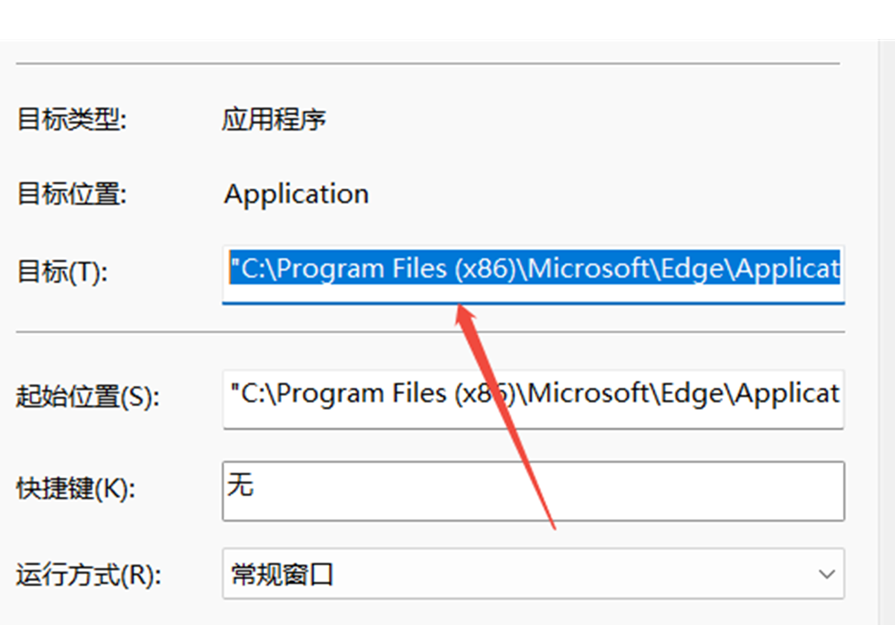

## 2. 页面

页面模块包含六个子标签页，提供了当前页面的常用节点、数据源、模板源码等信息。

### 2.1 常用页面节点

- **功能**：展示当前页面的常用节点树结构
- **操作**：
  - 点击节点可在页面上红色边框框住对应元素
  - 点击"跳转"按钮可跳转到节点元素模块的对应节点

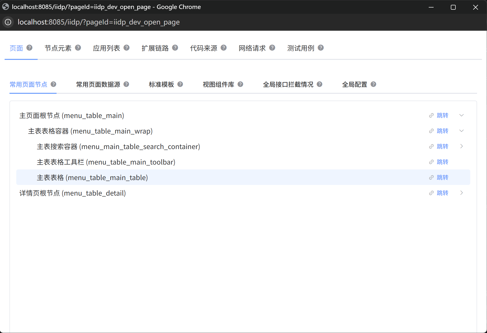
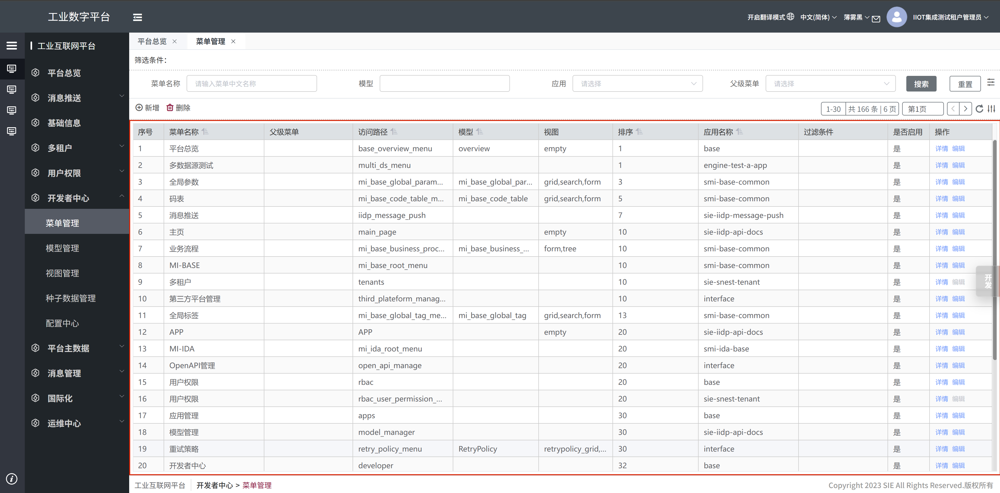

### 2.2 常用页面数据源

- **功能**：展示当前页面的常用数据源（**调接口**）列表
- **操作**：
  - 点击"跳转"按钮可跳转到节点元素模块的对应节点
  - 支持搜索过滤功能

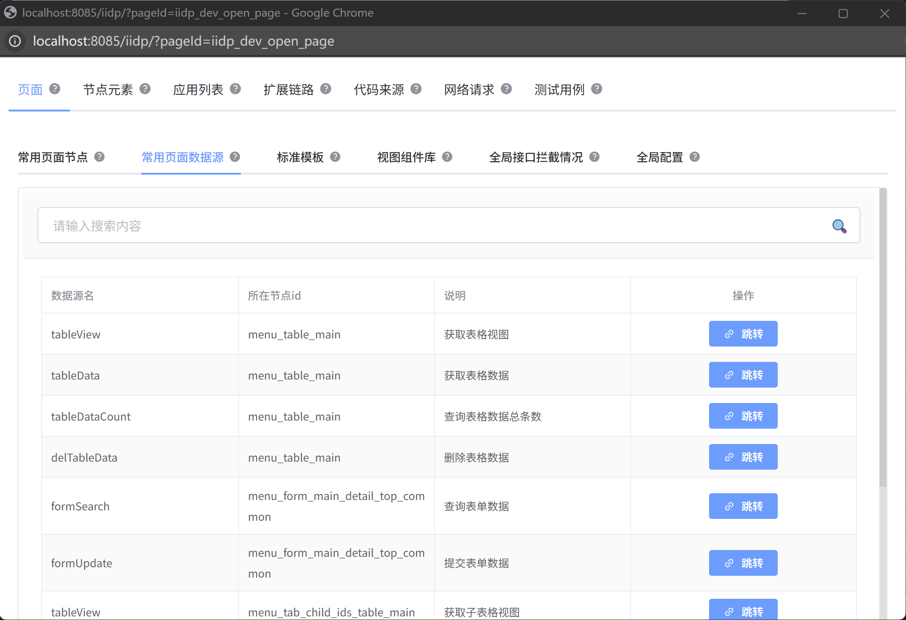

### 2.3 标准模板

- **功能**：查看标准模板源码信息（不可编辑）
- **操作**：
  - 浏览目录树选择要查看的文件
  - 查看文件源代码内容
- **主要目录文件**：
  - `schema/views/login/login.js`：登录页视图文件
  - `schema/views/index/dynamic/page.js`：标准页视图文件
  - `schema/views/index/dynamic/tree.js`：树视图文件
  - `schema/views/index/dynamic/table-search.js`：搜索视图文件
  - `schema/views/index/dynamic/tablePage.js`：表格视图文件
  - `schema/views/index/dynamic/formPage.js`：表单视图文件
  - `schema/views/index/dynamic/form-tabs-table.js`：子表视图文件
  - `snest/tree-utils.js`：树工具文件
  - `snest/table-utils.js`：表格工具文件
  - `snest/form-utils.js`：表单工具文件
  - `snest/tabs-utils.js`：子表工具文件

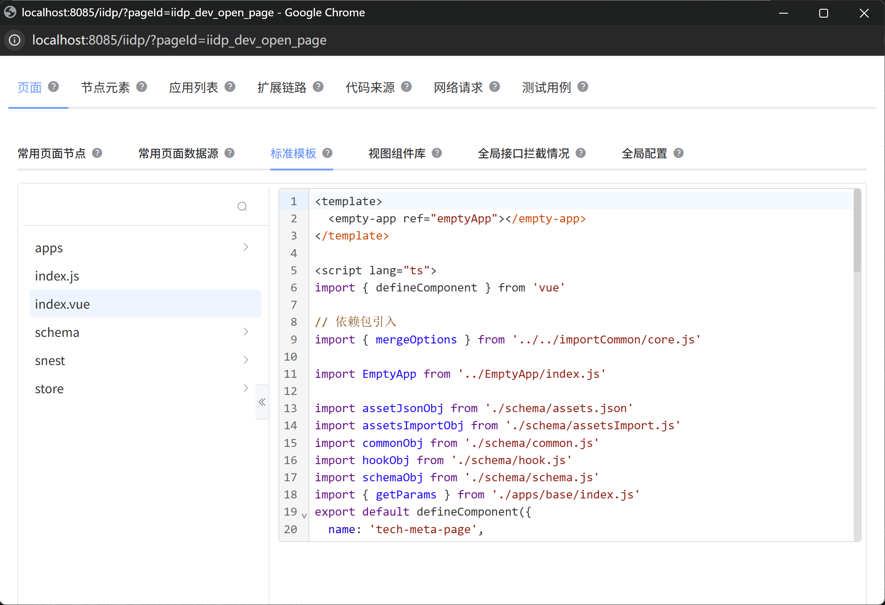

### 2.4 视图组件库

- **功能**：查看视图组件库源码信息（不可编辑）
- **操作**：
  - 浏览目录树选择要查看的组件文件
  - 查看组件源代码内容
- **主要目录文件**：
  - `base/table/vxe-table/table.vue`：表格组件
  - `base/Container/index.vue`：容器组件
  - `base/tabs/index.vue`：标签页组件
  - `base/dialog/src/dialog.vue`：弹窗组件
  - `base/m-form/src/FormCommon.vue`：表单组件
  - `base/paging/src/paging.vue`：分页组件
  - `base/tree/src/tree.vue`：树组件
  - `base/drawer/drawer.vue`：抽屉组件
  - `base/Button/button.vue`：按钮组件

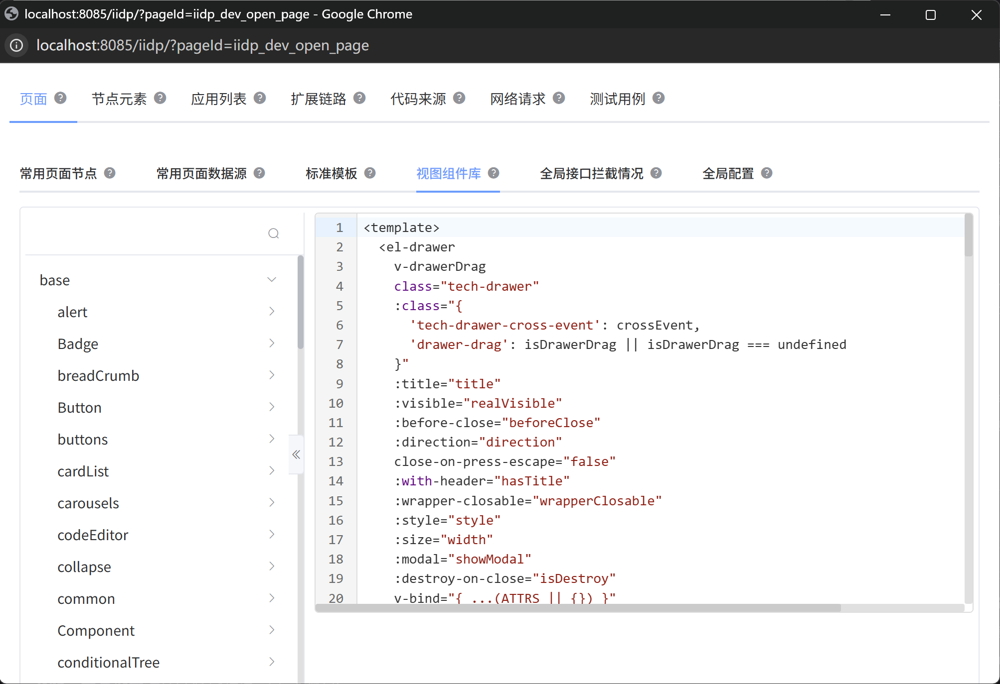

### 2.5 全局接口拦截情况

- **功能**：查看全局拦截接口钩子的重写历史记录。有四个全局接口拦截钩子：globalApiReqAsync（请求前异步）、globalApiReq（请求前同步）、globalApiResAsync（请求后异步）、globalApiRes（请求后同步）
- **操作**：
  - 展开折叠面板查看不同钩子的重写历史
  - 查看多个版本的重写代码
  - 了解钩子的完整重写链

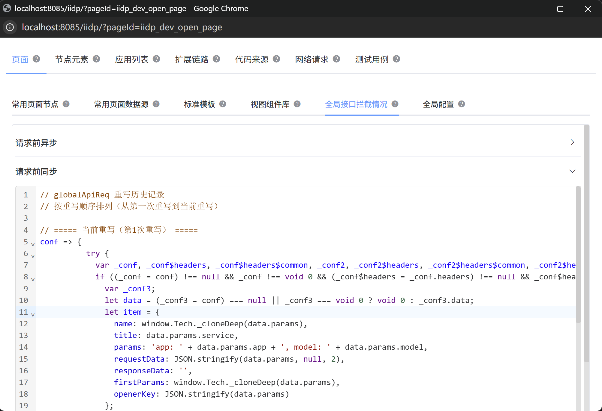

### 2.6 全局配置

- **功能**：查看和编辑 apps.json 配置文件
- **操作**：
  - 直接编辑 JSON 内容
  - 点击"保存"按钮保存配置
  - 自动验证 JSON 格式

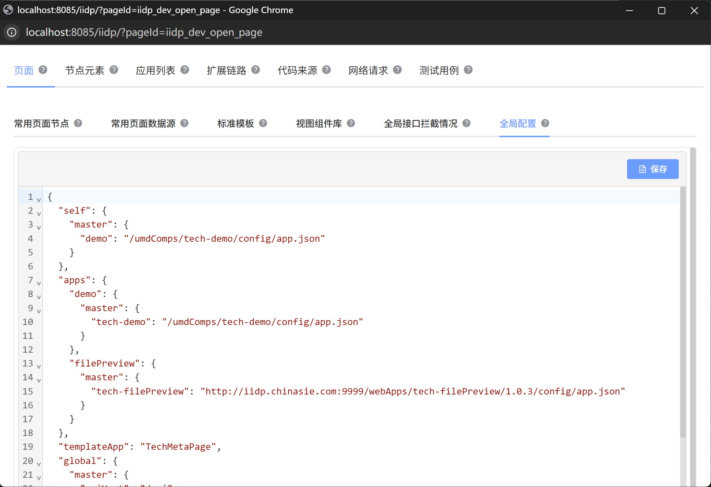

## 3. 节点元素

节点元素模块用于查看和编辑页面节点的详细信息，包含六个子标签页。左侧树支持新增和删除节点、查看节点代码、跳转到扩展。

### 3.1 属性

- **功能**：查看和编辑节点的属性信息
- **结构**：
  - 元属性：id、type、name、display、className、dataSource
  - 其他属性：动态生成的其他节点属性
- **操作**：
  - 直接编辑属性值
  - 支持查看和编辑函数类型属性
  - 自动生成操作代码

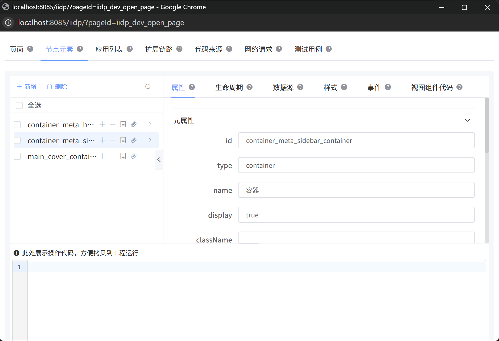

### 3.2 生命周期

- **功能**：查看和编辑节点的生命周期钩子
- **支持的生命周期**：
  - created
  - mounted
  - beforeDestroy
  - destroy
- **操作**：
  - 查看生命周期钩子的重写历史
  - 编辑当前版本的生命周期代码
  - 保存后自动生成操作代码

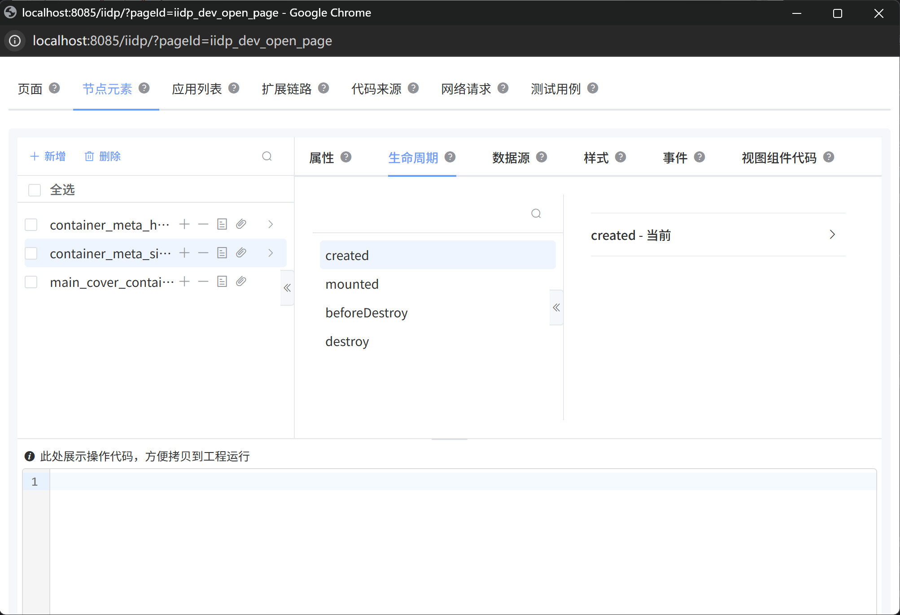

### 3.3 数据源

- **功能**：查看和编辑节点的数据源配置
- **树功能**：
  - 展示数据源列表
  - 支持点击数据源查看详细配置
- **操作**：
  - 查看数据源配置
  - 编辑 reqPrep（请求前） 和 reqAfter（请求后） 方法
  - 保存后自动生成操作代码

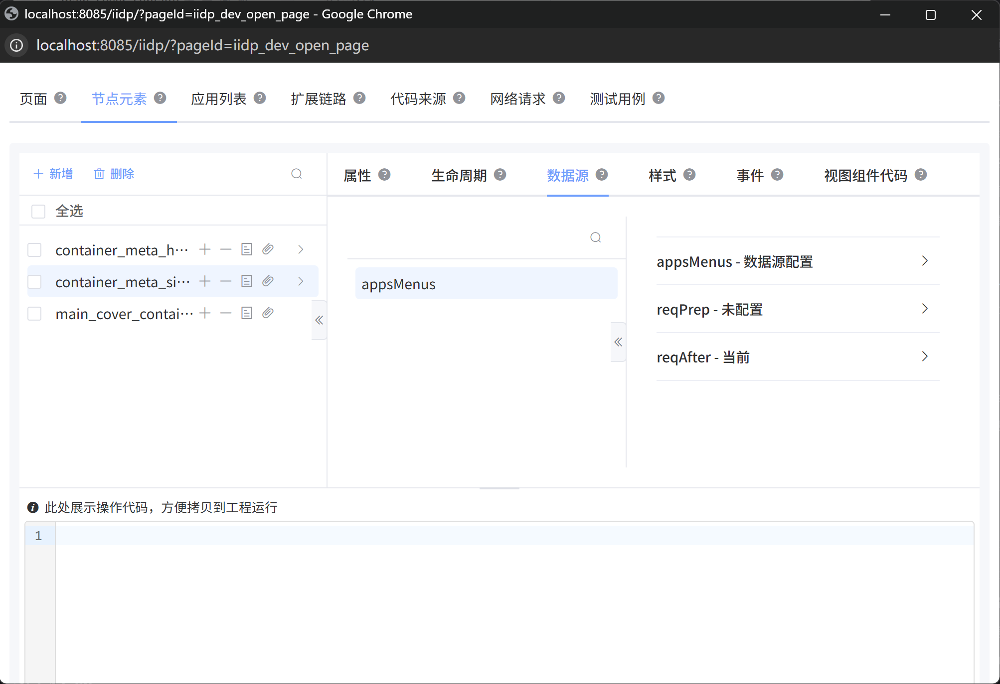

### 3.4 样式

- **功能**：编辑节点的样式配置
- **结构**：
  - style 属性：style 对象
  - css 属性：css 样式代码
- **操作**：
  - 编辑样式内容
  - 点击"保存样式"按钮保存样式
  - 自动生成操作代码

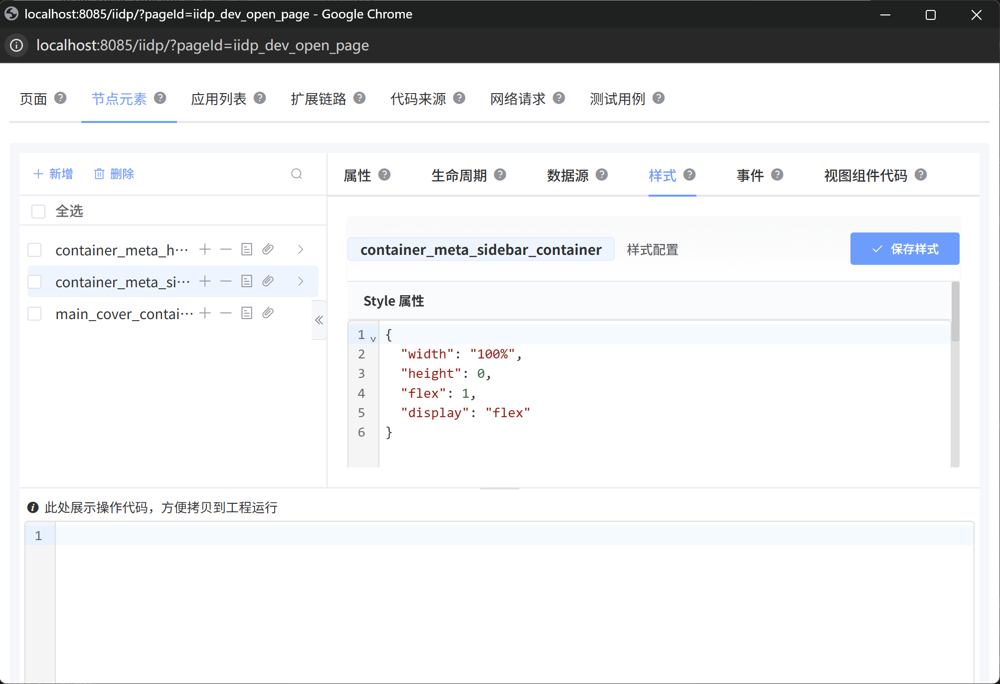

### 3.5 事件

- **功能**：查看和编辑节点的事件处理函数
- **操作**：
  - 查看事件处理函数（bind_on_xx 以及 view 协议里面的事件）的重写历史
  - 编辑当前版本的事件处理代码
  - 保存后自动生成操作代码

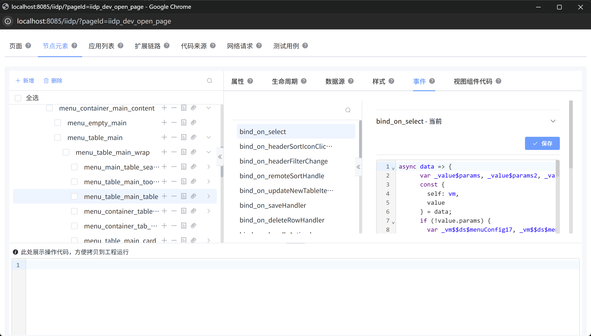

### 3.6 视图组件代码

- **功能**：查看视图 type 对应的 vue2 组件代码，例如 type=container 对应 tech-container 组件（不可编辑）
- **操作**：
  - 浏览目录树选择要查看的组件文件
  - 查看组件源代码内容

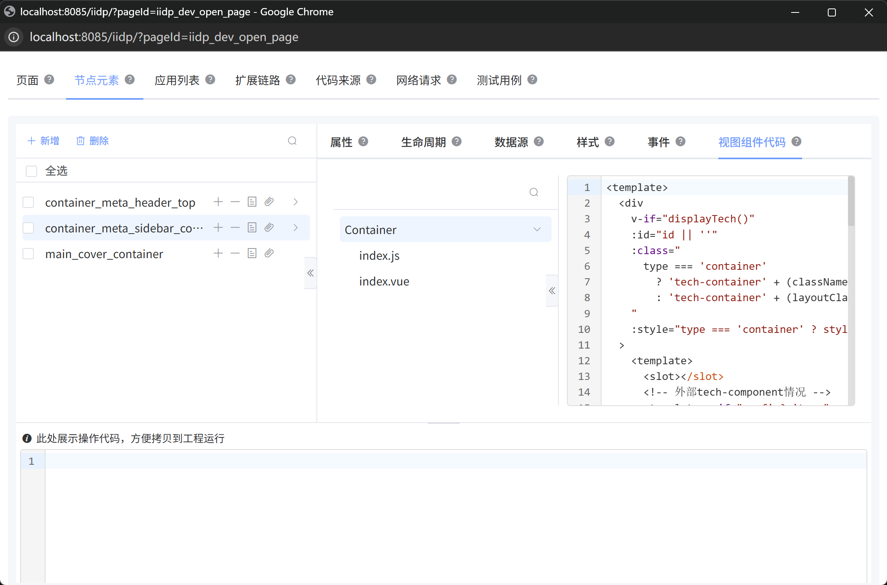

## 4. 应用列表

应用列表模块用于管理和查看前端扩展应用，包含五个子标签页。左侧树展示应用列表，点击圆形图标启用/禁用应用（绿色：启用，灰色：禁用），mockApps 将自动同步至 sessionStorage。节点文字为浅灰色时表示应用未加载。

注意事项：

- **`npm run start:base`** 启动时才显示圆形图标。需要配置 sessionStorage 的 tempApi 后端地址。
- 点击圆形图标启用/禁用应用后，需要刷新页面才能看到效果。

### 4.1 扩展

- **功能**：查看当前应用的所有扩展配置
- **树功能**：
  - 展示选中应用的扩展列表
  - 支持点击扩展查看详细信息
- **操作**：
  - 选择应用查看其扩展配置
  - 点击扩展可跳转到扩展链路模块

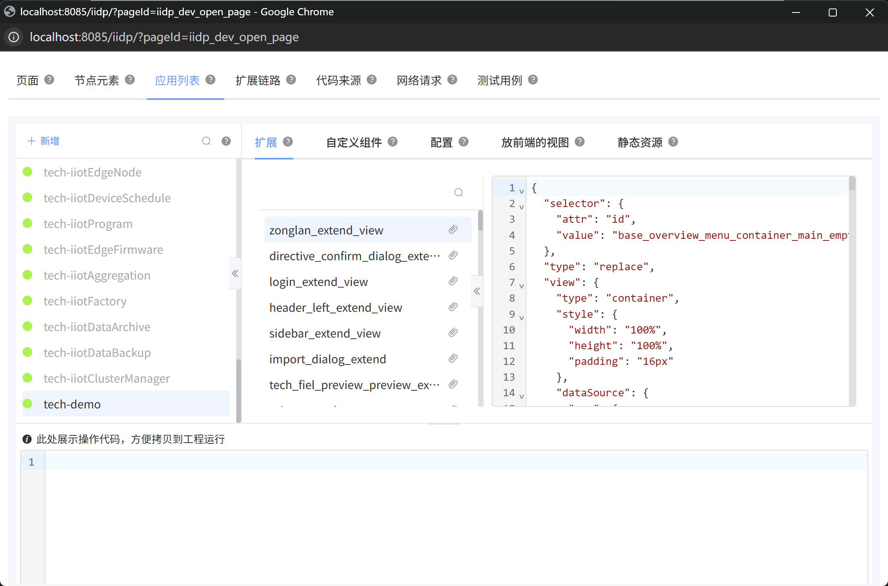

### 4.2 自定义组件

- **功能**：查看当前应用的自定义组件
- **树功能**：
  - 展示选中应用的自定义组件列表
  - 支持点击组件查看详细配置
- **操作**：
  - 选择应用查看其自定义组件
  - 查看组件详细配置

### 4.3 配置

- **功能**：查看当前应用的 app.json 配置（不可编辑）
- **操作**：
  - 选择应用查看其 app.json 配置

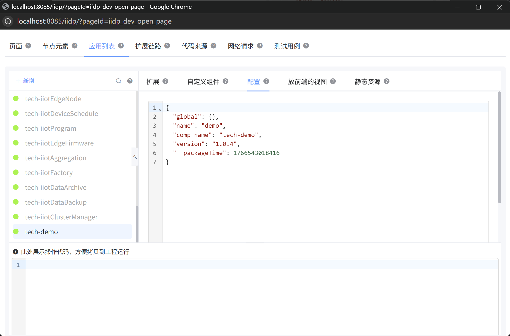

### 4.4 放前端的视图

- **功能**：查看当前应用的放前端的视图配置（目录：apps/xxx/model-views），**本地开发的应用才会显示数据**。
- **树功能**：
  - 展示后端视图放前端的视图列表
  - 支持点击视图查看详细配置
- **操作**：
  - 选择应用查看其前端视图
  - 查看视图详细配置

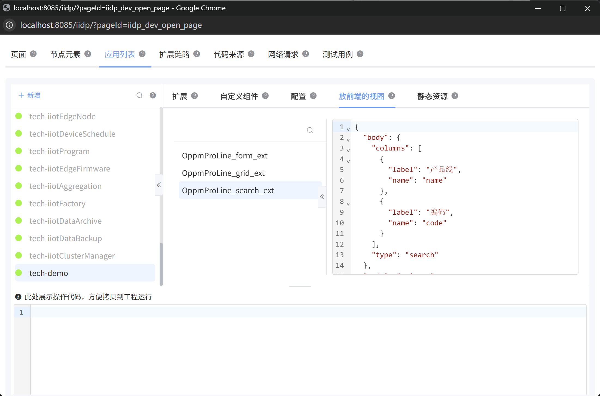

### 4.5 静态资源

- **功能**：查看当前应用的静态资源（目录：apps/xxx/static-resource），**本地开发的应用才会显示数据**。

注意事项：

- 打包后才能看到静态资源，npm run build:comp --module=xxx --comp=xxx
- 不要开着 npm run start 一边打包，会有资源冲突

- **类型**：
  - 图片资源：支持预览
  - 代码资源：支持查看内容
- **操作**：
  - 选择应用查看其静态资源
  - 点击资源查看详细内容
  - 图片资源支持直接预览

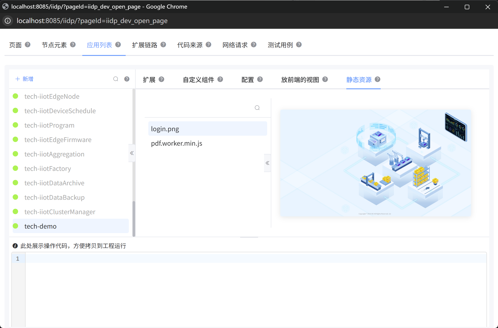

### 4.6 应用包按需加载处理

- **功能**：这是一个用于优化应用包性能的工具，通过对应用包进行分析、配置和重新打包，实现按需加载和代码分割。

注意事项：

- 此工具是当没有 app 源码只有打包后的 app 的 ZIP 包，或有源码但源码比较复杂，需要自动生成按需加载配置参考的情况下使用；有源码情况拿到按需加载配置后，需要手动把按需加载配置写到工程源码上，不需要使用工具转出 app 的 ZIP 包

- **操作**：
  - 点击右侧详情面板顶部的"处理应用包按需加载"按钮，打开应用包上传处理弹窗
  - 上传应用包，支持同时上传多个 ZIP 文件，上传前可以移除不需要的文件
  - 点击"开始处理"按钮，系统会上传 ZIP 包到后端
  - 处理完成后，会显示一个可编辑表格
    - 扩展 ID 列：自动生成的按需加载正则没有覆盖到的 id，默认都不勾选，需要手动勾选例如：**template-meta-page-app、page_meta_login、page_meta_index、tabs_meta_main_content_label** 等功能菜单外部扩展的 id。勾选了的前端节点 id 会重新把对应 id 的扩展抽取到首屏全局加载的子资源里面
    - 按需加载配置列：用于配置按需加载的正则，如果还有其他 id 没有被 app 的按需加载正则覆盖到则需要手动调整正则，例如：**iiot_abc** 这个 id 没有被覆盖到，生成的 app 正则为 ^/SMBM/?，需要手动调整 app 正则为 ^/(SMBM/?)|(iiot_abc)
  - 保存并下载，支持单个应用处理和批量处理，生成处理后的 ZIP 包

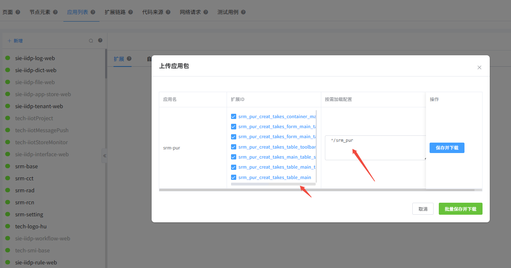

## 5. 扩展链路

扩展链路模块用于查看 配置扩展的调用链路（扩展之间的执行顺序 继承关系 代码）。左侧树展示扩展列表，点击扩展查看扩展血缘关系。

注意事项：

- 新增删除禁用启用扩展 只是改变工程运行时扩展 Map 变量 不会实际操作工程中的扩展和代码

### 5.1 左侧扩展树

- **功能**：查看当前加载的扩展视图 继承关系
- **左侧树功能**：
  - 展示扩展的名称 代码 继承关系
  - 编辑扩展代码 新增扩展 继承关系 删除扩展
- **操作**：
  - 新增 删除 查看扩展
  - 工具栏 批量新增 删除
    新增
    
    删除
    
    查看扩展
    

操作效果图：

### 5.2 右侧血缘关系树

点击扩展节点 显示当前扩展的血缘关系

- **功能**：更好的查看当前加载的扩展视图 继承关系
- **右侧血缘树功能**：
  - 展示扩展的名称 代码 继承关系
  - 编辑扩展代码 新增扩展 继承关系 删除扩展

## 6. 代码来源

代码来源模块用于录制和查看应用运行时调用的方法，帮助开发者了解代码执行流程。

### 6.1 录制功能

- **功能**：录制应用运行时调用的方法
- **操作**：
  - 点击"开始录制"按钮开始录制，操作业务页面
  - 点击"停止录制"按钮停止录制
  - 录制过程中显示实时进度
  - 查看录制的方法数量
  - 显示最近捕获的 5 个方法列表

### 6.2 方法列表

- **功能**：
  - 以折叠列表形式展示录制的方法
  - 每个方法包含标题、来源文件、行号等信息
  - 支持展开查看完整代码
- **过滤功能**：
  - 支持按方法名搜索
  - 支持过滤底层方法
  - 分页加载，每次加载 50 条

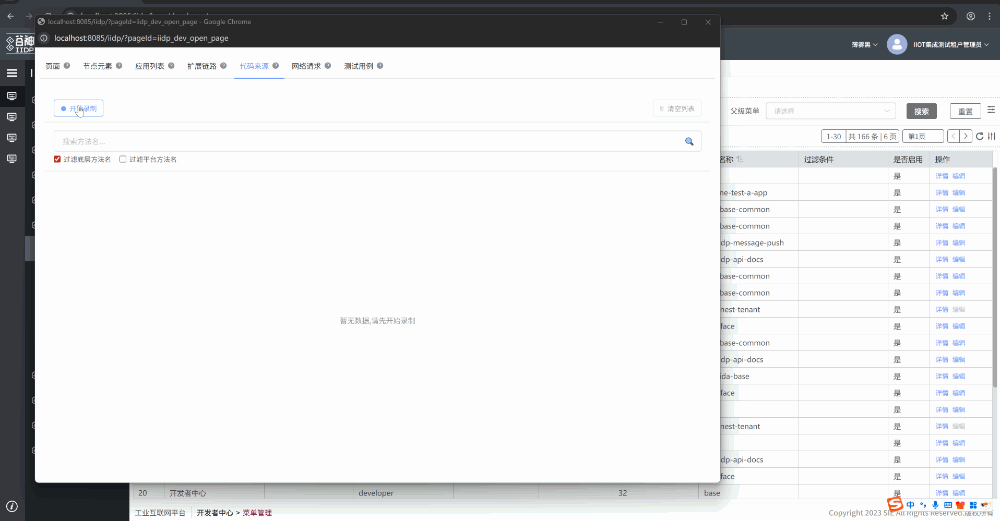

## 7. 网络请求

网络请求 用于监控发起的网络请求，可以支持 查看 配置 入参和返回。

- **功能**：

  - 支持展开查看完整参数 操作 点击 展开
    
  - 编辑入参 返回 搜索网络请求列表 操作 直接在入参/返回显示框中编辑
  - 根据当前修改参数重新发起网络请求 操作 点击当前展开的 发起请求 按钮
    
  - 保存当前参数到源请求 操作 点击当前展开的 保存到当前请求 按钮
    
  - 清除缓存（用户更改） 操作 点击当前展开的清除当前缓存按钮 / 点击清除全部缓存
  
  <!-- 功能效果动图：
   -->

## 8. 测试用例

测试用例模块用于管理和维护 UI 自动化测试用例录制保存和编辑单元测试脚本，支持测试用例的创建、编辑、批量删除与批量运行，提升测试效率和规范性。左侧树用于用例的管理，右侧是用例的编辑界面。
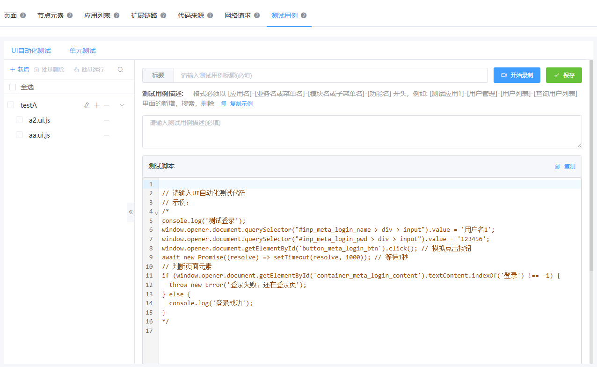

- **UI 自动化测试**：

  - 步骤 1：创建测试用例
    点击【新增】按钮 可选择新建文件夹或者文件
    填写文件名（必填） 页面上操作新建的文件会在页面上显示在左侧树中，并会保存到本地代码工程中的 uiTest 和 unitTest 文件如下图所示：

    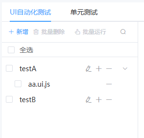
    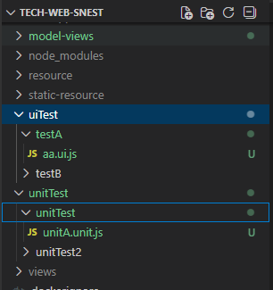
    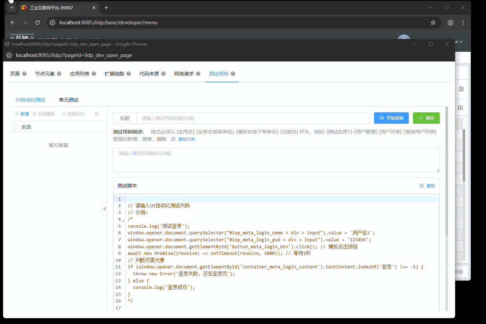

  - 步骤 2：填写标题（必填）
  - 步骤 3：按照规范填写测试用例描述（必填）
  - 步骤 4：编写或粘贴测试脚本代码 或者点击开始录制去页面操作生成脚本

    录制注意事项：从产品线菜单点击开始录制

    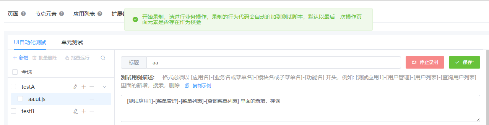

    

  - 步骤 5：点击【保存】完成创建

    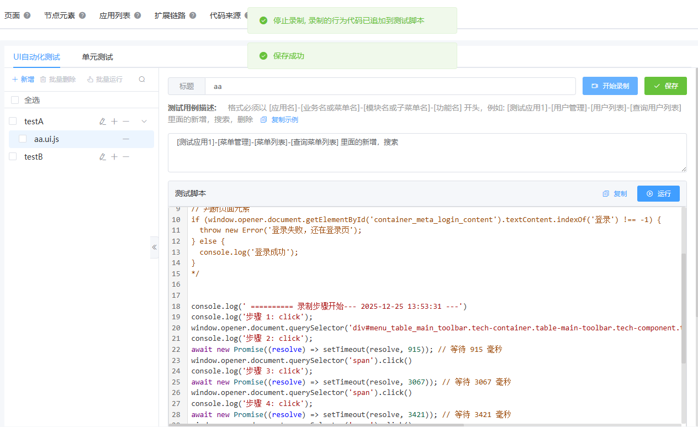
    

  - 步骤 6：点击【运行】执行测试用例

    测试结果会保存在工程的 testReport 目录下
    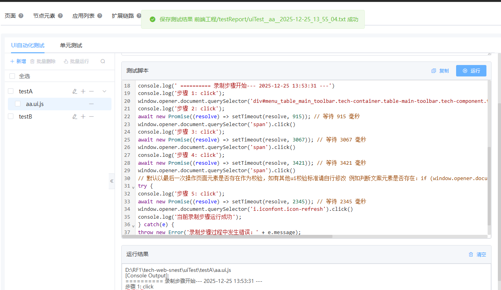
    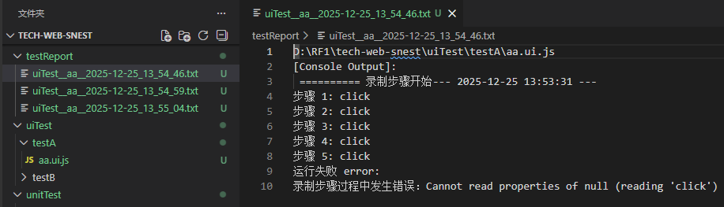
    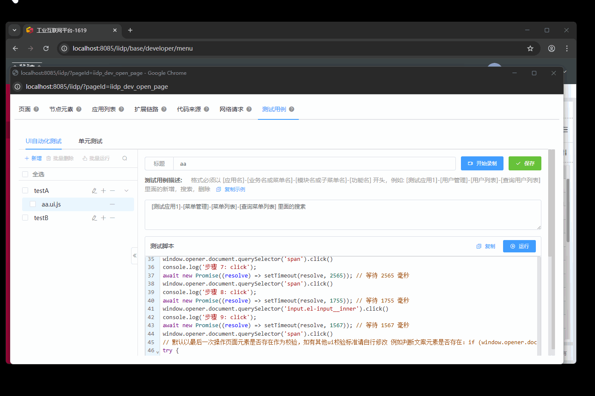

- **单元测试**：

  初次打开单元测试会安装 jest 单元测试依赖如下图所示：

  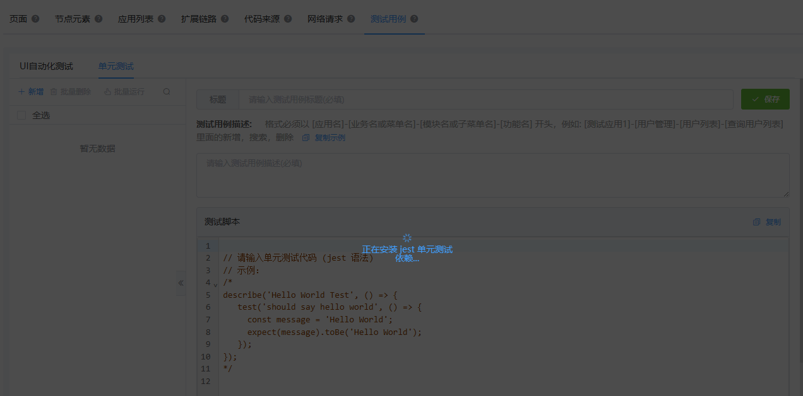

  - 步骤 1：创建测试用例（同 UI 自动化测试）
  - 步骤 2：填写标题（必填）
  - 步骤 3：按照规范填写测试用例描述（必填）
  - 步骤 4：编写或粘贴测试脚本代码
    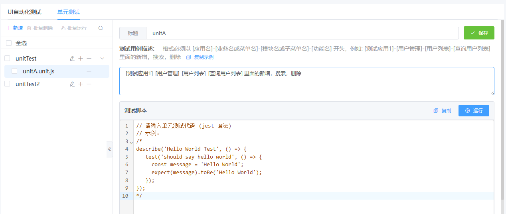
  - 步骤 5：点击【保存】完成创建
  - 步骤 6：点击【运行】执行测试用例，测试结果会保存在工程的 testReport 目录下

- **执行测试用例**：

  在列表中选择一个或多个测试用例（可点击【全选】）
  点击【批量运行】执行选中的测试用例

- **管理测试用例**：

  单条操作：直接点击测试用例进行编辑

  批量删除：选中多个用例后点击【批量删除】,未勾选用例的情况下批量删除按钮是禁用状态

  批量运行：选中多个用例后点击【批量运行】,未勾选用例的情况下批量运行按钮是禁用状态
