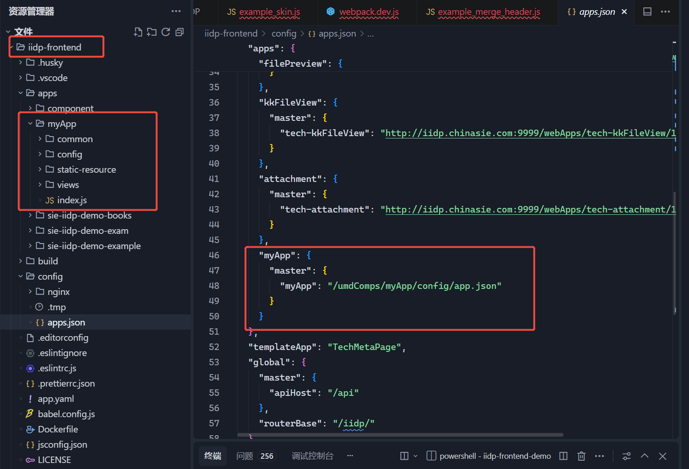
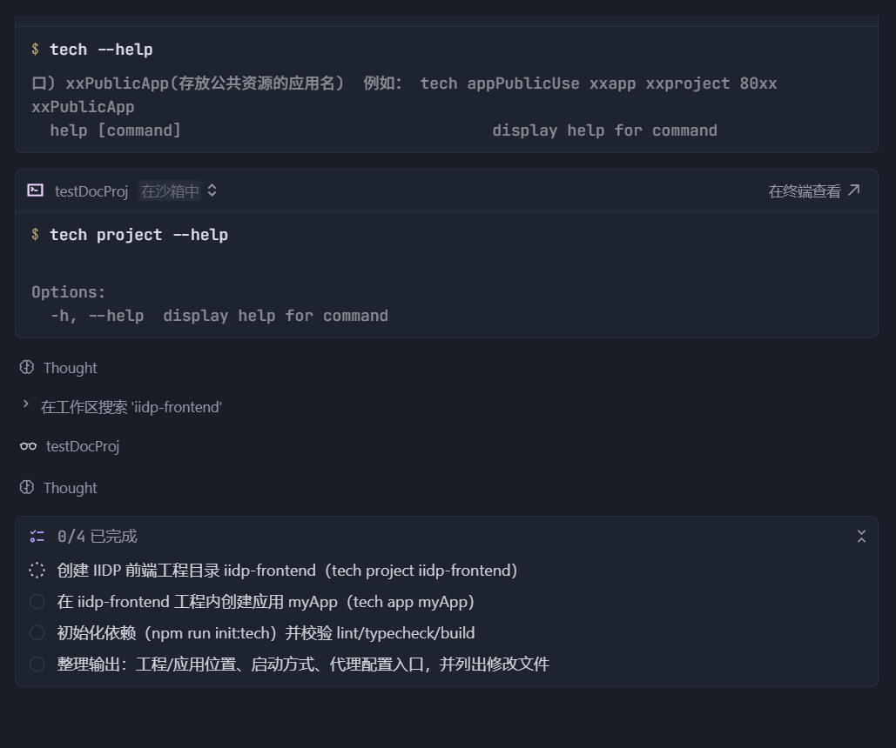
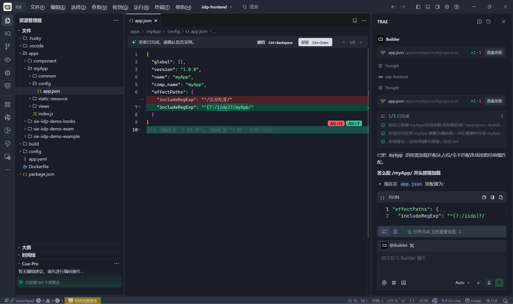
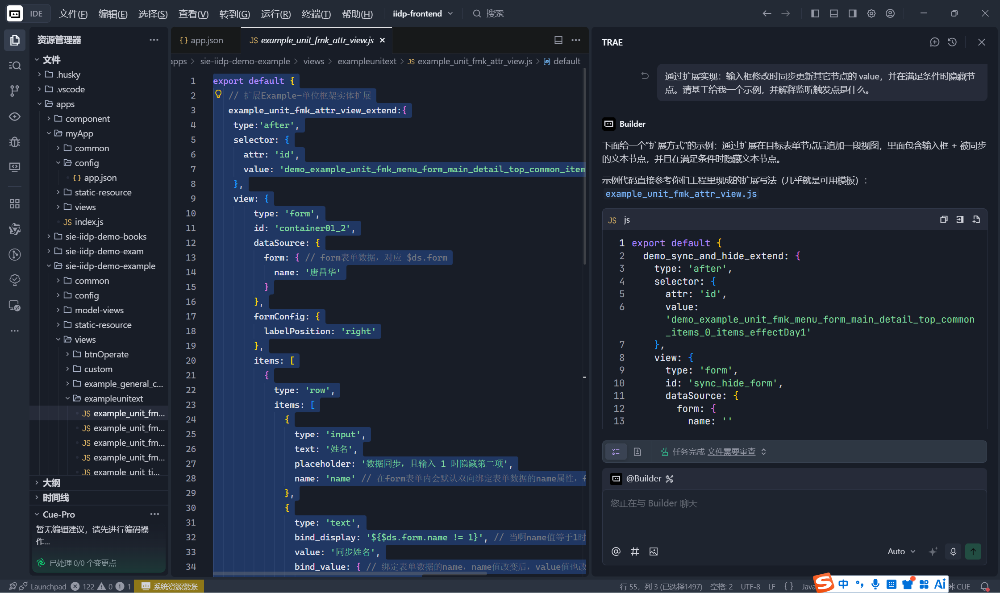
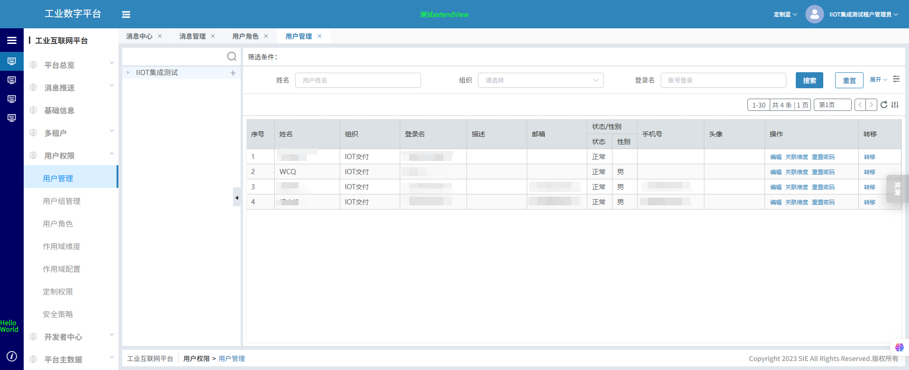
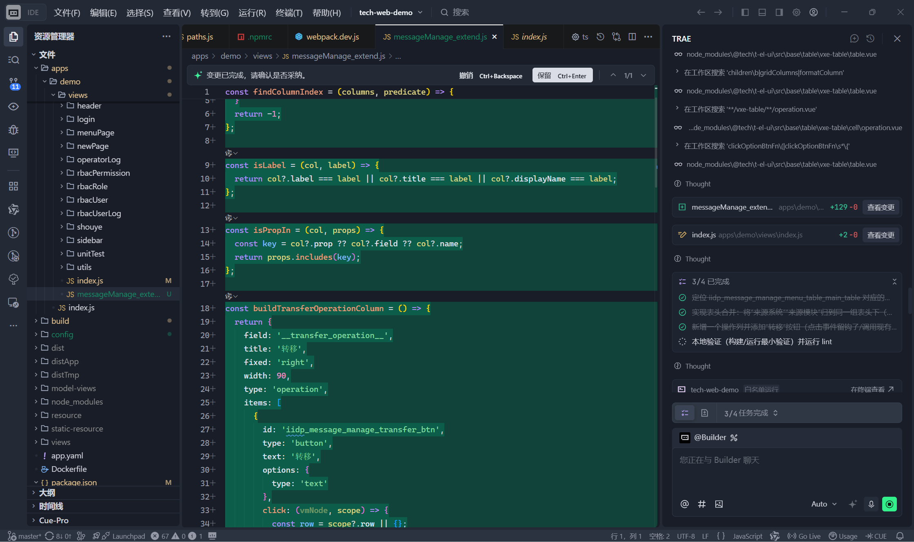
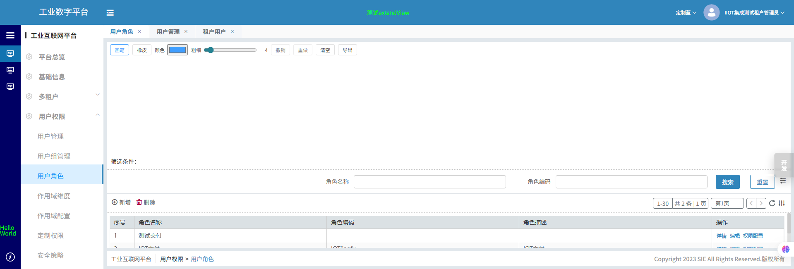
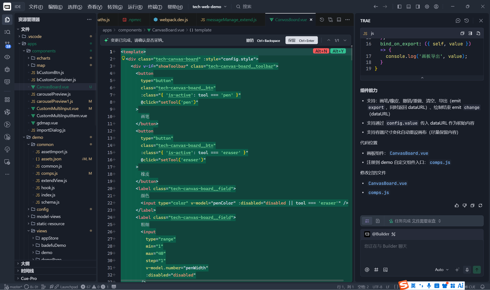

# 结合 AI 工具（直接可复制的提问示例）

本文档只给可直接复制的提问示例。使用 AI 前先准备“文档依据”，然后按你所处环节直接选一条提问即可。

## 0. 前置说明（开发者本地 AI 工具）

本章前提是开发者自己日常有一个可用的 AI 工具即可（任意品牌/形态均可），下列仅为举例：

- Trae IDE：项目级 AI 助手（适合结合代码仓库进行检索、改动与验证）
- ClawCode：AI 编程助手（按个人习惯选择对应模型与工作流）
- VS Code：GitHub Copilot Chat / Codeium Chat 等编辑器内 AI
- JetBrains IDE：AI Assistant（IDE 内对话、代码补全、重构建议）
- 本地大模型客户端：Ollama（或同类本地模型运行/对话工具，适合离线与敏感信息场景）

## 1. 提问前置（先把文档依据贴给 AI）

**离线文档下载**：[iidp文档.zip](/iidpdoc/file/file/iidp文档.zip)

### 提问格式


### 示例 1：线上文档作为依据

```text
文档来源：线上(https://iidp.chinasie.com:9999/iidpdoc/)
请基于该来源的全量文档体系回答：我想实现“表单输入联动其他节点显示/取值”，应该用 bind_ 还是 bind_two_？监听触发点是什么？
请给最小 JSON 示例 + 解释触发机制。
```

### 示例 2：本地文档作为依据

```text
文档来源：本地(你的本地路径)
相关文档文件：03.前端开发手册/06.框架/03.属性绑定.md
请基于该来源的全量文档体系回答：我按文档写了属性绑定，但页面不更新。
请给排查顺序 + 每一步怎么验证。
```

## 2. 工程化（目录结构/入口/按需加载）提问示例

### 提问格式

```text
文档来源：线上(https://iidp.chinasie.com:9999/iidpdoc/) / 本地(你的本地路径)
【工程化】 我的问题
应用名（可选）：例如 myApp
相关路径（可选）：例如 apps/{app}/index.js、apps/{app}/common、apps/{app}/config/app.json
请基于文档给出：目录结构 + 入口文件清单 + 最小示例。
```

### 示例 1：新建应用前端工程和应用

提问：

```text
文档来源：线上(https://iidp.chinasie.com:9999/iidpdoc/) / 本地(你的本地路径)
【工程化】根据文档帮我创建一个前端工程iidp-frontend，同时创建应用，应用名为 myApp。
```

效果：




### 示例 2：按需加载配置与启动报错

提问：
```text
文档来源：线上(https://iidp.chinasie.com:9999/iidpdoc/) / 本地(你的本地路径)
【工程化】把/myApp/开头的应用设置为按需加载。
```

效果：


## 3. 功能开发（视图/扩展/组件）提问示例

### 提问格式

```text
文档来源：线上(https://iidp.chinasie.com:9999/iidpdoc/) / 本地(你的本地路径)
【功能开发】<我的问题>
相关配置（可选）：<在线视图（后端视图） / 扩展配置 / 自定义组件 / 视图组件>
请给最小可用示例，并说明关键字段与注意项。
```

### 示例 1：仅用视图配置实现表单联动与隐藏

提问：
```text
文档来源：线上(https://iidp.chinasie.com:9999/iidpdoc/) / 本地(你的本地路径)
【功能开发】通过扩展实现：输入框修改时同步更新其它节点的 value，并在满足条件时隐藏节点。请基于给我一个示例，并解释监听触发点是什么。
```

效果：


### 示例 2：扩展表格

效果：
```text
文档来源：线上(https://iidp.chinasie.com:9999/iidpdoc/) / 本地(你的本地路径)
【扩展】根据文档写一个扩展‘iidp_message_manage_menu_table_main_table’节点的表格，实现合并表头‘来源系统’、‘来源模块’，增加多一个操作列，添加‘转移按钮’
```

结果：



### 示例 3：自定义Vue组件

效果：
```text
文档来源：线上(https://iidp.chinasie.com:9999/iidpdoc/) / 本地(你的本地路径)
【自定义组件】我要写一个自定义 Vue 组件用于视图渲染，组件会在视图 JSON 里通过 type 引用。组件实现画板功能。
```

结果：



## 4. 调试排障（接口/缓存/绑定）提问示例

### 提问格式

```text
文档来源：线上(https://iidp.chinasie.com:9999/iidpdoc/) / 本地(你的本地路径)
【调试】<我的问题>（实际 vs 期望）
我会提供：<loadView/loadMenu 片段 或 节点 JSON 或 报错堆栈>
请给：排查顺序 + 每一步如何验证
```

### 示例 1：字段不显示（loadView 排查）

```text
【调试】视图配置的字段在页面不显示。
请给我按优先级排序的排查清单，并告诉我 loadView 返回里要重点看哪些字段（fields/column/authInfo/advancedComponent）。
```

### 示例 2：字段顺序不一致（advancedComponent 偏好方案）

```text
【调试】页面字段顺序与后台配置不一致，新增字段不生效，已删字段仍显示。
请判断是否是 advancedComponent（用户偏好方案）导致，并给出清理方案与验证步骤。
```

### 示例 3：完整写法绑定未触发（selector/path/transform）

```text
【调试】bind_value 的完整写法（selector+path+transform）没有触发更新。
我会提供：selector 指向节点 id、path 写法、变更前后数据、transform 内容。
请判断是 selector 选错、path 应写 $ds 还是 dataSource、还是 transform 未 return。
```

### 示例 4：表达式不生效（$ds/$self/$cmd）

```text
【调试】我在视图里写了 bind_disabled/bind_display 的表达式，条件判断不生效。
请帮我把表达式拆解成可读逻辑，并指出 $ds、$self、$cmd 的作用域与常见坑。
```

### 示例 5：行内编辑保存无效（saveHandler 与行标识）

```text
【调试】行内编辑保存不调用接口，或接口入参没有变化字段。
请基于 saveHandler/行数据标识（__ROW_IS_CREATED__/__ROW_IS_DELETED__/__CELL_VALUE_CHANGED__）解释原因，并给出我在前端扩展里该如何同步这些标识的做法。
```

## 5. 打包构建（失败原因/产物/兼容）提问示例

### 提问格式

```text
文档来源：线上(https://iidp.chinasie.com:9999/iidpdoc/) / 本地(你的本地路径)
【构建】<我的问题>
命令：<npm run build>，环境：<OS/Node>，报错：<堆栈末尾>
请给：原因 + 最小修复 + 验证方式
```

### 示例 1：OpenSSL/Terser 构建报错（0308010C）

```text
【构建】npm run build 报错：error:0308010C:digital envelope routines::unsupported。
请说明原因，并给出在 Windows 下的最小修复方式（NODE_OPTIONS=--openssl-legacy-provider）以及应该把这个配置放在哪里更合适。
```

### 示例 2：构建成功但部署后仍旧旧页面

```text
【构建】本地 build 成功但线上部署后还是旧页面。
请告诉我产物目录里哪些文件/目录必须被正确部署（如 /umdComps、/static-resource），以及如何判断是否部署到了正确位置。
```

### 示例 3：start:base 与线上差异排查

```text
【构建】start:base 启动后页面与线上效果不一致。
请给我一套“techPluginsVersion 对比 + mockApps/tempApi + 同名 App 合并优先级”的排查流程。
```

## 6. 发布部署（应用市场/手动部署/覆盖规则）提问示例

### 提问格式

```text
文档来源：线上(https://iidp.chinasie.com:9999/iidpdoc/) / 本地(你的本地路径)
【部署】<我的问题>（实际 vs 期望）
方式：应用市场/手动，应用：<myApp>，产物：<tech-myApp.zip>，位置：< /umdComps /static-resource apps.json>
请给：排查顺序 + 验证方式 + 回滚方案（如适用）
```

### 示例 1：应用市场更新后仍旧旧代码

```text
【发布】我上传了前端 zip 包到应用市场并点击更新，但页面仍旧使用旧代码。
请给我按优先级排序的排查步骤：是否命中同名 App、是否有缓存、是否静态资源未更新、如何验证当前加载的是哪个版本。
```

### 示例 2：手动部署资源 404（/umdComps 与 /static-resource）

```text
【发布】我手动把 tech-myApp.zip 解压到 /umdComps，但页面样式或资源 404。
请说明 /umdComps 与 /static-resource 的关系，以及手动部署时静态资源应如何处理。
```

### 示例 3：不走应用市场快速回滚

```text
【发布】我想在不走应用市场的情况下快速回滚到上一个版本。
请给出“回滚文件范围、需要回滚的目录、如何验证版本”的最小步骤。
```

## 7. 常用关键词（复制到提问里）

```text
tech- / 视图 / type / selector / path / dataSource / $ds / $self / $cmd / bind_ / bind_two_ / bind_on_ / transform / loadView / loadMenu / advancedComponent / authInfo / fields / column / 行内编辑 / saveHandler / start:base / tempApi / mockApps / techPluginsVersion / umdComps / static-resource / apps.json
```

