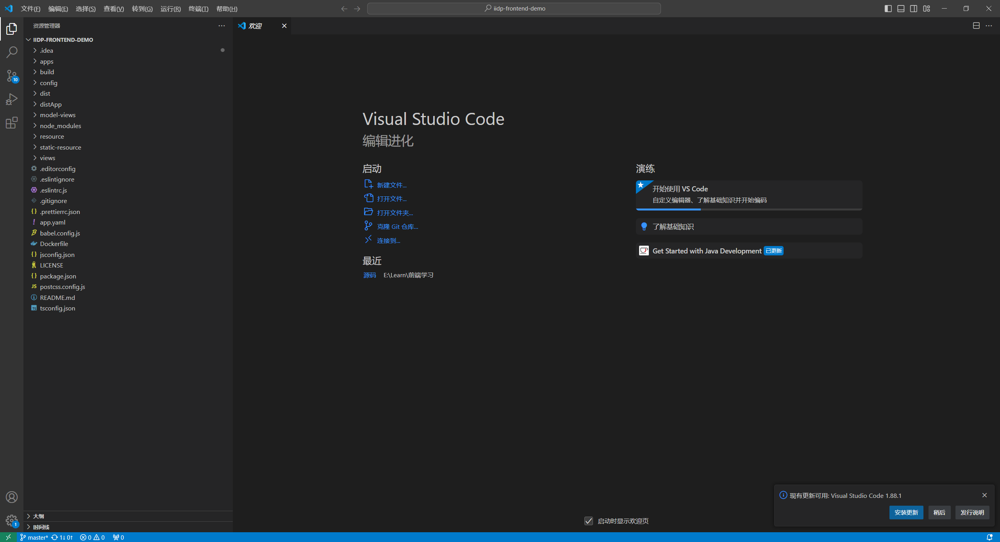
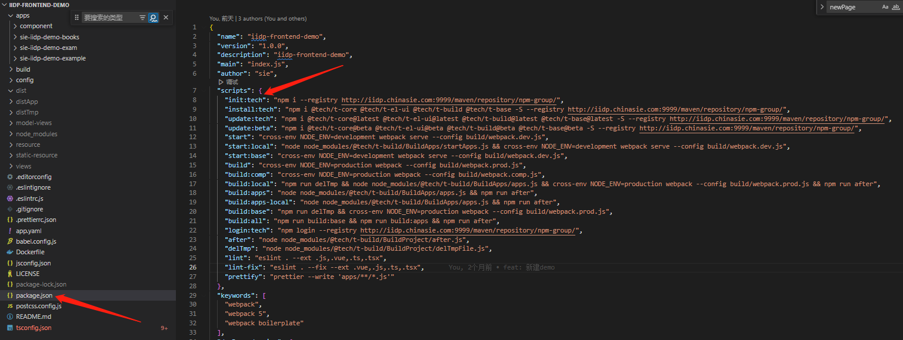
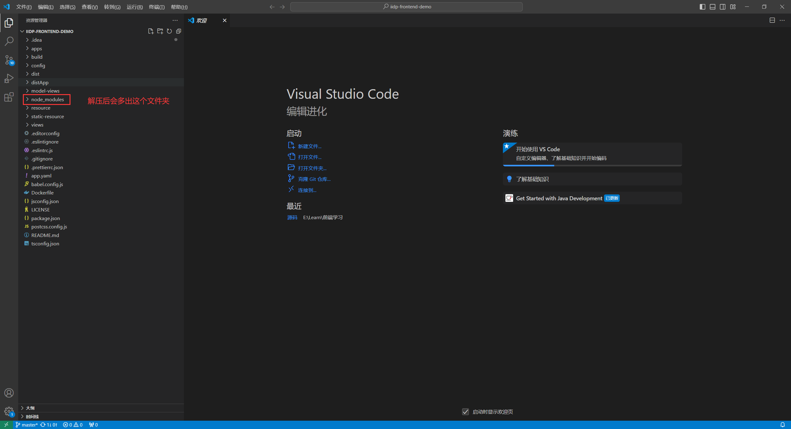
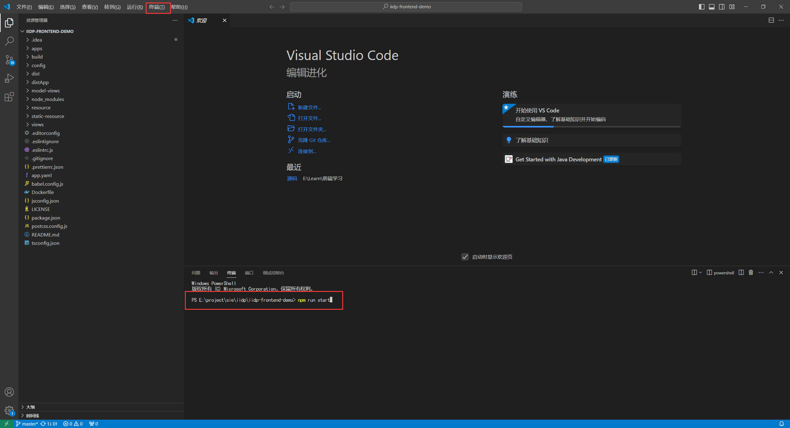
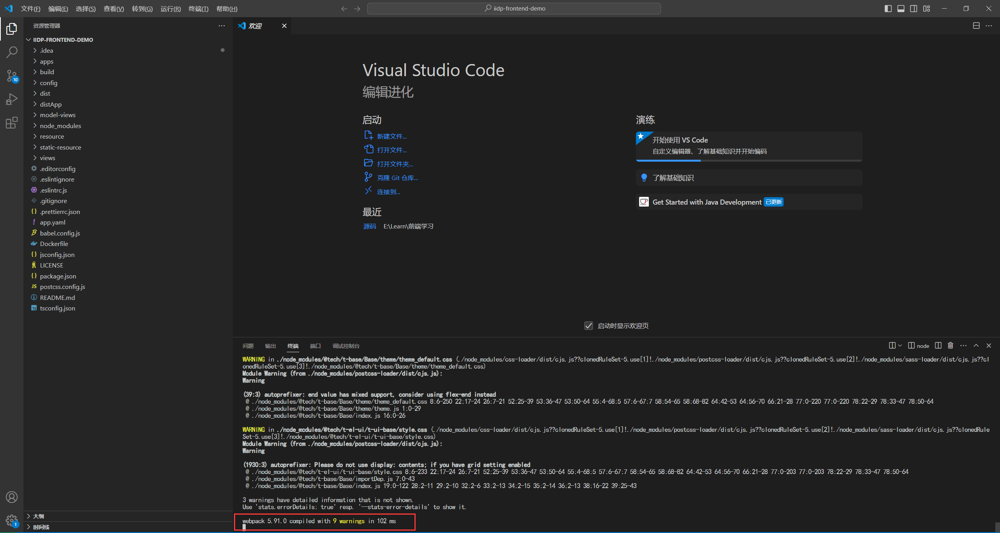
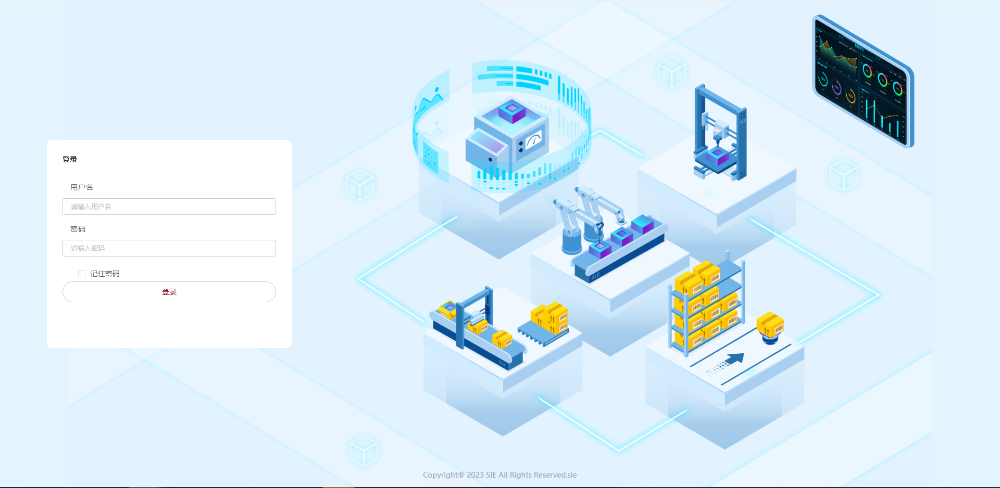
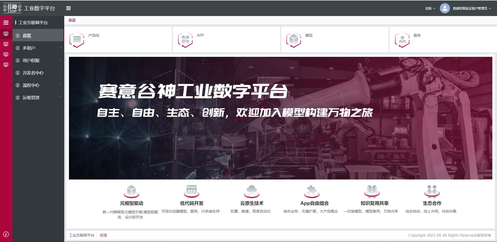

建议采用统一的开发工具，方便团队进行内部协作，如统一排错，标\*的是强制性要求：

## ​ **1、安装工具**

​ (1) **开发电脑配置（建议）** **`16G内存+    4核+`**

​ (2) **Nodejs 要求（必须）** **`必须：版本≥14 建议：node-v16.16.0-x64.msi`**

​ (3) **开发工具（建议）** **`建议：VSCodeUserSetup-x64-1.58.2`**

**工具可从百度云盘快速获取，云盘链接：https://pan.baidu.com/s/1iCnul47eAnWzmFjJULtv-A 提取码：iidp**

**`注意：上述工具安装成功后，在进行后续的步骤`。**

## ​ **2、获取前端工程源码**

- 获取方式 1：安装脚手架命令获取（⭐ 推荐使用）

```sh
# 安装脚手架(第一次使用需要安装，后面第二次使用不需要安装)
npm i t-cli -g --registry http://iidp.chinasie.com:9999/maven/repository/npm-group/

# 创建iidp前端工程命令 (命令行运行 例如: 创建 iidp-frontend-demo)
tech project iidp-frontend-demo
```

- 获取方式 2：在线下载。

  源码路径：http://192.168.175.55:9888/iidp-demo/iidp-frontend-demo.git  
  分支：master  
  账号：iidpDemo 密码：iidpDemo123456  
  **` * 【如果需要外网访问，需要在公司BPM系统上提交VPN申请流程，申请开通访问IP:192:168:175:55 的访问权限。】`**  
  **` * 【iidpDemo为只读账号，如果需要代码提交权限，需要企业微信联系IIDP平台管理员 李君10 分配。】`**

- 获取方式 3：离线获取，[点击下载 demo 工程](/iidpdoc/file/iidp-frontend-demo.zip)

## ​ **3、工程导入**

**<span style="color: rgb(255, 0, 255);">步骤 1：</span>** 代码获取成功后，例如将后端工程源码 iidp-frontend-demo 存放在 D:\iidp_code 目录中

**<span style="color: rgb(255, 0, 255);">步骤 2：</span>** 启动开发工具 VsCode 后，点击 "文件"->"打开文件夹" 后选择 D:\iidp_code 目录中的 iidp-frontend-demo 工程目录，完成工程的导入,如下图


**<span style="color: rgb(255, 0, 255);">步骤 3：</span>** 安装依赖或复制依赖包到工程目录下：

安装依赖: npm run init:tech

复制依赖包:下载百度网盘中的 SIE IIDP Demo -> 前端依赖离线包 -> iidp-frontend-demo -> node_modules.zip 前端依赖包，复制到工程目录下，并解压。解压后目录下会多一个 node_modules 文件夹


## ​ **4、启动项目**

在终端中输入 npm run start 命令，启动前端工程


```sh
npm run init:tech
```

#### 启动本地开发

```sh
npm run start
```

## 配置后台环境

进入文件 `./build/webpack.dev.js`，修改 proxy 代理

```js
// webpack 工程开发环境 配置
module.exports = merge(mergeCommon, {
  devServer: {
    port: "8085", // 本地启动端口
    proxy: {
      "/fileSystem": {
        target: "http://iidp.chinasie.com:9999/fileSystem/", // 本地开发时改为类似 http://192.168.168.9:8085/, 不需要fileSystem
        pathRewrite: { "^/fileSystem": "" },
      },
      "/api": {
        target: "http://127.0.0.1:8060",
        pathRewrite: { "^/api": "" },
      },
      "/register": {
        target: "http://192.168.168.176:8080/", // 本地开发时改为类似 http://192.168.168.9:8085/, 不需要api
        pathRewrite: { "^/register": "" },
      },
    },
  },
});
```

出现如下信息，说明启动成功


## 配置临时后端域名

配置临时 sessionStorage tempApi 连接后端域名 方便调试

优先级比上面的 webpack.dev.js 里面配置 ip 高

```js
// 浏览器按F12 在console控制台输入 则可临时切换连接的后端
// 配置后需要刷新页面，关闭浏览器tab则会自动失效  设置的ip/域名与端口按
sessionStorage.setItem("tempApi", "http://192.168.1.2:8060");
// 如果是前端域名后面跟/api
sessionStorage.setItem("tempApi", "http://test.snest.com:31815/api");
```

## 运行后页面效果

访问本地前端的地址 http://localhost:8085/
账户：admin_000001
密码：Admin_000001

登录页



登录，如图页面为管理员登录后首页


