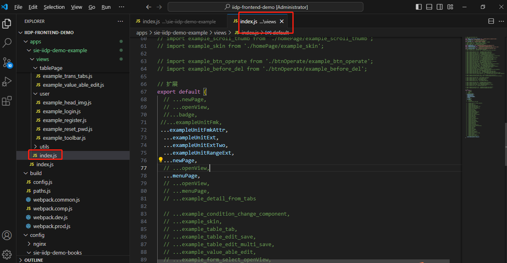
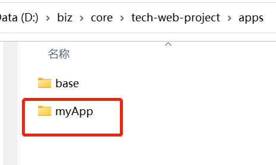
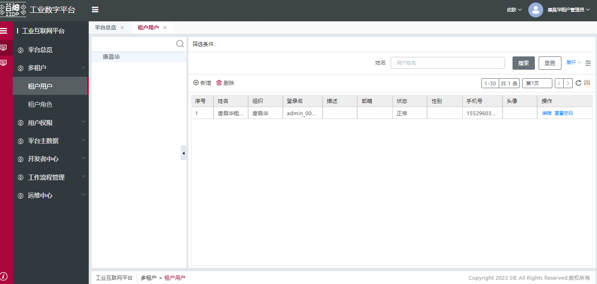
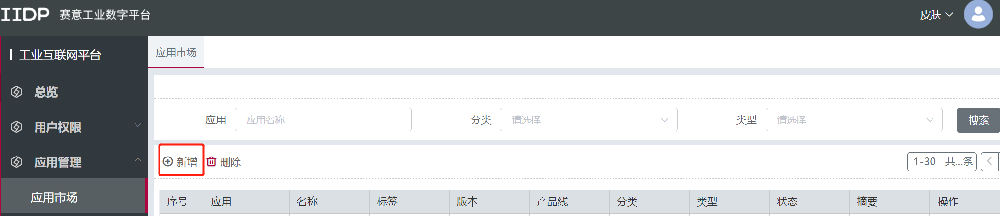
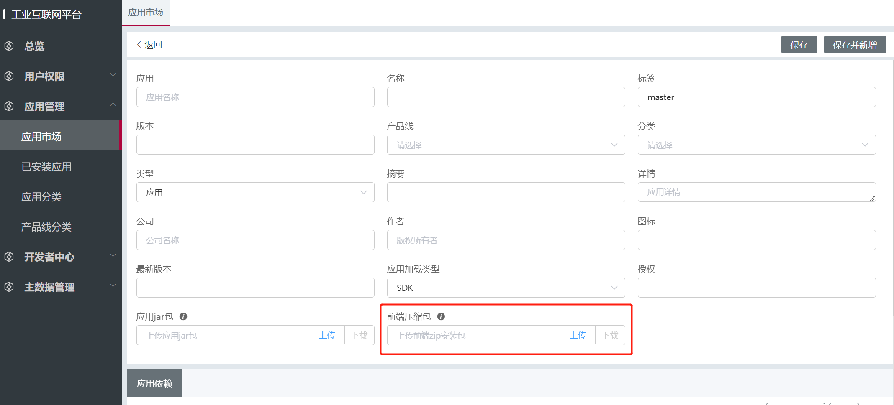
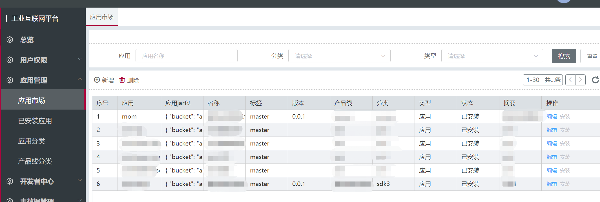
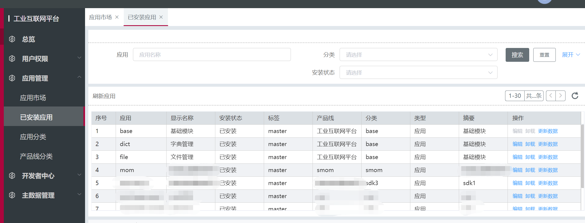

## 目录结构

```
|— apps
  |— demo                            // 业务App 根据实际情况命名
    |— common                        // 公共总扩展，一般情况不用操作，后面会展开讲解
    |— views                         // 纯js格式编辑视图，通过视图的扩展能力合并的主视图中
      |— rbacUser                    // 业务定制的扩展视图，名称根据实际情况定义
        |— tview__demo__rbac_user.js // 扩展文件，后面会展开讲解 命名规则：[自定义业务名].js
      |— ...
      |— index.js                    // 扩展视图的入口
    |— config                        // 当前App的额外配置，如全局变量
      |— app.json
    |— resource                      // 语言包，皮肤 等资源
    |— static-resource               // 静态资源
    |— index.js                      // 扩展引入入口
  |— component                       // 公共业务组件
|— config
  |— nginx
  |— apps.json
|— build                            // 各种环境的打包入口
```


## 清除demo的扩展

1. 找到目录apps\demo\views\index.js
2. 将所有引用内容都注释掉



## 配置应用

1. 拷贝一份/apps/demo目录
   命名修改为 myApp

   <!--  -->

   

2. 修改/apps/myApp/index.js文件里面关键字（注意：`注释中也需要修改`）
```js
export const name = 'tech-demo';
// 修改为：
export const name = 'tech-myApp';

/**${"name":"demo"}$**/
// 修改为：（需要跟文件夹名字一致,包括大小写）
/**${"name":"myApp"}$**/     

/*-*${"compName":"tech-demo"}$*-*/
// 修改为：（需要跟文件夹名字一致,包括大小写）
/*-*${"compName":"tech-myApp"}$*-*/
// 总体代码
import { mergeExtend } from '@tech/t-core/RuntimeIndex/build.RuntimeIndex.umd.js';
import extendConfig from './extend/extend.js';
import commonConfig from './common/index.js';
import config from './config/app.json';

// 参数组件名不能删除
export const name = 'tech-myApp';

export const getParams = () => {
  // 本地公共扩展 与 本地个性化扩展 合并
  let distOptions = mergeExtend(commonConfig, extendConfig); // test mock
  distOptions.global = config?.global || undefined; // 赋值应用配置
  return distOptions;
};


// 模块名注释不能删除 对应 config/apps.json apps下一级节点名
// eslint-disable-next-line spaced-comment
/**${"name":"myApp"}$**/
// 参数组件名注释不能删除 对应当前文件的 export name 与 config/apps.json 节点链接名
// eslint-disable-next-line spaced-comment
/*-*${"compName":"tech-myApp"}$*-*/
```


4. 修改/config/apps.json 配置文件

```js
{
  "self": { // 自身扩展工程./apps 下的扩展
    "master": { // 区分环境变量 master：生产环境  grey：灰度环境  test: 测试环境  dev：开发环境
      "smom-mes": "/iidp/umdComps/tech-smom-mes/config/app.json"
      ... 可以配置多个
    }
  },
  "apps": { // 扩展应用 遇到同名会在当前工程获取，其他在url连接上获取
    "smom-mes": { // 扩展应用模块名
      "master": {
        // 扩展应用组件名,如果没有远程扩展，写本地的扩展，与上面self的配置一致
        "tech-smom-mes": "http://xxx.xxx.xxx.xxx:xxxxx/iidp/umdComps/tech-smom-mes/config/app.json" 
      }
    }
    ... 可以配置多个
  },
  "templateApp": "TechMetaPage", // 固定元模型模板应用 不用修改
  "global": { // 全局变量 挂载到 window.tech 全局变量下
    "master": { // 区分环境变量 master：生产环境  grey：灰度环境  test: 测试环境  dev：开发环境
      "apiHost": "/api" // 调用：window.tech.apiHost
    },
    "routerdemo": "/iidp/" // 调用：window.tech.routerdemo
  }
}
```


## 本地运行项目

```sh
npm run start
```


## 构建部署

#### 打包
```sh
npm run build:all
```


#### 打包后目录

```sh
/dist
```


#### 部署nginx

在自己的服务器上安装nginx

[点击下载linux nginx 1.14.2](http://nginx.org/download/nginx-1.14.2.tar.gz)

[点击下载window nginx 1.14.2](http://nginx.org/download/nginx-1.14.2.zip)


#### 修改nginx.conf配置

配置的示例，请根据自己服务器的情况进行修改

```nginx
server {
    # 前端访问端口
    listen       xxxx;
    # 前端访问域名
    server_name  localhost;

    # 前端文件存放路径
    set $basePath "/xxxfront/";
    location /iidp {
      alias $basePath;
      index  index.html index.htm;
      if (!-e $request_filename) {
        rewrite ^/(.*) /iidp/index.html last;
        break;
      }
      if ($request_filename ~* .*\.(?:htm|html)$) {
        add_header Cache-Control "no-cache, no-store";
      }
      
      add_header Access-Control-Allow-Origin *;
      add_header Access-Control-Allow-Methods 'GET, POST, OPTIONS';
    }
    location ^~/docs {
      if ($request_filename ~* .*\.(?:htm|html)$) {
        add_header Cache-Control "no-cache, no-store";
      }
      set $curPath "${basePath}docs/";
      alias $curPath;
    }
    location /config {
        set $curPath "${basePath}config/";
        alias $curPath;
    }
    location /umdComps {
        set $curPath "${basePath}umdComps/";
        alias $curPath;
    }
    location /static-resource {
      set $curPath "${basePath}static-resource/";
      alias $curPath;
    }
    location /views {
      set $curPath "${basePath}views/";
      alias $curPath;
    }
    location /resource {
      set $curPath "${basePath}resource/";
      alias $curPath;
    }
    # 文件系统ip端口配置
    location ^~/fileSystem/ {
      proxy_http_version 1.1;
      client_max_body_size 200m;  
      proxy_pass http://xxx.xxx.xxx.xxx:xxxx/;
    }
    # 后端接口端口配置
    location ^~/api/ {
      proxy_http_version 1.1;   
      client_max_body_size 200m;
      proxy_pass http://xxx.xxx.xxx.xxx:xxxx/;
    }
  }
```


#### 上传服务器

dist里面文件上传到服务器对应前端文件目录


#### 访问项目

浏览器打开https://自己服务器域名.com/iidp




## 上传应用市场

#### 打包

```sh
npm run build:all
```


#### 压缩应用包

1. 进入`/dist/umdComps`目录，把打包出来的应用，分别压缩成zip文件
2. 进入平台，应用市场菜单，新增应用 
3. 在表单中上传应用的zip，一次上传一个应用，多个应用需要分别创建


### 安装应用
1. 进入`应用市场`菜单

2. 选择相应的应用，点击操作栏中的`安装`按钮

   


### 卸载应用
1. 进入`已安装应用`菜单
2. 选择相应的应用，点击操作栏中的`卸载`按钮


