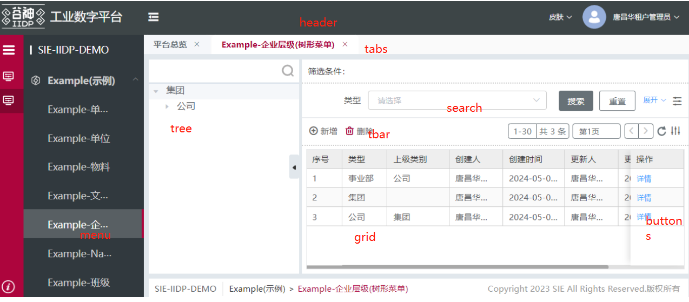
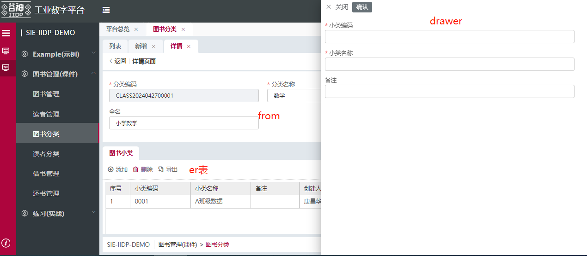
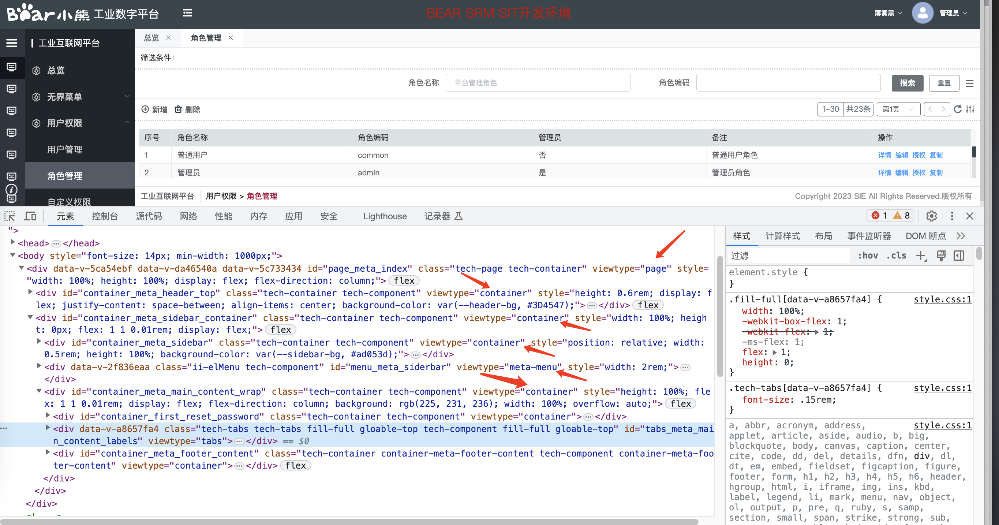
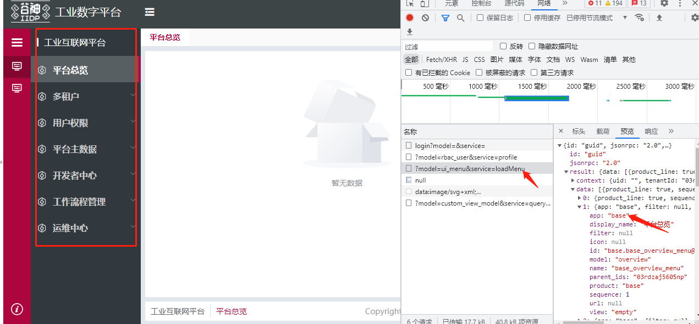
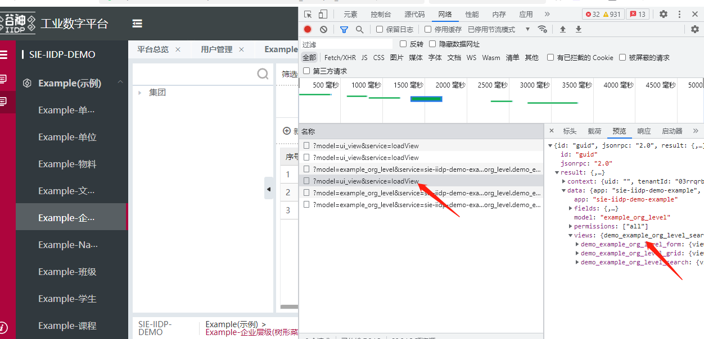
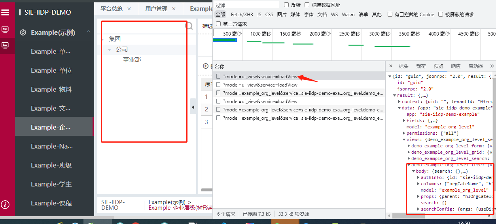
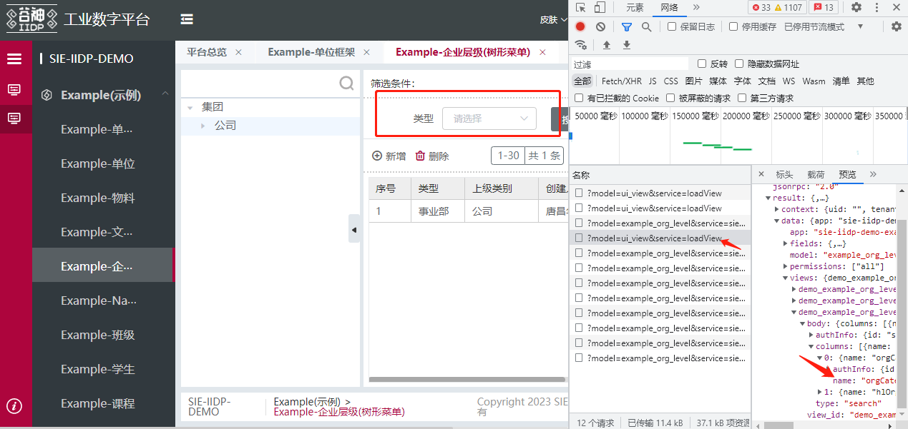
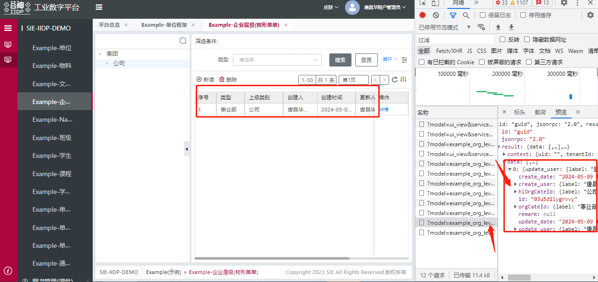
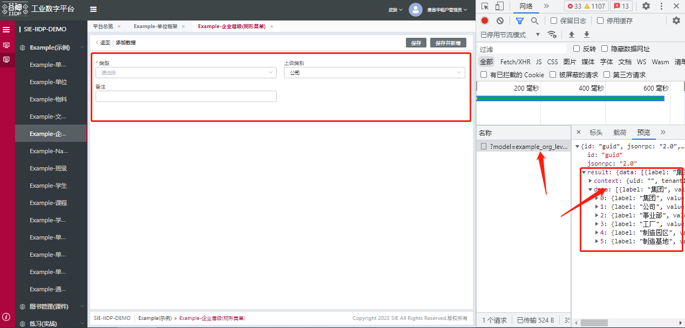
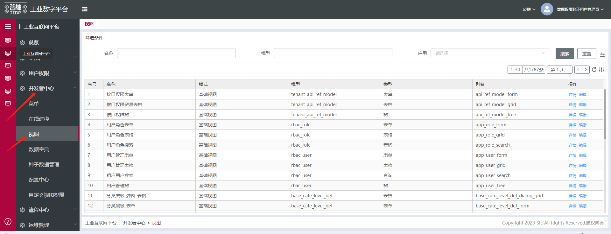

### 页面加载流程说明

- (1).前端底座加载页面框架 例如登录页 首页的顶部栏、菜单栏
- (2).前端菜单栏处理加载后端菜单数据接口 loadMenu接口
- (3).在loadMenu接口取出对应菜单的模型model和view视图
- (4).根据view视图类型和模型调用loadView接口加载出后端视图（根据管理后台常用场景配置的视图）
- (5).若后端视图放到前端视图（低代码结构的视图），则前端js根据loadView接口返回的view视图类型匹配出前端js文件带热更新
- (6).加载了后端视图前端js会转前端视图，再用vue2.7+element-ui渲染

### 标准页面主要由两部分视图组成 
- 相对固定：登录，导航，菜单等视图
- 承载动态业务：动态树，动态搜索，动态表格，动态表单等

### 标准模板页面
- 标准模板页面分为 **主表格页面** 和 **主表单页面**
- 可在F12查看各个节点的类型

主表格页面：

主表单页面：

页面节点查看：

### 标准模板视图
在开发者中心配置好模板页面的视图和菜单后，会自动生成对应的菜单目录，当点击左侧菜单时，会获取菜单对应的model属性，调用loadview接口获取视图，前端根据返回的视图数据进行页面的渲染。支持在线修改视图，大部分标准业务，由后端直接配置视图完成。

#### 页面渲染过程

1.登录后调用loadMenu接口，获取当前账号的已授权的应用及应用下的菜单列表，渲染应用及菜单

2.通过菜单配置中的模型(model)，调用loadView接口,获取当前页面视图配置，渲染当前页面

#### 视图渲染后效果
视图模型有四种类型：

- tree:   树视图

- search: 搜索视图
    - columns: 搜索项

- grid:   表格视图
    - tar: 工具栏按钮
    - buttons: 操作列按钮
    - columns: 表格列

- form:   表单视图
    - columns: 表单项
    - tabs: 子表列表

可在**开发者中心/视图**修改视图配置

<!-- ### 标准模板页面分类
标准模板页面分为表格模板，树表模板，上下表模板 -->

