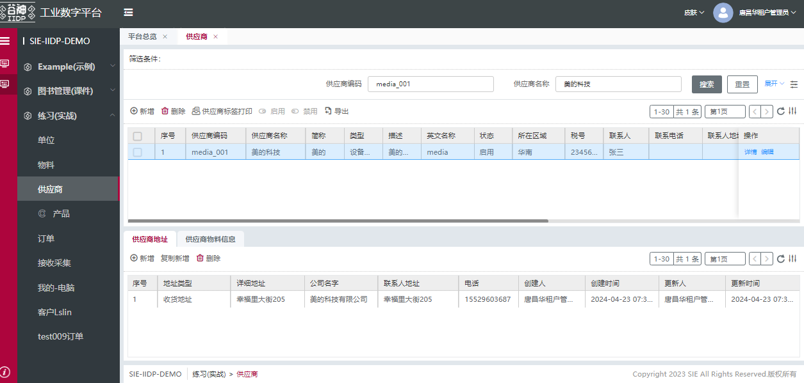
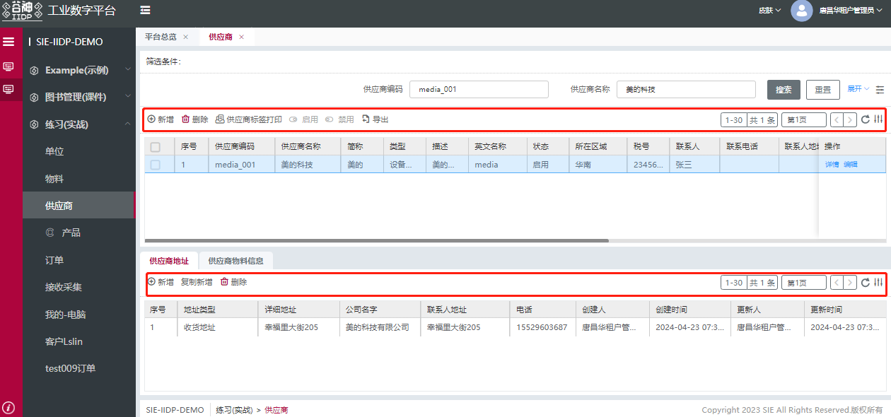
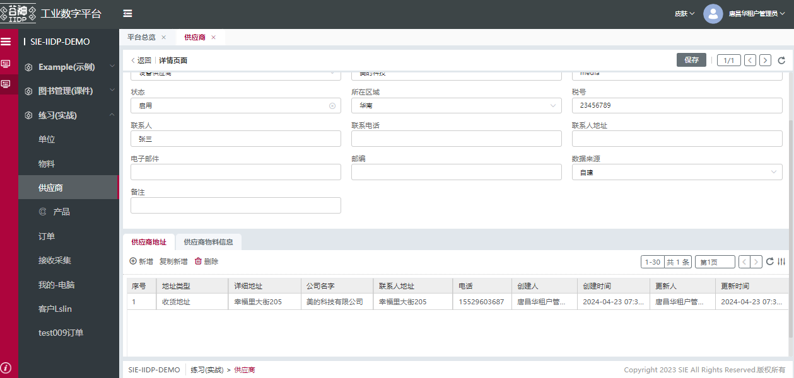
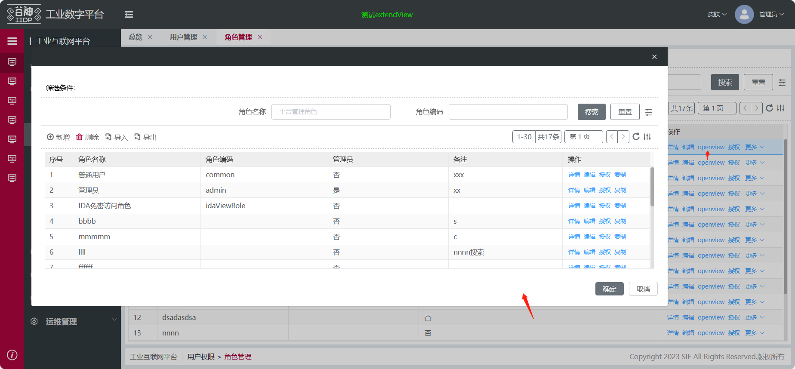
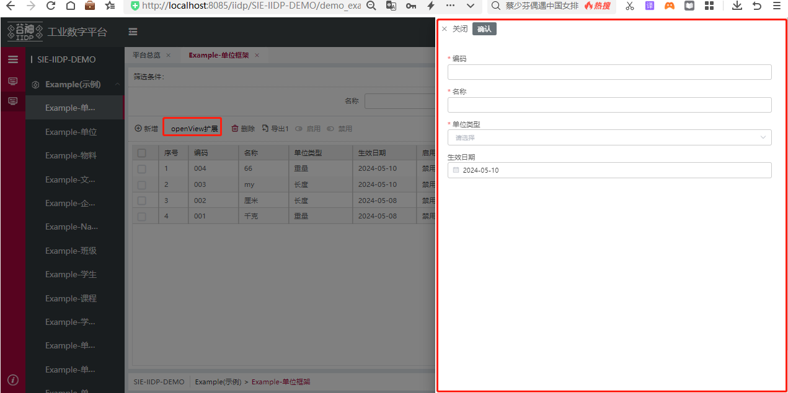
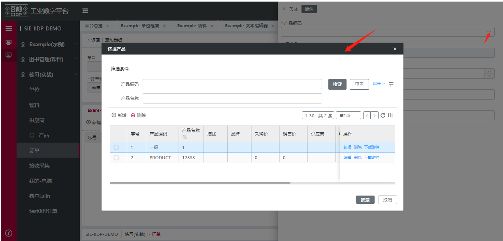

# 表格及表单模板

## 表格模板

表格模板页是最常用的模板页面，组成部分为为表格+搜索栏+表单，所以后端视图有3个，grid，search，form（视图的type）分别配置表格，搜索栏，表单。
表格实现数据的展示，搜索栏实现表格数据的搜索，表单页实现业务数据的增删改查，具有完整的业务实现逻辑

如图，表格模板的标准形式是上部为搜索栏，可以在搜索栏中输入查询条件搜索数据。




下方为表格，表格由动态工具栏（左侧）和固定工具栏（右侧）和主表格组成，动态工具栏的按钮可由后端视图中的tbar属性配置，目前支持新增，删除，导入，导出，刷新。也可以前端扩展已配置的按钮或者动态工具栏，自定义按钮和功能逻辑，或者后端视图配置按钮点击事件实现自定义的业务逻辑,结尾有扩展示例。固定工具栏具有分页，列筛选，排序，列排序等功能。




主表格主要功能包括自定义单元格等，具体视图配置随后会有详细介绍。主表格列和操作栏和单元格都是可以扩展的，结尾有示例。


表格操作栏的按钮可由表格视图的buttons属性配置，默认详情，编辑按钮点击进入表单模板页对表格数据进行修改，表单模板配置在后文



也可以前端扩展操作栏，增加/隐藏/修改按钮来实现复杂的业务需求（如图复制和授权）。


### 表格主要功能

1. 自定义单元格
2. 自定义列属性
3. 表头分组
4. 表尾数据
5. 行内编辑
6. 排序，筛选，刷新表格，自定义列宽，控制行，列显隐
7. 自定义查询条件
8. 虚拟滚动
9. 勾选
10. tab模式
11. 工具栏分组
12. 自定义单元格样式
13. 自定义工具栏
......

具体实现请查看[表格视图配置](/pages/57732f/)

## 表单模板

表单模板是表格模板的组成部分，它是根据配置将不同类型的字段通过不同的组件渲染成一个可查看、可编辑、可扩展的标准化表单页面，主要适用场景有查询表单、详情信息展示表单(包括新增、编辑、查看等)

### 表单模板主要功能
1. 表格上方查询表单视图
2. 详情页详情表单
3. 详情页查看、编辑、新增、保存
4. 保存按钮的配置
5. 详情页下方tabs单独保存
6. 表单元素单独扩展
7. 表单元素组件之间联动交互
8. 表单元素布局自定义、字段显示label自定义
9. 表单元素可组合可折叠收缩
......

### 表单模板组成元素
文本（text）、输入框（input）、多行文本输入框（textarea）、下拉框（select）、下拉分页（lookup）、单选（radio）、多选（checkbox）、日期选择（单个日期和日期范围）、级联选择（cascader）、下拉联动选择、上传（upload）、富文本编辑等

具体实现请查看[表单视图配置](/pages/8b6b77/)

## 业务扩展

当有标准配置之外的的业务需求时可以在前端写扩展，具体扩展写法可以参考[新建扩展应用](/pages/a62bee/)

示例：

1、表格操作列按钮扩展：扩展后实现点击表格操作列按钮弹出弹窗



```js
export default {
  test_role_table_btn_openview_extend_view: {
    // er表添加按钮跳转扩展
    type: 'custom',
    selector: {
      attr: 'id',
      value: 'rbac_role_menu_table_main_table'
    },
    beforeOperate: (app, operateItem, options) => {
      if (options.element.columns) {
        let ops = options.element.columns.find((item) => item.type === 'operation');
        if (ops) {
          if (!ops.items) {
            ops.items = [];
          }
          let addBtn = {
            id: 'custom_btn_my_openview_action',
            display: true,
            action: 'myOpenview',
            auth: true,
            options: { size: 'small', type: 'text' },
            text: 'openview',
            name: 'openview',
            type: 'button',
            created: (vm) => {
              console.log(' === in openview button created == ', vm);
            },
            view: {

              click: operateItem.view
            }
          };
          if (ops.items.findIndex((item) => item.action === 'myOpenview') < 0) {
            // ops.items.push(addBtn);
            ops.items.splice(2, 0, addBtn);
          }
        }
      }
      return operateItem.view;
    },
    view: {
      // view视图协议 里面的click行为协议
      openView: {
        showType: 'dialog', // dialog drawer dropdown 默认是容器
        preId: 'custom_rbac_user_001_', // 全局业务唯一标识前缀
        model: 'rbac_role', // rbac_user
        type: 'form,grid,search' // tree

      }

    }
  }
};

```
2、表格工具栏按钮扩展：扩展后实现点击按钮弹出抽屉表单



```js 
  test_drawer_extend_view: {
     selector: {
       // 如果是节点id列表
       attr: 'id', // 属性 key
       value: 'demo_example_unit_fmk_menu_table_toolbar_create'
     },
     type: 'after',
     view: {
       type: 'button',
       value: 'openView扩展',
       style: {
         color: '#000',
         background: '#fff',
         border: 0,
         fontSize: '0.14rem'
       },
       view: {
         click: {
           openView: {
             showType: 'drawer', // dialog drawer dropdown 默认是容器
             preId: 'demo_example_unit_fmk_', // 全局业务唯一标识前缀
             model: 'example_unit_fmk',
             type: 'form'
           }
         }
       }
     }
   }
```

3、表单模板业务扩展：在表单中新增一个按钮并点击弹出表格弹窗



```js
role_code_select_extend_view: {
    // 选择id = 'rbac_role_menu_form_main_detail_top_common_items_0_items_code'
    selector: {
      attr: 'id',
      value: 'rbac_role_menu_form_main_detail_top_common_items_0_items_code' 
    },
    type: 'replace',
    beforeOperate: (app, operateItem, options) => {
      delete options.element.name; // 因为替换自己 所以先去掉自己的name form会根据name拼接项
      options.originElement.layoutStyle = {
        width: '70%'
      };
      operateItem.view.items.unshift(options.originElement);
      return operateItem.view;
    },
    view: {
      type: 'form-container',
      id: 'rbac_role_menu_form_main_select_code_btn_container',
      style: {
        display: 'flex',
        alignItems: 'center',
        justifyContent: 'center'
      },
      items: [
        {
          type: 'button',
          value: '选择编码',
          id: 'rbac_role_menu_form_main_select_code_btn',
          layoutStyle: {
            width: '30%',
            marginLeft: '0.1rem',
            marginTop: '0.28rem'
          },

          created: (vm) => {
            // console.log(' ==== created === ', vm);
            let dialog = vm.$select('rbac_role_menu_form_main_select_code_dialog');
            if (dialog) {
              dialog.$ds.selectObj = null; // 每次创建时重置选中值
              dialog.$ds.defaultCheck = [];
            }
            console.log(vm.$ds);
          },
          view: {
            click: {
              // view视图协议 里面的click行为协议
              // 弹窗
              type: 'dialog',
              beforeOperate: (params) => {
                console.log(' ==== params == ', params);
                return true;
              },
              width: '80%',
              title: '选择编码',
              id: 'rbac_role_menu_form_main_select_code_dialog',
              __parentId: 'rbac_role_menu_form_main_select_code_btn_container', // 指定放进的 父级容器，可以获得其中的$ds数据  （__parentId 注意双下划线，否则会追加节点错误）
              dataSource: {
                selectObj: null,
                defaultCheck: []
              },
              display: true,
              created(vm) {
                console.log(vm.$ds);
              },
              items: [
                {
                  __block: 'b-table', // 区块视图标识  值对应区块视图组件名
                  preId: 'role_select_code_tb_', // preId 或 addId是必须配置
                  created: (vm) => {
                    let table_detail = vm.$select('rbac_role_menu_table_detail');
                    vm.$ds.reqConfig = table_detail.$ds.menuConfig; // 获取当前模型配置
                    // 定义其他其他模型配置
                    // vm.$ds.reqConfig.model = 'rbac_user'; // 其他模型名
                    // vm.$ds.reqConfig.view = 'form,grid,search'; // 其他模型视图类型
                    let formObj = vm.$select('rbac_role_menu_form_main_detail_top_common'); // 获取主表单节点
                    // debugger;
                    if (vm.$ds.selectObj === null && table_detail.$ds.clickType !== 'add') {
                      vm.$ds.selectObj = window.Tech._cloneDeep(formObj.$ds.form); // 创建时候清空选中对象
                      if (table_detail?.$ds?.mainTableRowData?.id !== undefined) {
                        vm.$ds.selectObj.id = table_detail.$ds.mainTableRowData.id;
                      }
                    }
                    if (vm.$ds?.selectObj?.id !== undefined) {
                      vm.$ds.defaultCheck = [vm.$ds.selectObj.id];
                    } else {
                      vm.$ds.defaultCheck = [];
                    }
                    // vm.$ds.defaultCheck = ['02ny0odh4ta0w'];
                  },
                  toolbarBtns: [
                    // toolbar按钮
                    {
                      action: 'myAction',
                      id: 'role_select_code_tb_table_toolbar_myaction',
                      options: {
                        disabled: false,
                        icon: 'iconfont icon-xinzeng',
                        size: 'medium',
                        type: 'text'
                      },
                      type: 'button',
                      value: 'my动作',
                      bind_on_click: (params) => {
                        console.log(' === myAction params == ', params);
                      },
                      view: {
                        click: {
                          type: 'dialog',
                          width: '60%',
                          title: '第二层弹窗',
                          id: 'rbac_role_menu_form_main_select_inner_dialog',
                          __parentId: 'rbac_role_menu_container_form_main_wrap', // 指定放进的 父级容器,可以获得其中的$ds数据（__parentId 注意双下划线，否则会追加节点错误）
                          items: [
                            {
                              __block: 'b-table', // 区块视图标识  值对应区块视图组件名
                              preId: 'role_select_inner_tb_', // preId 或 addId是必须配置
                              created: (vm) => {
                                vm.$ds.reqConfig = vm.$ds.menuConfig; // 获取当前模型配置
                              }
                            }
                          ]
                        }
                      }
                    }
                  ],
                  dataSource: {
                    tableHeight: '2.5rem',
                    searchSplitNum: 2 // 后面要测试配置1 还有校验问题
                  },
                  commands: {
                    // 重置里面的构造列方法
                    makeTableCol: (vm) => {
                      const { views, fields } = vm.$ds.loadView.data;
                      let columns = vm.$cmd.meta.tableFormat.formatColumns({
                        view: views.grid,
                        fields
                      });
                      // 去掉操作栏
                      let operaIndex = columns.findIndex((item) => item.type === 'operation');
                      columns.splice(operaIndex, 1);
                      return columns;
                    },
                    addAppendFilter: (vm, srcFilter) => {
                      // let addFilter = [['a', '=', '1']];
                      let addFilter = [];
                      return vm.$cmd.meta.addSearch(srcFilter, addFilter);
                    }
                  },
                  ds_config: {
                    list: [
                      {
                        name: 'tableData',
                        reqPrep: (vm, options, config) => {
                          console.log(' === tableData reqPrep options == ', options, vm);
                          if (options?.params?.args) {
                            let srcFilter = options.params.args?.filter || [];
                            options.params.args.filter = vm.$cmd.addAppendFilter(vm, srcFilter);
                          }
                        }
                      },
                      {
                        name: 'tableDataCount',
                        reqPrep: (vm, options, config) => {
                          console.log(' === tableDataCount reqPrep options == ', options);
                          if (options?.params?.args) {
                            let srcFilter = options.params.args?.filter || [];
                            options.params.args.filter = vm.$cmd.addAppendFilter(vm, srcFilter);
                          }
                        }
                      }
                    ]
                  },
                  items: [
                    {
                      id: 'main_table_content_container', // 存放表格节点的容器
                      items: [
                        {
                          id: 'table_main_table',
                          checkbox: 'single', // 开启单选
                          bind_defaultCheck: '$ds.defaultCheck',
                          bind_on_rowDblclick: (res) => {
                            // 双击行
                            console.log(' ==== 双击行2 == ', res);
                          },
                          bind_on_select: (res) => {
                            console.log(' ===== bind_on_select === ', res);
                            const { self: vm, value } = res;
                            vm.$ds.selectObj = value?.data || {};
                          }
                        }
                      ]
                    }
                  ]
                }
              ],
              bind_on_opreates: (params) => {
                const { self: vm, value } = params;
                if (value?.type == 'cancel') {
                  vm.data.display = false;
                }

                if (value?.type == 'confirm') {
                  let formObj = vm.$select('rbac_role_menu_form_main_detail_top_common'); // 获取主表单节点
                  if (!vm.$ds.selectObj) {
                    window.ELEMENT.Message('请选择编码');
                  } else {
                    formObj.$ds.form.code = vm.$ds.selectObj?.code || ''; // 赋值code变量
                    vm.data.display = false;
                  }
                }
              }
            }
          }
        }
      ]
    }
  }
```

其他扩展可参考[新建扩展应用](/pages/a62bee/)


