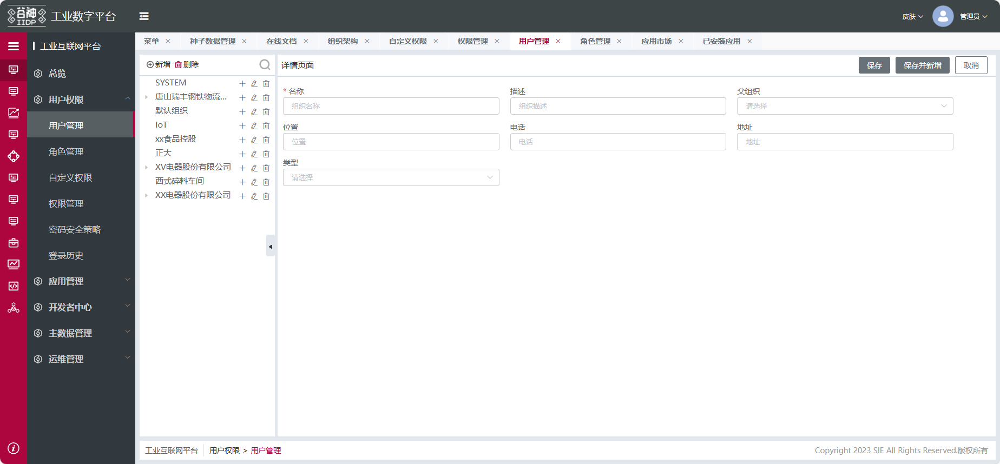
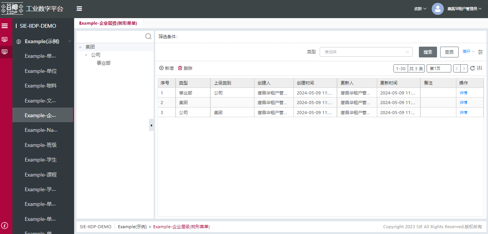

## 树表模板

树表模板顾名思义，是由树+表格模板+表单组成，左侧为树，右侧为点击树节点弹出对应节点的表格，点击树的工具栏的新增按钮可切换树+表单模式。

### 树表模板主要功能

#### 树主要功能

1. 配置树节点的 icon 图标
2. 回填主表单中字段（外列表树选中的节点）
3. 搜索结果树状展示
4. 自定义 search 接口请求
5. 右侧表格数据仅按当前选中节点搜索
6. 未选中树节点，显示右侧表格或表单
7. 树的勾选添加‘全部’节点
8. 配置节点按钮（新增，删除，编辑当前节点）
9. 控制每个节点的图标按钮显示
10. 更改表格数据后，更新树
11. 配置树工具栏（新增，删除树节点）
12. 查询树节点
    具体实现请查看[树视图配置](/pages/961578/)

#### 树+表单

点击新增，切换树+表单模式，新增树节点


#### 树+表格

实现表格数据的分类，不同层级节点的表格数据不同，点击树节点时会传 id 给表格，表格根据 id 单独查询请求数据。


### 树后端视图配置

树视图配置参数

配置参数

| 属性名     | 说明                                                                                                                                    | 类型     | 是否可选 | 默认值 |
| ---------- | --------------------------------------------------------------------------------------------------------------------------------------- | -------- | -------- | ------ |
| type       | 视图类型                                                                                                                                | string   | 必填     | -      |
| model      | 请求树数据的模型                                                                                                                        | string   | 必填     | -      |
| columns    | 请求树数据的字段                                                                                                                        | array    | 必填     | -      |
| props      | 包含对树的数据解析，右侧表格的请求参数                                                                                                  | array    | 可选     | -      |
| hasAllNode | 添加一个‘全部’的根节点，该节点的 id 为""                                                                                                | boolean  | 可选     | -      |
| buttons    | 节点右侧的图标按钮,只支持 create，edit，delete                                                                                          | array    | 可选     | []     |
| showBtnFn  | 控制每个节点的 button 显示，参数 nodeData:当前节点的数据，方法要求返回对象，如{<br/>create:true，<br/>edit:false,<br/>delete:true<br/>} | function | 可选     | -      |

props 配置参数

| 属性名                | 说明                                                                                                     | 类型    | 是否可选 | 默认值                                                                                           |
| --------------------- | -------------------------------------------------------------------------------------------------------- | ------- | -------- | ------------------------------------------------------------------------------------------------ |
| id                    | 指定树数据中与 id 对应的字段                                                                             | string  | 可选     | id                                                                                               |
| label                 | 指定树数据中与 label 对应的字段                                                                          | string  | 可选     | name                                                                                             |
| children              | 指定树数据中与 children 对应的字段                                                                       | string  | 可选     | 1. 配有 props 时，默认 children <br/> 2.有配置 props 且没有 children 时，默认 null（没有子节点） |
| parent                | 指定树数据中与 parent 对应的字段，树数据中表示父节点的字段可以是 string，也可以是{value:'',id:''}形式    | string  | 可选     | 1. 配有 props 时，默认 parent <br/> 2. 有配置 props 且没有 parent 时，默认 null（没有父节点）    |
| subModel              | 右侧视图请求接口中的 model 字段参数                                                                      | string  | 必须     | -                                                                                                |
| subViewType           | 右侧视图请求接口中的 type 字段参数，loadView 接口的视图类型参数                                          | string  | 必须     | -                                                                                                |
| subViewFilter         | 右侧请求数据接口中 filter 参数，左侧树数据的字段参数，如 filter:['org_id','in',当前选中节点的 id]        | string  | 可选     | id                                                                                               |
| subViewFilterValue    | 右侧请求数据接口中 filter 参数，左侧树选中节点参数值的字段，如 filter:['id','in',当前选中节点的指定字段] | string  | 可选     | id                                                                                               |
| hasIcon               | 是否显示树节点右侧的图标按钮（添加、编辑、删除）                                                         | boolean | 可选     | false                                                                                            |
| showSubView           | 未选中树节点时，默认显示右侧视图                                                                         | boolean | 可选     | false                                                                                            |
| subViewFromDefault    | 将树的数据回填到详情页面的表单中，单个字段                                                               | string  | 可选     | -                                                                                                |
| subViewFormInitValues | 将树的数据回填到详情页面的表单中，多个字段                                                               | array   | 可选     | -                                                                                                |

subViewFormInitValues 配置参数

| 属性名       | 说明                                                                        | 类型    | 是否可选 | 默认值 |
| ------------ | --------------------------------------------------------------------------- | ------- | -------- | ------ |
| treeName     | 树对应字段                                                                  | string  | 必填     | -      |
| subformName  | 表单的回填字段                                                              | string  | 必填     | -      |
| label        | look，select 类型生效，下拉值的显示名                                       | string  | 可选     | -      |
| labelInValue | look，select 类型生效，下拉值的显示名跟值一致，label 配置之后优先使用 label | boolean | 可选     | -      |

在菜单对应的模型中配置 tree 后端视图

```json
{
  "type": "tree",
  "model": "rbac_organization", //树的数据来源
  "columns": [
    //请求树的数据字段集合
    "name",
    "parent_id",
    "children_ids",
    "description"
  ],
  "props": {
    "children": "children_ids", //树的数据中以children_ids字段为children
    "parent": "parent_id", //树的数据中以parent_id字段为parent，parent_id需要以{value:'',id:''}形式
    "label": "name", //树的数据中以name字段为label
    "subApp": "base", //右侧视图loadView接口的app参数
    "subModel": "rbac_user", //右侧视图loadView接口的模型参数
    "subViewType": "grid,search,form", //右侧视图loadView接口的视图类型参数
    "subViewFilter": "org_id", //右侧视图获取数据接口的添加filter参数，字段名为org_id
    "subViewFilterValue": "id", //右侧视图获取数据接口的添加filter参数，字段名为org_id需要取当前数据字段为id的值，拼接后接口的filter:[["org_id","in",树的数据中id的值]]
    "hasIcon": true, //每个节点右侧是否有图标按钮（添加、编辑、删除）
    "lazy": true //开启树节点懒加载
  },
  "tbar": [
    "@defaults" //默认add，delete按钮，已实现添加和删除事件
    // ... 更多按钮请参考button组件的配置，其中的点击事件需要扩展实现
  ],
  "search": true //是否显示搜索
}
```

## 配置参数

| 属性名     | 说明                                                                                                                                    | 类型     | 是否可选 | 默认值 |
| ---------- | --------------------------------------------------------------------------------------------------------------------------------------- | -------- | -------- | ------ |
| type       | 视图类型                                                                                                                                | string   | 必填     | -      |
| model      | 请求树数据的模型                                                                                                                        | string   | 必填     | -      |
| columns    | 请求树数据的字段                                                                                                                        | array    | 必填     | -      |
| props      | 包含对树的数据解析，右侧表格的请求参数                                                                                                  | array    | 可选     | -      |
| hasAllNode | 添加一个‘全部’的根节点，该节点的 id 为""                                                                                                | boolean  | 可选     | -      |
| buttons    | 节点右侧的图标按钮,只支持 create，edit，delete                                                                                          | array    | 可选     | []     |
| showBtnFn  | 控制每个节点的 button 显示，参数 nodeData:当前节点的数据，方法要求返回对象，如{<br/>create:true，<br/>edit:false,<br/>delete:true<br/>} | function | 可选     | -      |

## props 配置参数

| 属性名                | 说明                                                                                                     | 类型    | 是否可选 | 默认值                                                                                           |
| --------------------- | -------------------------------------------------------------------------------------------------------- | ------- | -------- | ------------------------------------------------------------------------------------------------ |
| id                    | 指定树数据中与 id 对应的字段                                                                             | string  | 可选     | id                                                                                               |
| label                 | 指定树数据中与 label 对应的字段                                                                          | string  | 可选     | name                                                                                             |
| children              | 指定树数据中与 children 对应的字段                                                                       | string  | 可选     | 1. 配有 props 时，默认 children <br/> 2.有配置 props 且没有 children 时，默认 null（没有子节点） |
| parent                | 指定树数据中与 parent 对应的字段，树数据中表示父节点的字段可以是 string，也可以是{value:'',id:''}形式    | string  | 可选     | 1. 配有 props 时，默认 parent <br/> 2. 有配置 props 且没有 parent 时，默认 null（没有父节点）    |
| subModel              | 右侧视图请求接口中的 model 字段参数                                                                      | string  | 必须     | -                                                                                                |
| subViewType           | 右侧视图请求接口中的 type 字段参数，loadView 接口的视图类型参数                                          | string  | 必须     | -                                                                                                |
| subViewFilter         | 右侧请求数据接口中 filter 参数，左侧树数据的字段参数，如 filter:['org_id','in',当前选中节点的 id]        | string  | 可选     | id                                                                                               |
| subViewFilterValue    | 右侧请求数据接口中 filter 参数，左侧树选中节点参数值的字段，如 filter:['id','in',当前选中节点的指定字段] | string  | 可选     | id                                                                                               |
| hasIcon               | 是否显示树节点右侧的图标按钮（添加、编辑、删除）                                                         | boolean | 可选     | false                                                                                            |
| showSubView           | 未选中树节点时，默认显示右侧视图                                                                         | boolean | 可选     | false                                                                                            |
| subViewFromDefault    | 将树的数据回填到详情页面的表单中，单个字段                                                               | string  | 可选     | -                                                                                                |
| subViewFormInitValues | 将树的数据回填到详情页面的表单中，多个字段                                                               | array   | 可选     | -                                                                                                |

## subViewFormInitValues 配置参数

| 属性名       | 说明                                                                        | 类型    | 是否可选 | 默认值 |
| ------------ | --------------------------------------------------------------------------- | ------- | -------- | ------ |
| treeName     | 树对应字段                                                                  | string  | 必填     | -      |
| subformName  | 表单的回填字段                                                              | string  | 必填     | -      |
| label        | look，select 类型生效，下拉值的显示名                                       | string  | 可选     | -      |
| labelInValue | look，select 类型生效，下拉值的显示名跟值一致，label 配置之后优先使用 label | boolean | 可选     | -      |

## 模板页后端视图配置示例


用户树+表格

树后端视图

```js
{
  "type": "tree",
  "model": "rbac_organization",
  "columns": [
    "name",
    "parent_id",
    "children_ids",
    "description"
  ],
  "props": {
    "children": "children_ids",
    "parent": "parent_id",
    "label": "name",
    "subApp": "base",
    "subModel": "rbac_user",
    "subViewType": "grid,search,form",
    "subViewFilter": "org_id",
    "subViewFromDefault": "id",
    "hasIcon": true
  },
  "tbar": [
    "@defaults"
  ],
  "buttons": [
    "@defaults"
  ],
  "search": {}
}
```

表格后端视图

```js
{
  "type": "grid",
  "columns": [
    {
      "displayName": "姓名",
      "name": "name"
    },
    {
      "displayName": "组织",
      "name": "org_id"
    },
    {
      "displayName": "登录名",
      "name": "login"
    },
    {
      "displayName": "手机号",
      "name": "mobile"
    },
    {
      "displayName": "邮箱",
      "name": "email"
    },
    {
      "displayName": "状态",
      "name": "status"
    }
  ],
  "buttons": [
    {
      "name": "编辑",
      "action": "edit",
      "auth": "update"
    },
    {
      "name": "重置密码",
      "auth": "resetPassword",
      "service": "resetPassword",
      "action": "openView",
      "model": "rbac_user",
      "views": "custom",
      "args":{},
      "actionAfter": "refreshTable"
    },
    {
      "name": "解锁",
      "auth": "update",
      "model": "rbac_user",
      "service": "unlockAccount",
      "enableCondition": function condition(row) { return row && row[0]&&(row[0].status === '1');},
      "actionAfter": "refreshTable"
    }
  ],
  "tbar": [
    {
      "name": "新增",
      "action": "create",
      "auth": "create"
    },
    {
      "name": "删除",
      "action": "delete",
      "auth": "delete"
    }
  ]
}
```
