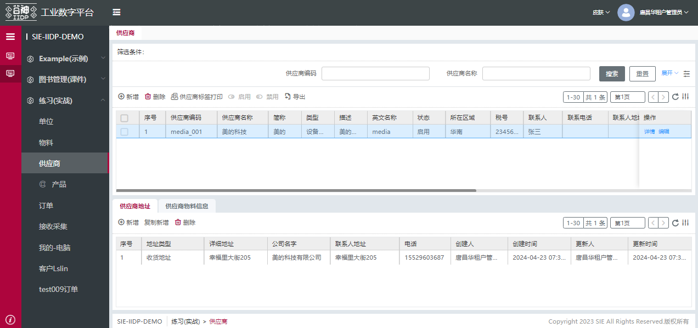

## 上下表格模板
上下表格模板以标准页面模板为基础，根据现有项目产品需求主表和关联子表在同一页展示数据延伸扩展出来的功能。上下表格模板需配置后端视图即可生成相应的页面效果，页面内的逻辑已经自带


#### 上下表格主要功能
1. 主表关联子表切换
2. 主表关联多个tabs页签，含er关系表和非er关系子表
3. 主表和子表都可以行内编辑保存或者单独调接口保存
4. 主表和子表都可行内编辑
5. 主表选中行信息可附带到子表的新增或编辑表单中
6. 主表和子表都可以配置自定义查询

#### 上下表格模板配置

- typeView 控制子表的显示隐藏 在表格配置
- dbClickEnterDetails 禁止双击进入详情页
```js
{
  "type": "grid",
  "typeView": "subTable",	//显示子表
  "dbClickEnterDetails": "disable", //禁止双击进入详情页，不配置默认双击进入详情页
  "mainTableHeight": "3rem",//主表高度不设置默认高度2rem
  "columns": [
    "name",
    "is_admin",
    "code",
    "remark"
  ],
  "buttons": [
    {
      "name": "详情",
      "action": "preview",
      "auth": "read"
    },
    {
      "name": "编辑",
      "action": "edit",
      "auth": "update"
    }],
  "tbar": [
    "@defaults"
  ]
}
```

上下表格：


- singleGrid 多个 tabs 非 er 关系子表的配置
- mainTableColumns 主表选中行内容回填抽屉表单

```js
{
  "type": "form",
  "columns": [
    "name",
    "is_admin",
    "code",
    "remark"
  ],
  "tabs": [
    { // 第一个tabs  er关系子表
      "header": "用户",
      "rowspan": 3,
      "isAloneSave": true, // er关系子表编辑删除等操作直接调接口保存
      "tbar": [
        {
          "name": "添加",
          "action": "addEr",
          "auth": "update"
        },
        {
          "name": "删除",
          "action": "deleteEr",
          "auth": "delete"
        }
      ],
      "body": {
        "type": "search,grid",
        "field": "user_ids", // er关系 String
        // 回填抽屉表单字段和主表选中行对应字段一致
        "mainTableColumns":[{//主表选中行内容回填抽屉表单
          "name": 'code',
          "custom": true,
          "disabled": true,
          "readonly": true,
        }],
        // 回填抽屉表单字段和主表选中行对应字段不一致
        "transformInitValue": (res)=>{ // 主表选中行内容回填抽屉表单
          let maintableObj = tech_app.page.getNode('rbac_role_menu_table_main_table')
          let rowValue = maintableObj?.instance?.getEditActived();
          if (rowValue?.row) {
              rowValue = rowValue?.row
          }
          if (!rowValue) {
              rowValue = maintableObj?.instance?.boxSelected?.[0];
          }
          if(rowValue){
           // 抽屉表单的对应值 = 主表选中行对应值
            res.remark = rowValue?.code||null;
          }
          return res;
        },
        "columns": [
          "login",
          "name",
          "email",
          "mobile",
          "status"
        ]
      }
    },
    { // 第二个tabs 非er关系
      "header": "权限",
      "rowspan": 3,
      "body": {
        "type": "grid,singleGrid,search,form", // 非er关系加singleGrid
        "field": { // 非er关系配置
          "attrs": {
            "unique": "tab001", // 唯一标识 避免与其他节点id冲突（可选参数）
            "relateModel": "rbac_permission" // 对应页面的model
          }
        },
        "columns": [
          "name",
          "auth",
          "type"
        ]
      }
    }
  ]
}
```
isAloneSave，er关系子表编辑删除等操作直接调接口保存
searchByMainTable可配置的自定义查询内容：service、model、args
配置search、filterTitle、toolbar、refresh、paging、columnsConfig显隐


## 业务扩展
当有标准配置之外的的业务需求时可以在前端写扩展，具体扩展写法可以参考[新建扩展应用](/dev/document/1、扩展说明/1.1、新建扩展应用.html)
