扩展是针对标准模板以外的功能开发,标准模板无法满足的复杂业务需求，可在标准模板的基础上添加扩展，或者需求页面与标准模板完全不同可通过前端自定义页面来实现。

## 创建应用

```sh
# 安装脚手架(第一次使用需要安装，后面第二次使用不需要安装)
npm i t-cli -g --registry http://iidp.chinasie.com:9999/maven/repository/npm-group/

# 命令行到工程根目录运行： 例如 创建app1应用
tech app app1
```

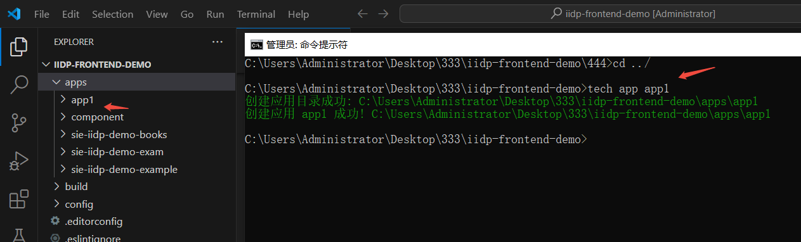

- 注：新版本在创建应用时会自动在 app.json 文件里配置按需加载：effectPaths: {includeRegExp: "^/需要配置/"}。需要手动修改 includeRegExp 的值，否则启动或者打包时检测到 "^/需要配置/" 会报错且中止进程。

## 扩展应用按需加载

<span style="color:red">推荐使用 app 资源按需加载配置，页面路由或按 pageId 加载，若工程开发很多个 app，若不配置 app 按需加载，app 会在进入页面时候全量加载会比较卡</span>

#### 扩展应用按页面路由加载

<span style="color:red">在 app 自身的 `apps/xxxapp/config/app.json` 配置按需加载。</span>

1. 打开【工程】`/apps/【扩展 app】/config/app.json`
2. 配置 `effectPaths`（按菜单路由/菜单路径匹配扩展 app 资源加载）

说明：

- `includeRegExp`：推荐使用，按“路径正则”匹配（更灵活）。支持多个正则，例如： "^/(newSdk/a/)|(sdk/b/)"
- `include` / `exclude`：可选，按“完整路径”精确匹配（不支持正则）。
- 匹配的“路径”一般指浏览器地址中 `/iidp` 后面的那段菜单路径。例如：
  - 浏览器 URL：`http://localhost:8085/iidp/SIE-IIDP-DEMO/demo_books_menu/demo_books_book_manage_menu`
  - 可配置：`"includeRegExp": "^/SIE-IIDP-DEMO/demo_books_menu/demo_books_book_manage_menu"`

```js
{
  "effectPaths": {
    "includeRegExp": "^/iiot/",
    // "include": ["/iiot/include_menu"],
    // "exclude": ["/iiot/exclude_menu"]
  }
}
```

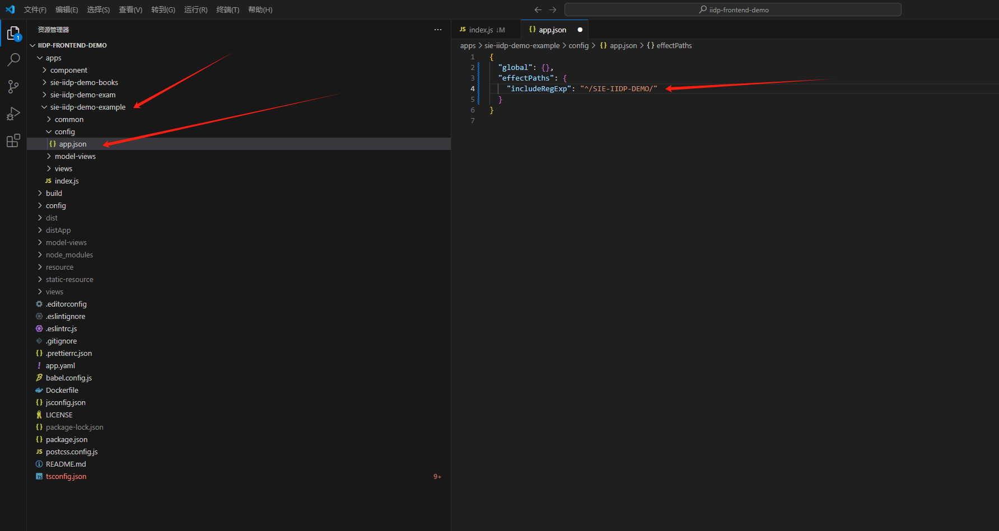
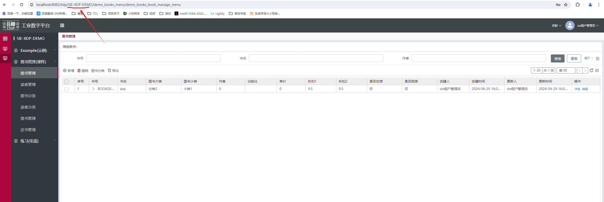

示例含义：只有当进入的菜单路径以 `/SIE-IIDP-DEMO/` 开头时，才会加载 SIE-IIDP-DEMO 扩展 app 的资源。

3.如果 app 一开始没有配置按需加载 后面想补上的时候 可以在控制台调用全局方法，该方法返回按需加载 effectPaths 的 includeRegExp 配置

```js
window.Tech.$dev.genAppEffect("app文件夹名");
```

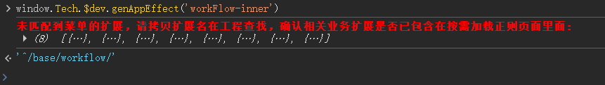

#### 扩展应用按页面 pageId 加载

<span style="color:red">优先配置 app 应用里面的 apps/xxxapp/config/app.json 实现懒加载</span>

1.查看当前页面 id 可以在 console 上打印 tech_app.page.data.id 查看
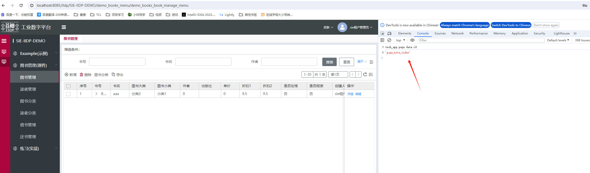

2.在【工程】/apps/【扩展 app】/config/app.json 配置 effectPageIds

```js
{
  "effectPageIds": { // 按页面pageId匹配扩展app资源加载
		"include": ["页面id"], // （可选配置）包含的页面pageId
		"exclude": ["页面id"] // （可选配置）不包含的页面pageId
	}
}
```

#### 扩展应用按需加载是否生效验证

本地运行：在控制台打印 window.tech_apps_comps['xxx-app']， 如果指定页面有值，其他页面 undefined，则按需加载生效；

线上环境：在 Network 面板 All 里筛查 xxx-app.umd.min.js 查看， 如果指定页面加载，其他页面不加载，则按需加载生效。

## 开发扩展优先级

- (1).优先根据后端视图配置出业务页面
- (2).若后端视图配置后还有 10%-20%的功能不满足，按前端扩展协议扩展
- (3).后端视图与业务页面需求差异很大，则在菜单入口配置空白页，按前端扩展协议扩展出业务需要元素
- (4).若局部服用后端视图配置出来的标准页，则使用 view 协议与 openView 协议处理

## 扩展文件目录结构

> 在 app/sie-iidp-demo-example/views 文件夹下新建扩展文件

```
|— apps
  |— sie-iidp-demo-example
    |— views
      |— newPage
        |— example_newPage.js   // 扩展新页面文件
      |— openView
        |— example_openView.js     // 扩展openView
      |— menuPage
        |— example_menuPage.js  // 菜单下页面扩展文件
      |— index.js                    // 扩展视图的入口
```

## 应用配置

配置文件路径：apps\sie-iidp-demo-example\index.js
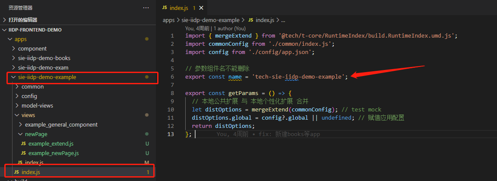

### 前端包单独上传安装应用配置

app 的 config/app.json，底座的 config/apps.json

| 属性         | 类型   | 可选值               | 必填     | 备注                                                             |
| ------------ | ------ | -------------------- | -------- | ---------------------------------------------------------------- |
| name         | String | 英文字母             | 是       | 应用名称 如有后端包跟后端包的应用名称保持一致                    |
| displayName  | String | 中文名称             | 是       | 中文名                                                           |
| comp_name    | String | 英文字母             | 是       | (打包自动生成)应用名称 和 app 下 index.js 里配置的 name 保持一致 |
| author       | String | 例如： sie           | 否       | 作者                                                             |
| company      | String | 例如： sie           | 否       | 公司名称                                                         |
| category     | String | 例如：component      | 是       | 分类                                                             |
| categoryDesc | String | 例如：公共组件       | 是       | 分类中文描述                                                     |
| product      | String | 例如：base           | 是       | 产品线                                                           |
| productDesc  | String | 例如：工业互联网平台 | 是       | 产品线中文描述                                                   |
| description  | String | 例如：基础模块       | 否       | 详情描述                                                         |
| summary      | String | 例如：基础模块       | 否       | 简短描述                                                         |
| tag          | String | 例如：master         | 是       | 版本                                                             |
| version      | String | 例如：1.0.0          | APP 必填 | 应用所属版本号                                                   |
| dependencies | Array  | []                   | 否       | 依赖项                                                           |
| license      | String | 例如：LGPL 3.0       | 否       | 开源协议                                                         |
| frontType    | String | base/app/''          | 是       | 只有前端包没有后端包的，配置成 app，底座的配 base，其他情况不配  |
| frontVersion | String | 例如：1.0.0-dev.1    | 底座必填 | 底座版本号                                                       |

## 创建公共资源配置

appPublic 在 iidp 前端工程的 app 里面创建公共资源配置 tech appPublic xxapp(存放公共资源的文件夹名)

```sh
tech appPublic xxapp
```

指令运行完会自动生成 public 文件夹以及一些简单示例，后续可把示例删掉换成需要存放在公共资源的组件

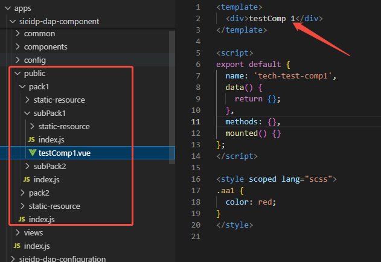

appPublicUse 在 iidp 前端工程的 app 里面调用公共资源 app 配置 tech appPublicUse xxapp(调用资源的文件夹名) xxproject(存放资源的工程名) 80xx(存放资源的工程启动端口) xxpublic-app(存放公共资源文件夹名)

```sh
tech appPublicUse xxapp xxproject 80xx xxpublic-app
```

指令运行完会自动生成 apps\xxx-app-name\common\publicUtils.js,在 common\assetImport.js 里引入 publicUtils.js

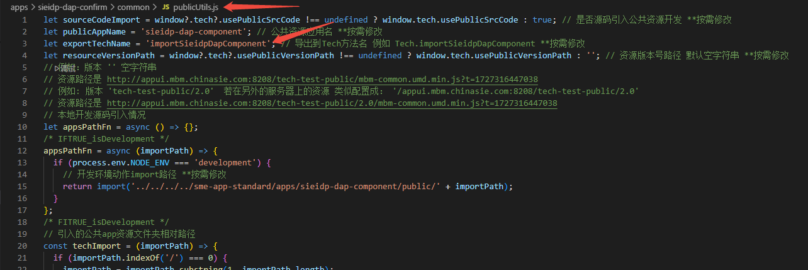

在 app/index.js 里添加引入

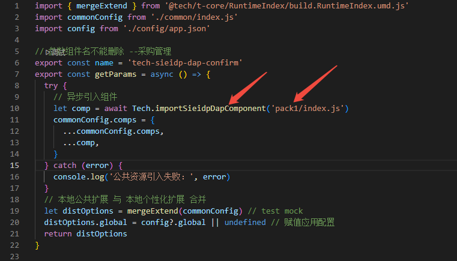

测试调试验证是否创建公共资源成功在引入的 app 里添加测试扩展引入公共资源里的组件，生效即成功

```js
test_container_meta_header_left_extend:{
    type: 'after',
    selector: {
      attr: 'id',
      value: 'container_meta_header_left'
    },
    view: {
      type: 'test-comp1',
    }
  }
```

验证引入成功


## app 优先加载标识

若需要调整本机开发 app 加载顺序 则调整扩展工程 config/apps.json 里面的 self.master 里面 app 排列顺序

添加了 app 的 loadFirst 标识优先加载

config/apps.json 配置 loadFirst 标识

```js
{
  "global": {
    "loadFirst": true
  }
}
```

## 引入扩展文件并导出

> 在 views/index.js 文件中引入扩展文件并导出

```js
import header from "./header/tview__base__header"; // 导航头扩展文件
import sidebar from "./sidebar/tview__base__sidebar"; // 侧边栏扩展文件
import login from "./login/tview__base__login"; // 登录扩展文件
import menuPage from "./menuPage/tview__base__menuPage"; // 菜单下页面扩展文件
import exampleUnit from "./exampleunitext/example_unit_view"; // 非视图节点的扩展文件
export default {
  ...header,
  ...sidebar,
  ...login,
  ...menuPage,
  ...exampleUnit,
};
```

## 查看扩展应用打包时间

> > <font class="can-use-version">对应 package.json t-build 插件 1.0.2 或以上版本</font>

1.在打包后的 dist/umdComps/xxapp/config/app.json 里面查看 **packageTime
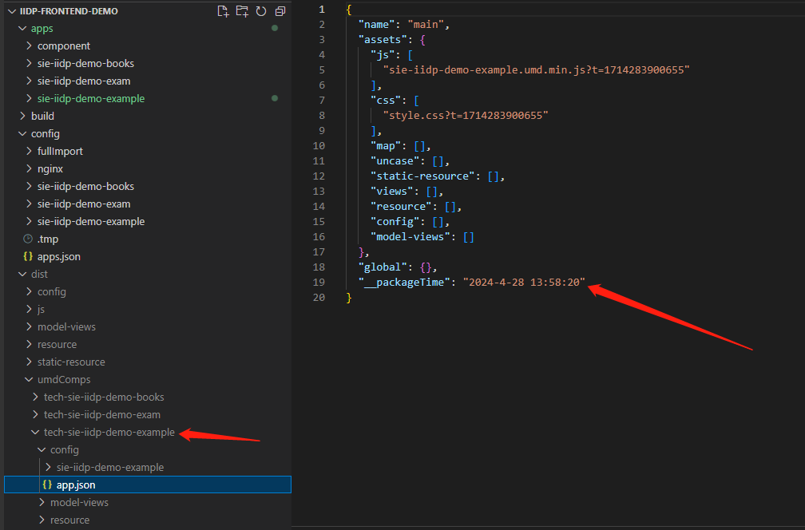

2.若使用应用市场 build:base 或 build:all 打包部署的，可以在 network 查找接口 prepareListApps，返回的
result.data[x].view_file_json.**packageTime 查看 (前提是 app 在 t-build 插件 1.0.2 或以上版本 打包出来的)
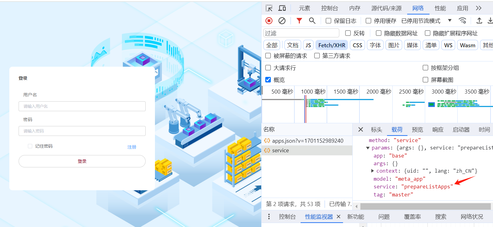

3.直接拼接路径查看

http://域名/[baseRoute 路径]/umdComps/tech-[应用模块名]/config/app.json

例如：

http://test.snest.com:31815/iidp/umdComps/tech-homePage/config/app.json

## 扩展应用加载配置以工程的 apps.json 配置优先

<span style="color:red">若工程开发很多个 app，若不配置 app 按需加载，app 会在进入页面时候全量加载会比较卡</span>

<span style="color:red">若配置了工程里面的 config/apps.json 则会覆盖，app 应用里面的 apps/xxxapp/config/app.json 的配置</span>

1.在【工程】/config/apps.json 配置 appDetail

```js
{
  "self": {},
  "apps": {},
  "templateApp": "TechMetaPage",
  "global": {
    "master": {
      "apiHost": "/api"
    },
    "routerBase": "/iidp/"
  },
  "appsDetail": { // （可选配置） app详细信息
		"doc": { // app 名 若build:local打本地包则跟 apps配置的前端包名对应，若在应用市场api prepareListApps接口取app名
      "desc": "在线文档",
		  "master": { // 环境配置 默认master
        "tech-docs": { // app 组件名
          "view_file_json": { // 具体某app详细信息
            "effectPaths": { // （可选配置） 按菜单路径加载资源配置
              "includeRegExp": "^/base/base_developer_center/base_documents_menu"
            }
          }
        }
		  }
		}
  }
}
```

上面的 effectPaths 配置 会覆盖 【工程】/apps/【扩展 app】/config/app.json 配置 effectPaths 配置

<a href="/iidpdoc/file/json/apps.json" target="_blank" download="apps.json">
  点击下载工程apps.json例子文件
</a>

## app 包含非菜单内容区域扩展注意事项

<div style="color:red; font-size: 18px; margin-top: 10px;">
app包含非菜单内容区域扩展，例如作用顶级节点的指令扩展等。
若配置了按需加载会令对应扩展失效。
</div>

<div style="color:red; font-size: 18px; margin-top: 10px;">
如果app里面原来有其他非内容区域节点的扩展，则需要把扩展抽到一个公共的，不配置按需加载的app里面
</div>

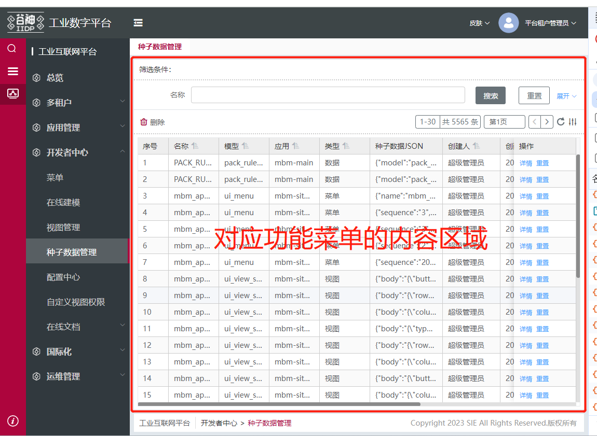

```js
  // 例如这个指令扩展是 作用在 首页的顶级节点
  // 因为这个节点不在菜单内容区域内所以配置了按需加载umd资源会不生效
  base_t_test_xx_extend_view: {
    type: 'merge',
    selector: {
      attr: 'id',
      value: 'page_meta_index', // 扩展到首页的顶级节点
    },
    beforeOperate: (app, config, options) => {
      config.view = {
        def_directives: {
          t_test_xx_extend: {
            analyse: (vm, config = {}) => {
              console.log(' == 解析指令 t_test_xx_extend ')
            }
          }
        }
      }
      return config.view
    },
    view: {}
  }
```

## 创建应用子资源 (可选)

注：需更新到+ @tech/t-core@2.7.2-uat.10版本以上

若应该里面包含大量的扩展，与自定义组件等，则需要创新应用子资源

```sh
# 安装脚手架(第一次使用需要安装，后面第二次使用不需要安装)
npm i t-cli -g --registry http://iidp.chinasie.com:9999/maven/repository/npm-group/

# 命令行到工程根目录运行： 例如 在app1应用里面创建sub1子资源(sub1是自定义的子资源名称，可按需拆分多个子资源)
tech appSub app1 sub1
```

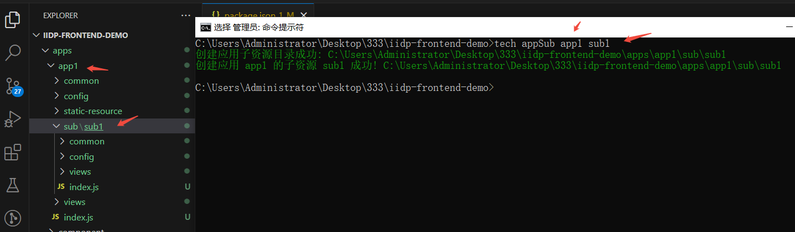

#### 配置子资源按需加载

在/apps/xxApp/sub/xxSub/config/config.json 文件里面配置按需加载，例如：

```js
{
  "effectPaths": {
    "includeRegExp": "^/base/" // 例如 正则匹配路由 /base/ (url上 http:xx/iidp 开头除外) 开头的url都会加载该子资源
  },
  // "notDepParent": false // 不依赖父级应用先加载 默认false (默认子资源加载依赖父级应用加载，如果配置true，则应用资源不加载情况下，子资源也加载)
}
```

可以配置按路由加载 effectPaths 与 按页面加载的 effectPageIds ，具体参考上面**[应用的按需加载](/pages/a62bee/#扩展应用按需加载)**配置

notDepParent: 不依赖父级应用先加载 默认 false (默认子资源加载依赖父级应用加载，如果配置 true，则应用资源不加载情况下，子资源也加载)

#### 子资源注意点

子资源目录下不能放置 静态资源目录:static-resource、后端视图目录：model-views、多语言资源目录：resource，所以子资源需要使用静态资源、后端视图、多语言配置 需要配置到应用层级的目录里面

例如加了一个多语言键值对要加在应用目录的 resource 里面，并且子资源不能配置 "notDepParent": true

其他 views 等扩展目录可以放置具体使用与上面**[应用扩展](/pages/a62bee/#引入扩展文件并导出)**使用一致

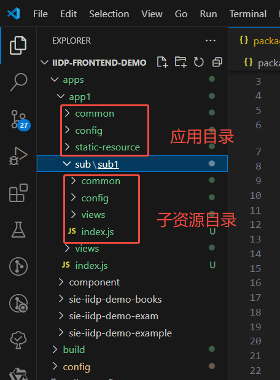

示例：
将 views 里的扩展拆出迁移到子应用中去，修改引入相对路径，并配置子应用按需加载,按实际需求修改 common/comps.js 里的引入
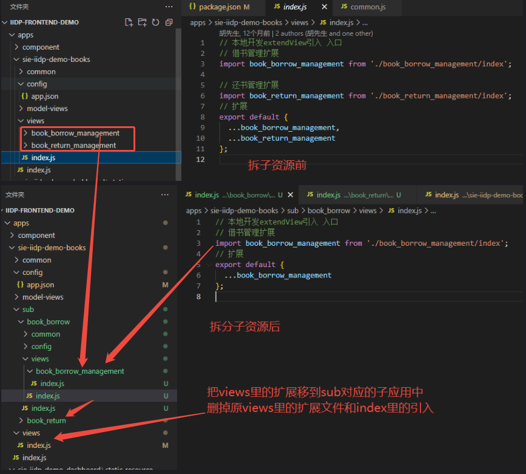
