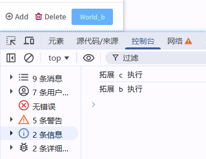
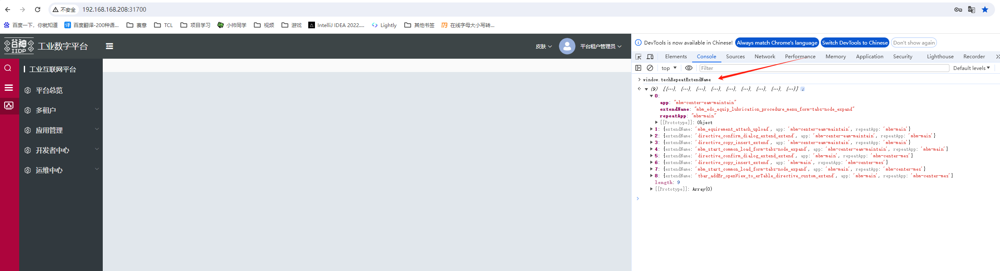

# 扩展命名

## 扩展文件命名规则

[自定义业务名].js
例如 扩展文件命名：tview**base**sidebar.js

tview 是固定的、base 是前端扩展模块名、sidebar 自定义业务名

```
|— apps
  |— base
    |— views
      |— sidebar
        |— tview__base__sidebar.js   // 侧边栏扩展文件
```

## 扩展顺序规则

#### 会按数字 0-9、字母 a-z 的顺序排序运行

可以在浏览器 console 上直接运行 `['sidebar_extend_view','login_extend_view'].sort()` 会打印出排序  

**后运行的拓展**内可以二次扩展**先运行的拓展**

> 例如：扩展命名：sidebar_extend_view、login_extend_view  
> 因为 l 的字母排序比 s 排前，所以扩展会先运行 login_extend_view 再运行 sidebar_extend_view

#### 使用 `extend` 可以指定拓展执行顺序

参考如下案例：  
a 拓展追加了节点，b 和 c 分别都修改了按钮的展示文本。  
按照默认执行逻辑，`a -> b -> c` ，按钮文本以 c 拓展为准。  
b 拓展内配置 `extend` 为 c_extend_view，`a -> c -> b`，按钮文本以 b 拓展为准。

```javascript
"a_extend_view": {
    type: "after",
    selector: {
        attr: "id",
        value: "sdk_test_org_table_toolbar_delete",
    },
    view: {
        type: "button",
        value: "Hello",
        id: "test_side_btn",
        style: { color: "#bbebd4ff" },
    },
},
"b_extend_view": {
    type: "custom",
    extend: "c_extend_view",
    selector: {
        attr: "id",
        value: "test_side_btn",
    },
    beforeOperate: (app, config, options) => {
        console.log('拓展 b 执行');
        options.element.value = "World_b";
    },
},
"c_extend_view": {
    type: "custom",
    selector: {
        attr: "id",
        value: "test_side_btn",
    },
    beforeOperate: (app, config, options) => {
        console.log('拓展 c 执行');
        options.element.value = "World_c";
    },
},
```



#### 打印重复扩展名，方便定位扩展调试

<font class="can-use-version">对应 package.json t-core 插件 1.0.36 或以上版本</font>

```js
// 在浏览器调试的console控制台输入
window.techRepeatExtendName;
```


打印输出的数组为有重复扩展名的数据 extendName 是扩展名，app 是原应用名称，repeatApp 是与原 app 同一个扩展名了 app

**[demo 清单](/pages/3a50a2/#_11、扩展侧边栏)**

```js
// app/base/views/sidebar/tview__base__sidebar.js
export default {
  sidebar_extend_view: {
    type: "before", // 在选中节点前面插入视图
    selector: {
      attr: "id",
      // pre: 'prexx_', // (可选前缀扩展 字符串情况) 拼接id前缀 等同 prexx_sidebar_about_button
      // pre: ['prexx1_', 'prexx2_'], // (可选前缀扩展 数组情况) 拼接id前缀数组 等同 prexx1_sidebar_about_button prexx2_sidebar_about_button
      // pre: (extendName, config) => {
      //   // (可选前缀扩展 函数情况) 拼接id前缀返回数组的函数 等同 prexx1_sidebar_about_button prexx2_sidebar_about_button
      //   // extendName 为扩展名 当前为 sidebar_extend_view
      //   // config 为当前扩展配置为 {type: 'before', selector ...}
      //   return ['prexx1_', 'prexx2_'];
      // },
      value: "sidebar_about_button", // 关于按钮
    },
    view: {
      type: "text",
      value: "Hello World",
      style: { color: "#07ff00" },
    },
  },
};
```

**[demo 清单](/pages/3a50a2/#_9、扩展登录)**

```js
// app/base/views/login/tview__base__login.js
export default {
  login_extend_view: {
    type: "unshift", // 在选中节点的items头部插入视图
    selector: {
      attr: "id",
      value: "form_meta_login",
    },
    view: {
      type: "row",
      id: "row_meta_login_row100",
      className: "meta-login-row",
      items: [
        {
          type: "input",
          id: "inp_meta_login_test",
          text: "扩展",
          name: "password",
          showPassword: true,
          bind_two_model: "$ds.form",
          placeholder: "扩展",
          className: "meta-login-row-inp",
        },
      ],
    },
  },
};
```
