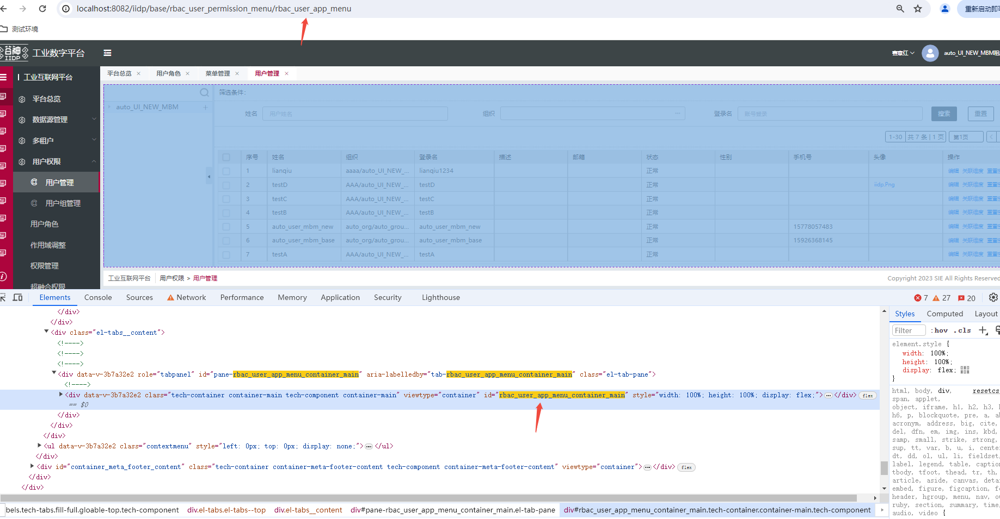

注：使用钩子需将版本更新到 2.4.0 以上版本

## 扩展钩子结构

钩子按视图类型划分在对应的对象内，例如查询视图的钩子在 page 内，表格数据的查询等在 grid 内，新增数据的保存等在 form 内。

扩展选择的节点为当前页面的顶级节点，即 `页面菜单 url + _container_main`  
例如：页面菜单 url 为 base/rbac_user_permission_menu/rbac_user_app_menu，则扩展选择的节点为 rbac_user_app_menu_container_main (如下图)



```js
test_hook_extend_view: {
    selector: {
      attr: 'id',
      value: 'menu_container_main' // id选择顶层节点，页面前缀 + 'container_main'
    },
    type: 'merge',
    extend: '继承的扩展名', // 继承其他扩展 可不配置
    // weight: 0, // 扩展权重 若都继承了同一个扩展 则同一层里面按权重大的先运行，默认0 【可选配置】
    // 钩子
    hook: {
        // 标准页
        page: {},
        // 主列表页
        gridPage: {},
        // 详情页
        detailPage: {},
        // 主表格
        grid: {
          tabs: {} // 上下表格下的tabs
        },
        // 主表格上的搜索
        search: {},
        // 主表单
        form: {
          tabs: {} // 详情页下的tabs
        },
        // 树
        tree: {}
    }
}
```

## 扩展钩子参数

- 钩子统一是异步方法
- vm: 上下文 vm.biz: 业务上下文 params: 业务参数 options: 可选参数
- vm.super：super 会调 extend 配置上一层继承的方法，如果没有配置 extend 会拿平台最初始的方法

```js
test_hook_extend_view: {
    selector: {
        attr: 'id',
        value: 'menu_container_main'
    },
    type: 'merge',
    extend: 'xxxxxx', // 继承的扩展 可不配置
    hook: {
        page: {
            // 查询视图钩子
            queryView: async (vm, params, options) => {
                console.log(' === page.queryView == params ', params);
                console.log(' === vm.super == ', vm.super);
                return await vm.super['page.queryView'](vm, params, options);
            }
        }
    }
}
```

## 业务上下文

业务上下文：vm.biz,按层级使用 例如 vm.biz.grid.data.tableData

- data: 相关数据
- req：存储调用接口相关的请求 对应里面的 ds_config 配置
- baseMethods：平台原始方法
- methods：扩展钩子后的方法及其他方法
- nodes: 相关节点

可以使用全局方法：window.Tech.$page(xxxxId)返回当前标准页所有结构的上下文，window.Tech.$biz(xxxxId)返回参数 vm 的 biz 上下文。例如 window.Tech.$biz('DYDataSource_menu_container_table_search_items_1').data.form 获取搜索栏表单数据

### 使用方法

```js
{
  hook: {
    grid: {
      queryCount: async (vm, params, options) => {
        // 业务上下文：vm.biz
        vm.biz.search.data.form = { name: "myName1" }; // 设置 整体
        vm.biz.search.data.form.name = "myName6"; // 设置 单属性设置
        console.log(" === vm.biz", vm.biz.search.data.form.name);
        console.log(" === vm.biz", vm.biz.grid.data.tableData);
        console.log(" === vm.biz", vm.biz.grid.req.tableData);
        console.log(" === vm.biz", vm.biz.grid.baseMethods.canCreate);
        console.log(" === vm.biz", vm.biz.grid.methods.canDelete);
        console.log(" === vm.biz", vm.biz.grid.nodes.self);
        console.log(" === vm.biz", vm.biz.grid.edit.req.singleRowEditDelete);
        console.log(" === vm.biz", vm.biz.grid.edit.baseMethods.canCreateRow);
        console.log(" === vm.biz", vm.biz.grid.edit.methods.deleteConfirm);
        console.log(" === vm.biz", vm.biz.page.data.pre);
        console.log(" === vm.biz", vm.biz.tree.page.loadView);
        console.log(" === vm.biz", vm.biz.page.baseMethods.queryView);
        console.log(" === vm.biz", vm.biz.page.methods.queryView);
        console.log(vm.biz.grid.tabs.xx.drawerForm.data.form.name);
      };
    }
  }
}
```

### vm.biz.page

```js
page: {
  data: {
    pre: '', // id前缀
    loadView: '', // loadView接口返回的数据
    isOpenDetail: '', // 是否打开详情页 对应里面的 $ds.isDetail
    model: '', // 模型
    app: '', // 所属app
  },
  req: {
    loadView: {xxx} // 请求loadView接口ds_config
  },
  baseMethods: { // 平台原始方法
    'queryView' // 查询视图钩子
  },
  methods: { // 扩展钩子后的方法及其他方法
    'queryView'
  },
  nodes: {
    self: {xxx} // 整个标准页的自身节点
  }
}
```

### vm.biz.gridPage

```js
gridPage: {
  data: {
    model: '', // 模型
    app: '', // 所属app
  },
  baseMethods: { // 平台原始方法
    'created', 'mounted', 'destroy'
  },
  methods: { // 扩展钩子后的方法及其他方法
    'created', 'mounted', 'destroy'
  },
  nodes: {
    self: {xxx} // 主列表页自身节点
  }
}
```

### vm.biz.detailPage

```js
detailPage: {
  data: {
    title: '', // 详情页title
    model: '', // 模型
    app: '', // 所属app
  },
  baseMethods: { // 平台原始方法
    'created', 'mounted', 'destroy'
  },
  methods: { // 扩展钩子后的方法及其他方法
    'created', 'mounted', 'destroy',
    'runback' // 从详情页返回 用法：vm.biz.detailPage.methods.runback()
  },
  nodes: {
    self: {xxx}, // 详情页自身节点
    backNode: {xxx} // 返回按钮节点
  }
}
```

### vm.biz.search

```js
search: {
  data: {
    form: {}, // 搜索栏表单数据
    model: '', // 模型
    app: '', // 所属app
  },
  req: {
    tableData: {xxx} // 请求接口数据配置
  },
  baseMethods: { // 平台原始方法
    'created', 'mounted', 'destroy',
    // 查询相关的钩子
    'canQuery', 'validateQuery'
  },
  methods: { // 扩展钩子后的方法及其他方法
    ...同baseMethods,
    'runReset', // 运行重置方法 用法：vm.biz.search.methods.runReset()
    'runSearch' // 运行搜索方法 用法：vm.biz.search.methods.runSearch()
  },
  nodes: {
    self: {xxx}, // 整个搜索栏自身节点
    formNode: {xxx}, // 搜索表单前端节点
    extendFormNode: {xxx}, // 搜索展开表单前端节点
    searchBtnNode: {xxx},  // 搜索按钮前端节点
    resetBtnNode: {xxx}, // 重置按钮前端节点
    conditionNode: {xxx} // 搜索条件栏节点
  }
}
```

### vm.biz.grid

```js
grid: {
    data: {
        tableData: [], // 表格数据
        currentRow: {} // 当前行
        selectedRows: [] // 选中的多行
        tbar: [] // 工具栏按钮
        tableConfig: {}, // 表格配置
        buttons: [] // 行按钮
        page: {}, // 当前分页信息
        isEdit: false // 是否进入编辑态
        erCacheData: xx // er缓存数据
    },
    req: { // 存储调用接口相关的请求
        tableData: {xxx} // 请求接口表格数据配置
        tableDataCount: {xxx} // 请求接口数据总条数配置
        delTableData: {xxx} // 请求接口删除表格数据配置
    },
    baseMethods: { // 存了最原始的方法 扩展钩子前的原方法
      'canCreate', 'queryCount', 'canDelete', 'beforeDelete', 'delete', 'afterDelete',
      'canEdit', 'beforeQuery', 'query', 'afterQuery', 'select', 'cancelSelect',
      'created', 'mounted', 'destroy'
    },
    methods: { // 扩展后的方法
      ...同baseMethods,
      'runRefresh', // 刷新表格方法
      'toPage', // 跳转到表格某页
      'addErData' // 添加er缓存方法
    },
    nodes: { // 放相关前端视图节点
        self: {xxx},  // 表格前端自身节点
        tbarNodes: {xxx},  // 工具栏按钮节点 使用：vm.biz.grid.nodes.tbarNodes[0] 工具栏第一个按钮
        buttonNodes: {xxx}, // 表格行节点 使用：vm.biz.grid.nodes.buttonNodes[0] 操作列第一个按钮
        refreshNode: {xxx} // 刷新节点
    },
    edit: { // 行内编辑相关
        req: {
            singleRowEditDelete: {xxx}, // 请求接口单行删除数据配置
            singleRowEditSave: {xxx} // 请求接口单行保存数据配置
        },
        baseMethods: { // 存了最原始的方法 扩展钩子前的原方法
          'canCreateRow', 'canDeleteRow', 'deleteConfirm', 'beforeSingleRowDelete',
          'singleRowDelete', 'afterSingleRowDelete', 'canRowEditSave', 'beforeRowEditSave',
          'rowEditSave', 'afterRowEditSave'
        },
        methods: { ...同baseMethods },
    },
    tabs: { // 用法：vm.biz.grid.tabs.xxField.search.data.form.display_name
     xxField: {
      grid: {
        data: {
          'tableView', 'paging', 'tableDataCount', 'tableData',
          'tableFilter', 'tableFilterTags', 'treeFilter', 'tabUniqueTag'
        },
        req: {
          tableData: {xxx} // 请求接口表格数据配置
          tableDataCount: {xxx} // 请求接口数据总条数配置
          delTableData: {xxx} // 请求接口删除表格数据配置
        },
        baseMethods: {
          'canCreate', 'canDelete', 'canEdit', 'onConfirm', 'beforeQuery',
          'query', 'afterQuery', 'queryCount', 'select', 'cancelSelect', 'delete'
        },
        methods: {
          ...同baseMethods,
          'runRefresh' // 刷新方法
          'toPage' // 跳转到表格某页
          'addErData' // 添加er缓存方法
        },
        nodes: { 同vm.biz.grid.nodes },
        edit: { 同vm.biz.grid.edit },
      },
      search: {
        同vm.biz.search
      },
      drawerForm: {
        data: {
          // vm.biz.grid.tabs.child_ids.drawerForm.data.form.name = 11
          // vm.biz.grid.tabs.child_ids.drawerForm.data.form = { name: 22 }
          form: {}
        },
        baseMethods: {
          'queryView', 'beforeQuery', 'query', 'afterQuery', 'init', 'save',
          'created', 'mounted', 'destroy'
        },
        methods: { ...同baseMethods },
        nodes: {
          self: {xxx}, // 抽屉表单节点
          drawerNode: {xxx} // 抽屉节点
        },
      },
      addRel: {
        data: {
          'optionList', //左边栏可选项
          'checkedList', //左边栏已选项
          'selectedList', //右边table当前页选中项
          'tableDataCount',
          'tableView',
          'selectedDisplay' // 左侧已选择数据的显示名称，默认取name字段
        },
        req: {
          tableDataCount: {xxx},
          tableData: {xxx},
          tableView: {xxx}
        },
        baseMethods: {
          'created', 'mounted', 'destroy', 'queryView', 'beforeQuery',
          'query', 'afterQuery', 'queryCount', 'save'
        },
        methods: { ...同baseMethods },
        nodes: {
          self: {xxx}, // 添加关联弹窗节点
          searchNode: {xxx}, // 搜索按钮节点
          resetNode: {xxx}, // 重置按钮节点
          refreshNode: {xxx}, // 刷新按钮节点
          tableNode: {xxx}, // 表格节点
        },
      }
    }
  }
}
```

### vm.biz.form

```js
form: {
  data: {
    form: {}, // 表单数据
    clickType: '', // add: 添加  edit: 编辑  preview: 详情
    model: '', // 模型
    app: '', // 所属app
  },
  req: {
    tableData: {xxx}, // 查询表单行数据配置
    formUpdate: {xxx}, // 请求接口数据配置
  },
  baseMethods: { // 平台原始方法
    'created', 'mounted', 'destroy', 'beforeQuery', 'query', 'afterQuery',
    'init', 'beforeSave', 'save', 'afterSave', 'validate'
  },
  methods: { // 扩展钩子后的方法及其他方法
    ...同baseMethods,
    'runSave', // 表单保存方法 用法：vm.biz.form.methods.runSave()
    'runRefresh', // 刷新表单方法 用法：vm.biz.form.methods.runRefresh()
    'toNext', // 跳转下一条方法
    'toPrev' // 跳转下一条方法
  },
  nodes: {
    self: {xxx}, // 表单前端自身节点
    saveNode: {xxx} // 保存按钮节点
  },
  tabs: 同vm.biz.grid.tabs
}
```

### vm.biz.tree

```js
tree: {
  data: {
    showRightType: '', // 右侧显示类型 empty/form/table
    currentId: '', // 当前树节点id
    currentData: '', // 当前树节点
    checkedData: '', // 勾选的数据
    treeViewRes: '', // 树视图
    treeData: '', // 树数据
    clickType: '', // add: 添加  edit: 编辑  preview: 详情
    model: '', // 模型
    app: '', // 所属app
  },
  req: {
    treeViewRes: {xxx}, // 树视图接口数据配置
    treeData: {xxx}, // 树数据接口数据配置
    getFormData: {xxx}, // 获取表单接口数据配置
    formUpdate: {xxx} // 提交表单接口数据配置
  },
  baseMethods: { // 平台原始方法
    'created', 'mounted', 'destroy',
    'canCreate', 'canDelete', 'canEdit', 'canQuery', 'beforeSave',
    'save', 'afterSave', 'onConfirm', 'beforeDelete', 'delete', 'afterDelete',
    'beforeQuery', 'query', 'afterQuery', 'select', 'cancelSelect'
  },
  methods: { ...同baseMethods },
  nodes: {
    self: {xxx}, // 树页面
    treeNode: {xxx}, // 树节点
    rightFormNode: {xxx}, // 右侧表单
    rightTableNode: {xxx}, // 右侧表格
    rightFormSaveNode: {xxx} // 右侧表单保存按钮
  }
}
```
