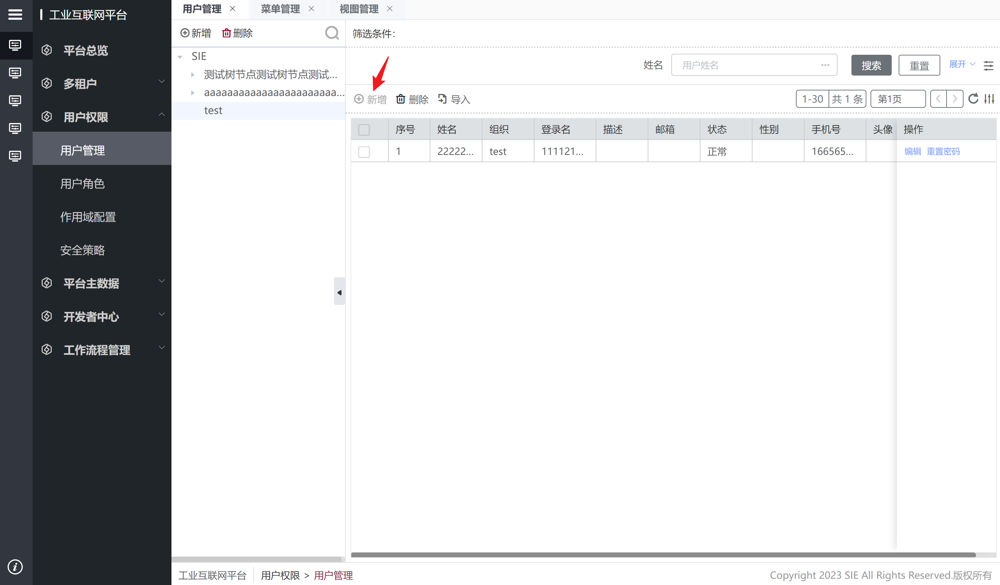
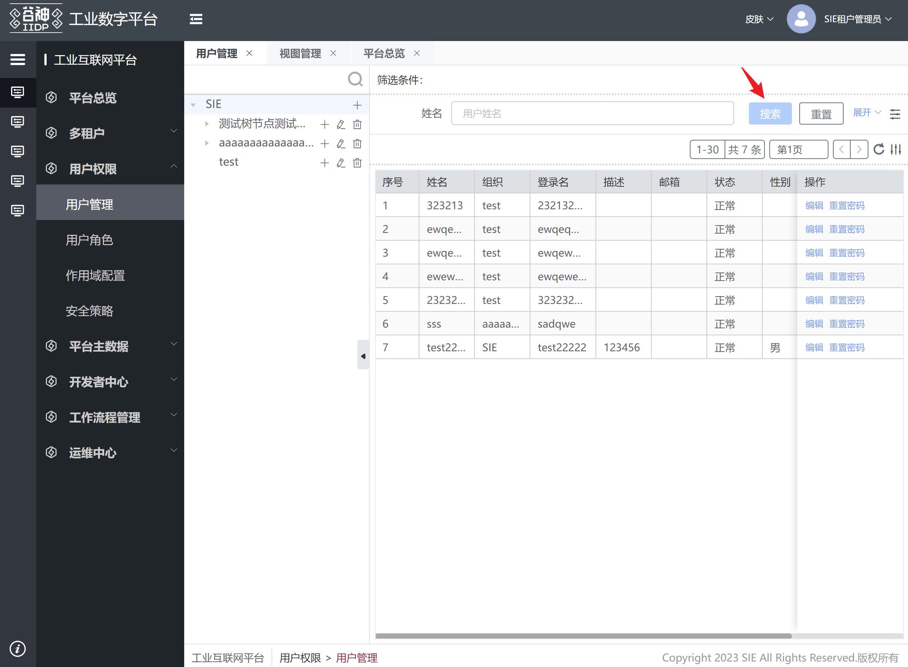

- can 开头的钩子 return false 置灰对应的按钮
- 非 can 开头的钩子 返回 false 就逻辑中断

## 是否可新增

工具栏新增按钮是否可点击

```js
hook: {
  grid: {
    canCreate: async (vm, params, options) => {
      console.log("====grid.canCreate====", vm, params, options);
      return true; // 返回false则按钮禁用
    };
  }
}
```



## 是否可删除

工具栏删除按钮是否可点击

```js
hook: {
  grid: {
    canDelete: async (vm, params, options) => {
      // params: 选中的行数据（如果配置了勾选框则为勾选的数据，否则为蓝色背景数据）
      // options: {triggerType: checkRow/selectRow}
      console.log("====grid.canDelete====", vm, params, options);
      if (params[0]?.id === "base.rbac.Role") {
        return false;
      }
      return true;
    };
  }
}
```

## 是否可编辑

操作列编辑按钮是否可点击

```js
hook: {
  grid: {
    canEdit: async (vm, params, options) => {
      // params: 所处行数据
      if (params.rowIndex === 1) {
        return false;
      }
      return true;
    };
  }
}
```

## 删除前二次弹窗确认

工具栏删除按钮点击后的二次弹窗确认

```js
hook: {
  grid: {
    onConfirm: async (vm, params, options) => {
      // params: 弹窗节点
      params.data.items[1].value = "更换了提示信息";
      params.data.items[0].className = "iconfont icon-yulan1";
      return await vm.super["grid.onConfirm"](vm, params, options);
    };
  }
}
```

## 删除

工具栏删除按钮二次弹窗确认按钮点击后

```js
hook: {
  grid: {
    // 删除前钩子
    beforeDelete: async (vm, params, options) => {
      // params: 调用删除接口时传递的参数
        if (params?.args?.ids?.[0] === '03u659fts0aac') {
            window.ELEMENT.Message.error("不让你删");
            return false;
        }
        return params;
    },
    // 删除钩子
    delete: async (vm, params, options) => {
      // params: 调用删除接口时传递的参数
        // 调用原有的删除逻辑
        let res = await vm.super['grid.delete'](vm, params, options);
        return res; // res: 接口返回的数据
    },
    // 删除后钩子
    afterDelete: async (vm, params, options) => {
      // params: 调用删除接口后接口返回的数据
        return await vm.super['grid.afterDelete'](vm, params, options);
    }
  }
}
```

## 查询

表格数据查询

```js
hook: {
  grid: {
    // 查询前钩子
    beforeQuery: async (vm, params, options) => {
      // params: 调用查询接口时传递的参数
        params.testArg = 1; // 在查询接口调用前修改接口参数
        return params;
    },
    // 查询钩子
    query: async (vm, params, options) => {
      // params: 调用查询接口时传递的参数
        // 调用原有的删除逻辑
        let res = await vm.super['grid.query'](vm, params, options);
        return res; // res: 查到的表格数据 {data: [{xxxx}]}
    },
    // 查询后钩子
    afterQuery: async (vm, params, options) => {
      // params: 查到的表格数据
        window.ELEMENT.Message.success('表格数据查到啦');
        return await vm.super['grid.afterQuery'](vm, params, options);
    },
    // 查询总条数钩子
    queryCount: async (vm, params, options) => {
      // params: 调用查询总条数接口的参数
        return await vm.super['grid.queryCount'](vm, params, options);
    },
  }
}
```

## 选择行

表格选择行和取消选择行，点击勾选框和点击行出现蓝色背景时触发钩子

```js
hook: {
    grid: {
        // 选择行
        select: async (vm, params, options) => {
          // params: 选中的行
          // vm.biz.search.data.form.name = 'myName1111';
          return params;
        },
        // 点击勾选框取消选中行
        cancelSelect: async (vm, params, options) => {
          // params: 取消选中的行
          // vm.biz.search.data.form.name = 'myName2222';
          return params;
        }
    }
}
select和cancelSelect钩子的options参数：{
    triggerType: 'checkbox'（点勾选框）, 'rowSelect'（点击行出现蓝色背景）
    checked,（是否选中）
    checkedData, （选中的行数据）
    paramsObj（相关数据对象）
}
```

## 工具栏和操作列按钮

```js
hook: {
  grid: {
    // 工具栏按钮钩子
    beforeToolbar: async (vm, params, options) => {
      // params: 工具栏按钮数组
      params[0].bind_on_click = (res) => {
        console.log("重写bind_on_click事件", res);
      };
      return params;
    },
    // 使用$set改变对象属性来控制工具栏和操作列按钮
    beforeQuery: async (vm, params, options) => {
        let tbarBtn = vm.biz.grid.nodes.tbarNodes[0]; // 工具栏第一个按钮
        let operationBtn = vm.biz.grid.nodes.buttonNodes[2]; // 操作列第三个按钮
        Tech.$set(tbarBtn.data, 'options.disabled', false);
        Tech.$set(operationBtn.data, 'options.disabled', false);
        Tech.$set(
          tbarBtn.instance,
          'click', // bind_on_click无效 因为节点已注册
          async (res1, res2) => {
            try {
              console.log(' === Scope == ', Scope, res1, res2);
            } catch (e) {}
            let distRes = await Super.click(params);
          },
          { a: 1 }
        );
        Tech.$set(
          operationBtn.data,
          'click', // bind_on_click无效 因为节点已注册
          async (res1, res2) => {
            try {
              console.log(' === Scope == ', Scope, res1, res2);
            } catch (e) {}
            let distRes = await Super.click(params);
          },
          { a: 2 }
        );
        return params;
      }
  }
}
```

## 行内编辑

行内编辑相关钩子，包含单行编辑和多行编辑

```js
hook: {
    grid: {
        edit: {
            // 是否能新增行
          canCreate: async (vm, params, options) => {
            return true;
          },
            // 行内删除按钮能否点击
          canDelete: async (vm, params, options) => {
            // params: 所处行数据
            return true;
          },
            // 保存按钮能否点击 包括单行和多行的保存按钮
          canSave: async (vm, params, options) => {
            // params: 单行编辑时为所处行数据
            return true;
          },
            // 单行编辑行内删除前的二次确认弹窗
          onConfirm: async (vm, params, options) => {
            // params：要删除的id数组
            window.Tech.confirmbox({
              width: '45%',
              title: '请注意',
              items: [
                {
                  id: vm.$ds.idPre + 'deleteRow_confirmBox',
                  value: '确定要删除此数据吗',
                  type: 'text'
                }
              ],
              options: {
                confirm: async (close) => {
                  options.deleteFn(close);
                  close();
                },
                cancel: (close) => {
                  close();
                }
              }
            });
            return params;
          },
            // 单行编辑删除前
          beforeSingleRowDelete: async (vm, params, options) => {
            // params：要删除的id数组
            return params;
          },
            // 单行编辑删除
          singleRowDelete: async (vm, params, options) => {
            // params：要删除的id数组
            return vm.super['grid.edit.singleRowDelete'](vm, params, options);
          },
            // 单行编辑删除后
          afterSingleRowDelete: async (vm, params, options) => {
            return vm.super['grid.edit.afterSingleRowDelete'](vm, params, options);
          },
            // 保存前 包括单行和多行的保存
          beforeSave: async (vm, params, options) => {
            // params：要保存的数据
            return params; // 返回调用接口时保存的数据
          },
            // 保存 包括单行和多行的保存
          save: async (vm, params, options) => {
            // params：要保存的数据
            return await vm.super['grid.edit.save'](vm, params, options);
          },
            // 保存后 包括单行和多行的保存
          afterSave: async (vm, params, options) => {
            return await vm.super['grid.edit.afterSave'](vm, params, options);
          }
        }
    }
}
```

## 表格行拖拽结束

表格行拖拽结束钩子，在表格行拖拽结束后触发。返回 false 则还原拖拽行

```js
hook: {
  grid: {
      dragRowEnd: async (vm, params, options) => {
        return params; // 返回 false 则还原拖拽行
      },
  }
}
```

## 主表搜索栏

主表搜索栏钩子

```js
hook: {
  search: {
      // 是否能搜索
      canQuery: async (vm, params, options) => {
        return true; // 返回false则搜索按钮不能点击
      },
      // 搜索校验
      validateQuery: async (vm, params, options) => {
        return await vm.super['search.validateQuery'](vm, params, options);
      }
  }
}
```


