# 复杂扩展实践过程

## 需求：通过扩展实现标准页主表格多行编辑保存
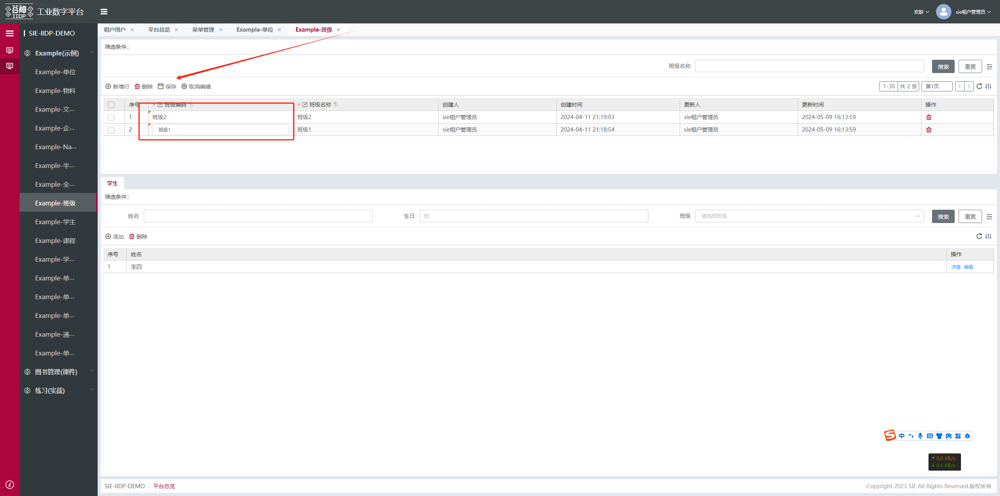

## 建扩展入口文件
创建一个准备扩展这个功能的js文件： (最新初始例子工程zip里面有这个文件)
apps/demo/rbacRole/extend_rbac_role_table_multi_save.js
```js
export default {}
```
在apps\demo\views\index.js 入口文件引入扩展
```js
import tableMultiSave from './rbacRole/extend_rbac_role_table_multi_save';
export default {
  ...tableMultiSave
};
```

## 需求拆解实现 - 扩展数据源实现表格可行内编辑
__分析思路__：
扩展前的主表格：
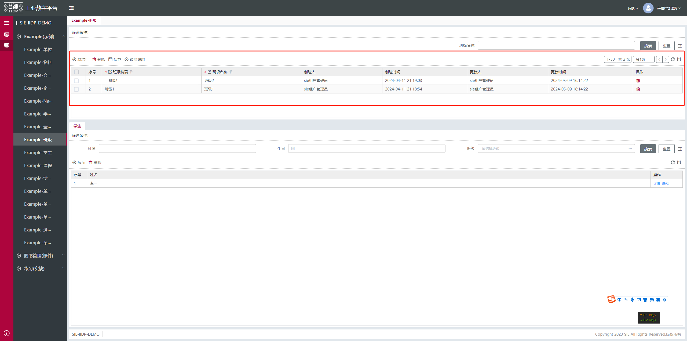

__考虑因素1__：平台原来能配置表格后端视图能实现行内编辑，但不具备多行保存能力

技术文档搜索栏搜 行内编辑 即可找到
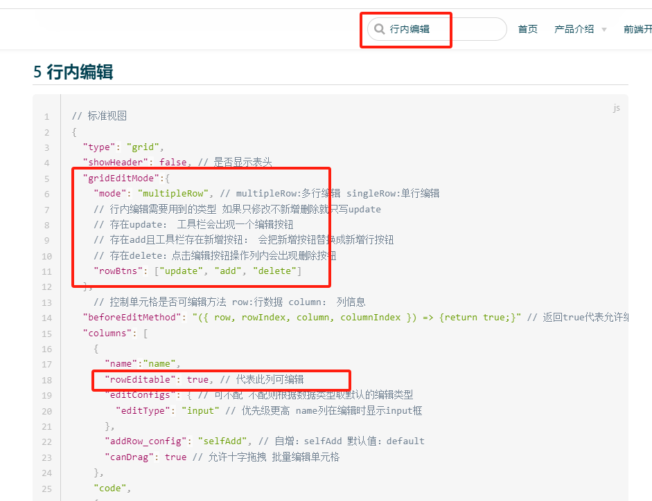

__考虑因素2__：我们扩展多行保存能力需要复用到很多地方

__结论__：扩展改写数据源返回统一修改loadView接口返回的后端视图配置

__代码实现提前1__：寻找加载后端视图数据源loadView接口定义的地方

在浏览器上审查元素，可以找到以_table_main结尾的id，里面存放了标准页的loadView数据源定义
可以直接console运行 tech_app.page.getNode('demo_example_class_menu_table_main').data.ds_config 打印查看

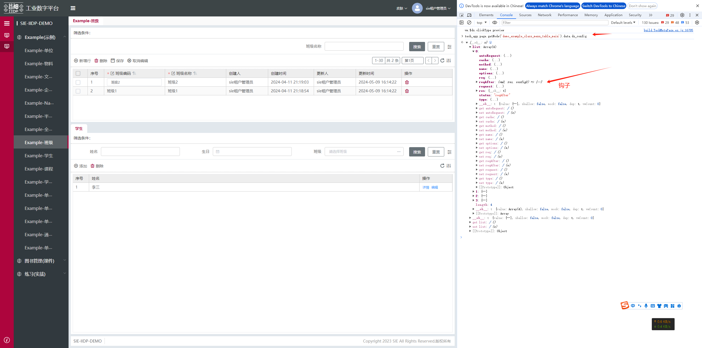
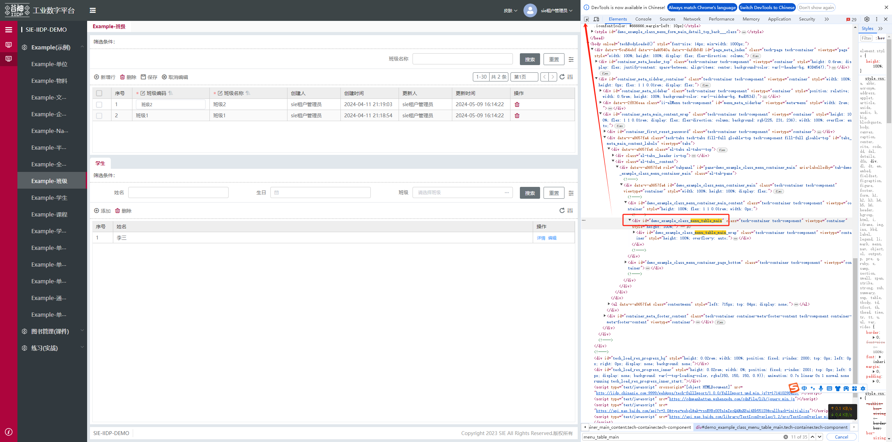

__代码实现提前2__：在接口文档搜索数据源扩展一般改动那些方法
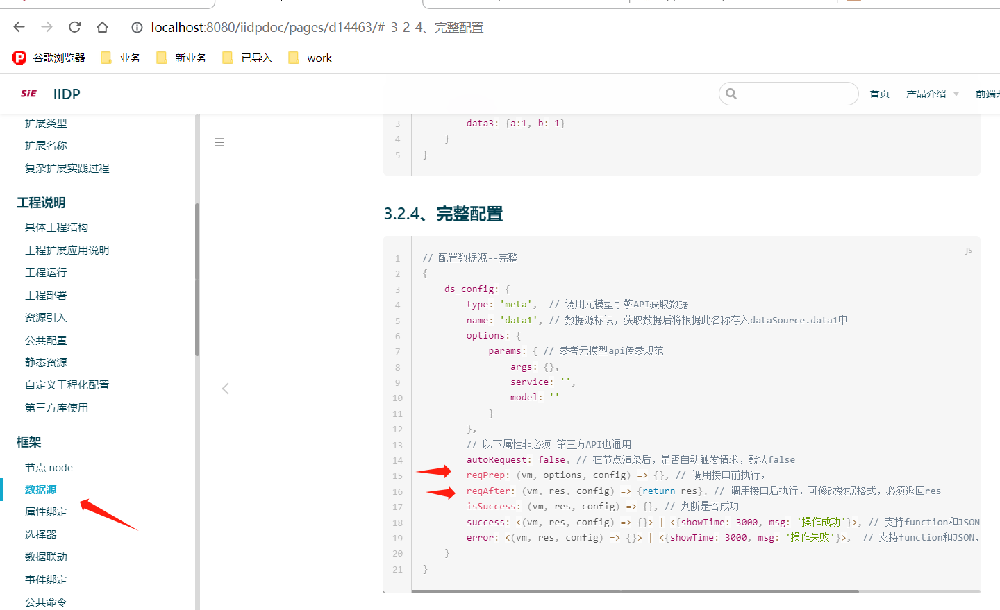

__代码实现__：
apps/demo/rbacRole/extend_rbac_role_table_multi_save.js
```js
import { tableToEdit } from '../utils/tableToEdit'; // 提交import js文件引入 方便js方法复用
export default {
  // 修改数据源扩展表格为可行内编辑
  extend_table_multi_edit: {
    type: 'custom', // 自定义扩展
    selector: {
      attr: 'id',
      pre: ['rbac_user_menu_tree_main_wrap_right_table', 'rbac_role_menu_table_main'], // 扩展可复用到 角色管理 用户管理 的主表格里面
      value: ''
    },
    beforeOperate: (app, operateItem, options) => {
      tableToEdit(app, operateItem, options);
      return operateItem.view;
    },
    view: {}
  }
}
```
建业务公共js方法文件：
apps\demo\views\utils\tableToEdit.js
```js
// 表格转行内编辑
const tableToEdit = (app, operateItem, options) => {
  // console.log(' ==== in tableToEdit ', app, operateItem, options);
  let tableViewDsConfig = options.element.ds_config.list.find((item) => item.name === 'tableView');
  tableViewDsConfig.reqAfter = (vm, res) => {
    // console.log(' === tableView res === ', res);
    if (res?.data?.views?.grid?.body) {
      // 获取表格的后端视图配置
      let gridEndView = res.data.views.grid.body;
      // 行内编辑配置
      gridEndView.gridEditMode = {
        mode: 'multipleRow', // multipleRow:多行编辑 singleRow:单行编辑
        // 行内编辑需要用到的类型 如果只修改不新增删除就只写update
        // 存在update： 工具栏会出现一个编辑按钮
        // 存在add且工具栏存在新增按钮： 会把新增按钮替换成新增行按钮
        // 存在delete：点击编辑按钮操作列内会出现删除按钮
        rowBtns: ['update', 'add']
      };
      // 以下是配置列字段 可行内编辑 
      // 若第一列是简写字符串 配置成对象
      if (Object.prototype.toString.call(gridEndView.columns[0]) === '[object String]') {
        let fieldName = gridEndView.columns[0];
        gridEndView.columns[0] = {
          name: fieldName
        };
      }
      // 把第一列配置成可编辑
      gridEndView.columns[0].rowEditable = true; 
    }
    return res;
  };
};

export { tableToEdit };

```
__效果__：
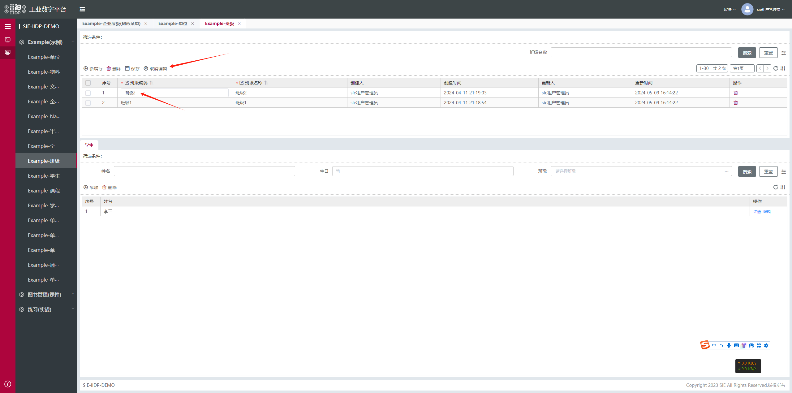


## 需求拆解实现 - 扩展表格编辑输入改变事件
__分析思路__：
扩展前的主表格：
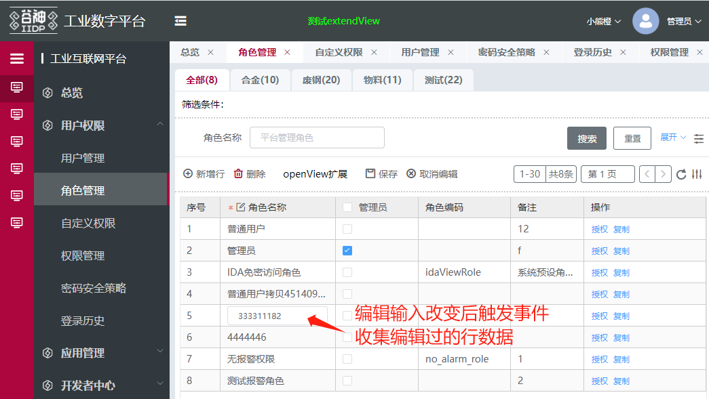

__考虑因素1__：由于主表格具备翻页搜索功能，所以每次编辑字段改变都要把行数据收集起来
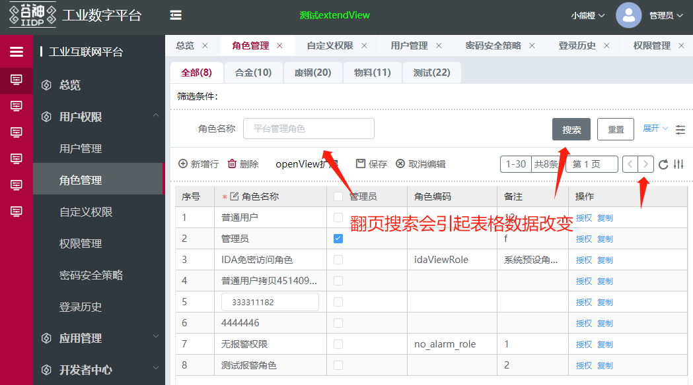

__考虑因素2__：由于是保存按钮发起的，收集的地方存入保存按钮的数据源上

tech_app.page.getNode('rbac_role_menu_table_toolbar_rowEdit_save').$ds.afterEditRow
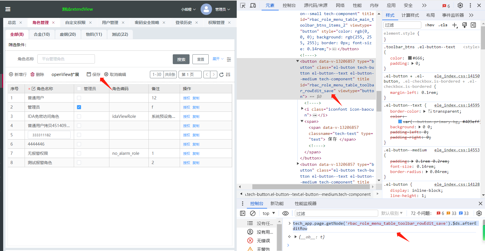

__结论__：扩展表格编辑行状态下输入框改变事件触发收集编辑改动的行数据，存在保存按钮的数据源上

__代码实现提前1__：找到主表格的编辑改变事件

在浏览器上审查元素，可以找到以table_table_main结尾的id，或者找viewtype="table" 表格的前端视图节点
可以直接console运行 tech_app.page.getNode('rbac_role_menu_table_main_table').instance

在里面可以找到editChange的事件方法，后面我们可以用 bind_on_editChange来使用它

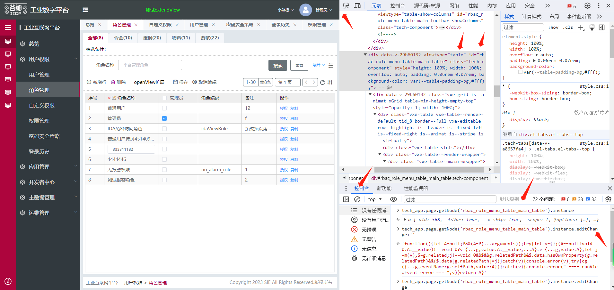

__代码实现__：
apps/demo/rbacRole/extend_rbac_role_table_multi_save.js
```js
import { tableMultiSave, tableMultiSaveBtn } from '../utils/tableMultiSave';

export default {
  // 修改表格的编辑改变方法 把编辑过的行  保存在编辑保存按钮上
  extend_table_multi_save: {
    type: 'custom',
    selector: {
      attr: 'id',
      pre: ['rbac_user_menu_', 'rbac_role_menu_'],
      value: 'table_main_table'
      // value: 'rbac_role_menu_table_main_table'
    },
    beforeOperate: (app, operateItem, options) => {
      tableMultiSave(app, operateItem, options);
      return operateItem.view;
    },
    view: {}
  }
};

```
建业务公共js方法文件：
apps\demo\views\utils\tableMultiSave.js
```js
// 表格多选保存处理
const tableMultiSave = (app, operateItem, options) => {
  console.log(' ==== in tableMultiSave ', app, operateItem, options);
  options.element.bind_on_editChange = (params) => {
    let vm = params.self;
    let pre = vm.$ds.idPreTab || vm.$ds.idPre;
    let row = params.value.row;
    // console.log(' ==== bind_on_editChange row == ', row);
    // 获取编辑保存按钮节点
    let saveBtnVm = vm.$select(pre + 'table_toolbar_rowEdit_save');
    saveBtnVm.$ds.afterEditRow[row.id] = row; // 存起编辑后的行信息
  };
};

export { tableMultiSave };

```

## 需求拆解实现 - 扩展表格上部的工具栏保存按钮
__分析思路__：
扩展表格上部的工具栏保存按钮，实现多行保存:
tech_app.page.getNode('rbac_role_menu_table_toolbar_rowEdit_save').data.bind_on_click
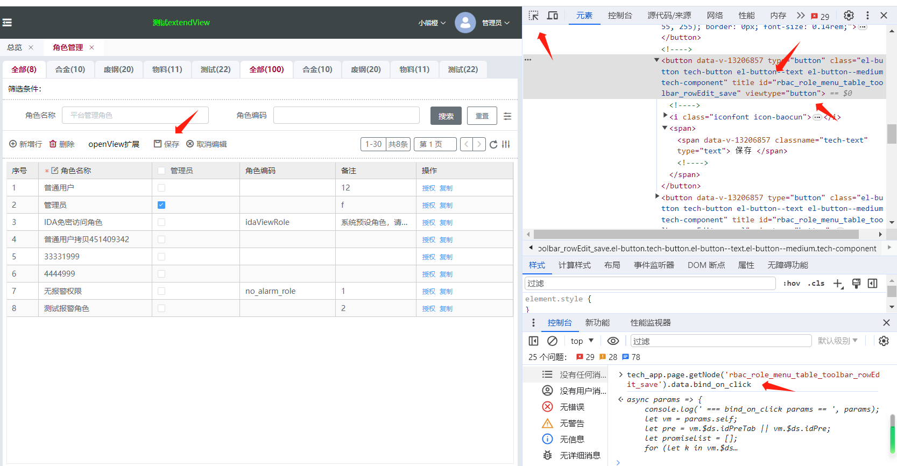

__代码实现提前1__：搜索技术文档熟悉bind_on_事件使用

搜索 事件绑定：
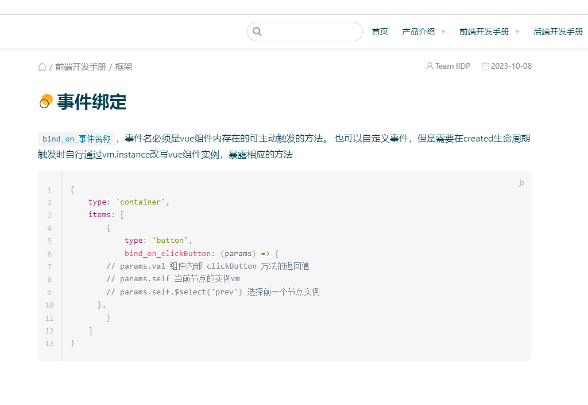

__代码实现提前2__：搜索技术文档熟悉自定义数据源的使用
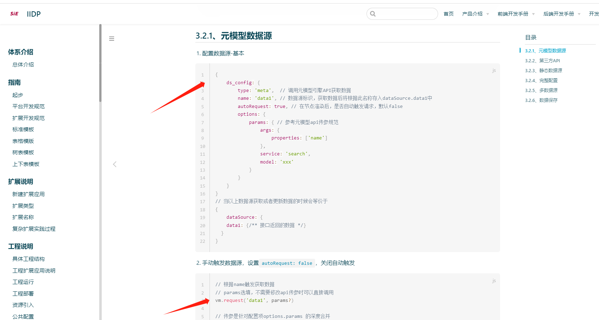

**[demo清单](/pages/3a50a2/#_49、扩展表格为多行保存在保存按钮上扩展)**

__代码实现__：
apps/demo/rbacRole/extend_rbac_role_table_multi_save.js
```js
扩展表格为多行保存在保存按钮上扩展
import { tableMultiSave, tableMultiSaveBtn } from '../utils/tableMultiSave';

export default {
  // 扩展表格为多行保存 在保存按钮上扩展
  extend_table_multi_save_btn: {
    type: 'custom',
    selector: {
      attr: 'id',
      pre: ['rbac_user_menu_', 'rbac_role_menu_'],
      value: 'table_toolbar_rowEdit_save'
      // value: 'rbac_role_menu_table_toolbar_rowEdit_save'
    },
    beforeOperate: (app, operateItem, options) => {
      tableMultiSaveBtn(app, operateItem, options);
      return operateItem.view;
    },
    view: {}
  }
};

```
建业务公共js方法文件：
apps\demo\views\utils\tableMultiSave.js
```js
// 表格多选保存处理 保存按钮
const tableMultiSaveBtn = (app, operateItem, options) => {
  console.log(' ==== in tableMultiSave ', app, operateItem, options);
  // 定义保存数据源
  options.element.ds_config = {
    name: 'allSave',
    type: 'meta',
    method: 'service',
    autoRequest: false,
    options: {}
  };
  // 定义数据源存编辑过的行对象
  options.element.dataSource = {
    afterEditRow: {}
  };
  // 定义编辑保存按钮的 点击事件
  options.element.bind_on_click = async (params) => {
    console.log(' === bind_on_click params == ', params);
    let vm = params.self;
    let pre = vm.$ds.idPreTab || vm.$ds.idPre;

    let promiseList = [];
    for (let k in vm.$ds.afterEditRow) {
      let tmpReq = vm.request('allSave', {
        model: vm.$ds._metaParamsModel, // 继承下来的model
        service: 'update',
        args: {
          ids: [k],
          values: vm.$ds.afterEditRow[k]
        }
      });
      promiseList.push(tmpReq);
    }

    let results = await Promise.all(promiseList);
    let errStr = '';
    // eslint-disable-next-line @typescript-eslint/prefer-for-of
    for (let i = 0; i < results.length; i++) {
      let res = results[i];
      if (!res?.data) {
        let rowString = JSON.stringify(vm.$ds.afterEditRow[i]);
        errStr += rowString + '   ';
      } else {
        delete vm.$ds.afterEditRow[i];
      }
    }
    if (errStr !== '') {
      errStr += '保存失败，其他保存成功！';
    }

    if (errStr === '') {
      window.ELEMENT.Message.success('保存成功');
      vm.$ds.afterEditRow = {}; // 清空需要保存的行信息
      document.getElementById(pre + 'table_main_toolbar_refresh').click();
    } else {
      window.ELEMENT.Message.error(errStr);
    }
  };
};

export { tableMultiSaveBtn };
```
__效果__：
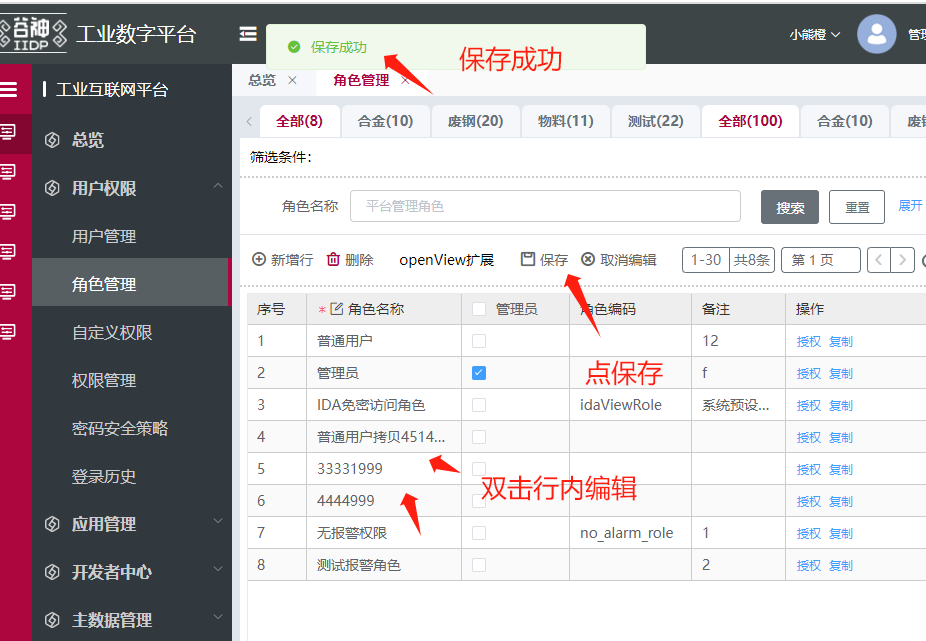


## 最终全部代码
 
**[demo清单](/pages/3a50a2/#_47、修改数据源扩展表格为可行内编辑)**

apps/demo/rbacRole/extend_rbac_role_table_multi_save.js
```js
import { tableToEdit } from '../utils/tableToEdit';
import { tableMultiSave, tableMultiSaveBtn } from '../utils/tableMultiSave';

export default {
  // 修改数据源扩展表格为可行内编辑
  extend_table_multi_edit: {
    type: 'custom',
    selector: {
      attr: 'id',
      pre: ['rbac_user_menu_tree_main_wrap_right_table', 'rbac_role_menu_table_main'],
      value: ''
      // value: 'rbac_role_menu_table_main'
    },
    beforeOperate: (app, operateItem, options) => {
      tableToEdit(app, operateItem, options);
      return operateItem.view;
    },
    view: {}
  },
  // 修改表格的编辑改变方法 把编辑过的行  保存在编辑保存按钮上
  extend_table_multi_save: {
    type: 'custom',
    selector: {
      attr: 'id',
      pre: ['rbac_user_menu_', 'rbac_role_menu_'],
      value: 'table_main_table'
      // value: 'rbac_role_menu_table_main_table'
    },
    beforeOperate: (app, operateItem, options) => {
      tableMultiSave(app, operateItem, options);
      return operateItem.view;
    },
    view: {}
  },
  // 扩展表格为多行保存 在保存按钮上扩展
  extend_table_multi_save_btn: {
    type: 'custom',
    selector: {
      attr: 'id',
      pre: ['rbac_user_menu_', 'rbac_role_menu_'],
      value: 'table_toolbar_rowEdit_save'
      // value: 'rbac_role_menu_table_toolbar_rowEdit_save'
    },
    beforeOperate: (app, operateItem, options) => {
      tableMultiSaveBtn(app, operateItem, options);
      return operateItem.view;
    },
    view: {}
  }
};

```
建业务公共js方法文件：
apps\demo\views\utils\tableToEdit.js
```js
// 表格转行内编辑
const tableToEdit = (app, operateItem, options) => {
  // console.log(' ==== in tableToEdit ', app, operateItem, options);
  let tableViewDsConfig = options.element.ds_config.list.find((item) => item.name === 'tableView');
  tableViewDsConfig.reqAfter = (vm, res) => {
    // console.log(' === tableView res === ', res);
    if (res?.data?.views?.grid?.body) {
      // 获取表格的后端视图配置
      let gridEndView = res.data.views.grid.body;
      // 行内编辑配置
      gridEndView.gridEditMode = {
        mode: 'multipleRow', // multipleRow:多行编辑 singleRow:单行编辑
        // 行内编辑需要用到的类型 如果只修改不新增删除就只写update
        // 存在update： 工具栏会出现一个编辑按钮
        // 存在add且工具栏存在新增按钮： 会把新增按钮替换成新增行按钮
        // 存在delete：点击编辑按钮操作列内会出现删除按钮
        rowBtns: ['update', 'add']
      };
      // 若第一列是简写字符串 配置成对象
      if (Object.prototype.toString.call(gridEndView.columns[0]) === '[object String]') {
        let fieldName = gridEndView.columns[0];
        gridEndView.columns[0] = {
          name: fieldName
        };
      }
      // 把第一列配置成可编辑
      gridEndView.columns[0].rowEditable = true;
    }
    return res;
  };
};

export { tableToEdit };
```
apps\demo\views\utils\tableMultiSave.js
```js
// 表格多选保存处理
const tableMultiSave = (app, operateItem, options) => {
  console.log(' ==== in tableMultiSave ', app, operateItem, options);
  options.element.bind_on_editChange = (params) => {
    let vm = params.self;
    let pre = vm.$ds.idPreTab || vm.$ds.idPre;
    let row = params.value.row;
    // console.log(' ==== bind_on_editChange row == ', row);
    // 获取编辑保存按钮节点
    let saveBtnVm = vm.$select(pre + 'table_toolbar_rowEdit_save');
    saveBtnVm.$ds.afterEditRow[row.id] = row; // 存起编辑后的行信息
  };
};

// 表格多选保存处理 保存按钮
const tableMultiSaveBtn = (app, operateItem, options) => {
  console.log(' ==== in tableMultiSave ', app, operateItem, options);
  // 定义保存数据源
  options.element.ds_config = {
    name: 'allSave',
    type: 'meta',
    method: 'service',
    autoRequest: false,
    options: {}
  };
  // 定义数据源存编辑过的行对象
  options.element.dataSource = {
    afterEditRow: {}
  };
  // 定义编辑保存按钮的 点击事件
  options.element.bind_on_click = async (params) => {
    console.log(' === bind_on_click params == ', params);
    let vm = params.self;
    let pre = vm.$ds.idPreTab || vm.$ds.idPre;

    let promiseList = [];
    for (let k in vm.$ds.afterEditRow) {
      let tmpReq = vm.request('allSave', {
        model: vm.$ds._metaParamsModel, // 继承下来的model
        service: 'update',
        args: {
          ids: [k],
          values: vm.$ds.afterEditRow[k]
        }
      });
      promiseList.push(tmpReq);
    }

    let results = await Promise.all(promiseList);
    let errStr = '';
    // eslint-disable-next-line @typescript-eslint/prefer-for-of
    for (let i = 0; i < results.length; i++) {
      let res = results[i];
      if (!res?.data) {
        let rowString = JSON.stringify(vm.$ds.afterEditRow[i]);
        errStr += rowString + '   ';
      } else {
        delete vm.$ds.afterEditRow[i];
      }
    }
    if (errStr !== '') {
      errStr += '保存失败，其他保存成功！';
    }

    if (errStr === '') {
      window.ELEMENT.Message.success('保存成功');
      vm.$ds.afterEditRow = {}; // 清空需要保存的行信息
      document.getElementById(pre + 'table_main_toolbar_refresh').click();
    } else {
      window.ELEMENT.Message.error(errStr);
    }
  };
};

export { tableMultiSave, tableMultiSaveBtn };

```
