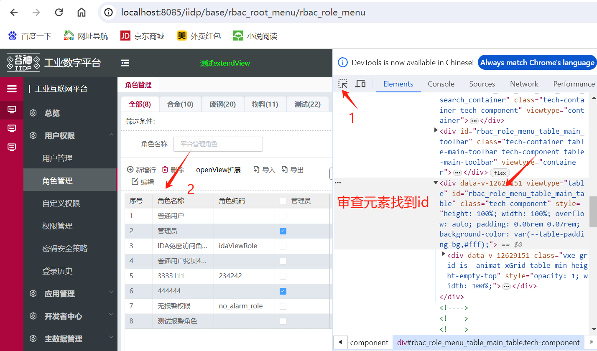
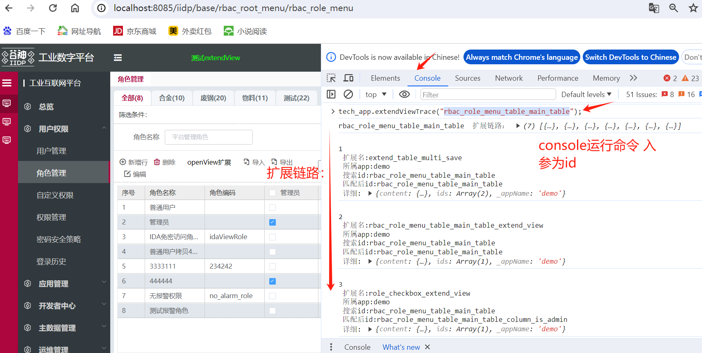

## 打印节点扩展链路信息

打开控制台，根据节点的 id 通过 tech_app.extendViewTrace 方法打印出基于该节点的所有扩展的链路顺序

<font class="can-use-version">对应 package.json t-core 插件 1.0.30 或以上版本</font>

```js
// 入参为节点id 可调试申请元素定位获取id 入参id支持模糊匹配(则可输入非完整的id)
tech_app.extendViewTrace("rbac_role_menu_table_main_table");
```


