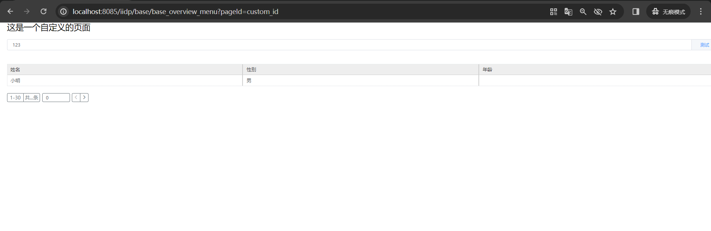

## 1.自定义页面功能背景说明

当业务需求和标准模板的展现方式不匹配时，使用自定义页面，不受模板限制

## 2.自定义页面使用方法介绍

自定义页面有两种实现方式：

- **方式一（替换标准页）**：通过 `type: 'replace'` 替换标准页面中的指定元素，直接显示 Vue 组件或区块视图组件，无需修改路由。**推荐优先使用此方式**。
- **方式二（路由访问）**：通过 `type: 'page'` 创建全新页面，通过 URL 参数 `?pageId=xxx` 访问。仅在需要完全独立的页面路由时使用。

---

### 2.1 方式一：替换标准页元素（type: replace）（推荐）

当需要将标准页面中的某个区域替换为自定义 Vue 组件或区块视图组件时，使用 `type: 'replace'` 方式。这种方式无需修改路由，直接在原页面位置显示自定义内容。

#### 基本语法

```js
export default {
  test_replace_extend_view: {
    type: "replace",
    selector: {
      attr: "id",
      value: "xxx_table_main_wrap", // 选取xxx_table_main_wrap代表替换整个标准模板
    },
    view: {
      type: "xxx", // Vue2 组件名（组件name，去除tech-） 或 区块视图组件名
      id: "trace_forward_comp",
    },
  },
};
```

#### 参数说明

| 参数             | 说明                                                         |
| ---------------- | ------------------------------------------------------------ |
| `type`           | 固定为 `'replace'`，表示替换模式                             |
| `selector.attr`  | 选择器属性名，用于定位目标元素                               |
| `selector.value` | 选择器属性值，与 `attr` 配合定位具体的 DOM 元素              |
| `view.type`      | 替换后的组件类型，可以是已注册的 Vue2 组件名或区块视图组件名 |
| `view.id`        | 唯一标识                                                     |

#### 使用场景

- 在标准页面特定位置（xxx_table_main_wrap）嵌入自定义 Vue 组件
- 用区块视图组件替换标准页面的某个区域
- 保持原有路由不变，仅在指定位置展示自定义内容

#### 相关组件开发参考

- **自定义 Vue 组件**：遵循 Vue 2.x 规范开发的 `.vue` 单文件组件，适用于复杂的交互逻辑和 UI 定制。详见 [自定义 Vue 组件](/pages/587afe/)
- **区块视图组件**：通过视图 JSON 配置定义的可复用视图块，以 `__block: true` 标记，适用于纯配置化的视图复用场景。详见 [自定义视图组件](/pages/d74bbd/)

---

### 2.2 方式二：路由访问自定义页面（type: page）

先创建一个扩展组件，然后在该组件内加入自定义页面代码，还需要引入到 index.js 中，具体示例如下。
view 中的 type 类型为 `page`，id 即为访问时候的页面 id。

```js
export default {
  // 自定义页面 ?pageId=custom_id
  tview_custom_page: {
    type: "append",
    selector: {
      attr: "id",
      value: "template-meta-page-app", // 固定
    },
    view: {
      type: "page", // 固定
      id: "exam_myself_newPage_id", // 自定义页面id
      noToken: true, // true: 未登录也可以访问   false: 登录后才能访问
      dataSource: {
        from: { name: "xxx" },
        options: [
          { text: "a", value: 1 },
          { text: "b", value: 2 },
        ],
      },
      items: [
        {
          type: "container",
          id: "container1",
          items: [
            {
              type: "text",
              style: {
                margin: "20px",
                fontSize: "24px",
              },
              value: "这是一个自定义的页面",
            },
            {
              type: "input",
              name: "input",
              text: "输入",
              style: {
                margin: "20px",
              },
              model: {
                // 脱离表单，单独使用时组件的value设置
                input: "123", // 字段名跟name一致
              },
              // 绑定回车事件
              bind_on_keyupEnter: (data) => {
                console.log(data);
              },
              // 绑定change事件
              bind_on_changeHandler: (data) => {
                console.log(data);
              },
              // 绑定input事件
              bind_on_inputHandler: (data) => {
                console.log(data);
              },
              append: {
                type: "button",
                text: "测试",
                handler: (params) => {
                  console.log(params);
                },
              },
            },
            {
              type: "table",
              oSize: 200, // 纵向虚拟滚动偏移量 默认2
              oSizeX: 20, // 横向虚拟滚动偏移量 默认2
              style: {
                margin: "20px",
                height: "200px",
              },
              tableData: [
                { id: 1, name: "小明", gender: "男", age: 16 },
                { id: 2, name: "小花", gender: "女", age: 17 },
              ],
              items: [
                { prop: "name", label: "姓名", type: "text" }, // type设置为text 代表该列为文本列
                { prop: "gender", label: "性别", type: "text" },
                { prop: "age", label: "年龄", type: "tag" },
              ],
            },
            {
              type: "paging",
              id: "paging_001",
              style: {
                margin: "20px",
              },
              pageSize: 30,
              input: "1-30",
              totalCount: "...",
              bind_on_changePageNumber: async (res) => {
                const { self: vm, value: page } = res;
                console.log(vm.data.pageSize, page);
              },
            },
          ],
        },
      ],
    },
  },
};
```

---

## 3.访问方式

#### 方式一（type: replace）的访问方式

- 无需修改路由，直接访问标准页面的原有 URL 即可，被 `selector` 匹配到的元素会自动替换为自定义组件

#### 方式二（type: page）的访问方式

- 可通过 任意菜单 url 加 `?pageId=自定义页面id` 访问（例：`/iidp/base/base_overview_menu?pageId=custom_id`）
- 不同自定义页面，须定义不同页面 id。示例访问地址：`http://localhost:7070/iidp/base/base_overview_menu?pageId=custom_id`

## 4.页面效果图


