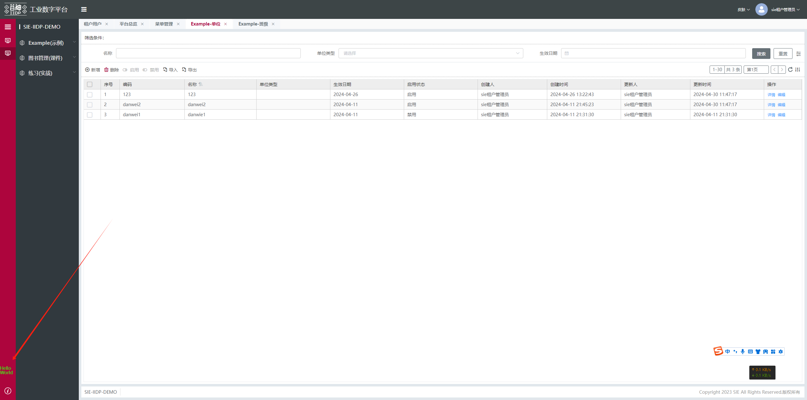
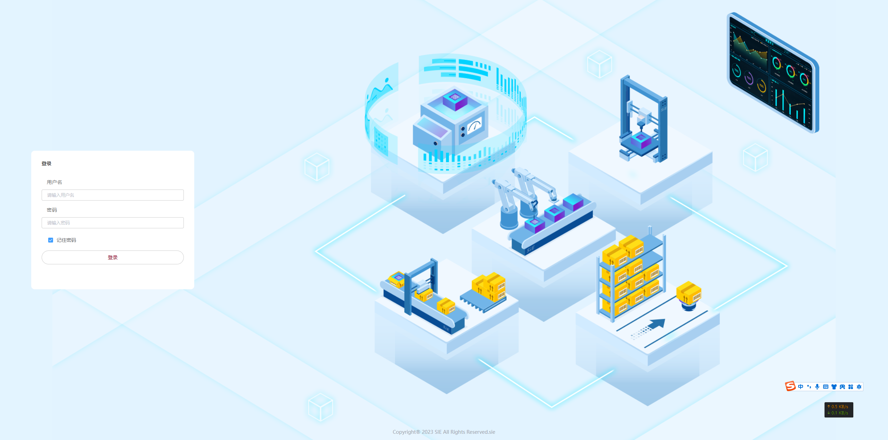
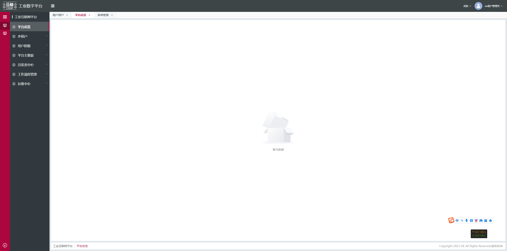
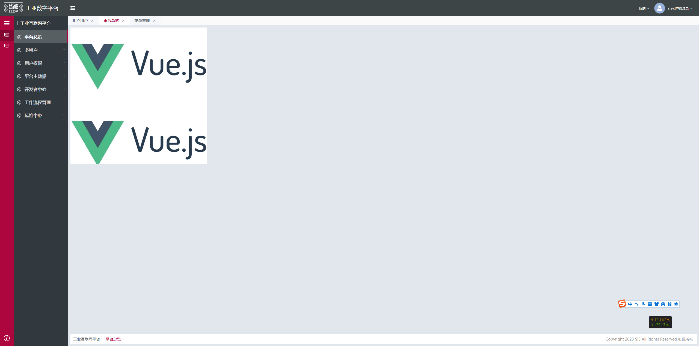
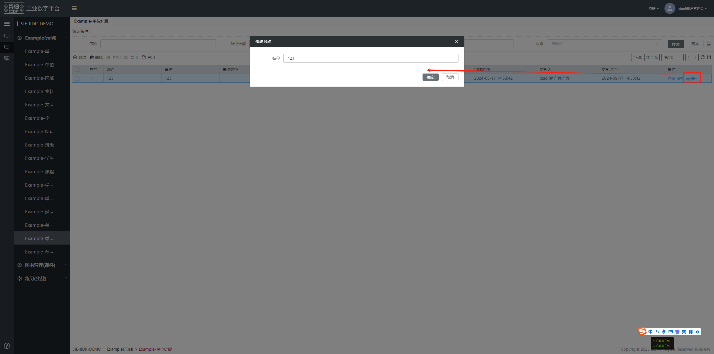

## 扩展配置介绍

```js
iidp_demo_example_unit_menu_table_main_table_extend: { // 扩展名称（自定义，唯一，定义规则见 前言-扩展开发规范）
	type: 'custom', // 扩展类型（见扩展说明-扩展类型）
	selector: { // 扩展选择节点（见 框架-选择器）
		attr: 'id', // 选择属性
		value: 'demo_example_unit_menu_table_main_table' // 选择的节点id
	},
	// beforeOperate：执行对应type前执行的钩子函数（见扩展说明-扩展类型）
	beforeOperate: (app, operateItem, options) => {
		// 获取主表格数据源
		let tableDataDsConfig = options.element.ds_config.list.find(
			(item) => item.name === 'tableData'
		);
		tableDataDsConfig.reqPrep = operateItem.view.ds_config.list[0].reqPrep;
		return operateItem.view;
	},
	// view: 节点视图
	view: {
		// ds_config：数据源 （见 框架-数据源）
		ds_config: {
			list: [
				{
					name: 'tableData',
					reqPrep: (vm, options, config) => {
						options.params.args.xxx='aaa' // 修改接口入参
						return options;
					}
				}
			]
		},
		// 公共方法 （见 框架-公共命令）
		commands: {
		// 通过$cmd.setValue() 在视图函数内调用, params是必传参数
			setValue: (params) => {
				console.log(params)
			}
		},
		// 详见 框架-节点node
		type: 'container', // 组件类型（见 组件）
		id: 'container01_1', // 组件id，会自行拼接
		style: { // 当前节点的样式，会追加到DOM的style中，所有组件都有此属性
			width: '300px',
			height: '300px',
			background: 'green'
		},
		css: '.box1>.text1{color: red;}', // 自定义页面样式
		className: 'box1', // 设置class
		display: true, // 控制节点的显示，所有组件都有此属性
		dataSource: { // 数据源获取的数据将缓存在dataSource中,使用可简写为$ds
			aaa: '1',
			tableData: []
		},
		bind_value: '$ds.aaa', // 属性绑定（见 框架-属性绑定）
		created: (vm) => {
			// 节点创建时触发
			// vm 当前节点的上下文
			vm.$ds.aaa = '2' // 修改数据
			vm.data.display = false // 修改节点属性
		},
		mounted: (vm) => {
			// 节点渲染完成时触发
		},
		destroy: (vm) => {
			// 节点销毁时触发
		},
		items: [ // 子节点列表
			{
				type: 'button',
				bind_on_click: (params) => { // 事件绑定（见 框架-事件绑定）
					// params.self 当前节点的实例vm
					// params.value 组件内部 click 方法的返回值
					const { self: vm, value } = params
					vm.$cmd.setValue(123) // 调用公共方法
					window.ELEMENT.Message.success('Hello World!!!')
				}
			},
			{
				type: 'table',
				name: '表格组件',
				height: '300px',
				checkbox: 'multiple',
				bind_tableData: '$ds.tableData',
				items:[
					{prop:'name',label:'姓名'},
					{prop:'gender',label:'性别'},
					{
						prop:'operate',
						label:'操作',
						type:'operation',
						btns:[
							{
								text:'提交',
								options:{
									disabled:false,// 是否可操作
									type:'primary',// 按钮类型
									size:'small',// 按钮大小
									icon:'iconfont icon-tijiao',// 按钮text前的图标
									plain:''
								}
							}
						]
					}
				],
				bind_on_clickOptionBtn: (btn, scope, event) => {// 绑定操作栏按钮的点击事件
					// btn：当前按钮，相当于配置中的btns[0]
					// scope:{row，column，index}
					...
				}
			}
		]
	}
}
```

## 扩展侧边栏

**[demo 清单](/pages/3a50a2/#_11、扩展侧边栏)**

```js
// apps/sie-iidp-demo-example/views/custom/example_custom_permission.js
export default {
  sidebar_extend_view: {
    type: "before", // 在选中节点前面插入视图
    // 选择id = "sidebar_about_button"
    selector: {
      attr: "id",
      value: "sidebar_about_button", // 关于按钮
    },
    view: {
      type: "text",
      style: {
        color: "#07ff00",
        position: "absolute",
        bottom: "0.8rem",
      },
      value: "Hello World",
    },
  },
};
```



## 扩展登录

**[demo 清单](/pages/3a50a2/#_9、扩展登录)**

扩展前


扩展后，在表单头部添加了一个表单项


```js
// apps/sie-iidp-demo-example/views/custom/example_custom_permission.js
export default {
  login_extend_view: {
    type: "unshift", // 在选中节点的items头部插入视图
    // 选择id = "form_meta_login"
    selector: {
      attr: "id",
      value: "form_meta_login",
    },
    view: {
      type: "row",
      id: "row_meta_login_row100",
      className: "meta-login-row",
      items: [
        {
          type: "input",
          id: "inp_meta_login_test",
          value: "扩展",
          name: "password",
          placeholder: "扩展",
          className: "meta-login-row-inp",
        },
      ],
    },
  },
};
```

<!-- ## 动态表格

1. 后端 search 接口增加的 fields 和 views 字段（类似 loadview 接口返回的 fields 和 views）,
   fields 和 views 应包含需要展示的列的数据, 如下所示 </br>
   原来为

```js
data: [数据];
```

改为

```js
data: {
 data: [数据],
 fields: {
           trend: {
             dateType: 'String',
             displayName: '趋势',
             name: 'trend'
           },
           type: {
             dateType: 'String',
             displayName: '属性',
             name: 'type'
           },
           resAdminOrg: {
             dateType: 'String',
             displayName: '节点名称',
             name: 'resAdminOrg'
           }
         },
 views: {
           grid: {
             view_id: 'mes_tech_month_stat_grid',
             body: {
               columns: [
                 {
                   displayName: '节点名称',
                   name: 'resAdminOrg'
                 },
                 {
                   displayName: '属性',
                   name: 'type'
                 },
                 {
                   displayName: '趋势',
                   name: 'trend'
                 }
               ],
               type: 'grid'
             }
           }
         }
}
```

2. 扩展修改页面表格默认的 search 接口为后端新接口
3. 下面代码为默认的 search 的逻辑代码，修改 search 参数请求后端新接口

```js
'demo_example_org_level_menu_form_main_table_search': {
   type: 'custom',// 对选中节点不做任何处理 但会执行beforeOperate函数 用户自行动态构造
           // 选择id = "demo_example_org_level_menu_form_main_table_search"
           selector: {
      attr: 'id',
              value: 'demo_example_org_level_menu_form_main_table_search'
   },
   beforeOperate: (app, operateItem, options) => {
      options.element.commands.requestSearch = async (params, filterArr) => {
         const { self: vm } = params;
         const commonform = vm.$select(vm.$cmd.getIdPre(vm) + 'form_main_table_search_common');
         // 树视图时使用树视图的请求参数
         const treeNode = vm.$select(`${vm.$ds.idPre}tree_main_wrap`);
         const loadViewConfig = treeNode?.$ds?.loadViewConfig;
         if (loadViewConfig && !vm.$cmd.fromTab(vm)) {
            return await commonform.request('tableData', {
               app: loadViewConfig.subApp,
               service: 'search',
               model: loadViewConfig.subModel,
               args: {
                  filter: filterArr,
                  useDisplayForModel: true,
                  limit: vm.$ds.paging.pageSize + 1, // 多拿一条
                  offset: vm.$ds.paging.pageStart,
                  order: '',
                  properties: vm.$cmd.meta.toProperty(
                          commonform.$ds.tableView.data.views.grid.body.columns,
                          commonform.$ds.tableView.data.fields
                  )
               }
            });
         }
         return await commonform.request('tableData', {
            model: commonform.$cmd.getModel(commonform),
            args: {
               filter: filterArr,
               properties: vm.$cmd.meta.toProperty(
                       commonform.$ds.tableView.data.views.grid.body.columns,
                       commonform.$ds.tableView.data.fields
               )
            }
         });
      };
      return operateItem.view;
   }
}
``` -->

## 扩展某个菜单下页面

扩展前


扩展后，设置为一张图片


```js
// app/base/views/menuPage/tview__base__menuPage.js
export default {
  base_overview_menu_container_main_empty_items_0_items_developing: {
    type: "replace", // 替换选中节点为视图节点
    // 选择id = "base_overview_menu_container_main_empty_items_0_items_0"
    selector: {
      attr: "id",
      value: "base_overview_menu_container_main_empty_items_0_items_developing",
    },
    view: {
      type: "container",
      id: "row_meta_page_container1",
      css: "#row_meta_page_container1{background-image: url(/static-resource/sie-iidp-demo-example/vue.png);width:500px;height:500px;background-size: 100%}",
    },
  },
};
```

## 表格操作列按钮扩展

**[demo 清单](/pages/3a50a2/#_6、表格行内扩展操作列的按钮-重置密码)**

扩展后实现点击表格操作列按钮弹出弹窗


```js
// apps\sie-iidp-demo-example\views\tablePage\example_edit_column_dialog.js
demo_example_edit_column_field_extend_view: {
   // 修改字段
   type: 'custom',
           selector: {
      attr: 'id',
              value: 'demo_example_unit_ext_menu_table_main_table'
   },
   beforeOperate: (app, operateItem, options) => {
      console.log(' === out options === ', options);
      if (options.element.columns) {
         let ops = options.element.columns.find((item) => item.prop === 'operate');
         if (ops) {
            if (!ops.items) {
               ops.items = [];
            }
            let addBtn = {
               id: 'custom_btn_my_action',
               display: true,
               action: 'myAction',
               auth: true,
               options: { size: 'small', type: 'text' },
               text: 'my按钮',
               name: 'my按钮',
               type: 'button',
               bind_on_click: async (params) => {
                  console.log('myAction', params);
                  const { self:vm, value} = params;
                  // 弹窗节点已存在
                  let dialog_meta_edit_name = vm.$select(vm.$ds.idPre + 'dialog_meta_edit_unitName');
                  if (dialog_meta_edit_name?.instance) {
                     dialog_meta_edit_name.data.display = true;
                     return;
                  }
                  let resetPassword = window.Tech._cloneDeep(operateItem.view);
                  // 弹窗节点不存在，动态添加修改字段弹窗
                  vm.$cmd.meta.popupView(vm, resetPassword, vm.$ds.idPre);
               }
            };
            if (ops.items.findIndex((item) => item.action === 'myAction') < 0) {
               ops.items.push(addBtn);
            }
         }
      }
      return operateItem.view;
   },
           view: {
      type: 'dialog',
              id: 'dialog_meta_edit_unitName',
              width: '30%',
              title: '修改名称',
              display: true,
              bind_on_operates: (params) => { // 点击按钮
         const {self:vm, value} = params;
         // 可以进行相关操作
         value.close(); // 关闭弹窗方法
      },
              items: [
         {
            type: 'form',
            name: '表单',
            // 数据源
            dataSource: {
               form: {
                  unitName: ''
               }
            },
            items: [
               {
                  type: 'input',
                  id: 'dialog_meta_edit_unitName_input',
                  text: '名称',
                  name: 'unitName',
                  created: async (vm) => {
                     const tableNode = vm.$select(vm.$ds.idPre + 'table_main_table');
                     vm.$ds.form.unitName = tableNode.$ds.mainTableRowData.unitName;
                  },
               }
            ]
         }
      ]
   }
}
```

## 扩展表格

表格列 id 命名规则：

1. 操作列： `${idPre}table_main_table_column_operation`
2. 序号列： `${idPre}table_main_table_column_rowIndex`
3. 其他列： `${idPre}table_main_table_column_${prop}` [prop: 对应列内容的字段名]

```js
// 自定义单击行、双击行、编辑单元格值改变事件
'rewrite_table_event_extend_view': {
  type: 'custom',// 对选中节点不做任何处理 但会执行beforeOperate函数 用户自行动态构造
  // 选择id = "demo_example_unit_ext_menu_table_main_table"
  selector: {
    attr: 'id',
    value: 'demo_example_unit_ext_menu_table_main_table'
  },
  beforeOperate: (app, operateItem, options) => {
    options.element.bind_on_rowDblclick = (res) => {
      // 双击行
      const { self: vm, value } = res
      let btnDom = vm.instance.$el.querySelector(`#meta_app_category_menu_table_main_table_column_operation_openView_${value?.row?.id}_openView`)
      btnDom?.click()
    }
    // 单击行
    options.element.bind_on_cellClick = (res) => {
      const { self: vm, value } = res
      let btnDom = vm.instance.$el.querySelector(`#meta_app_category_menu_table_main_table_column_operation_openView_${value?.row?.id}_openView`)
      btnDom?.click()
    }
    // 编辑单元格值改变时
    options.element.bind_on_editChange = (res) => {
      const { self: vm, value } = res
      console.log(value, vm)
    }
  },
  view: {}
}
// 序号列扩展
table_seq_extend_view: {
   type: 'custom',
           // 选择id = "demo_example_unit_ext_menu_table_main_table_column_rowIndex"
           selector: {
      attr: 'id',
              value: 'demo_example_unit_ext_menu_table_main_table_column_rowIndex'
   },
   beforeOperate: (app, operateItem, options) => {
      options.element.seqHtml = (scope, item, pagingIndexStart) => {
         let row = scope.row;
         let color = 'transparent';
         if (row.__IS_EDIT__ === true) {
            color = '#67C23A';
         } else if (row.__IS_EDIT__ === false) {
            color = '#F56C6C';
         }
         return `<div style="display:flex;align-items:center">
                      <span>${scope.seq + pagingIndexStart}</span>
                      <div style="width:5px;height:5px;background:${color};border-radius:50%;margin-left:10px"></div>
                  </div>`;
      };
   },
           view: {}
}
// 操作列扩展
'table_operation_extend_view1': {
  type: 'custom',
  // 选择id = "demo_example_unit_ext_menu_table_main_table_column_operation"
  selector: {
    attr: 'id',
    value: 'demo_example_unit_ext_menu_table_main_table_column_operation'
  },
  beforeOperate: (app, operateItem, options) => {
    options.element.items.push({
      type: 'button',
      options:{
        disabled: false,
        type: 'text'
      },
      formatItem: (row, item) => {
        item.text = row.name === 'entity2' ? '启用' : '停用';
        return item;
      },
      bind_on_click: (param) => {
        console.log(param)
      },
    });
    return operateItem.view;
  },
  view: {}
}
```

## 扩展删除弹窗

```js
'table_toolbar_delete_extend': {
  type: 'custom',// 对选中节点不做任何处理 但会执行beforeOperate函数 用户自行动态构造
  // 选择id = "demo_example_unit_ext_menu_table_toolbar_delete"
  selector: {
    attr: 'id',
    value: 'demo_example_unit_ext_menu_table_toolbar_delete' // 删除按钮
  },
  beforeOperate: (app, operateItem, options) => {
    options.element.bind_on_click = (vm) => {
      const delDialog = vm.self.$select(`${vm.self.$ds.idPre}table_main_del_dialog`) // 弹窗节点
      const delconfirm = (close) => {
        // 确认事件内容
        close() // 弹窗关闭事件
      }
      delDialog.data.display = true
      delDialog.data.options.confirm = delconfirm // 重写确认事件
    };
    return operateItem.view;
  }
}
```

## 扩展 demo 清单

###### 1、主表格-工具栏增加启用按钮扩展 demo

    菜单入口: Example(示例) - Example-单位扩展
    js文件路径：apps\sie-iidp-demo-example\views\tablePage\example_enable_btn.js
    扩展名：demo_example_unit_table_main_toolbar_append_enable_btn_extend_view

###### 2、主表单，扩展表单，变为双 tab 页

    菜单入口: Example(示例) - Example-单位扩展
    js文件路径：apps\sie-iidp-demo-example\views\tablePage\example_trans_tabs.js
    扩展名：demo_example_trans_tabs_extend_view

###### 3、主表格-扩展主表格接口方法

    菜单入口: Example(示例) - Example-单位扩展
    js文件路径： apps\sie-iidp-demo-example\views\tablePage\example_datasource.js
    扩展名：demo_example_table_main_datasource_extend_view

###### 4、主表单-追加自定义组件(gdmap,echarts)

    菜单入口: 自定义权限-主表单
    js文件路径：apps\sie-iidp-demo-example\views\custom\example_custom_permission.js
    扩展名：demo_example_custom_permission__extend_view

###### 5、封装自定义指令，挂载在全局

    js文件路径：apps\sie-iidp-demo-example\views\custom\example_directive_confirm_dialog.js
    扩展名：directive_confirm_dialog_extend_extend

###### 6、表格行内扩展操作列的按钮 重置密码

    菜单入口: Example(示例) - Example-单位扩展
    js文件路径：apps\sie-iidp-demo-example\views\tablePage\example_edit_column_dialog.js
    扩展名：demo_example_edit_column_field_extend_view

###### 7、扩展注册

    菜单入口: Example(示例) - Example-单位扩展
    js文件路径：apps\sie-iidp-demo-example\views\user\example_register.js
    扩展名：demo_example_register_extend_view

###### 8、扩展总览

    菜单入口: Example(示例) - Example-单位扩展
    js文件路径：apps\sie-iidp-demo-example\views\homePage\example_totalview.js
    扩展名：demo_example_totalview_extend_view

###### 9、扩展登录

    菜单入口: Example(示例) - Example-单位扩展
    js文件路径：apps\sie-iidp-demo-example\views\user\example_login.js
    扩展名：login_extend_view

###### 10、扩展导航头

    js文件路径：apps\sie-iidp-demo-example\views\homePage\example_left_header.js
    扩展名：header_left_extend_view

###### 11、扩展侧边栏

    js文件路径：apps\sie-iidp-demo-example\views\homePage\example_sidebar.js
    扩展名：sidebar_extend_view

###### 12、扩展某个菜单下页面

    菜单入口: Example(示例) - Example-单位扩展
    js文件路径：apps\sie-iidp-demo-example\views\menuPage\example_menuPage.js
    扩展名：menuPage_extend_view

###### 13、扩展新页面

url 后拼接 ?pageId=newpage (newpage 为扩展 view 中的 id，demo 中为 custom_id),

    js文件路径：apps\sie-iidp-demo-example\views\newPage\example_newPage.js
    扩展名：example_newPage_extend_view

###### 14、扩展表格多选模式

    菜单入口: Example(示例) - Example-课程（子表-学生）
    js文件路径：apps\sie-iidp-demo-example\views\tablePage\example_table_checkbox.js
    扩展名：table_checkbox_extend_view

###### 15、扩展详情页添加 '发布' 按钮

    菜单入口: Example(示例) - Example-单位扩展
    js文件路径：apps\sie-iidp-demo-example\views\tablePage\example_btn_publish.js
    扩展名：demo_example_publish_btn_extend_view

###### 16、扩展主表格转出视图字符串方法

    菜单入口: Example(示例) - Example-单位扩展
    js文件路径：apps\sie-iidp-demo-example\views\tablePage\example_table_to_view_string.js
    扩展名：demo_example_main_table_to_view_string_extend_view

###### 17、增加工具栏的按钮 点击按钮弹出表单弹窗 点击弹出确定保存数据

    菜单入口: Example(示例) - Example-单位扩展
    js文件路径：apps\sie-iidp-demo-example\views\user\example_toolbar.js
    扩展名：user_toolbar_extend_view

###### 18、扩展替换详情页面,名字可以自定义

    菜单入口: Example(示例) - Example-单位扩展
    js文件路径：apps\sie-iidp-demo-example\views\tablePage\example_replace_form.js
    扩展名：demo_example_replace_form_extend_view

###### 19、扩展详情保存按钮 保存事件重写，扩展名字可自定义，不要重名

    菜单入口: Example(示例) - Example-单位扩展
    js文件路径：apps\sie-iidp-demo-example\views\tablePage\example_detail_event_save.js
    扩展名：demo_example_detail_top_save_extend_view

###### 20、表格斑马线自定义

    菜单入口:  Example(示例) - Example-单位扩展
    js文件路径： apps\sie-iidp-demo-example\views\tablePage\example_table_stripe.js
    扩展名： demo_example_table_stripe_extend_view

###### 21、删除表格的某一列

    菜单入口:  Example(示例) - Example-单位扩展
    js文件路径： apps\sie-iidp-demo-example\views\tablePage\example_del_table_column.js
    扩展名： demo_example_del_table_column_extend_view_1

###### 22、点击弹出表格弹窗

    菜单入口:  Example(示例) - Example-单位扩展
    js文件路径：apps\sie-iidp-demo-example\views\tablePage\example_table_dialog.js
    扩展名： demo_example_click_table_dialog_extend_view

###### 23、非视图按钮操作节点扩展 -搜索按钮

    菜单入口:  Example(示例) - Example-单位扩展
    js文件路径：apps\sie-iidp-demo-example\views\btnOperate\example_btn_operate.js
    扩展名： demo_example_operate_search_btn_extend_view

###### 24、非视图按钮操作节点扩展 -重置按钮

    菜单入口:  Example(示例) - Example-单位扩展
    js文件路径：apps\sie-iidp-demo-example\views\btnOperate\example_btn_operate.js
    扩展名： demo_example_operate_reset_btn_extend_view

###### 25、扩展修改使用树视图的请求参数

    菜单入口:  Example(示例) - Example-单位扩展
    js文件路径：apps\sie-iidp-demo-example\views\btnOperate\example_btn_operate.js
    扩展名：demo_example_update_tree_extend_view

###### 26、物料列表 查询基本单位

    菜单入口:  Example(示例) - Example-单位扩展
    js文件路径：apps\sie-iidp-demo-example\views\tablePage\example_item_list.js
    扩展名： demo_example_unit_cnvform_main_detail_top_common_items_7_items_unitCode_extend_view

###### 27、在表格工具栏添加'openView 扩展'按钮

    菜单入口:  Example(示例) - Example-单位扩展
    js文件路径：apps\sie-iidp-demo-example\views\openView\example_openView.js
    扩展名：demo_example_openView_extend_view

###### 28、er 表添加按钮跳转扩展

    菜单入口:  Example(示例) - Example-物料
    js文件路径： apps\sie-iidp-demo-example\views\btnOperate\example_er_table_jump.js
    扩展名：demo_example_erbtn_jump_extend_view

###### 29、扩展主数据页面主数据的搜索条件入参

    菜单入口:  Example(示例) - Example-单位扩展
    js文件路径： apps\sie-iidp-demo-example\views\tablePage\example_search_add_param.js
    扩展名： demo_example_main_table_add_param_extend_view

###### 30、点击表格的名称字段弹出表格弹窗 先按项样式

    菜单入口:  Example(示例) - Example-单位扩展
    js文件路径： apps\sie-iidp-demo-example\views\tablePage\example_er_dialog.js
    扩展名： demo_example_er_tel_table_css_extend_view

###### 31、点击表格的名称字段弹出表格弹窗

    菜单入口:  Example(示例) - Example-单位扩展
    js文件路径： apps\sie-iidp-demo-example\views\tablePage\example_er_dialog.js
    扩展名： demo_example_er_tel_table_extend_view

###### 32、复用删除逻辑，但是前插一些判断

    菜单入口:  Example(示例) - Example-单位扩展
    js文件路径： apps\sie-iidp-demo-example\views\btnOperate\example_before_del.js
    扩展名： demo_example_table_btn_delete_extend_view

###### 33、名称搜索扩展

    菜单入口:  Example(示例) - Example-单位扩展
    js文件路径： apps\sie-iidp-demo-example\views\tablePage\example_name_search.js
    扩展名： demo_example_search_name_extend_view

###### 34、头部用户头像点击扩展

    js文件路径：apps\sie-iidp-demo-example\views\user\example_head_img.js
    扩展名：user_head_img_extend_view

###### 35、表单替换成几个 table

    菜单入口: Example(示例) - Example-单位扩展
    js文件路径：apps\sie-iidp-demo-example\views\tablePage\example_form_replace_tables.js
    扩展名：replace_form_to_table_extend_view

###### 36、表格列编辑 支持分组表头 transformValue

    菜单入口: Example(示例) - Example-单位扩展
    js文件路径： apps\sie-iidp-demo-example\views\tablePage\example_split_column.js
    扩展名：demo_example_split_column_extend_view

###### 37、表格列行内编辑名称 input 后加按钮点击 openView 弹出弹窗

    菜单入口: Example(示例) - Example-班级
    js文件路径： apps\sie-iidp-demo-example\views\tablePage\example_input_openView.js
    扩展名：input_append_openview_extend

###### 38、扩展表格某一列为 checkbox

    菜单入口: Example(示例) - Example-单位扩展
    js文件路径：apps\sie-iidp-demo-example\views\tablePage\example_column_of_checkbox.js
    扩展名：demo_example_checkbox_extend_view

###### 39、扩展表格添加列合并表头

    菜单入口: Example(示例) - Example-单位扩展
    js文件路径：apps\sie-iidp-demo-example\views\tablePage\example_merge_header.js
    扩展名：demo_example_merge_header_extend_view

###### 40、扩展详情页保存按钮后添加测试按钮

    菜单入口: Example(示例) - Example-单位扩展
    js文件路径：apps\sie-iidp-demo-example\views\tablePage\example_btn_add.js
    扩展名：customBtn_extend_view

###### 41、扩展修改全部表格页面滚动条背景颜色

    js文件路径：apps\sie-iidp-demo-example\views\homePage\example_scroll_thumb.js
    扩展名：scrollbar_thumb_extend_view

###### 42、表格页面添加 tabs 标签扩展

    菜单入口: Example(示例) - Example-单位扩展
    js文件路径：apps\sie-iidp-demo-example\views\tablePage\example_table_tab.js
    扩展名：tabs_custom_extend_view

###### 43、表单项后添加'选择'按钮点击打开弹窗

    菜单入口: Example(示例) - Example-单位扩展
    js文件路径：apps\sie-iidp-demo-example\views\tablePage\example_form_select_openView.js
    扩展名：user_field_select_extend_view

###### 44、修改数据源扩展表格为可行内编辑

    菜单入口: Example(示例) - Example-单位扩展
    js文件路径：apps\sie-iidp-demo-example\views\tablePage\example_value_able_edit.js
    扩展名：extend_table_multi_edit

###### 45、修改表格的编辑改变方法 把编辑过的行 保存在编辑保存按钮上(45、46 一起看效果)

    菜单入口: Example(示例) - Example-单位扩展
    js文件路径：apps\sie-iidp-demo-example\views\tablePage\example_table_edit_save.js
    扩展名：extend_table_multi_save

###### 46、扩展表格为多行保存在保存按钮上扩展(45、47 一起看效果)

    菜单入口: Example(示例) - Example-单位扩展
    js文件路径：apps\sie-iidp-demo-example\views\tablePage\example_table_edit_multi_save.js
    扩展名：extend_table_multi_save_btn

###### 47、扩展导航头部切换皮肤皮肤

    js文件路径：apps\sie-iidp-demo-example\views\homePage\example_skin.js
    扩展名：demo_extend_skin

###### 48、根据不同的角色显示不同的 container

    菜单入口: Example(示例) - Example-单位扩展
    js文件路径：apps\sie-iidp-demo-example\views\tablePage\example_condition_change_component.js
    扩展名：page_view_by_role_extend

###### 49、后端视图放前端视图 demo

    菜单入口: Example(示例) - Example-单位
    js文件路径：apps\sie-iidp-demo-example\model-views\example_unit_view.js
