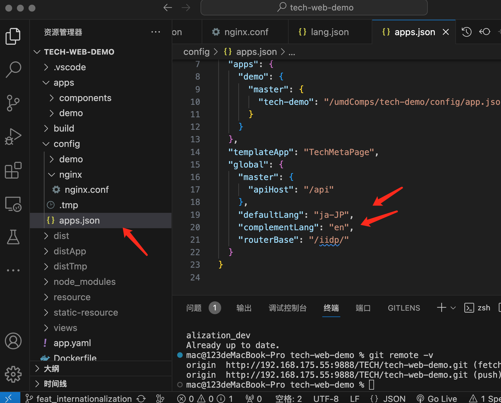
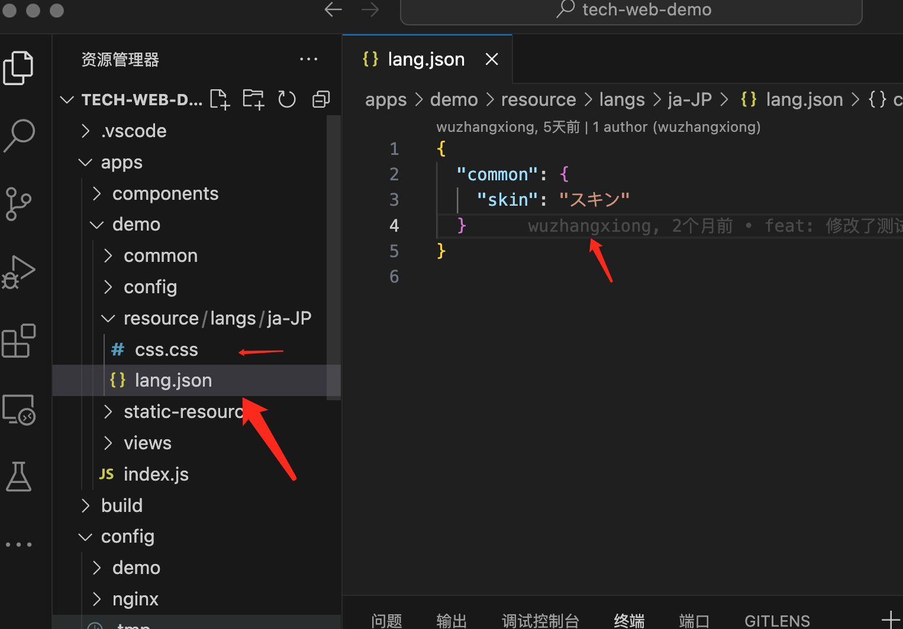
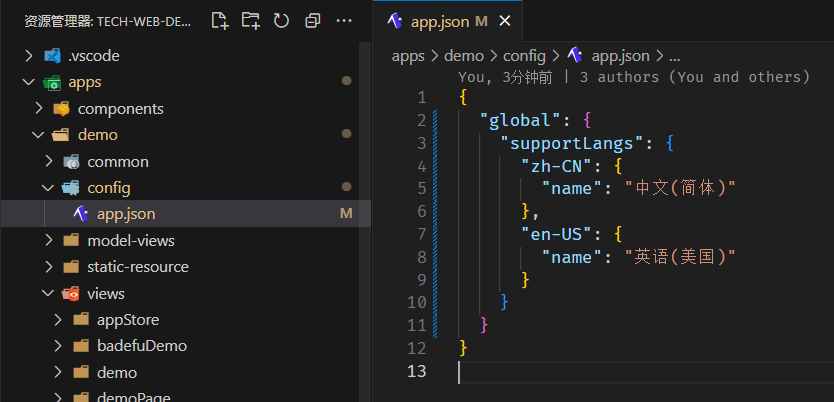
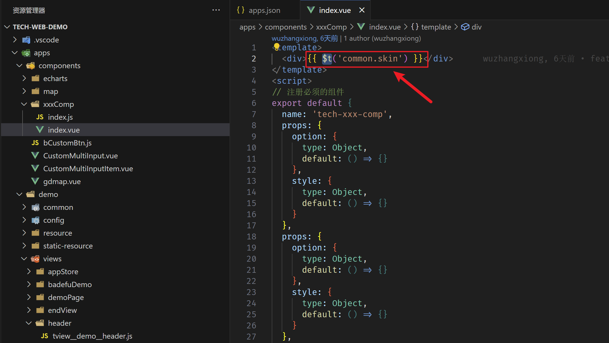
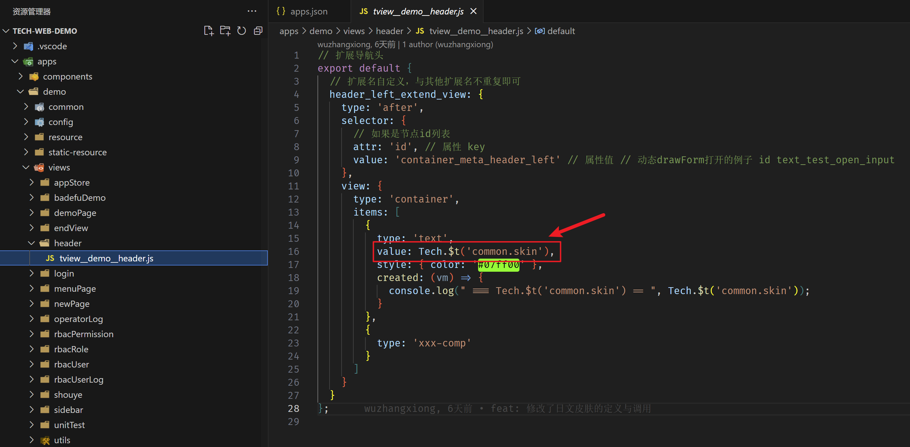

## 配置步骤

1. 在工程 apps.json 配置默认语言（defaultLang）和补全语言（complementLang）

- 默认语言：系统默认显示的语言，例如下图配置了`"defaultLang": "ja-JP"`，则默认显示日文
- 补全语言：当在语言包中没有找到对应的值时，则显示补全语言。例如有个单词在语言包中没有对应的日文，又因为配置了`"complementLang": "en-US"`，所以显示英文

注意：补全语言只能配置英文或者中文，不支持其他语言

```json
// apps.json
{
  "self": {
    "master": {
      "demo": "/umdComps/tech-demo/config/app.json"
    }
  },
  "apps": {
    "demo": {
      "master": {
        "tech-demo": "/umdComps/tech-demo/config/app.json"
      }
    }
  },
  "templateApp": "TechMetaPage",
  "global": {
    "master": {
      "apiHost": "/api"
    },
    "defaultLang": "ja-JP", // 默认语言
    "complementLang": "en-US", // 补全语言
    "routerBase": "/iidp/"
  }
}
```




 若作为内置应用（不走应用市场安装），需先在 apps.json 文件内引入组件

```js
{
  ...
  "apps": {
    ...
    "i18nApp": {
      "master": {
        "tech-i18nApp": "http://iidp.chinasie.com:9999/webApps/tech-i18nApp/1.0.0/config/app.json"
      }
    }
  }
}
```

2. 配置扩展语言键值对 在 /apps/xxxApp/resource 里面建对应语言的文件夹 json 和 css 文件， json 是键值对， css 是按需调整的样式文件

目录结构：

```
|—- resource
    |—- langs
        |— ja-JP
            |— lang.json
            |— css.css
|— static-resource
|— ...
```

```json
// lang.json
{
  "common": {
    "skin": "スキン"
  }
}
```




3. 配置当前app所支持的语种。在对应app的config文件夹下的 `app.json` 中配置supportLangs字段，格式如下：

```json
// apps/myApp/config/app.json
{
  "global": {
    "supportLangs": {
      "zh-CN": {
        "name": "中文(简体)"
      },
      "en-US": {
        "name": "英语(美国)"
      }
    }
  }
}
```



## 使用方法

1. 在 vue 文件中的用法： `this.$t('commom.skin')`

```html
<template>
  <div>{{ $t("common.skin") }}</div>
</template>
```

2. 在前端视图中的用法： `Tech.$t('common.skin')`

```js
{
    type: 'text',
    value: Tech.$t('common.skin'),
    style: { color: '#07ff00' },
    created: (vm) => {
        console.log(" === Tech.$t('common.skin') == ", Tech.$t('common.skin'));
    }
}
```

3. 在后端视图中的用法： `$t('xxx')`

```js
{
    type: 'grid',
    buttons: [
      {
        action: 'xx',
        label: "$t('header.skin')"
      }
    ]
}
```

注： $t 是手动配置定制的情况，会遍历按常规 key 名翻译。例如 displayName: "名字" 会自动翻译为 displayName: "name"



