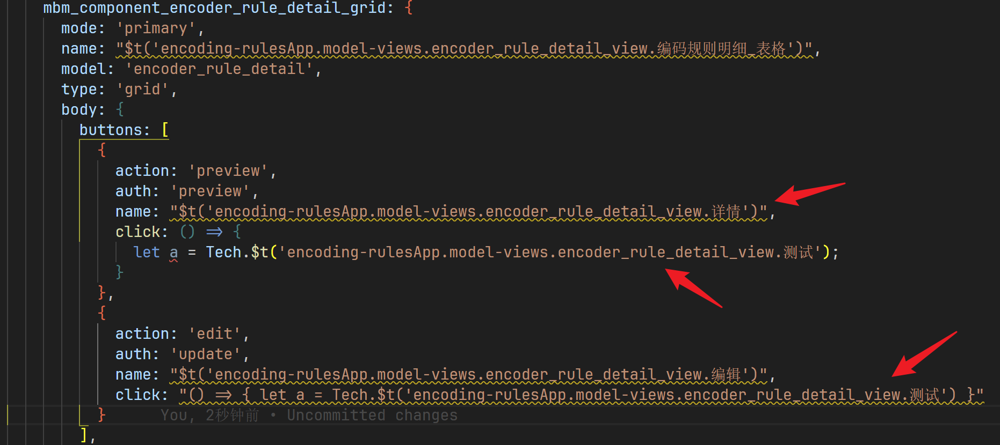
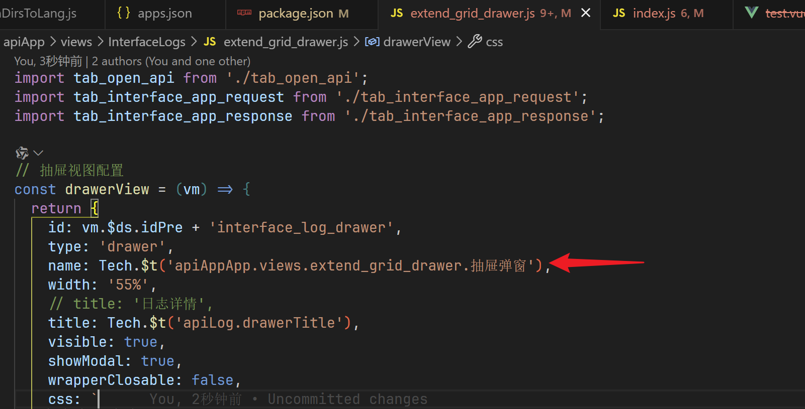
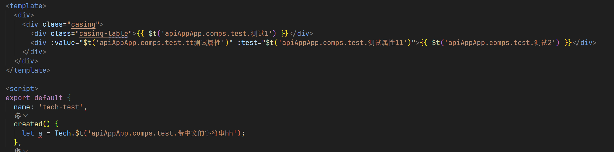

## 自动扫描工程中文

### 目的

如果前端工程之前没有使用国际化，工程中可能存在大量中文。这些中文需要被提取出来，以便后续进行翻译。平台提供了自动扫描工程中文的功能，可以提取出工程中的中文，生成 lang.json 文件。

### 操作步骤

1. 升级 t-build 插件（目前还是测试版，尚未发布正式版）t-build@1.0.26-dev.8
   > npm i @tech/t-core@dev @tech/t-el-ui@dev @tech/t-build@dev @tech/t-base@dev -S --registry http://iidp.chinasie.com:9999/maven/repository/npm-group/
2. 初始化工程
   > 执行 npm run init:tech
3. 启动工程
   > 执行 npm run start
4. 开始扫描
   > 执行 npm run scanLang 开始扫描；如果想按 app 扫描，可以执行 npm run scanLang --app=xxx(app文件名)；默认不扫描 model-views 文件夹，如果想扫描，可以执行 npm run scanLang --modelViews

### 扫描结果

扫描后，model-views 里的视图文件和 Vue 文件中的中文会替换成 $t(app 名称.文件夹名称.文件名称.中文字符串)，其他文件中的中文会替换成 Tech.$t(app 名称.文件夹名称.文件名称.中文字符串)。

1. model-views 文件:
   

2. js 文件:
   

3. vue 文件:
   

### 扫描结果说明

扫描后会在 model-views 文件夹下生成 iidp_auto_lang 文件夹，里面保存了脚本报错日志信息以及每个 app 的 auto_lang_xx.json 文件。auto_lang_xx.json 文件会与对应的 app 文件夹下的 resource/langs/en-US/lang.json 和 resource/langs/zh-CN/lang.json 进行深度合并，lang.json 文件优先级更高。

auto_lang_xx.json 文件保存了扫描结果，格式如下：

```js

{
    "demoApp": { // app 名称 + 'App'
        "views": { // 文件夹名称
            "demo": { // 文件名称
                "抽屉弹窗": "抽屉弹窗" // 中文字符串
                ...
            }
        },
        "model-views": {
            "encoder_rule_detail_view": {
                "编码段": "编码段"
                ...
            },
            "encoder_rule_view": {
                "编码规则-表单": "编码规则-表单"
                ...
            }
        },
        ...
    },
    ...
}
```
