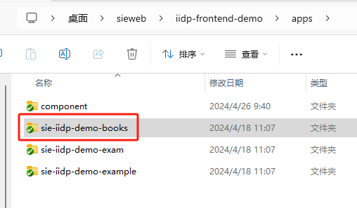

# 2.2、工程扩展应用说明


## 创建扩展应用目录

1. 拷贝一份/apps/demo目录，命名修改为 myApp


2. 修改/apps/myApp/index.js文件里面关键字
```js
export const name = 'tech-demo';
// 修改为：
export const name = 'tech-sie-iidp-demo-books';

/**${"name":"demo"}$**/
// 修改为：（需要跟文件夹名字一致,包括大小写）
/**${"name":"sie-iidp-demo-books"}$**/     

/*-*${"compName":"tech-demo"}$*-*/
// 修改为：（需要跟文件夹名字一致,包括大小写）
/*-*${"compName":"tech-sie-iidp-demo-books"}$*-*/
```

```js
// 总体代码
import { mergeExtend } from '@tech/t-core/RuntimeIndex/build.RuntimeIndex.umd.js';
import extendConfig from './extend/extend.js';
import commonConfig from './common/index.js';
import config from './config/app.json';

// 参数组件名不能删除
export const name = 'tech-sie-iidp-demo-books';

export const getParams = () => {
  // 本地公共扩展 与 本地个性化扩展 合并
  let distOptions = mergeExtend(commonConfig, extendConfig); // test mock
  distOptions.global = config?.global || undefined; // 赋值应用配置
  return distOptions;
};


// 模块名注释不能删除 对应 config/apps.json apps下一级节点名
// eslint-disable-next-line spaced-comment
/**${"name":"sie-iidp-demo-books"}$**/
// 参数组件名注释不能删除 对应当前文件的 export name 与 config/apps.json 节点链接名
// eslint-disable-next-line spaced-comment
/*-*${"compName":"tech-sie-iidp-demo-books"}$*-*/
```

4. 修改/config/apps.json 配置文件
```js
{
	"self": { // 自身扩展工程./apps 下的扩展
		"master": { // 区分环境变量 master：生产环境  grey：灰度环境  test: 测试环境  dev：开发环境
            "sie-iidp-demo-books": "/umdComps/tech-sie-iidp-demo-books/config/app.json", 
            "sie-iidp-demo-exam": "/umdComps/tech-sie-iidp-demo-exam/config/app.json",
            "sie-iidp-demo-example": "/umdComps/tech-sie-iidp-demo-example/config/app.json"
      ... 可以配置多个
		}
	},
	"apps": { // 扩展应用 遇到同名会在当前工程获取，其他在url连接上获取
      "sie-iidp-demo-books": {// 扩展应用模块名
         "master": {
            // 扩展应用组件名,如果没有远程扩展，写本地的扩展，与上面self的配置一致
            "tech-sie-iidp-demo-books": "/umdComps/tech-sie-iidp-demo-books/config/app.json"
         }
      },
      "sie-iidp-demo-exam": {
         "master": {
            "tech-sie-iidp-demo-exam": "/umdComps/tech-sie-iidp-demo-exam/config/app.json"
         }
      }
    ... 可以配置多个
	},
	"templateApp": "TechMetaPage", // 固定元模型模板应用 不用修改
	"global": { // 全局变量 挂载到 window.tech 全局变量下
		"master": { // 区分环境变量 master：生产环境  grey：灰度环境  test: 测试环境  dev：开发环境
			"apiHost": "/api" // 调用：window.tech.apiHost
		},
		"routerdemo": "/iidp/" // 调用：window.tech.routerdemo
	}
}
```
