# 工程运行


## 配置开发环境
./build/webpack.dev.js
```js
// webpack 工程开发环境 配置
const { merge } = require('webpack-merge');
const common = require('./webpack.common');
const devMerge = require('@tech/t-build/BuildWebpack/webpack.dev.merge.js');
const mergeCommon = merge(common, devMerge);

module.exports = merge(mergeCommon, {
    devServer: {
        port: '8085', // 本地启动端口
        proxy: {
            '/fileSystem': {
                target: 'http://iidp.chinasie.com:9999/fileSystem/', // 配置文件服务器ip与端口
                pathRewrite: { '^/fileSystem': '' }
            },
            '/api': {
                target: 'http://127.0.0.1:8060', // 配置接口服务器ip与端口
                pathRewrite: { '^/api': '' }
            },
            '/register': {
                target: 'http://192.168.168.176:8080/', // 本地开发时改为类似 http://192.168.168.9:8085/, 不需要api
                pathRewrite: { '^/register': '' }
            }
        }
    }
});

```


## 安装命令

1. 初始化依赖：
```sh
npm run init:tech
```
2. 安装依赖：
```sh
npm run install:tech
```
3. 更新依赖： （当依赖的组件库发布了新版本，需要更新）
```sh
npm run update:tech
```


## 启动命令

1. 本地开发启动 所有外部依赖app根据 apps.json配置从外部运行时获取
```sh
npm start
# 打开页面后面如果开发环境卡 可以按 ctrl+r 快捷键 强制刷新页面  如果想用回浏览器默认刷新点击浏览器左上角的刷新按钮
```
2. 本地开发启动 提前把外部依赖app下载到本地再启动
```sh
npm run start:local
```
3. 本地开发启动 通过api接口 拿外部依赖apps
>> market参数为连接的应用市场前端资源路径 默认以本地开发app优先，再合并线上app开发 (对应t-base 2.4或以上版本)
```sh
npm run start:base --market=http://xx.xx.com:31815/iidp
```

>> app=onlyMarketApp 只加载应用市场应用 则不合并本地工程开发的app (对应t-base 2.4或以上版本)
```sh
npm run start:base --market=http://xx.xx.com:31815/iidp --app=onlyMarketApp
```

需要配置临时后端api域名
```js
// 浏览器按F12 在console控制台输入 则可临时切换连接的后端
// 配置后需要刷新页面，关闭浏览器tab则会自动失效  设置的ip/域名与端口按
sessionStorage.setItem('tempApi', 'http://localhost:8060')
// 如果是前端域名后面跟/api
sessionStorage.setItem('tempApi', 'http://test.snest.com:31815/api');
```
配置好后刷新页面，url会自动带上frontHost配置，frontHost为获取前端app资源域名前缀
(可按需修改为其他域名那其他服务器上的前端app资源)
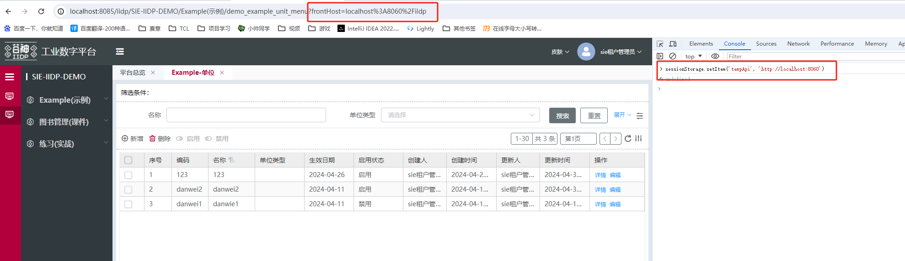

<!-- #### 配置应用市场拉下来的app数据，方便调试万一遇到功能问题是哪个app影响的

(1).寻找search接口：
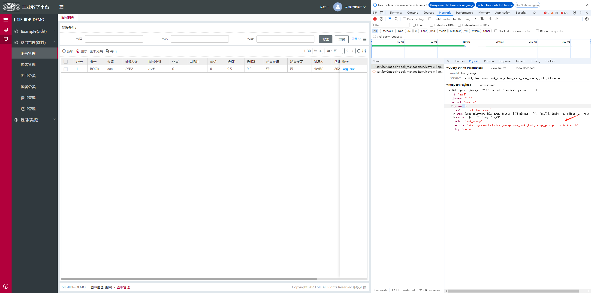
(2).复制search接口返回data数组：
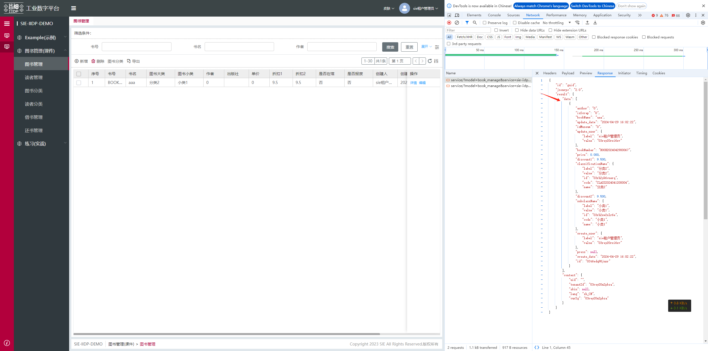
(3).设置mockApps数组空数据：
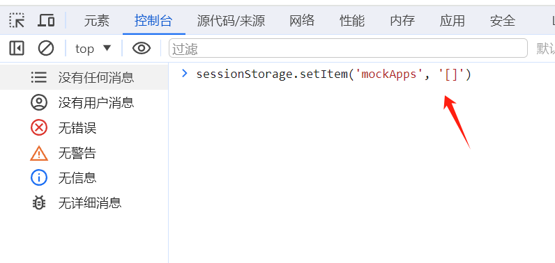
(4).编辑mockApps数组空数据：（把prepareListApps接口返回的）
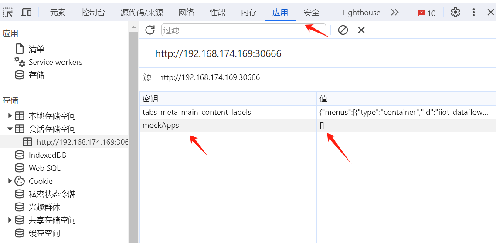 -->


### 查看工程的插件版本
如果发现本地页面和线上页面有差异的时候，在浏览器调试器中打印techPluginsVersion，可以看到依赖的版本，对比一下本地的是不是一致
浏览器控制台输入techPluginsVersion回车
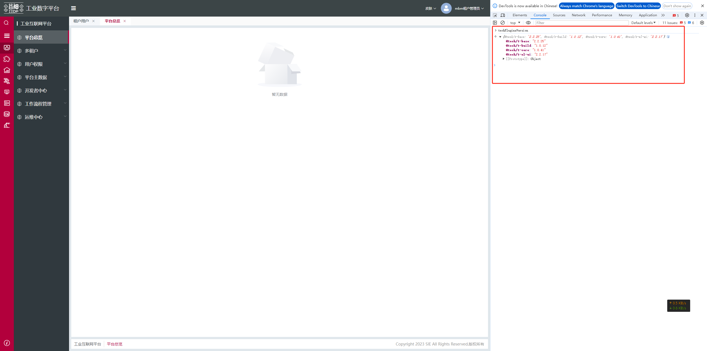


### 配置工程的环境变量
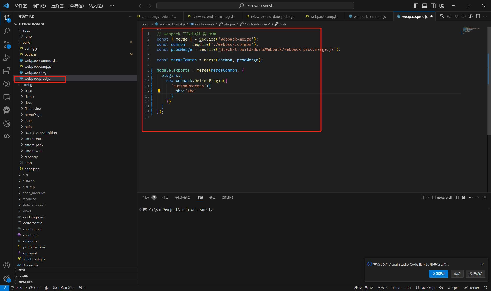
customProcess.bbb，customProcess这个变量只有在编译的时候有用


### 前端项目本地排查线上 app 包冲突指南  

本文档用于指导如何在前端本地环境中排查线上 App 包冲突问题，特别是当本地安装包生效而线上不生效时。

------

#### 1. 启动前端项目

通过以下指令启动前端项目，项目会通过 API 接口获取外部依赖的 App 列表：

```shell
npm run start:base
```

------

#### 2. 配置临时后端 API 域名

在浏览器控制台（按 `F12` 打开）中输入以下代码，临时切换后端 API 域名。


```javascript
sessionStorage.setItem('tempApi', 'http://localhost:8060');

sessionStorage.setItem('tempApi', 'http://test.snest.com:31815/api');
```

配置完成后需 `刷新页面`，关闭浏览器标签页后配置会自动失效。

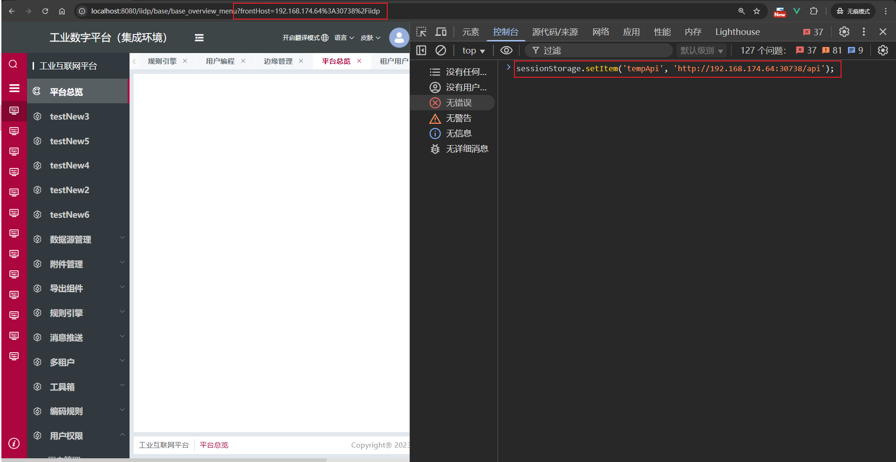

- **`frontHost`**：获取前端 App 资源的域名前缀，可按需修改为其他域名以获取不同服务器上的前端 App 资源。
- 配置成功后，刷新页面，地址栏 URL 会自动带上 `frontHost` 配置。

------

#### 3. 配置成功后，刷新页面查看 `prepareListApps` 接口的返回

刷新页面后，查看 `prepareListApps` 接口的返回内容，重点关注 `data` 数组。

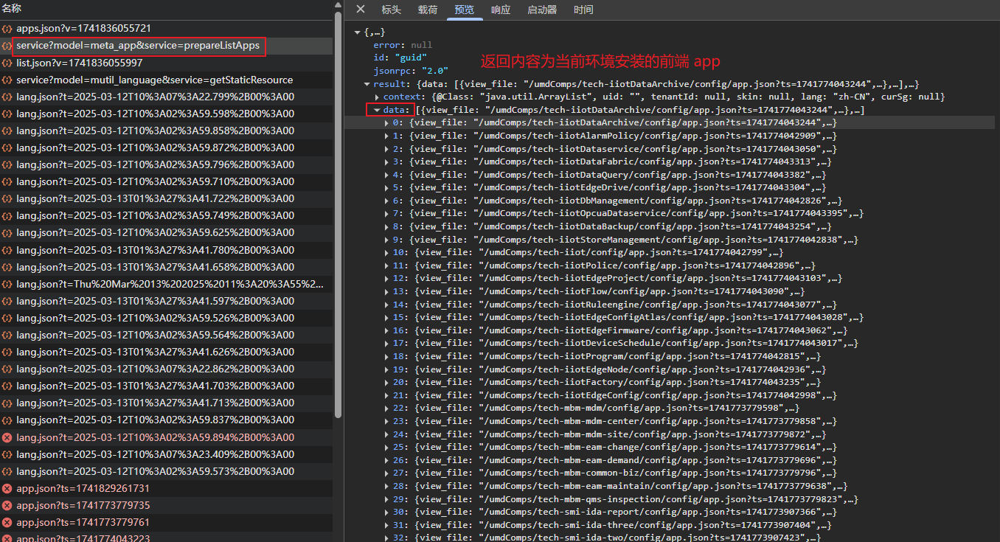

------

#### 4. 复制 `prepareListApps` 接口的 `data` 数组

将 `prepareListApps` 接口返回的 `data` 数组复制出来，用于后续操作。


------

#### 5. 初始化 `mockApps` 数组

在浏览器控制台输入以下代码，初始化 `mockApps` 数组为空：

```shell
sessionStorage.setItem('mockApps', '[]');
```

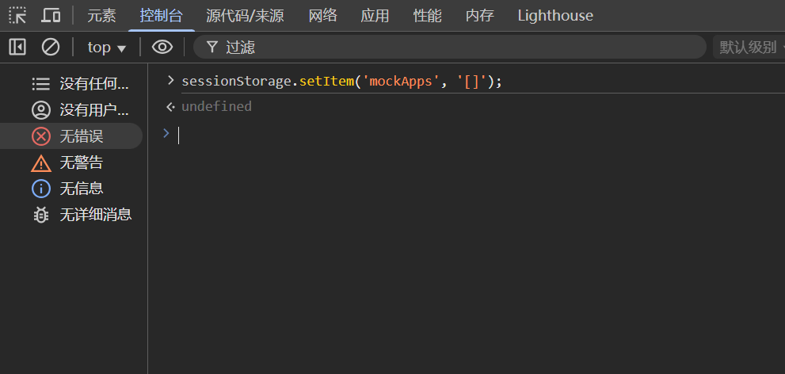


或者通过以下路径手动设置：

- 打开浏览器开发者工具（`F12`）。
- 进入 **应用（Application）** →  **会话存储空间（Session Storage）**。
- 新建一个键值对，键为 `mockApps`，值为 `[]`。


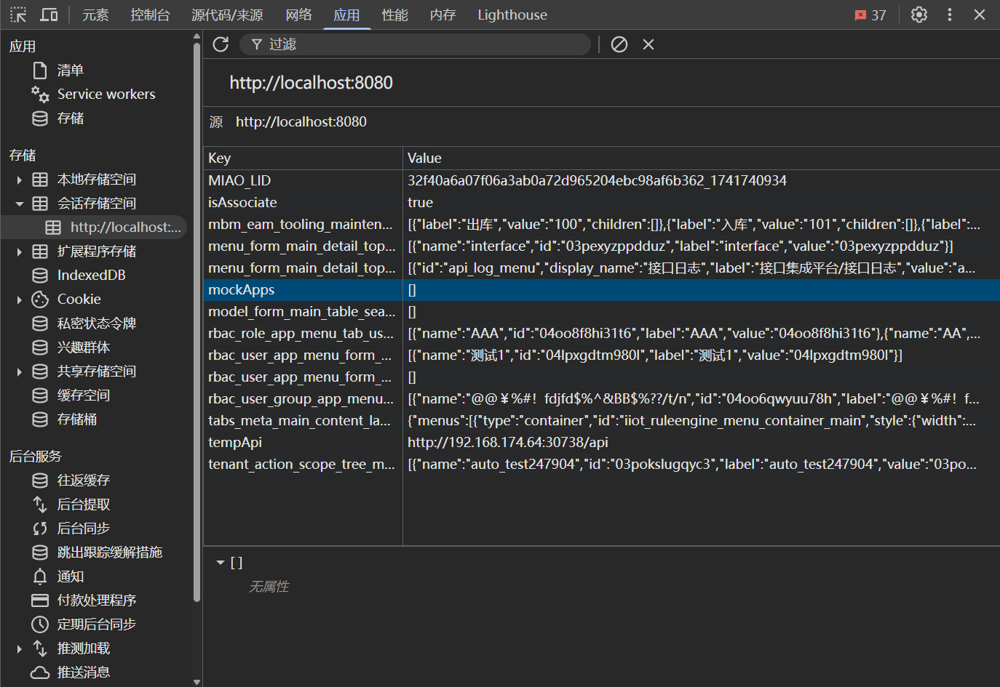

------

#### 6. 将接口数据赋值给 `mockApps` 数组

将步骤 4 中复制的 `data` 数组赋值给 `mockApps`

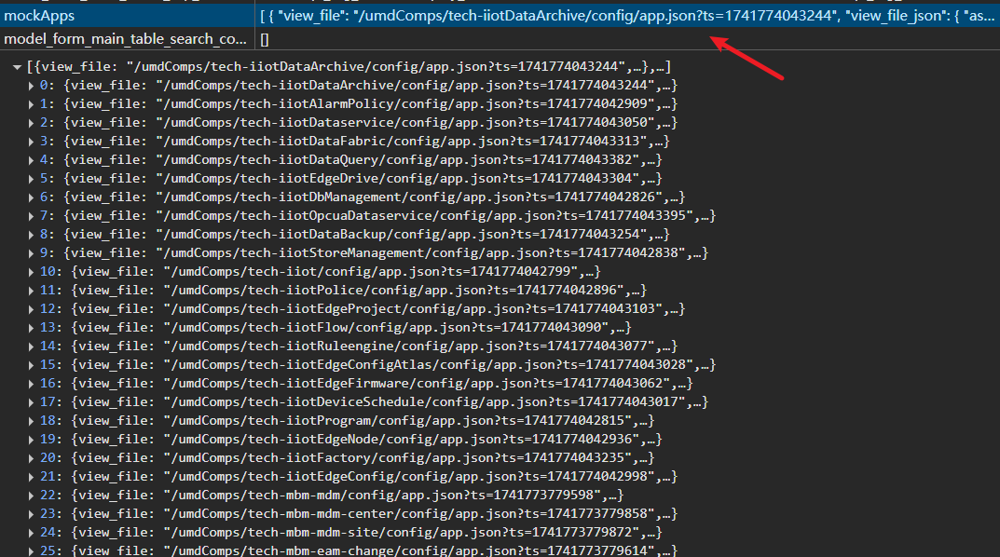

------

#### 7. 刷新页面，即可模拟线上 App 环境

刷新页面后，`mockApps` 中的 App 会与本地 `app.json` 中的 App 合并：

- **同名 App**：优先使用本地的 App。
- **需要使用线上的 App**：需在前端项目的 `config/app.json` 文件中，移除相关 App 的引入。

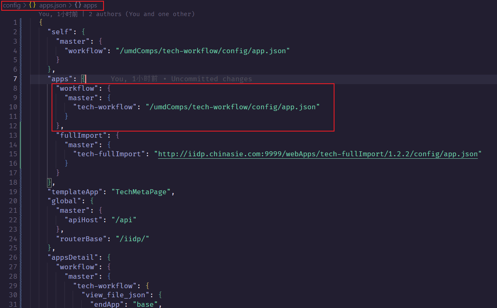

------

#### 8. 逐步排查冲突 App

通过修改 `mockApps` 数组中的数据（二分法），逐步排查出影响功能的 App 具体是哪一个。

------

#### 注意事项

使用 `start:base` 指令启动项目后，会拉取对应环境的 App 资源（接口返回），并与本地的 `app.json` 文件合并。

如果 `sessionStorage` 中存在 `mockApps`，则优先将 `mockApps` 与本地的 `app.json` 合并 （接口返回的不会生效）。

排查完后清除 `sessionStorage` 中的 `mockApps`。


