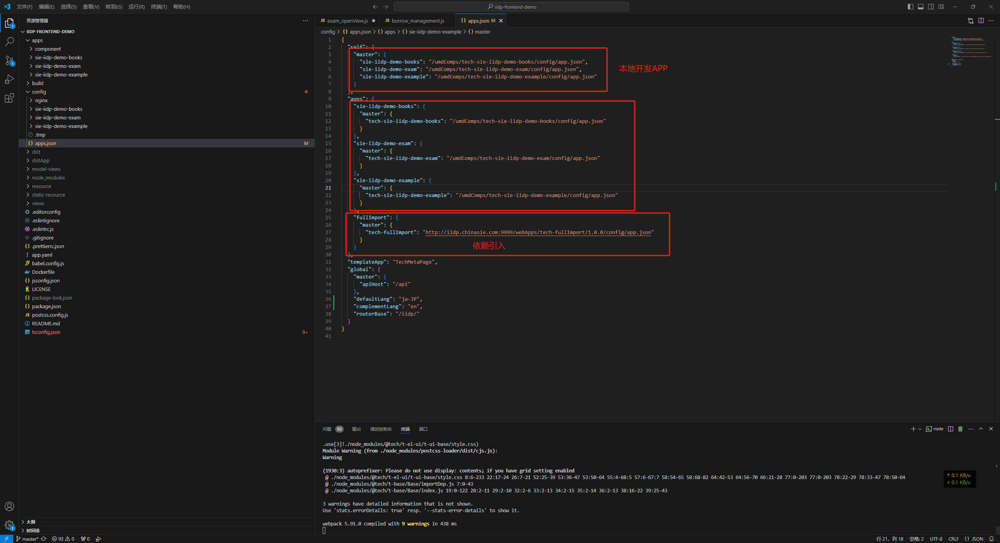

# 工程部署

1. 底座的更新只能通过更新服务器中前端工程。
2. app 的更新可通过`应用市场`更新，可也以通过`服务器`部署更新

## 构建命令

### 不经过应用市场安装

通过手动或流水线等工具部署到线上环境，不经过应用市场安装，可以使用以下命令构建：



1. 本地打工程包,加载所有外部依赖 app,并且打包到./dist 中，根据 apps.json 配置的 apps 配置

```sh
npm run build
```

2. 本地打工程包,加载所有外部依赖 app 和本地开发的 app，并且打包到./dist 中

```sh
npm run build:local
```

3. 本地打工程包,仅对底座进行打包，不打包本地开发的 app 和外部依赖的 app，适用于服务器更新底座时使用

```sh
npm run build:base
```

### 经过应用市场安装

1. 打包外部依赖 app 和本地开发的 app 到`./dist/umdComps`中。适用于通过应用市场上传安装

```sh
npm run build:apps
```

2. 打包本地开发的 app 到`./dist/umdComps`中。适用于通过应用市场上传安装

```sh
npm run build:apps-local
```

3. 先运行 build:base 打包底座（服务器中更新），再运行 build:apps 打包 打到 ./dist 里面

```sh
npm run build:all
```

4. 单独打包某 app （即./apps/xxx 某扩展应用）打到 ./dist/umdComps 里面

```sh
npm run build:comp --module=xxx --comp=tech-xxx
```

## 按环境打包(可选配置)

配置不同 apps.json 入口，构建不同环境的 app

> 工程 config/apps.json 按项目需要 创建 config/apps-test.json 作为测试环境配置 区分环境
>
> **对应 package.json t-build 插件 1.0.5 版本或以上**

1. 本地打工程包 所有外部依赖 app 根据 apps.json 配置从外部运行时获取 打到 ./dist 里面

依赖配置：apps-test.json

```sh
npm run build --entry=apps-test.json
```

2. 本地打工程包 所有外部依赖 app 先下载到本地 运行时从本地的 umdComps 文件夹那依赖 apps 打到 ./dist 里面

依赖配置：apps-test.json

```sh
npm run build:local --entry=apps-test.json
```

3. 本地打工程包 通过 api 接口 拿外部依赖 apps 打到 ./dist 里面

依赖配置：apps-test.json

```sh
npm run build:base --entry=apps-test.json
```

# 部署

#### 单网卡服务器

1. 两台服务器（只要是为了两个 IP 地址，以隔离浏览器渲染进程）
2. 主服务器部署静态资源和 nginx，辅服务器只部署 nginx 服务，并代理到主服务器
3. 配置/config/apps.json，增加 TABIFRAME 属性配置
4. 增加或删除 TABIFRAME 属性，可以直接控制 tab 页的加载方式

#### 主服务器的 nginx 需要增加允许跨域

允许跨域配置

1. 所有的涉及静态资源转发的都需要配置允许跨域

```js
location /resource {
  # 允许跨域
  add_header Access-Control-Allow-Origin *;
  add_header Access-Control-Allow-Methods 'GET, POST, OPTIONS';
  set $curPath "${basePath}resource/";
  alias $curPath;
  index index.html index.htm;
}
```

2. 涉及代理转发的不需要设置跨域

```js
location ^~/api/ {
  proxy_http_version 1.1;
  client_max_body_size 200m;
  proxy_pass http://20.200.5.70:9080/;
}
```

#### 辅服务器的 nginx 配置

```js
server {
	listen  30666;
	server_name  localhost;
	# 转发到主服务器
  location / {
    proxy_http_version 1.1;
    client_max_body_size 200m;
    proxy_pass http://20.200.5.67:30666/;
  }
}
```

#### 开启 tab 页启用 Ifram 的配置

```json
{
  "self": {},
  "apps": {},
  "templateApp": "TechMetaPage",
  "global": {
    "master": {
      "apiHost": "/api"
    },
    "routerBase": "/snest/",
    "TABIFRAME": {
      // 主服务器，网页的访问入口
      "host": "http://20.200.5.65:30667",
      //辅助服务器，tab页对应iframe的入口，只需要部署一个nginx服务，代理到主服务器
      "contentHost": "http://20.200.5.70:30667"
    }
  }
}
```

> 注：为了尽量提升 iframe 的加载速度，需要启用“静态资源懒加载”。
> 影响：tab 页切换效率优化--tab 也独立渲染进程
> 开启 tab 页 Iframe 模式有以下影响

1. 显著提升已打开 tab 页面的切换速度
2. 保证 tab 页面独立性，不会随着 tab 页面增加而降低单个 tab 页面的性能
3. tab 页首次打开速度有所降低
4. 弹窗宽度有所减小，需要加宽
5. 弹窗位置会偏右
6. 内存增加
7. 部署时需要两个 IP 地址（为了隔离浏览器渲染进程）

## 手动部署前端包

### 手动部署 APP 包

将前端 APP 手动部署到服务器环境，无论是应用市场自动部署还是手动部署，部署后的最终结果都是一致的。

1. 获取 APP 前端包的途径：

- 执行 npm run build:apps 打包后得到所有 APP，比如 APP 名称是 demo，所在目录 dist/umdComps/tech-demo，直接压缩对应 APP 目录得到 tech-demo.zip；
- 其他方式直接获取到其他项目的 tech-demo.zip 包。

2. 找到服务器上前端部署的根目录，比如/web
3. 找到服务器上前端 App 的部署目录，比如/web/umdComps/
4. 将 tech-demo.zip 拷贝到/web/umdComps/下，并解压得到/web/umdComps/tech-demo/
5. 找到目录/web/umdComps/tech-demo/static-resource/demo，将 demo 目录完成的剪切到/web/static-resource/demo，如果是应用市场部署这个动作会自动执行
6. 手动部署 app 完成。

## 手动关联 APP 包

如果不是应用市场安装卸载方式部署的 APP 包(比如 npm run build:local)，新增时需要手动关联新增的 APP 包。

1. 找到/web/config/apps.json，手动增加 APP 配置

```json
{
  "self": {
    "master": {
      "demo": "/umdComps/tech-demo/config/app.json"
    }
  },
  "apps": {
    "demo": {
      "master": {
        "tech-demo": "/umdComps/tech-demo/config/app.json"
      }
    }
  }
}
```

## nginx 相关的增项

不论手动还是自动部署的 app，如果新增的 APP 需要有单独的 nginx 配置，目前都需要手动在 nginx 的配置文件里面手动增加配置

## 作为远程应用被引用

A 项目本地开发时，特殊场景下需要手动引用远程 APP

1. 获取远程 APP 的入口文件地址，一般指的是某个 app 应用的配置文件，如 tech-demo/config/app.json
2. 远程 APP 的地址有多种，比如按上面部署好的远程引用地址是：http://域名/umdComps/tech-demo/config/app.json
3. 示例，进入本地开发目录的/config/apps.json 内增加如下配置

```json
{
  "self": {
    "master": {
      "demo": "http://域名/umdComps/tech-demo/config/app.json"
    }
  },
  "apps": {
    "demo": {
      "master": {
        "tech-demo": "http://域名/umdComps/tech-demo/config/app.json"
      }
    }
  }
}
```

4. 远程应用执行大包的时候会自动下载相应资源到本地的打包结果上。
5. 其他获取远程引用的途径，nginx 代理的某个静态资源路径，比如http://iidp.chinasie.com:9999/webApps/tech-filePreview/1.0.0/config/app.json


## K8S相关操作

[K8S前端配置及升级底座](/iidpdoc/file/K8S.zip)

## 关于URL基础路径配置问题

[关于URL基础路径配置问题](/iidpdoc/file/关于URL基础路径配置问题.docx)
