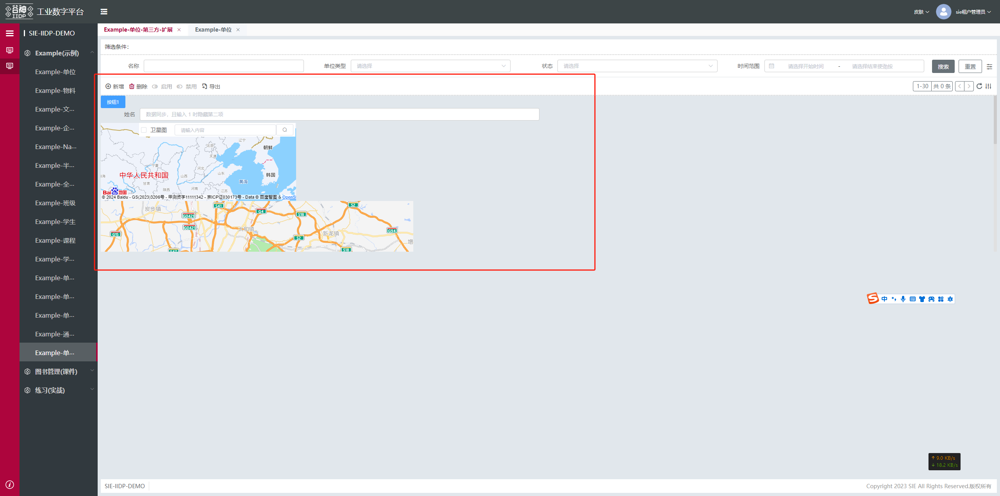

# 第三方库使用

## 兼容性前提（Vue 2.7）

平台标准前端底座与渲染引擎基于 Vue 2.7（Vue2 体系）。因此第三方库接入时需满足：

- 若接入的是 UI 组件库，必须选择支持 Vue 2.x / Vue 2.7 的版本；仅支持 Vue 3 的 UI 组件库不适用。
- 若接入的是功能型库（如 echarts、地图 SDK 等），原则上与 Vue 版本无强依赖，但封装为组件时仍需遵循 Vue 2.x 组件规范与注册方式。

## 支持第三方库的使用，如echarts，百度地图，高德地图等，具体使用步骤如下：
  1.安装插件（建议使用npm安装稳定版）<br>
  2.自定义组件<br>
  3.引入自定义组件<br>
  4.视图配置
## 下面以echarts使用为例
  1.安装echarts插件，通过npm获取echarts
  ```js
  npm install echarts --save
  ```
  2.自定义vue组件，组件name为项目名称简写
  ```js
  // echarts/vue.js
  <template>
  <div>
    <div v-if="show" ref="chartsBox" class="chartsBox" :style="style"></div>
  </div>
</template>
<script>
// 引入 echarts 核心模块，核心模块提供了 echarts 使用必须要的接口。
import * as echarts from 'echarts/core';
// 引入柱状图图表，图表后缀都为 Chart
import { BarChart, PieChart, LineChart } from 'echarts/charts';
// 引入提示框，标题，直角坐标系，数据集，内置数据转换器组件，组件后缀都为 Component
import {
  TitleComponent,
  TooltipComponent,
  GridComponent,
  DatasetComponent,
  TransformComponent,
  LegendComponent,
  ToolboxComponent
} from 'echarts/components';

// 引入dataZoom
import 'echarts/lib/component/dataZoom';

// 标签自动布局、全局过渡动画等特性
import { LabelLayout, UniversalTransition } from 'echarts/features';
// 引入 Canvas 渲染器，注意引入 CanvasRenderer 或者 SVGRenderer 是必须的一步
import { CanvasRenderer } from 'echarts/renderers';
import { GaugeChart } from 'echarts/charts';
echarts.use([
  TitleComponent,
  TooltipComponent,
  GridComponent,
  DatasetComponent,
  TransformComponent,
  BarChart,
  PieChart,
  LineChart,
  LabelLayout,
  ToolboxComponent,
  UniversalTransition,
  CanvasRenderer,
  LegendComponent,
  GaugeChart
]);
// 注册必须的组件
export default {
  name: 'tech-xxx-echarts', // xxx为项目名称简写
  props: {
    option: {
      type: Object,
      default: () => {}
    },
    style: {
      type: Object,
      default: () => {}
    }
  },
  data() {
    return {
      show: true,
      chart: null,
      data: [5, 20, 36, 10, 10, 20, 5, 20, 36, 10, 20, 36, 10, 10, 20, 5, 20, 36, 10]
    };
  },
  watch: {
    option: {
      handler(newValue, oldValue) {
        this.show = false;
        this.$nextTick(() => {
          this.show = true;
          this.$nextTick(() => {
            this.chart = echarts.init(this.$refs.chartsBox);
            if (!newValue.series?.length) {
              let option = {
                title: {
                  text: '暂无数据',
                  x: 'center',
                  y: 'center',
                  textStyle: {
                    fontSize: '14px',
                    fontWeight: 'normal'
                  }
                }
              };
              this.chart.setOption(option);
            } else {
              this.chart.setOption(newValue);
            }

            this.chart.on('click', (params) => {
              // 控制台打印数据的名称
              console.log(params.name);
              this.click(params);
            });
          });
        });
      },
      // 因为option是个对象，而我们对于echarts的配置项，要更改的数据往往不在一级属性里面
      // 所以这里设置了deep:true，vue文档有说明
      deep: true
    }
  },
  mounted() {
    this.chart = echarts.init(this.$refs.chartsBox);

    this.chart.setOption(this.option);
    this.chart.on('click', (params) => {
      // 控制台打印数据的名称
      console.log(params.name);
      this.click(params);
    });
    // 这里模拟后台请求动态变化的数据，每2S改变一次数据
    // setInterval(this.changeOption, 2000);
  },
  methods: {
    click(params) {
      return params;
    },
    changeOption() {
      var r = Math.floor(Math.random() * 12);
      // splice会改变原来的数组
      // var data = this.data.splice(r,6);
      var d = this.data.slice(r, r + 6);
      this.option.series[0].data = d;
    }
  }
};
</script>
<style lang="scss" scoped>
.chartsBox {
  width: 400px;
  height: 200px;
}
</style>

  ```
  ```js
  // echarts/index.js
  import echarts from './index.vue';

echarts.install = (Vue) => {
  Vue.component(echarts.name, echarts);
};

export default echarts;
  ```

## 自定义组件引入，见**[组件引入](/pages/587afe)**


## 扩展示例

```js
export default {
  // 自定义权限-主表单-追加自定义组件(gdmap,echarts)
  demo_example_unit_tripartite_ext_menu_table_main_table_extend_view: {
    selector: {
      // 要扩展的节点
      attr: 'id',
      value: 'demo_example_unit_tripartite_ext_menu_table_main_table' // 自定义权限主表单页面表单节点id
    },
    type: 'replace', // 扩展类型
    view: {
      type: 'container',
      style: {
        height: '400px',
        overflowY: 'scroll'
      },
      dataSource: {
        value1: 3
      },
      items: [
        {
          type: 'button',
          value: '按钮1',
          bind_on_click: (params) => {
            const { self: vm, value } = params;
            vm.$ds.value1 = vm.$ds.value1 * 2;
          }
        },
        {
          type: 'form',
          id: 'test-form',
          dataSource: {
            form: {
              // form表单数据，对应 $ds.form
              name: ''
            }
          },
          formConfig: {
            labelPosition: 'right'
          },
          items: [
            {
              type: 'row',
              items: [
                {
                  type: 'input',
                  text: '姓名',
                  placeholder: '数据同步，且输入 1 时隐藏第二项',
                  name: 'name' // 在form表单内会默认双向绑定表单数据的name属性，form.name
                },
                {
                  type: 'text',
                  bind_display: '${$ds.form.name != 1}', // 当啊name值等于1时，隐藏当前节点
                  value: '同步姓名',
                  bind_value: '$ds.form.name' // 绑定表单数据的name，name值改变后，value值也改变
                }
              ]
            }
          ]
        },
        {
          type: 'map',
          id: 'map_container',
          style: {
            width: '500px',
            height: '200px'
          }
        },
        {
          type: 'gdmap',
          id: 'amap_container',
          style: {
            width: '500px',
            height: '200px'
          }
        },
        {
          type: 'iidp-echarts',
          id: 'custom_echarts_box',
          dataSource: {},
          style: {
            width: '600px',
            height: '400px'
          },
          option: {
            title: {
              text: 'Stacked Line'
            },
            tooltip: {
              trigger: 'axis'
            },
            legend: {
              data: ['Email', 'Union Ads', 'Video Ads', 'Direct', 'Search Engine']
            },
            grid: {
              left: '3%',
              right: '4%',
              bottom: '3%',
              containLabel: true
            },
            toolbox: {
              feature: {
                saveAsImage: {}
              }
            },
            xAxis: {
              type: 'category',
              boundaryGap: false,
              data: ['Mon', 'Tue', 'Wed', 'Thu', 'Fri', 'Sat', 'Sun']
            },
            yAxis: {
              type: 'value'
            },
            series: [
              {
                name: 'Email',
                type: 'line',
                stack: 'Total',
                data: [120, 132, 101, 134, 90, 230, 210]
              },
              {
                name: 'Union Ads',
                type: 'line',
                stack: 'Total',
                data: [220, 182, 191, 234, 290, 330, 310]
              },
              {
                name: 'Video Ads',
                type: 'line',
                stack: 'Total',
                data: [150, 232, 201, 154, 190, 330, 410]
              },
              {
                name: 'Direct',
                type: 'line',
                stack: 'Total',
                data: [320, 332, 301, 334, 390, 330, 320]
              },
              {
                name: 'Search Engine',
                type: 'line',
                stack: 'Total',
                data: [820, 932, 901, 934, 1290, 1330, 1320]
              }
            ]
          }
        }
      ]
    }
  }
};
```

## 最终效果

