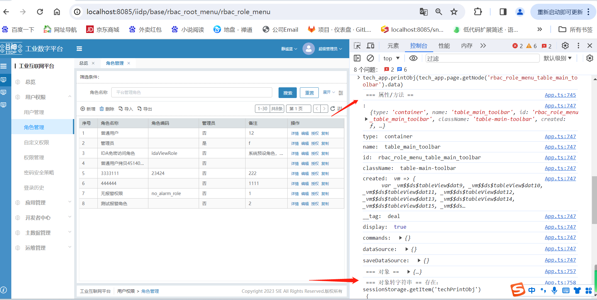

# 框架

概念：视图是由节点**node**组成的，**node**有不同类型，如：app，page，container，或者各类组件

## 节点

```js
{
	type: 'container',//节点类型，相当于组件的名字
	items: [//子节点
		{
			type: 'text',
			value: 'xx文本'//text组件的属性
		}
	]
}
```

## 节点属性

```js
{
	type: 'container',
	id: 'container01_1',
	style: { // 当前节点的样式，会追加到DOM的style中，所有组件都有此属性
		width: '300px',
		height: '300px',
		background: 'green'
	},
	css: '.box1>.text1{color: red;}', // 和普通css样式一样可以写任意样式，注意全局样式污染，所有组件都有此属性
	className: 'box1',//添加样式，所有组件都有此属性
  	ayoutStyle: {}, // 若被form嵌套 外面会有一层div 需要写layoutStyle作用到外层上
  	ayoutClassName: {}, // 若被form嵌套 外面会有一层div 需要写layoutClassName作用到外层上
		display: true, //显示节点，true：显示，false：隐藏，利用控制dom是否渲染来控制节点的显示或隐藏
	items: [ // 子级节点
		{
			type: 'text',
			value: '文本BOX1',
			style: {
				display: 'block',
				margin: '30px auto'
			},
			className: 'text1' // 样式名称，可以使用页面已有任何样式
		}
	],
	created: (vm) => {
		// 节点创建时触发
		// vm 当前节点的上下文，详见下文
	},
	mounted: (vm) => {
		// 节点渲染完成时触发
	},
	destroy: (vm) => {
		// 节点销毁时触发
	},
	dataSource: {} // 数据源获取的数据将缓存在dataSource中
	ds_config: {} // 数据源（获取数据的接口）配置，详细见数据源配置
}
```

## 节点实例 vm

1. 页面渲染后，视图内的每个节点都有自己的实例（vm）
2. 节点实例有以下获取途径

### 获取途径

节点的生命周期参数，如 created

```js
{
	created: (vm) => {
		// 节点创建时触发
		// vm 当前节点的节点实例
	},
	mounted: (vm) => {
		// 节点渲染完成时触发
		// vm 当前节点的节点实例
	},
	beforeDestroy: (vm) => {
		// 节点销毁前触发
		// vm 当前节点的节点实例
	},
	destroy: (vm) => {
		// 节点销毁时触发
		// vm 当前节点的节点实例
	},
}
```

事件绑定时传参

```js
{
  bind_on_xxx: (params) => {
    //xxx为事件名字
    //let {self:vm} = params 当前所在节点的实例
  };
}
```

其他途径可参考具体的能力 如事件绑定等

### vm 的属性

```js
{
  app; // 整个app的所有信息
  pages; // 所有页面集合
  page; // 当前渲染的页面
  data; // 当前节点的信息
  parent; // 父节点
  children; // 子节点
  instance; // vue组件实例, 可以对vue组件进行操作，如新增修改方法，取dom绑定事件，添加监听等
}
```

#### vm 的方法

```js
// 根据id获取全局任意节点
vm.page.getNode("nodeId");

// 设置打开页面
vm.app.openPage(id | vm); // page的id或者page的vm

// 局部更新视图
// 例如在parentNode节点items下放一个新加的node节点
let node = {type: 'container'} // 新加的节点
let parentNode = tech_app.page.getNode('xxxx') // 要挂载的节点
vm.app.updatePageNode(node, parentNode, () => {
	parentNode.data.items.push(node)
});

// 动态添加弹窗视图, 详情请看 commands内置方法
vm.$cmd.meta.popupView(vm, view, vm.$ds.idPre);
```

## 页面与节点

### App 和 page

视图根节点的 `type` 为 `app`，每个视图有且仅有一个 `app` 根节点，其 `items` 下包含一个或多个 `page` 页面节点。

1. 根节点类型 `app`，是整个视图 JSON 的最外层。
2. 页面节点类型 `page`，写在 `app.items` 内。

```js
{
  type: 'app',
  id: 'app_1',
  name: 'demo',
  items: [
    {
      type: 'page',
      id: 'page_1',
      name: 'page1',
      style: { // 样式
        width: '100%',  // 宽度
        height: '100vh'  // 高度
      },
      items: []
    },
    {
      type: 'page',
      id: 'page_2',
      name: 'page2',
      style: {
        width: '100%',
        height: '100vh'
      },
      items: []
    }
  ]
};
```

3.页面节点更新 需要调用 updatePageNode

```js
created: (vm) => {
	let newTextObj = {
		id:'input_myitem',
		type: "input",
		text: "动态item",
		name: "newtext",
	};
	// 若旧视图存在新增的节点 则需要先删除
	vm.app.page.removeNode(newTextObj.id);
	// 把定节点更新到当前节点对应父级下
	vm.app.updatePageNode(newTextObj, vm, () => {
		vm.data.items.push(newTextObj);
	});

	// 当前节点是form表单节点 的赋值操作
	// vm.$ds.form.newtext = "321";
	// 若当前节点是form表单节点 则要进行update
	// vm.instance?.update();
},
```

4.若需要刷新当前节点则运行 refresh()

```js
vm.refresh();
// vm.$('指定节点id').refresh();
```

### 容器和布局

type 字段的值是组件名，以下是特殊节点说明。

- **app**：视图根节点，顶级容器，有且仅有一个，`items` 下包含一个或多个 `page`。
- **page**：页面节点，承载页面内的节点树，写在 `app.items` 下。
- **container**：通用容器/布局节点，用于包裹和组织子节点（items）。

视图完整结构示例（`app > page > container > 具体组件`）：

```js
{
  type: 'app',
  id: 'example_app',
  items: [
    {
      type: 'page',
      id: 'example_page',
      style: { width: '100%', height: '100vh' },
      items: [
        {
          type: 'container',
          id: 'example_container',
          items: [
            // 具体组件节点，如 form / grid / text 等
          ]
        }
      ]
    }
  ]
}
```

```js
{
	type: 'container',  // 容器
	id: 'container01',
	style: { // 样式
		width: '100%',
		height: '100%',
		display: 'flex'
	},
	items: [ // 子级
		{
			type: 'container',
			id: 'container01_1',
			style: {
				width: '300px',
				height: '300px',
				background: 'green'
			},
			items: [
				{
					type: 'text', // 文本框
					value: 'BOX1',
					style: {
						display: 'block',
						margin: '30px auto'
					}
				}
			]
		},
	]
}
```

## 打印节点属性信息

打开控制台，根据节点的 id 通过 tech_app.printObj 方法打印出该节点的所有属性信息，打印出的数据还会自动存进 sessionStorage 的 techPrintObj 里面。

```js
// 第二个参数默认false不打印items，传true则打印items
tech_app.printObj(
  tech_app.page.getNode("rbac_role_menu_table_main_toolbar").data,
  false
);
```



### 节点属性一览表

| 属性 | 类型 | 默认值 | 必填 | 适用节点 | 说明 |
| --- | --- | --- | --- | --- | --- |
| type | string | — | 是 | 所有 | 节点类型（相当于组件名），如 app/page/container/text 等 |
| id | string | — | 是 | 所有 | 节点唯一标识，需全局唯一，便于定位与更新 |
| name | string | — | 否 | app/page/部分组件 | 显示名称或标题，用于页面/应用等命名 |
| style | object | {} | 否 | 所有 | 直接追加到节点 DOM 的 style 上（内联样式） |
| css | string | '' | 否 | 所有 | 写入页面样式，注意作用域与全局污染风险 |
| className | string | '' | 否 | 所有 | 追加到节点 DOM 的 class，用于配合样式选择器 |
| ayoutStyle | object | {} | 否 | 被 form 包裹的节点 | 作用于外层布局容器（form 包裹时的外层 div） |
| ayoutClassName | object | {} | 否 | 被 form 包裹的节点 | 作用于外层布局容器的 class（form 包裹时的外层 div） |
| display | boolean | true | 否 | 所有 | 是否渲染节点（true 渲染，false 不渲染） |
| items | array | [] | 否 | app/page/container | 子节点数组（容器/页面/App 用） |
| created | function(vm) | — | 否 | 所有 | 节点创建时触发，vm 为当前节点实例 |
| mounted | function(vm) | — | 否 | 所有 | 节点渲染完成时触发 |
| beforeDestroy | function(vm) | — | 否 | 所有 | 节点销毁前触发 |
| destroy | function(vm) | — | 否 | 所有 | 节点销毁时触发 |
| dataSource | any | — | 否 | 组件 | 数据源获取后的缓存数据 |
| ds_config | object | {} | 否 | 组件 | 数据源配置（接口与参数等），详见数据源配置 |

说明：组件特有属性（例如 text 组件的 value、input 组件的 text/name 等）不在此通用表内，请参考对应组件文档。
