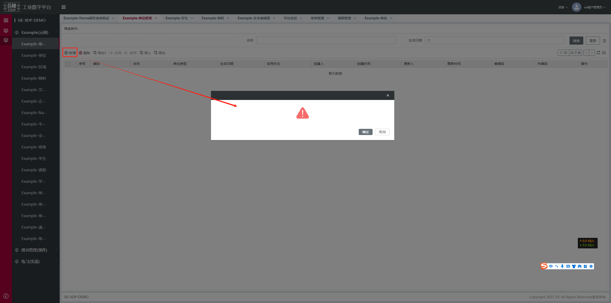
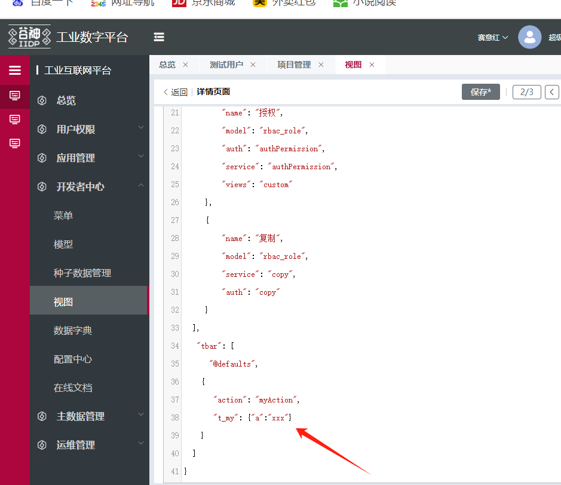
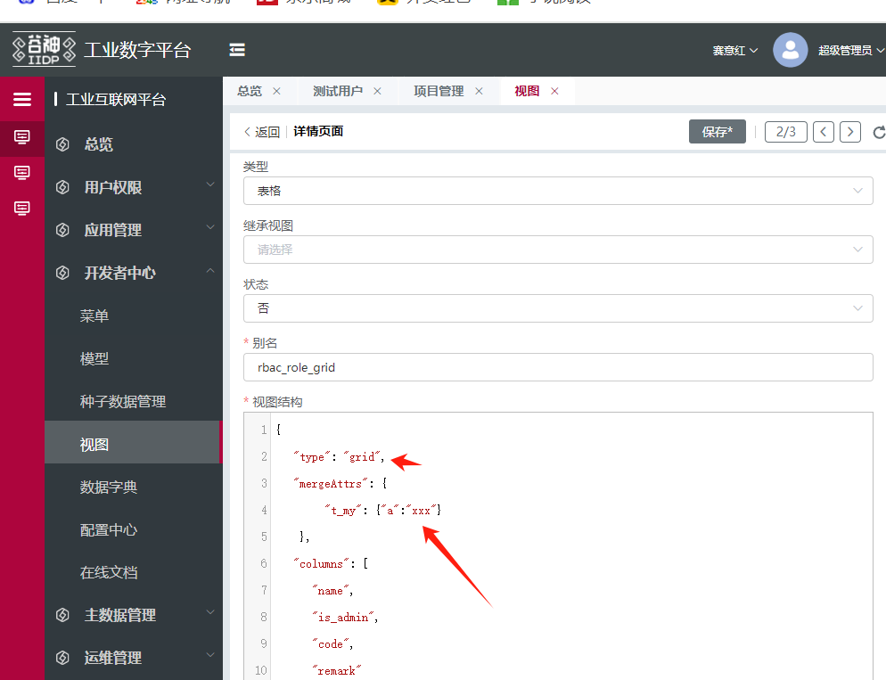

# 自定义指令协议

## 概述

`def_directives` 用于在视图节点上定义自定义指令。指令定义后，可在当前节点及子节点上按指令名调用，实现逻辑的封装与复用。

- `def_directives` 的 key 为指令名（如 `t_my`），value 为指令配置对象
- 指令定义具有继承关系，子节点可直接使用父节点定义的指令，也可重新定义覆盖

## 配置参数

| 参数 | 类型 | 必填 | 说明 |
|------|------|------|------|
| `analyse(vm, config)` | Function | ✅ | 指令解析方法。`vm` 为当前节点上下文，`config` 为调用时传入的配置值 |
| `activeFn(vm)` | Function | ❌ | 激活判断方法，返回 `true` / `false` 决定是否运行该指令。未配置时按指令名命中即运行 |
| `beforeBind` | Boolean | ❌ | 是否在绑定逻辑执行前运行，默认 `false`。开启后可在 `analyse` 中直接修改 `config.bind_xx` 等绑定配置 |
| `statement` | String | ❌ | 指令功能声明。例如配置 `"_print"` 可对应打印功能扩展，未装载对应 app 时按钮默认隐藏 |

## 基础用法

最小可用配置：

```js
{
    type: 'container',
    // 定义指令
    def_directives: {
        t_my: {
            analyse: (vm, config) => {
                // vm.data.display = false // 例：通过修改 display 控制节点显示隐藏
            }
        }
    },
    // 调用指令
    t_my: { a: 'xxx' }
}
```

包含所有可选配置的完整示例：

```js
{
    type: 'container',
    def_directives: {
        t_my: {
            // 激活判断：返回 true 才运行指令（未配置时按指令名命中即运行）
            activeFn: (vm) => {
                // if (vm?.data?.action === '_testAction') return true
                return true
            },
            // 绑定前运行：开启后可在 analyse 中修改 config.bind_xx 等绑定配置
            beforeBind: true,
            // 指令功能声明：配置 "_print" 可关联打印按钮显隐
            statement: '_print',
            analyse: (vm, config) => {
                // 指令逻辑
            }
        }
    },
    t_my: { a: 'xxx' }
}
```

## 指令继承

指令定义具有继承关系。子节点可直接使用祖先节点定义的指令，也可在当前节点重新定义同名指令以覆盖父级。

```js
{
    type: 'container',
    def_directives: {
        t_my: {
            analyse: (vm, config) => {},
        }
    },
    t_my: { a: 'xxx' }, // 调用指令（当前节点）
    items: [
        {
            type: 'container',
            t_my: { a: 'xxx' }, // 调用指令（使用父级定义的指令）
        },
        {
            type: 'container',
            // 重新定义同名指令，覆盖父级
            def_directives: {
                t_my: {
                    analyse: (vm, config) => {},
                }
            },
            t_my: { a: 'xxx' }, // 调用指令（使用当前重新定义的指令）
        }
    ]
}
```

## 实战案例

以下案例封装了 `t_confirm_dialog` 自定义指令，挂载在全局。在按钮点击前弹出确认对话框，确认后才执行原有点击逻辑。

```js
directive_confirm_dialog_extend_extend: {
    type: 'merge', // 在选中节点前面插入视图
    selector: {
        attr: 'id',
        value: 'page_meta_index' // 自定义指令挂载在全局
    },
    beforeOperate: (app, config, options) => {
        config.view = {
            def_directives: {
                t_confirm_dialog: {
                    beforeBind: true, // 绑定逻辑前运行
                    analyse: (vm, config = {}) => {
                        if (!vm._resetBindOnClick) {
                            vm._resetBindOnClick = true;
                            let srcBindOnClick = vm.data.bind_on_click;
                            // 重写点击绑定逻辑
                            vm.data.bind_on_click = (params) => {
                                const dialog = vm.$select(`${vm.$ds.idPre}table_main_pop_dialog`);
                                const dialogText = vm.$select(`${vm.$ds.idPre}table_main_pop_dialog_text`);
                                dialogText.data.value = config.tip || '';
                                dialog.data.confirmText = config.confirmText || '确定';
                                dialog.data.cancelText = config.cancelText || '取消';

                                let resetDialog = () => {
                                    dialog.data.value = '';
                                    dialog.data.confirmText = '确定';
                                    dialog.data.cancelText = '取消';
                                };
                                let confirm = (close) => {
                                    srcBindOnClick(params); // 调用原有点击逻辑
                                    resetDialog();
                                    close();
                                };
                                let cancel = (close, options) => {
                                    resetDialog();
                                    close();
                                };
                                dialog.data.display = true;
                                dialog.data.options.confirm = confirm;
                                dialog.data.options.cancel = cancel;
                                confirm = null;
                                cancel = null;
                            };
                        }
                    }
                }
            }
        };
        return config.view;
    },
    view: {}
}
```

## 在视图节点上使用

### 前端视图节点

通过指令集扩展（`type: 'replace'` 等）将自定义指令属性挂到前端视图节点上：

```js
demo_example_unit_fmk_menu_table_toolbar_create: {
    type: 'replace',
    selector: {
        attr: 'id',
        value: 'demo_example_unit_fmk_menu_table_toolbar_create'
    },
    view: {
        t_confirm_dialog: { a: 'XXX' } // 在目标节点上调用自定义指令
    }
}
```

效果如图：



### 后端视图节点

在 grid 后端视图的 tbar 工具栏按钮上添加自定义指令：



与 `type` 同级的自定义指令需通过 `mergeAttrs` 添加：



---

**[demo 清单](/pages/46d471/#_5、封装自定义指令-挂载在全局)**
