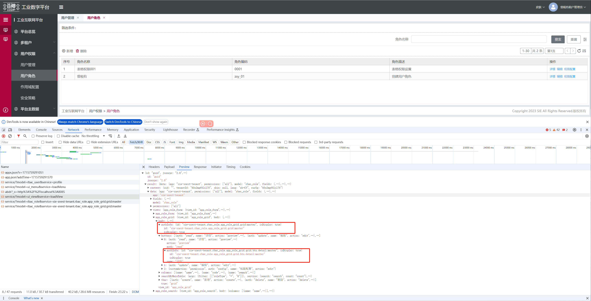
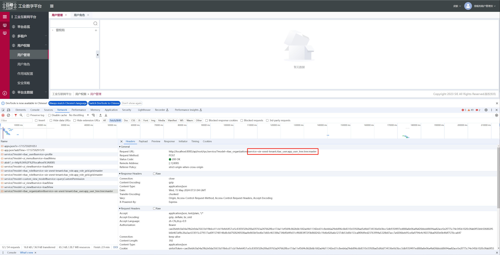
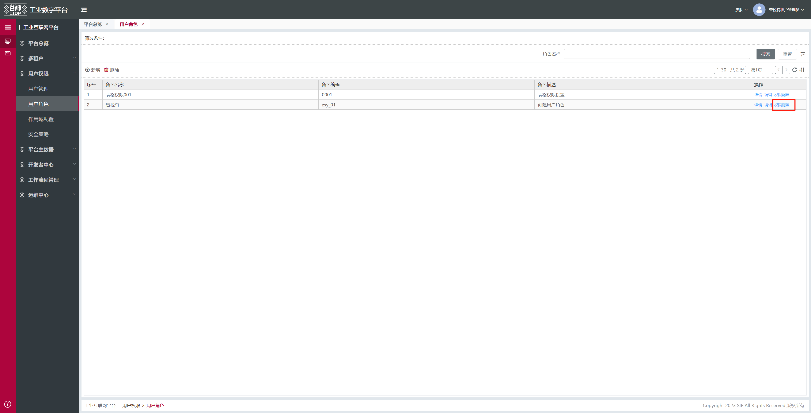
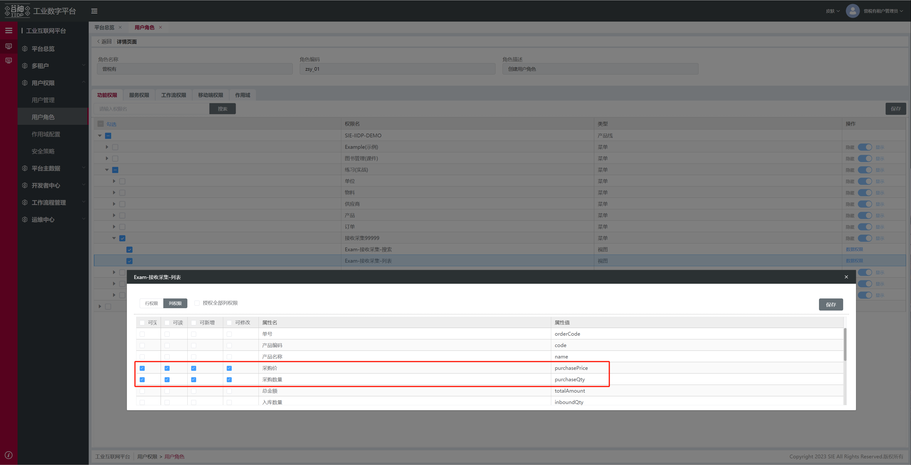
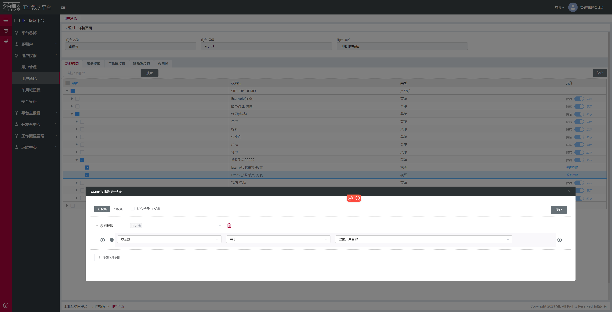
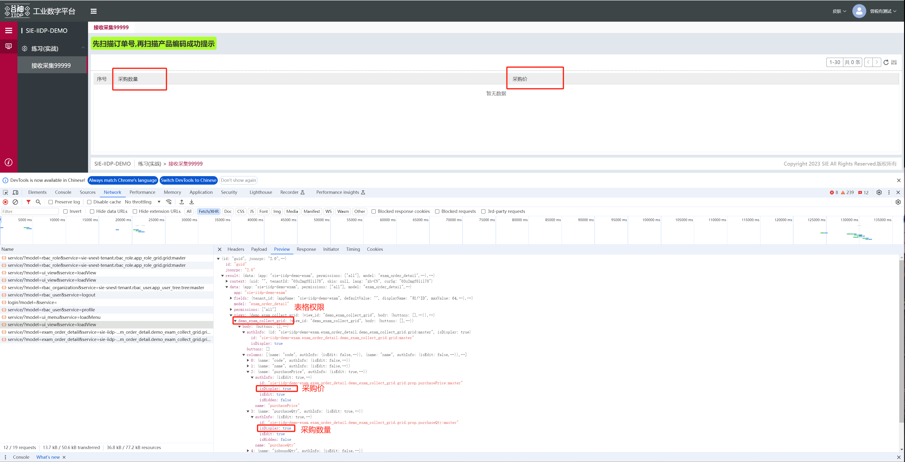

<!--
 * @Author: ZENGsy25 510064377@qq.com
 * @Date: 2024-05-08 15:14:42
 * @LastEditors: ZENGsy25 510064377@qq.com
 * @LastEditTime: 2024-05-15 16:05:04
 * @FilePath: \iidp-docs\docs\03.前端开发手册\06.框架\012.权限系统\01.系统权限.md
 * @Description: 这是默认设置,请设置`customMade`, 打开koroFileHeader查看配置 进行设置: https://github.com/OBKoro1/koro1FileHeader/wiki/%E9%85%8D%E7%BD%AE
-->

---

title: 系统权限
date: 2023-12-15 11:00:44
permalink: /pages/8576e5/

---

# 系统权限

此文介绍系统中前端部分的权限逻辑，方便开发过程中理解其中的流程

1. 前端依赖：
   - @tech/t-base: >2.0.0
   - tech/t-el-ui: >2.0.0
2. 后端：>2.0.0

## 功能权限

1. 控制视图节点是否生成实例（页面中是否显示）

- 系统权限会在`loadview`接口中返回
- 系统权限控制的节点与`loadview`接口返回的视图层级一致，

例如：

1.  权限在 grid 中，侧控制整个 grid 是否生成实例
2.  权限在 tbar 的按钮上，侧控制工具栏中按钮是否生成实例
    

3.  控制请求
    权限会体现在接口的 service 中
    

## 数据权限

1. 列权限，数据每行的控制，表格中某一列的数据是否显示
   
   
2. 行权限，数据字段的控制，表格中某一行数据是否显示
   
3. 配置完成后需要对用户和角色进行绑定，请参照：开发手册/平台能力/平台功能/用户权限，进行相关角色配置
4. `loadview`接口中的体现
   
