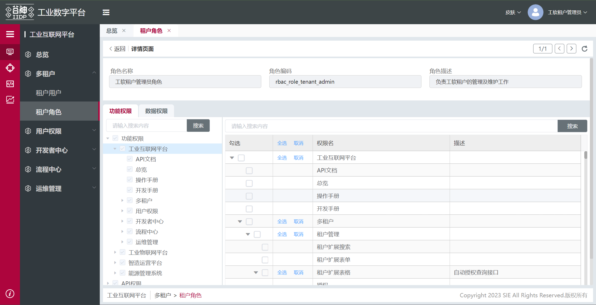

# 自定义权限

## 使用条件

1. 前端依赖：
   - @tech/t-base: >2.0.0
   - @tech/t-el-ui: >2.0.0
2. 后端：
   - 引擎 >v2.0.0.RELEASE
   - 多租户 APP ：sie-snest-tenant-v2.0.0.RELEASE.jar

## 使用范围

扩展文件内的视图、节点的功能权限的控制

- 功能权限包含控件是否显示、接口权限
- 数据权限暂时无法控制

## 配置自定义权限

- 在 `/config` 文件夹中新建一个 `auth.json` 的文件
- 在 `auth.json` 文件内填写自定义权限配置
- 在扩展文件中，需要使用权限的节点使用 `c_p` 指令控制节点的是否显示
- 调用接口时，在`dataSource`中设置权限 ID `tech_authId`字段

> c_p 指令:用于解析权限的命令，控制是否生成该节点

::: tip 提示
1、更新到最新版@tech/t-build 后支持编译时按 app 扫描扩展文件（根据 c_p 指令）生成 auto_auth.json 文件，如果有 auth.json 则要跟 auth.json 文件做合并，合并时 auth.json 文件优先级更高 <br />
2、自定义页面的元素显示隐藏在自定义权限勾选，自定义接口在服务权限全局勾选
:::

## auth.json 文件示例

1.配置 auth.json

```json
{
  "app": "base", //当前的app应用
  "tag": "master",
  "type": "ViewExt", //ViewExt:pc的扩展，AppView：移动端的扩展
  "authPoints": {
    //权限配置传列表
    "authA": {
      //自定义权限点名称，必须全局唯一
      "menuId": "quality_rule_menu", //菜单数据的name属性。非必填
      "apis": [
        //可能调用的接口api相关信息
        {
          "appTag": "master", //接口中的tag
          "appName": "base", //当前的产品线（app）
          "model": "rbac_user", //接口的model
          "service": "search" //接口的service
        },
        {
          "appTag": "master", //接口中的tag
          "appName": "base", //当前的产品线（app）
          "model": "rbac_user", //接口的model
          "service": "count" //接口的service
        }
      ],
      "name": "测试", //权限名字，在权限列表中体现
      "authPoints": {
        //子级权限点，可以继续嵌套
        "authBB": {
          "apis": [
            {
              "appTag": "master",
              "appName": "base",
              "model": "rbac_role",
              "service": "search"
            }
          ],
          "name": "按钮"
        }
      }
    }
  }
}
```

| 字段       | 值                                       |
| ---------- | ---------------------------------------- |
| app        | 当前控件所在的 app                       |
| tag        | 当前控件所在的 app 标签                  |
| name       | 权限的名称，功能权限列表中显示           |
| type       | ViewExt:pc 的扩展，AppView：移动端的扩展 |
| menuId     | 可选，菜单数据的 name 属性               |
| authPoints | 权限配置表                               |
| apis       | 接口权限列表                             |
| appTag     | 接口的 app 标签                          |
| appName    | 接口的 app                               |
| model      | 接口的 model                             |
| service    | 接口的 service                           |

配置完成后，权限列表在角色管理-详情页面-功能权限树中体现


2.扩展文件内使用

扩展一个按钮，被自定义权限控制

- 控制是否生成节点实例
- 控制接口是否可用

```js
tech_limit_table_toolbar_undefined_2_extend_view: {
  type: 'after',
  selector: {
    attr: 'id',
    value: 'meta_app_store_menu_table_toolbar_delete'
  },
  beforeOperate: (app, operateItem, options) => {
    return operateItem.view;
  },
  view: {
    type: 'button',
    id: 'refresh_stabilize_count_dialog ',
    value: '测试',
    c_p: 'custom_function.authA',  // 权限控制节点是否生成 **** c_p指令需要在前面加custom_function.的前缀 ****
    // items: [{
    //   type: 'container',
    //   c_p: 'custom_function.authA.authB' // **** 子级的c_p指令需要拼接父级的指令 ****
    // }],
    ds_config: {
      list: [
        // 定义一个名字为‘getCustomPermission’的接口
        {
          name: 'getCustomPermission', // 方便类似buttons 调用其他服务
          type: 'meta',
          method: 'service',
          autoRequest: false,
          options: {}
        }
      ]
    },
    bind_on_click: async (param) => {
      const { self: vm } = param;
      const customPermissionNode = vm.$select(vm.$ds.idPre + 'container_main');
      // 把权限设置到当前节点中
      vm.$ds.tech_authId = customPermissionNode.$ds.customPermissionApi.authA;     //调用接口前，设置权限id
      const params = {
        model: 'rbac_user',
        service: 'search',
        app: 'base',
        args: {
         //接口参数
        }
      };
      const res = await vm.request('getCustomPermission', params);
    }
  }
}

```
