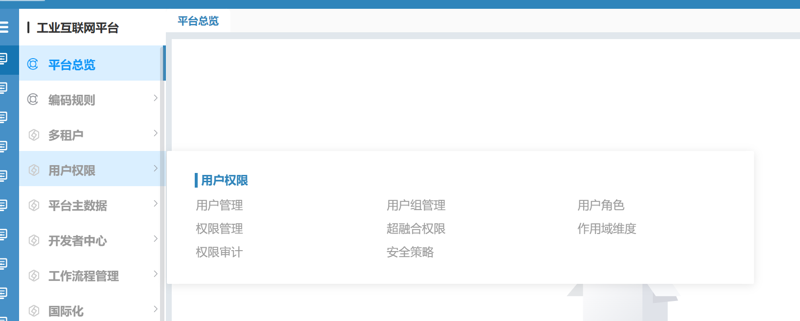
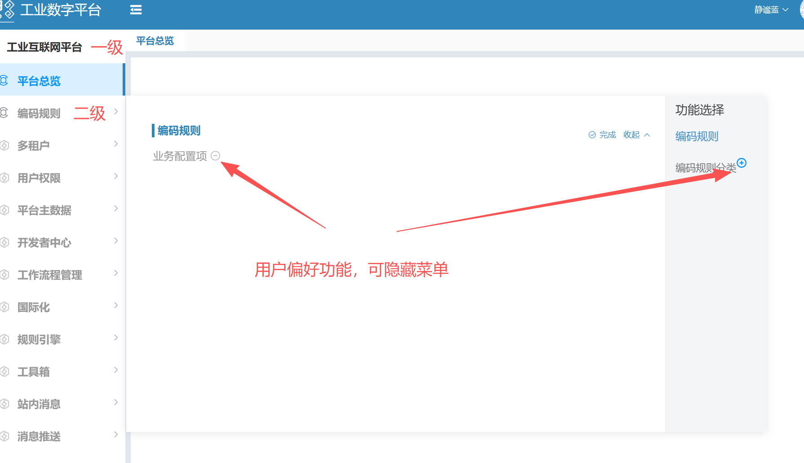
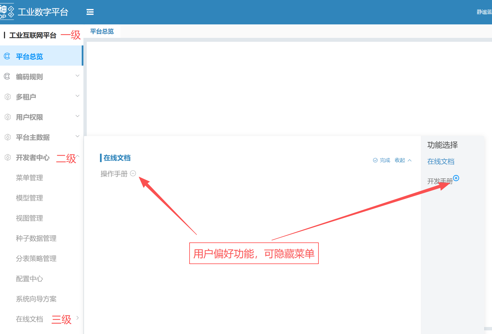
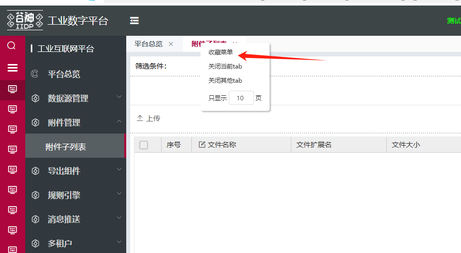
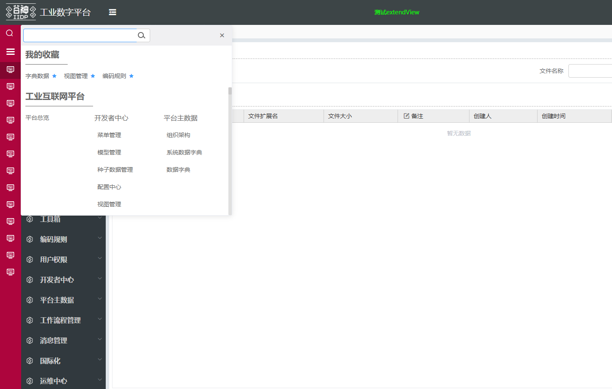
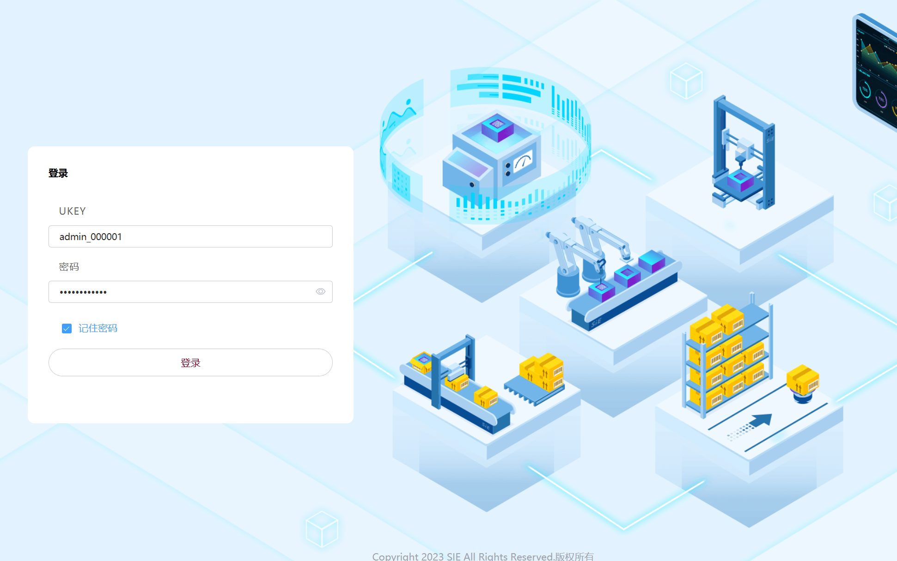

# 系统级变量

在 apps.json 文件中配置的变量，整个系统中生效

## 浏览器标题全局配置

- 登录页默认显示 IIDP
- 登录后显示打开菜单对应的产品线名称
- 配置 globalTitle 后全局生效，展示配置的标题名称

```js
{
    "globalTitle": "全局标题示例"
}
```

## 登录跳转指定菜单

- 登录后默认打开第一个产品线第一个菜单
- defaultMenu 登录后跳转的指定菜单

```js
{
    "defaultMenu": "/base/developer/menu",
}
```

## 高级表格

```js
{
    "techAdvancedTable": true
}
```

## 开高级表格后隐藏【设置字段】

```js
{
    "techAdvancedTable": true,
    "techTableHideSetField": true
}
```

## 控制表格操作列按钮显示个数

例如配置为 2 时，表格操作列只会显示两个按钮，如果表格操作列按钮超过 2 个，则最后一个按钮会显示为更多，点击更多按钮会弹出下拉菜单，显示剩余的按钮。默认显示 4 个按钮。

```js
{
    "operationShowBtnNum": 2
}
```

## 点击按钮时显示全局 loading 效果

点击按钮并且调用接口时，会显示全局 loading 效果。默认为 false，不显示全局 loading 效果。

```js
{
    "globalLoading": true, // service = count（查总条数） 时默认不显示 loading
    "excludeGlobalLoadingServices": [] // 不显示loading效果的service名称
}
```

- 如果某个按钮不想显示 loading 效果，可以在按钮视图配置中设置 `globalLoading: false`
- 当手动调用 vm.request 或 window.Tech.httpMeta 时，不想显示 loading 效果，可以在请求参数中设置`loading: false`

```js
window.Tech.httpMeta({
    data: {
        params: {
            ...
        }
    },
    loading: false
})
vm.request('xx', {
    model:'xx',
    service: 'xx',
    loading: false
})
```

## 主表单详情预览状态展示

```js
{
    "previewForm": true
}
```

## 表单项文本显示在控件内部
```js
{
    "innerLabel": true,

     "innerLabelCustomComps": {
        "custom-vue-a-component": true,
        "custom-vue-b-component": true
    }
}
```

注意：
1. 设置了 `innerLabel：true` 后不支持配置 labelWidth，由组件内动态计算实现。
2. 表单项如果使用自定义组件，需在 `innerLabelCustomComps` 中将自定义组件的名称设置为 `true`，否则，将默认显示表单自带的文本。
3. 自定义组件内需要自行实现 `innerLabel` 功能。

## 全局隐藏筛选条件标题

```js
{
    "hiddenFilterTitle": true
}
```

## 菜单标签最大打开数量

```js
{
    "maxMenuTabs": 20
}
```

## 搜索项对齐方式

```js
{
    "searchAlign": "left"
}
```

## 表格自适应行高

```js
{
    "autoRowHeight": true
}
```

## 悬浮菜单

 ### 普通悬浮菜单
```js
{
    "collapse": true
}
```



 ### 二级以下菜单开启悬浮菜单（带用户偏好功能）
```js
{
    "collapseSenior": true
}
```



 ### 三级以下菜单开启悬浮菜单（带用户偏好功能）
```js
{
    "collapseLevel": true
}
```



## 搜索菜单配置

```js
{
    "showSearch": true
}
```


## 菜单收藏配置

```js
{
    "showCollectMenu": true
}
```




## 表格搜索不区分大小写

```js
{
    "techTableEnableIlike": true
}
```

## 开启高级查询

```js
{
    "techAdvancedTable": true, // 需要开启高级表格
    "techAdvancedQuery": true, // 开启高级查询
    "techAdvancedQueryGroupSize": 2, // 限制条件组的数量，小于0或不配置则就不限制
    "techAdvancedQueryConditionSize": 2 // 限制条件组的条件数量，小于0或不配置则就不限制
}
```

## 表格同步勾选配置

```js
{
    "gridDefaultCheck": "bgSync"
}
```

## 取消作用域切换检测

```js
{
    "syncScope": false
}
```

## 表单校验后定位到 error 字段功能禁用

```js
{
    "noFormErrorScroll": true
}
```

## 搜索条件取消搜索项回车和切换触发查询

- V2.7.2-UAT.013 以上版本功能

```js
{
    "noDirectSearch": true
}
```

## openView 默认取消缓存

```js
{
    "openViewNoCache": true
}
```

## 主表格高度配置（上下表模式生效）

```js
{
    "mainTableHeight": '50%'
}
```

## 切换应用取消默认打开第一个菜单

```js
{
    "notOpenMenuDefault":true
}
```

## 菜单 tab 页面切换时，重新加载要切换的 tab 页面

```js
{
    "noCacheMenu": ['rbac_user_app_menu']
}
```

## 子表抽屉表单配置翻页

```js
{
    "popDrawerFormPaging": true
}
```

## 主表单 lebel 位置

```js
{
    "formLabelPosition": "left" // 默认top，可配置left
}
```

## 主表格搜索条件保存最后一次查询方案

```js
{
    "techAutoSaveSearch": true
}
```

## 全局配置分页方式

```js
{
    "selectPageSize":{
        "show": true, // 显示分页n条/页下拉
        "allowCreate": true, // 允许用户创建n条/页新条目
        "options": [20,50,100] // 分页n条/页下拉选项
    }
}
```

## 所有提示语展示时间

```js
{
    "messageDuration": 5000
}
```

## 错误提示语展示时间

- 另可配置值为'forever' 永久显示，需手动点击关闭按钮才关闭

```js
{
    "errMessageDuration": 10000
}
```

## 错误提示语是否显示关闭按钮

```js
{
    "errMessageShowClose": true
}
```

## 工作流详情，点保存（同意）不提交禁用或只读字段到表单数据

```js
{
    "workflowReadonlySubmit": true
}
```

## 把search和count接口合并替换成searchPage
视图配置优先，版本支持@tech/t-el-ui: "^2.9.0-uat.8",
```js
{
    "searchWithCount": true
}
```

## 切换皮肤侧边栏图标颜色切换
版本支持@tech/t-base: "^2.9.0-uat.22"

开启此项功能，自定义皮肤设定--menu-icon-color颜色变量，切换到对应皮肤侧边栏图标换成对应颜色；不设定图标颜色变量可根据侧边栏背景色深浅切换图标为灰色或白色；
```js
{
    "skinChangeMenuIconColor":true
}
```

## minio 文件上传公共桶
版本支持@tech/t-base: "^2.9.1-uat.001"

config/apps.json配置"uploadPublicViews": ["meta_app_store_form"] 数组里面按需配置view_id,这个视图里dataType: "File"的上传会添加bucketType：public参数，把文件上传到minio公共桶。

```js
{
    "uploadPublicViews":["rbac_tenant_ext_form","meta_menu_form","app_user_form","meta_app_store_form","template_print_grid"],
}
```

## 验证预览文件是否加密
版本支持sie-iidp-filepreview-web-v2.9.0-UAT.002 以上

config/apps.json配置

```js
{
    "filePreviewVerifyEncryption":{
        "service": "fileIsEncrypted",
        "model": "file_encryption_model",
        "app":  "mbm-common-decryption"
    }
}
```


## 安全登录APP配置 （Ukey配置）
版本支持sie-iidp-safe-web-v3.0.1-UAT.001.zip 以上

config/apps.json配置

不需要验证码登录
```js
{
    "notLoginValue": true,
}
```



需要uKey和普通登录
```js
{
   "selectLoginMethod": "double"
}
```


只需要uKey登录
```js
{
   "selectLoginMethod": "uKey"
}
```


## 配置页面整体缩放zoom
版本支持2.8最新版本 或 3.0及以上

config/apps.json配置

例如：页面整体缩小到原来的0.8倍
```js
{
    "zoom": 0.8
}
```