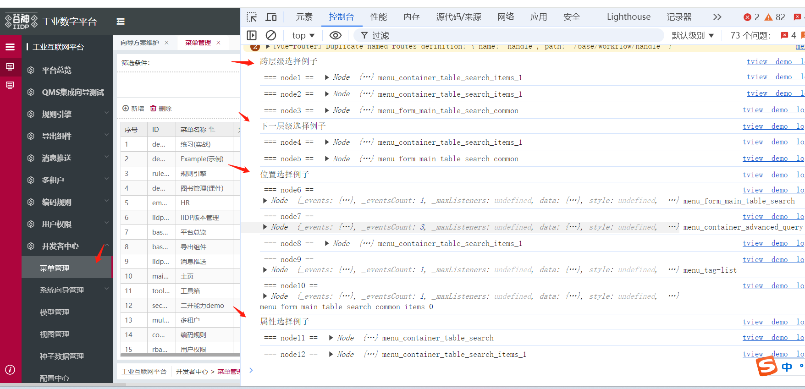
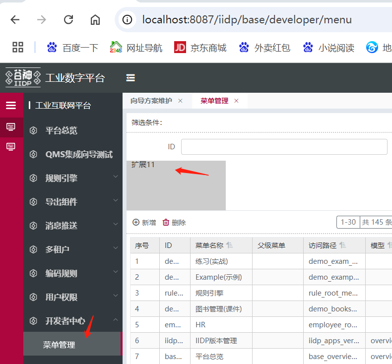
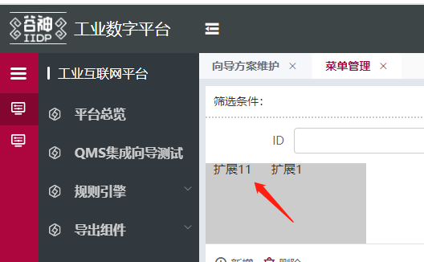
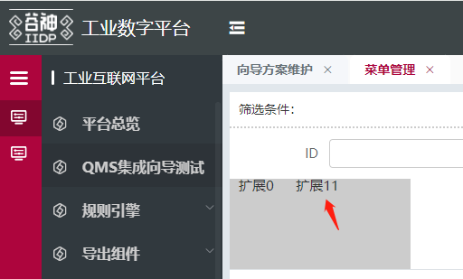

# 选择器 selector

## js 写法

```js
// $select 永远返回单个结果或者null
// 选择前一个节点实例
vm.$select('prev')
// 选择自己节点中第一个属性name == xxxx 的节点
vm.$select({
  attr: 'name',
  value: 'xxxx',
  relative:'children'
})

// 单选时可以使用链式调用
vm.$select('prev').$select(...)

// $selectAll 永远返回数组，多选
vm.$selectAll('brother')
```

## path 和 selector 配合

```js
{
	path: '$ds.data.b'  // 符合简写时，可直接解析，相对于自己
}

{
	path: '$ds.data.b',
	selector: 'xxx'      // 查找id === 'xxx' 的节点
}

{
	path: 'text',
	selector: 'xxx'      // 查找id === 'xxx' 的节点
}

{
	path: 'text',
	selector: {    // 查找id === 'xxx' 的节点
		value: 'xxx'
	}
}

{
	path: 'text',
	selector: {    // 查找属性含name的第一个节点
		attr: 'name',
		value: 'xxxx'
	}
}

{
	path: 'text',
	selector: { // 查找属性name的值等于 xxx 的第一个节点
		attr: 'name',
		value: 'xxx'
	}
}

{
	path: 'text',
	selector: { // 支持正则 查找属性名以name开头 且值是以xxx开头的节点, 暂不支持全局查找
		attr: /^name/,
		value: /^xxx/,
		relative: 'parent'
	}
}

{
	path: 'text',
	selector: { // 支持正则 查找属性名以name开头 且值是以xxx开头的节点
		attr: (data) => {return true},
		value: (data) => {return true}
	}
}

{
	path: 'text',
	selector: {    // 查找第一个type为table的父级节点
		attr: 'type',
		value: 'table',
		relative: 'parent
	}
}

{
	path: 'text',
	selector: {    // 查找第3个type为table的父级节点
		attr: 'type',
		value: 'table',
		relative: 'parent',
		index: 3
	}
}

{
	path: 'text',
	selector: {    // 查找第3个父级节点
		relative: 'parent',
		index: 3
	}
}

{
	path: 'text',
	selector: 'parent'      // 查找最近的父级节点
}

{
	path: 'text',
	selector: {    // 查找type为table的兄弟节点
		attr: 'type',
		value: 'table',
		relative: 'brother',
	}
}

{
	path: 'text',
	selector: 'brother' // 查找第所有兄弟节点
}

{
	path: 'text',
	selector: {    // 查找第3个兄弟节点
		relative: 'brother',
		index: 3
	}
}

{
	path: 'text',
	selector: 'next'      // 查找下一个兄弟节点
}

{
	selector: 'next2'
}

{
	path: 'text',
	selector: 'prev'      // 查找上一个兄弟节点
}

{
	selector: 'prev2'
}

{
	path: 'text',
	selector: 'children'
}

{
	path: 'text',
	selector: {    // 查找第3个子节点
		relative: 'children',
		index: 3
	}
}
```


## id 选择器
注：@tech/t-core >= 2.7版本

> 扩展中选择的 id 同样适用，详细用法：[扩展中选择的 id](/pages/287053/)

1、空格: 跨层级，在子孙节点中查找

2、\> : 下一层级，在直接的子节点中查找， >前后不要加空格

3、:first-child: 第一个子节点； :last-child: 最后一个子节点； :nth-child(xx): 第 xx 个子节点；

4、xxxxx[type=container]: 根据属性查找

	等于 = 'a[className=b]'

	以xx开头 ^= 'a[className^=b]'

	不等于 != 'a[className!=b]'

	带有xx属性 'a[className]'

	包含字符串 *= 'a[className*=b]'

	以xx结尾 $= 'a[className$=b]'

##### 注意：
	<div style="color: red;">id 选择器 第一个必须是当前菜单完整的id  为了节省性能</div>
	<div style="color: red;">例如： xxx_container_main 为当前菜单入口id   menu_container_main</div>

```js
  // 使用例子
  test_menu_id_extend_view: {
    type: 'custom',
    selector: {
      attr: 'id',
      value: 'menu_container_table_search items_1'
    },
    beforeOperate: (app, config, options) => {
      // 因为在注册前的钩子未渲染 所以先设置0延迟的异步
      setTimeout(() => {
        let vm = tech_app.page.getNode('menu_table_main');

        console.log('跨层级选择例子');
        // id为menu_container_table_search的节点的子孙后代id以items_1结尾的节点
        let node1 = vm.$select('menu_container_table_search items_1');
        console.log(' === node1 == ', node1, node1?.data?.id);
        let node2 = tech_app.page.getNode('menu_container_table_search items_1');
        console.log(' === node2 == ', node2, node2?.data?.id);
        // id为menu_container_table_search的节点的子孙后代id以items_1结尾的节点的子孙后代id以menu_form_main_table_search_common结尾的节点
        let node3 = vm.$select(
          'menu_container_table_search items_1 menu_form_main_table_search_common'
        );
        console.log(' === node3 == ', node3, node3?.data?.id);

        console.log('下一层级选择例子');
        // id为menu_container_table_search的节点的子节点id以items_1结尾的节点
        let node4 = vm.$select('menu_container_table_search>items_1');
        console.log(' === node4 == ', node4, node4?.data?.id);
        let node5 = vm.$select(
          'menu_container_table_search>items_1 menu_form_main_table_search_common'
        );
        console.log(' === node5 == ', node5, node5?.data?.id);

        console.log('位置选择例子');
        // id为menu_container_table_search的节点的第一个子节点
        let node6 = vm.$select('menu_container_table_search:first-child');
        console.log(' === node6 == ', node6, node6?.data?.id);
        // id为menu_container_table_search的节点的最后一个子节点
        let node7 = vm.$select('menu_container_table_search:last-child');
        console.log(' === node7 == ', node7, node7?.data?.id);
        // id为menu_container_table_search的节点的第二个子节点
        let node8 = vm.$select('menu_container_table_search:nth-child(1)');
        console.log(' === node8 == ', node8, node8?.data?.id);
        // id为menu_container_table_search的第一个子节点的下一个层级子节点中id以tag - list为结尾的节点;
        let node9 = vm.$select('menu_container_table_search:first-child>tag-list');
        console.log(' === node9 == ', node9, node9?.data?.id);
        let node10 = vm.$select(
          'menu_container_table_search menu_form_main_table_search_common:last-child'
        );
        console.log(' === node10 == ', node10, node10?.data?.id);

        console.log('属性选择例子');
        /**
        // 等于 = 'a[className=b]'
        // 以xx开头 ^= 'a[className^=b]'
        // 不等于 != 'a[className!=b]'
        // 带有xx属性 'a[className]'
        // 包含字符串 *= 'a[className*=b]'
        // 以xx结尾 $= 'a[className$=b]'
        */
        // id为menu_container_table_search且节点type属性以contain开头
        let node11 = vm.$select('menu_container_table_search[type^=contain]');
        console.log(' === node11 == ', node11, node11?.data?.id);
        // id为menu_container_table_search的节点的子孙后代id以items_1结尾且节点className属性=container-table-search-items1
        let node12 = vm.$select(
          'menu_container_table_search items_1[className=container-table-search-items1]'
        );
        console.log(' === node12 == ', node12, node12?.data?.id);
      });
      return config.view;
    },
    view: {}
  }
```
运行效果：



## id 选择器解决的问题

> 解决 id 变化导致扩展失败或者获取节点失败问题。

<div style="color: red;">
由于若开发者没有固定id , id则按结构动态生成 ，里面的 _items_ 是按动态生成的 
	例如 menu_items_0_items_1 或 menu_items_0_items_1_my_tag
</div>

```js
// 例如定义的节点
{
	type: 'container',
	id: 'test_container', // 有定义固定id
	items: [
		{
			type: 'input'
			// 没有定义固定id 运行时会按位置自动补全 id: 'test_container_items_0'
			// 因为是按结构运行时生成的id 所以经过多次扩展后 结构变了 id也会变化 原来的id选择代码会选不中
		}
	]
}
```

##### (1). id若里面没有包含 _items_则可用取完整的id来用
	例如： id: 'menu_abc' // 按原来的写法 可以不用id选择器
	
##### (2). id若里面中间包含 _items_则按空格跨层级取出来用
	例如 id: 'menu_items_0_items_1_my_tag'   使用id选择器 'menu my_tag'

	// 若不够精准仿效第3点 补上补上位置或特定属性

##### (3). id若里面结尾是 _items_数字 则按id选择器的 层级后缀 或 位置 或 特有属性来选择
	例如按空格后缀：id: 'menu_items_0_items_1'   使用id选择器 'menu items_1'
	
	例如按位置：id: 'menu_items_0_items_1'   使用id选择器 'menu:nth-child(0):nth-child(1)'
	例如按first last位置：id: 'menu_items_0_items_1'   使用id选择器 'menu:first-child:nth-child(1)'
	
	若不够精准可用在层级后 补上位置或特定属性：
	例如补上位置：id: 'menu_items_0_items_1'   使用id选择器 'menu>items_0:nth-child(1)' // >是下一层级 找到对应后缀 再找他第二个孩子
	例如补上属性：id: 'menu_items_0_items_1'   使用id选择器 'menu items_1[type^=contain]'


## id 选择器解决id变化场景例子
  ##### 扩展1：
  > 在搜索栏下扩展一个容器 再在容器的mounted方法里面updatePageNode动态扩展 带扩展1文案 的容器进去

  > 并且找到扩展1节点文案 改成 扩展11
```js
  // 扩展1
  // 在搜索栏下扩展一个容器 再在容器的mounted方法里面updatePageNode动态扩展 带扩展1文案 的容器进去
  // 并且找到扩展1节点文案 改成 扩展11
  test_menu_id_confict1_extend_view: {
    selector: {
      attr: 'id',
      value: 'menu_container_table_search_items_1'
    },
    type: 'after',
    beforeOperate: (app, config, options) => {
      console.log(' in 1 beforeOperate ');
      console.log(' === options == ', options, config);
      return config.view;
    },
    view: {
      type: 'container',
      id: 'my_t1_container',
      style: {
        width: '100%',
        height: '100px'
      },
      mounted: async (vm) => {
        console.log(' === in mounted == ', vm);
        let view = {
          type: 'container',
          // id: 'my_t1_container_items_0', // 自动补全的id
          style: {
            width: '200px',
            height: '100px',
            backgroundColor: '#ccc'
          },
          items: [
            {
              type: 'container',
              // id: 'my_t1_container_items_0_items_0', // 自动补全的id
              items: [
                {
                  type: 'container',
                  // id: 'my_t1_container_items_0_items_0_items_0', // 自动补全的id
                  items: [
                    {
                      // id: 'my_t1_container_items_0_items_0_items_0_items_0'
                      // id: 'test_container_text',
                      type: 'text',
                      value: '扩展1',
                      style: {
                        padding: '10px'
                      }
                    }
                  ]
                }
              ]
            }
          ]
        };
        tech_app.updatePageNode(view, vm, () => {
          vm.data.items.push(view);
        });

        // 例如200毫秒后再取id做逻辑 这里是模拟一个异步操作 业务上很多这种异步场景
        await new Promise((resolve) => setTimeout(resolve, 200));
        let node = vm.$select('my_t1_container_items_0_items_0_items_0_items_0'); // 原来的
        // let node = vm.$select('my_t1_container:first-child:first-child:first-child:last-child'); // 使用id选择器后的
        // 取到节点后把 扩展1 改成 扩展11
        if (node?.data) {
          node.data.value = '扩展11';
        }
      },
      items: []
    }
  },
```
只按扩展1运行的效果:


##### 扩展2
> 扩展了上面扩展1的 my_t1_container_items_0_items_0_items_0 节点 created方法时候 修改了他的孩子节点
```js
  // 扩展2
  // 扩展了上面扩展1的 my_t1_container_items_0_items_0_items_0 节点 created方法时候 修改了他的孩子节点
  test_menu_id_confict2_extend_view: {
    selector: {
      attr: 'id',
      // value: 'my_t1_container_items_0_items_0_items_0' // 原来的
      value: 'my_t1_container:first-child:first-child:first-child' // 按id选择器
    },
    type: 'merge',
    beforeOperate: (app, config, options) => {
      console.log(' in 2 beforeOperate ');
      console.log(' === options == ', options, config);
      return config.view;
    },
    view: {
      created: async (vm) => {
        vm.data.items = [];
        setTimeout(() => {
          let items = [
            {
              type: 'text',
              value: '扩展0',
              style: {
                padding: '10px'
              }
            },
            {
              type: 'text',
              value: '扩展1',
              style: {
                padding: '10px'
              }
            }
          ];
          items.map((view) => {
            tech_app.updatePageNode(view, vm, () => {
              vm.data.items.push(view);
            });
          });
        });
      }
    }
  }
```
按扩展1 扩展2一起运行的效果:

> 按扩展1的id选择 let node = vm.$select('my_t1_container_items_0_items_0_items_0_items_0');

> 会选中第一个

> 若开发者意图是选最后一个可以使用id选择器：

> let node = vm.$select('my_t1_container:first-child:first-child:first-child:last-child'); 

```js
let node = vm.$select('my_t1_container:first-child:first-child:first-child:last-child');
```
那最终扩展效果为：


