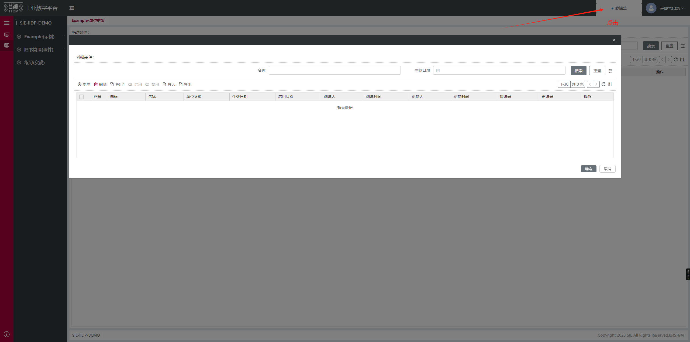
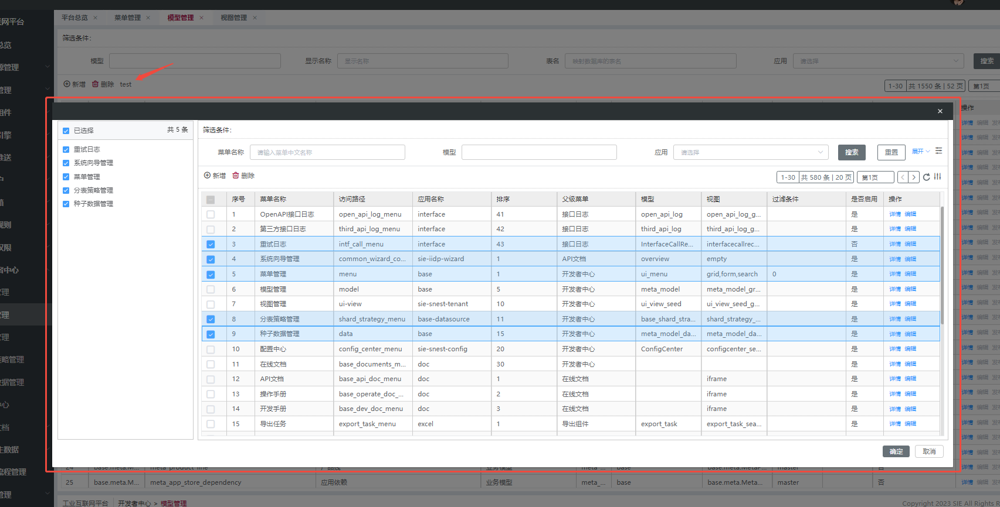
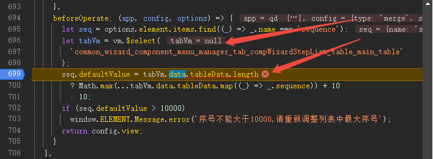

## 视图行为协议 - view, 打开后端视图 openView 配置

> 视图行为协议 view 属性，click 点击属性下一层级的 openView 后端视图配置  
> openView 配置会以加载的后端视图的展开到 click 的值对象里面
> click 的值对象下面配置更多的自定义属性 会合并到 openView 展开的前端视图里面
> 例如下面的 myAttr: 'aaa' 属性会合并到展开的 弹窗 dialog 属性里面，其他属性也会按名字合并

```js
{
	type: 'container',
	view: {
		click: { // 新视图节点定义
			openView: {
				showType: 'dialog', // 后端视图展示方式 支持：弹窗/抽屉/下拉 dialog/drawer/dropdown (可选配置) 不配置则默认以普通容器container展示
				title: '', // showType为dialog时有效，未配置时为空
				width: '', // showType为dialog时有效，未配置时默认80%
				marginTop: 100, // showType为dialog时有效，未配置时默认130
				preId: 'example_unit_fmk_001_', // 全局业务唯一标识前缀 不能重复
				model: 'example_unit_fmk', // 后端模型名
				type: 'form,grid,search', // 后端视图类型 多个类型以,逗号隔开
				// mergeEndData: (res, data) => { // 要合并的后端接口返回的 loadView data (可选配置)  合并和替换只能配置一个
				//   return {
				//    fields: {
				//     aaa: {}
				//   }
				//  }
				// },
				// replaceEndData: (vm, data) => { // 要替换的后端接口返回的 loadView data (可选配置)  合并和替换只能配置一个
				//   return {
				//    fields: {
				//     bbb: {}
				//   }
				//  }
				// }
			},
			myAttr: 'aaa',
			// 自定义按钮数组（确认按钮前）
			customButtons: [
				{
					text: '移除',
					action: 'remove',
					icon: 'el-icon-upload'
				},
			],
			// 点击按钮 showType是dialog的情况下
			bind_on_opreates: async (params) => {
				const { self: vm, value } = params
				if (params.value.type === 'remove') {
				// 点击了移除按钮
				} else if (params.value.type === 'confirm') {
				// 点击了确认按钮
				}
				value.close() // 关闭弹窗
			},
			... 其他视图配置
		}
	}
}
```

## 视图行为协议 openView 自定义 search、count、save

- 自定义查询：search、count;
- 自定义保存：save; 点击弹窗的确认按钮时会调用 api.save 配置的接口

> 不配置 api.save 时，openView 里面配置的 grid 不会触发接口，form 会触发默认的保存接口

```js
// 表格
{
	type: 'container',
	view: {
		click: {
			openView: {
				showType: 'dialog', 
				preId: 'example_unit_fmk_001_',
				model: 'example_unit_fmk',
				type: 'grid,search',
				api: {
					grid: {
						// 自定义查询
						search: {
							 params: {
								args: {
									// filter: [['id', '=', xxx]],
									// properties: ['name'],
									limit: 0 // limit=0 代表不分页
								}
								// model: 'xxx',
								// service: 'xxx'
							},
							reqPrep: (t, params) => {
								return params;
							},
							reqAfter: (vm, res) => {
								return res;
							}
						},
						// 自定义 count
						count: { // 不配置count时，默认使用api.grid.search的配置
							 params: {
								args: {
									// filter: [['id', '=', xxx]],
									// properties: ['name'],
									limit: 0 // limit=0 代表不分页
								}
								// model: 'xxx',
								// service: 'xxx'
							},
							reqPrep: (t, params) => {
								return params;
							},
							reqAfter: (vm, res) => {
								return res;
							}
						},
						// 自定义保存
						save: { // 点击弹窗的确认按钮时会调用此接口
							 params: {
								args: {
									// filter: [['id', '=', xxx]],
									// properties: ['name'],
									limit: 0, // limit=0 代表不分页
									mainId:'$table.mainRow.id', // 自定义参数，主页面中主表当前选中的行数据
									treeId:'$tree.tree.id' // 自定义参数，openView中主表当前选中的行数据
								}
								// model: 'xxx',
								// service: 'xxx'
							},
							reqPrep: (t, params) => {
								return params;
							},
							reqAfter: (vm, res) => {
								return res;
							}
						}
					}
				}
			}
		}
	}
}
// 表单
{
	type: 'container',
	view: {
		click: { 
			openView: {
				showType: 'dialog',
				preId: 'example_unit_fmk_001_',
				model: 'example_unit_fmk',
				type: 'form',
				api: {
					form: {
						search: {
							 params: {
								args: {
									// filter: [['id', '=', xxx]],
									// properties: ['name'],
								}
								// model: 'xxx',
								// service: 'xxx'
							},
							reqPrep: (t, params) => {
								return params;
							},
							reqAfter: (vm, res) => {
								return res;
							}
						}
					}
				}
			}
		}
	}
}

// 子表
view: {
	click: {
		openView: {
			showType: 'dialog',
			preId: 'example_demo_',
			model: 'ui_menu',
			type: 'form,grid',
			api: {
				form: {
					tabs: {
						 // 所属tab的field值,非Ert关系的子表配置 relateModel + unique，也可审查tab节点元素查看
						child_ids: {
							search: {
								reqPrep: (t, params) => {
									return params;
								},
								reqAfter: (vm, res) => {
									return res;
								}
							},
							count: {
								reqPrep: (t, params) => {
									return params;
								},
								reqAfter: (vm, res) => {
									return res;
								}
							}
						}
					}
				}
			},
		}
	}
}
```

## 视图行为协议 openView 自定义确认按钮事件 - confirm

- confirm 事件会在调用 api.save 后执行，没配则直接执行（form 会在默认保存接口后执行）
- confirm 事件内 `return false` 会中断弹框关闭
- 与 api 同级，配置 `"gridNoLoading":true`,`confirm` 事件执行时不会显示 loading

```js
{
	type: 'container',
	view: {
		click: { 
			openView: {
				showType: 'dialog',
				preId: 'example_unit_fmk_001_', 
				model: 'example_unit_fmk', 
				type: 'grid,search',
				confirm: (vm,result)=>{
					console.log(result)
					// return false // 中断弹框关闭
				},
				gridNoLoading:true,
				api: {
					grid: {
						save: { // 点击弹窗的确认按钮时会调用此接口
							 params: {
								args: {
									// filter: [['id', '=', xxx]],
									// properties: ['name'],
									limit: 0 // limit=0 代表不分页
								}
								// model: 'xxx',
								// service: 'xxx'
							},
							reqPrep: (t, params) => {
								return params;
							},
							reqAfter: (vm, res) => {
								return res;
							}
						}
					}
				}
			}
		}
	}
}
```

## openView - 表单默认值回填

只有显示表单时可用

```js
{
	type: 'container',
	view: {
		click: { 
			openView: {
				showType: 'dialog', 
				preId: 'example_unit_fmk_001_', 
				model: 'example_unit_fmk', 
				type: 'form', 
				customDefaultValue: [ // 注意：customDefaultValue只在新增的表单中生效,配置了isOpenViewRefDialog:false或者search的配置将无效
					{
						formName: "hlLocation", // 表单的回填属性
						formValue: "$table.mainRow.code", // 表单的回填值
						label: "", // 指定label，仅select、lookup可用
						labelInValue: true // 拉值的显示名跟值一致，label配置之后优先使用label，仅select、lookup可用
					}
				]
			}
		}
	}
}
```

## openView 的 loadView 接口钩子

通过 reqPrep 改变请求的入参、reqAfter 改变接口数据

```js
{
	type: 'container',
	view: {
		click: { 
			openView: {
				showType: 'dialog', 
				preId: 'example_unit_fmk_001_', 
				model: 'example_unit_fmk', 
				type: 'grid,search',
				api: {
                  loadView: {
                    reqPrep: (vm, options) => { // 改变openView的loadView接口入参
                      // options._cache = false  // _cache不缓存loadView参数
                      return options;
                    },
                    reqAfter: (vm, res) => { // 改变openView的loadView接口数据
                      return res;
                    }
                  }
				}
			}
		}
	}
}
```

## openView - isOpenViewRefDialog 将选中行的值带到按钮弹窗内

- **isOpenViewRefDialog: true** - 自动将当前表格选中行的数据带到弹窗表单中（最佳实践）
- 设置 true 且没有配置 api.form.search 时，会默认请求当前行的数据，回填到表单中

```js
{
    type: 'container',
        view: {
        click: { 
            openView: {
                showType: 'dialog',
				preId: 'example_unit_fmk_001_',
				isOpenViewRefDialog: true, // ** 【最佳实践】将选中行数据带到弹窗内 **
				model: 'example_unit_fmk', 
				type: 'grid,search', 
            }
        }
    }
}
```



## openView - openView 表格，配置多选模式

- 按钮配置打开 openView 的表格，可配置多选模式，左侧可展示已选择数据
- checkbox: 配置多选模式:multiple
- valueField: 配置多选模式下，选中的值字段
- labelField: 配置多选模式下，选中的显示字段
- confirm: 自定义确认事件，return false 可中断弹框关闭；可从表格节点的 transferSelected 获取已选择的所有数据

```js
{
  "type": "grid",
  "columns": [],
  "tbar": [
    {
      "name": "新增",
      "action": "create",
      "auth": "create"
    },
	{
      "name": "test",
      "action": "test",
      "auth": "test",
      "view": {
        "click": {
          "openView": {
            "showType": "dialog",
			"height": "60vh",
            "preId": "example_unit_fmk_001_",
            "model": "ui_menu",
            "type": "grid,search",
            "checkbox": "multiple",
            "valueField": "id",
            "labelField": "display_name",
			"confirm": (vm) => {const selectedData = vm.$select(vm.$ds.idPre + 'table_main_table').$ds.transferSelected;console.log('selectedData',selectedData)}
          }
        }
      }
    }
  ]
}

```



## openView - 无界模式

- openView 使用无界模式打开页面
  因为 openView 应用中存在很多被扩展的页面因 id 被添加了 openView 的 preId 前缀 id 无法正常显示扩展内容，所以需要使用无界模式打开页面。

```js
// 相关信息从menuConfig菜单信息获取
let microInfo = {
  name: vm?.$ds?.menuConfig?.label,
  model: vm?.$ds?.tableView?.data?.model,
  sequence: 0, // 多个页面情况下的序号
  view: "form",
  id: "uniquePreTagXXXX", // 业务标识唯一id
  menuId: vm?.$ds?.menuConfig?.id, // 菜单id
};
let tab = {
  id: microInfo.id + microInfo.sequence + microInfo.model, // 业务标识唯一id
  type: "container",
  items: [],
  view: {
    created: {
      // 新视图节点定义
      _reInit: true,
      _noCache: true,
      inheritData: false,
      openView: {
        micro: {
          type: "wujie", // 使用无界方式必须配置
          info: microInfo, // 使用无界方式必须配置
          path: vm?.$ds?.menuConfig?.label, // 使用无界方式必须配置
          degrade: true, // 可选择配置降级模式
          //主动降级设置，无界方案在有些浏览器上可能出现不兼容的情况(例如样式问题鼠标坐标问题等)，此时无界需要进行降级
        },
        preId: idPre + "_" + microInfo.sequence + microInfo.model + "_openview", // 全局业务唯一标识前缀 不能重复
        model: vm?.$ds?.tableView?.data?.model, // 后端模型名
        type: "form, grid, search", // 对应loadMenu 接口返回的view字段
        app: "base", // openView的app
      },
    },
  },
};
```

- 按需加载配置: 无界打开的页面扩展里获取不到上下文的情况，在 app 里的 config/app.json 里配置按需加载
  

```js
{
  "global": {},
  "effectPaths": { // 非必需配置
    "includeRegExp": ""
  }
}
```

## openView 协议参数

| 属性名              | 说明                                                                                 | 类型     | 可选值                               | 默认值    |
| ------------------- | ------------------------------------------------------------------------------------ | -------- | ------------------------------------ | --------- |
| showType            | openView 的展示形式                                                                  | string   | container/dialog/drawer/dropdown     | container |
| app                 | openView 内的接口 app                                                                | string   | 可选                                 | -         |
| preId               | id 前缀，会拼接在所有视图 id 前面                                                    | string   | 必填                                 | -         |
| title               | showType 为 dialog 时弹框标题                                                        | string   | 可选                                 | -         |
| width               | showType 为 dialog 和 drawer 时宽度，dialog 默认 80%,drawer 默认 45%                 | string   | 可选                                 | -         |
| marginTop           | showType 为 dialog 时生效，弹窗的上边距， 默认为 130                                 | number   | 可选                                 | 130       |
| model               | 请求视图模型                                                                         | string   | 可选，有该参数才去请求 loadView 接口 | -         |
| type                | 后端视图的别名，loadView 接口调使用                                                  | string   | 有 model 时必填                      | -         |
| api                 | 自定义 api 接口参数                                                                  | object   | 可选                                 | -         |
| confirm             | 确认按钮调用完 api 接口后执行的方法                                                  | function | 可选                                 | -         |
| customDefaultValue  | 自定义表单回填值，只有只显示表单时可用                                               | object   | 可选                                 | -         |
| isOpenViewRefDialog | 弹窗是否关联当前表格选中行数据                                                       | Boolean  | 可选                                 | -         |
| useAdvancedTable    | openView 是否使用高级表格配置，openView 默认无法使用高级表格功能，配置此项后可以使用 | Boolean  | 可选                                 |

## openView.customDefaultValue 参数

| 属性名    | 说明                                                                                | 类型   | 可选值 | 默认值 |
| --------- | ----------------------------------------------------------------------------------- | ------ | ------ | ------ |
| formName  | openView 中 form 的字段名                                                           | string | 可选   | -      |
| formValue | openView 中 form 的回填值，回填值参考[openView.api 参数获取](#openView.api参数获取) | string | 可选   | -      |

## openView.api 参数

| 属性名 | 说明            | 类型   | 可选值 | 默认值 |
| ------ | --------------- | ------ | ------ | ------ |
| form   | form 视图的 api | object | 可选   | -      |
| grid   | grid 视图的 api | object | 可选   | -      |

## openView.api.form | openView.api.grid 参数

| 属性名 | 说明                    | 类型   | 可选值 | 默认值                                                                                                                                  |
| ------ | ----------------------- | ------ | ------ | --------------------------------------------------------------------------------------------------------------------------------------- |
| search | 表格视图数据接口        | object | 可选   | 默认按配置的 model 获取的后端视图配置调用 search 接口                                                                                   |
| count  | 表格视图数据 count 接口 | object | 可选   | 默认按配置的 model 获取的后端视图配置调用 count 接口，如果配置了 search 没有 count，则 count 接口使用 search 的配置，只对 grid 视图有效 |
| save   | 点击确认按钮触发的接口  | object | 可选   | form 默认按详情页面保存按钮调用 update/create 接口，根据配置 openView 节点的 action                                                     |

## openView.api 参数获取

| 属性名                    | 说明                                                           | 类型   |
| ------------------------- | -------------------------------------------------------------- | ------ |
| $table.mainRow            | 主页面的主表格，当前选中行数据                                 | object |
| $table.mainCheckIdList    | 主页面的主表格，勾选数据的 id 集合，表格 check 为 true 时可用  | array  |
| $table.mainSubRow         | 主页面的子表格，当前选中行数据                                 | object |
| $table.mainSubCheckIdList | 主页面的子表格，勾选数据的 id 集合，表格 check 为 true 时可用  | array  |
| $table.row                | openView 主表格，当前选中行数据                                | object |
| $table.checkIdList        | openView 主表格，勾选数据的 id 集合，表格 check 为 true 时可用 | array  |
| $table.subRow             | openView 子表格，当前选中行数据                                | object |
| $table.subCheckIdList     | openView 子表格，勾选数据的 id 集合，表格 check 为 true 时可用 | array  |
| $tree.mainTree            | 主页面树，当前选中树节点数据                                   | object |
| $tree.tree                | openView 子表格，当前选中树节点数据                            | object |
| $form.mainForm            | 主页面的主表单，主表单数据                                     | object |
| $form.curForm             | openView 的表单，当前表单数据                                  | object |
| $search.mainSearch        | 主列表的 search，主列表的 search 表单数据                      | object |
| $search.subSearch         | 主页面的子表格的 search，主页面的子表格 search 表单数据        | object |
