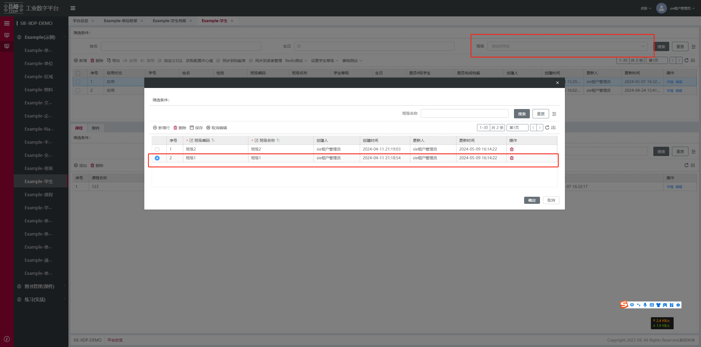
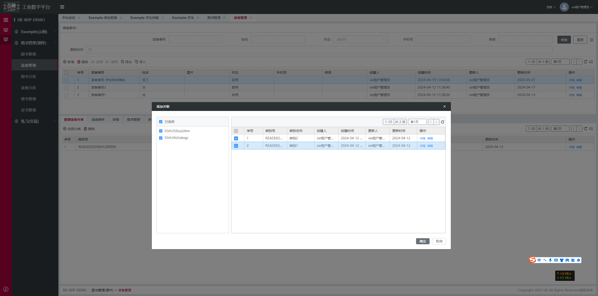
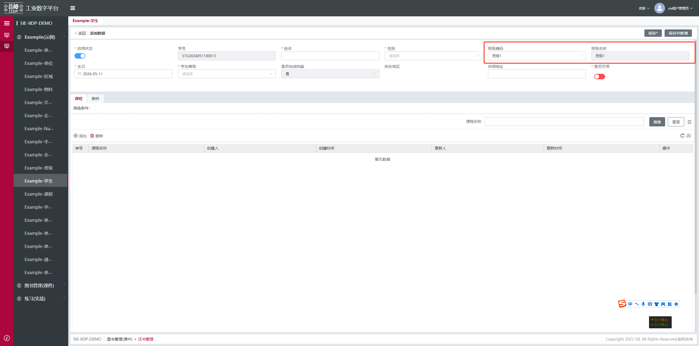
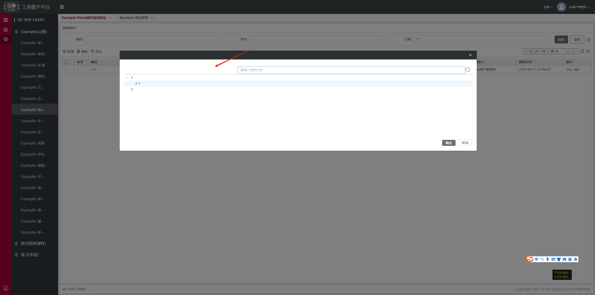

## 基础配置

当前表单项中，增加该配置可弹框选择数据，确认后回填表单
- useCustomClick: true  弹框选择的标识

view协议行为参数
- customClick： 弹框选择的协议类型
- 下级参数详见 **[openView协议](/pages/f8c496/)** 


效果图：单选：
"checkbox": "single"



多选："checkbox": "multiple"




## 回填当前表单项为下拉组件（select或lookup）
- valueField：所选行数据的选取值，默认取id
- labelField：所选行数据的展示值，默认取name
```js
{
  "name": "name",
  "useCustomClick": true, // 弹框选择的标识，必填配置
  "view": {
    "customClick": { // 弹框选择的协议类型
      "__parentId": "xxx", // 弹框挂载的节点，默认为当前form的id（__parentId 注意双下划线，否则会追加节点错误）
      "customSelect": {
        "showType": "dialog",
        "width": "", // 弹框宽度，非必填，默认60%
        "title": "", // 弹框标题，非必填，默认为空
        "hasFooter": true, // 弹框底部按钮，非必填，默认true
        "useOpenView": {
          "preId": "preId_",
          "model": "xxx",
          "type": "grid, search",
          "checkbox": "single",  // 单选'single', 多选''multiple'
          "valueField": "partName", // 所选行数据的选取值，默认取id
          "labelField": "partName", // 所选行数据的展示值，默认取name
        }
      }
    }
  }
}
```
## 回填当前表单项为输入框（input）

- valueField: 所选行数据的字段名
- onlyReturnValue：true

（不支持多选）
```js
{
  "name": "name",
  "useCustomClick": true, // 必填配置
  "view": {
    "customClick": {
      "_noCache": true, // 是否缓存，非必填，默认false
      "_reInit": true, // 是否重新初始化，非必填，默认false
      "__parentId": "xxx", // 弹框挂载的节点，默认为当前form的id（__parentId 注意双下划线，否则会追加节点错误）
      "customSelect": {
        "showType": "dialog",
        "useOpenView": {
          "preId": "preId_",
          "model": "item",
          "type": "item_listing_grid,item_listing_search",
          "checkbox": "single",
          "valueField": "partName",
          "onlyReturnValue": true // 为input时得设置返回值为value
        }
      }
    }
  }
}
```

## 回填其他表单项

当配置单选时，可以将选中的行数据中其他字段回填到其他表单项
- setFormValues：必填，要回填的其他表单项字段的Value
- setFormLabels：非必填，要回填的其他表单项字段值的label (若该表单项为输入框，则配置为null)
- getTableValues：必填，所选行数据的字段名

比如配置将所选行数据中的班级名称，赋值给表单的中的班级名称

```js
{
  "name": "type",
  "useCustomClick": true,
  "view": {
    "customClick": {
      "__parentId": "xxx", // 弹框挂载的节点，默认为当前form的id（__parentId 注意双下划线，否则会追加节点错误）
      "customSelect": {
        "showType": "dialog",
        "useOpenView": {
          "preId": "preId_",
          "model": "item",
          "type": "item_listing_grid,item_listing_search",
          "checkbox": "single",  // 单选'single', 多选''multiple'
          "valueField": "partType",
          "labelField": "partType",
          "setFormValues": "name", // 必填，多字段用逗号拼接
          "setFormLabels": "null", // 非必填，回填的表单项为输入框时为null，否则为表单项字段，多字段用逗号拼接
          "getTableValues": "name", // 必填，多字段用逗号拼接
        }
      }
    }
  }
}
```
## 自定义事件
- confirm: 平台默认的回填表单事件执行后的操作，result为弹框选择器选择的数据
- customClear: 配了弹框选择器的表单项自定义清除事件
```js
{
  "name": "name",
  "useCustomClick": true, // 弹框选择的标识，必填配置
  "view": {
    "customClick": { // 弹框选择的协议类型
      "__parentId": "xxx", // 弹框挂载的节点，默认为当前form的id （__parentId 注意双下划线，否则会追加节点错误）
      "customSelect": {
        "showType": "dialog",
        "width": "", // 弹框宽度，非必填，默认60%
        "title": "", // 弹框标题，非必填，默认为空
        "hasFooter": true, // 弹框底部按钮，非必填，默认true
        "useOpenView": {
          "preId": "preId_",
          "model": "xxx",
          "type": "grid, search",
          "checkbox": "single",  // 单选'single', 多选''multiple'
          "valueField": "partName", // 所选行数据的选取值，默认取id
          "labelField": "partName", // 所选行数据的展示值，默认取name
          "confirm": "(vm,result)=>{console.log(vm)}",
          "customClear": "(vm)=>{console.log(vm)}"
        }
      }
    }
  }
}
```


## 自定义视图查询及返回值等

在useOpenView里传入api 请参考[api配置](/pages/f8c496/#_3-8-2、视图行为协议openview-自定义查询)

```js
{
  "name": "status",
  "useCustomClick": true,
  "view": {
    "customClick": {
      "__parentId": "xxx", // 弹框挂载的节点，默认为当前form的id （__parentId 注意双下划线，否则会追加节点错误）
      "customSelect": {
        "showType": "dialog",
        "useOpenView": {
          "preId": "preId_",
          "model": "item",
          "type": "item_listing_grid,item_listing_search",
          "checkbox": "single",
          "api": {
          	"grid": {
          		"search": {
          			"params": {
          				"args": {
          					"limit": 0,
          					"mainId": "$table.mainRow.id",
          					"treeId": "$tree.tree.id"
          				}
          			}
          		}
          	}
          }
        }
      }
    }
  }
}
```

## 弹窗树选择器
- 当前表单项为lookup或select
- useSelectTree：弹框树选择器配置

httpMetaConfig为树数据源请求配置，请参考[httpMeta](/pages/e80dbe/#httpmeta-调用元模型api)
单选：


```js
{
  "name": "name",
  "useCustomClick": true,
  "view": {
    "customClick": {
      "customSelect": {
        "showType": "dialog",
        "useSelectTree": {
          "preId": "preId_",
          "type": "single",
          "httpMetaConfig": {
            "data": {
              "params": {
                "args": {
                  "filter": [],
                  "limit": 31,
                  "offset": 0,
                  "properties": ["name"],
                  "mainId": "$table.mainRow.id"
                },
                "model": "example_validate",
                "service": "search",
                "app": "sie-iidp-demo-example"
              }
            }
          }
        }
      }
    }
  }
}
```