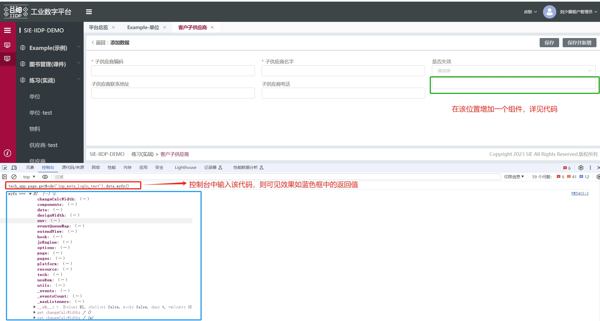

# 函数字符串转换协议

函数字符串转换 fn_str_xxx: "()=>{}"  转  xxx: () => {}

> 需要配置 useFnStr: true 开启使用 函数字符串转换


## API展示说明

```js
{
	type: 'input',
	id: 'inp_meta_login_test',
	useFnStr: true, // 开启使用 函数字符串转换 标识
	fn_str_myfn: '()=>{ console.log("myfn ===", window.tech_app) }', 
	// 调用例子： tech_app.page.getNode('inp_meta_login_test').data.myfn()
	myDeep: {
	fn_str_myfndeep: '()=>{ console.log("myfndeep ===", window.tech_app) }' 
	// 调用例子： tech_app.page.getNode('inp_meta_login_test').data.myDeep.myfndeep();
	},
	myArr: [
		{
			fn_str_myfn2: '()=>{ console.log("myfn2 ===", window.tech_app) }' s
			// 调用例子： tech_app.page.getNode('inp_meta_login_test').data.myArr[0].myfn2()
		}
	],
	myDeepArr: {
	  myArr: [
			{
				fn_str_myfn3: '()=>{ console.log("myfn3 ===", window.tech_app) }' 
				// 调用例子： tech_app.page.getNode('inp_meta_login_test').data.myDeepArr.myArr[0].myfn3()
			}
		]
	}
}
```


## 具体使用方法示例

首先根据需要进行扩展，在扩展的组件内进行操作。（在练习——客户子供应商，新增界面可见效果，打开F12，在控制台上输入调用示例：tech_app.page.getNode('inp_meta_login_test').data.myDeep.myfndeep();）

具体示例如下：

```js

//  函数字符串转换协议
  my_son_supply_extend_view: {
    type: 'after',
    selector: {
      attr: 'id',
      value: 'demo_exam_son_supplier_menu_form_main_detail_top_common_items_0_items_sonSupplierPhone'
    },
    view: {
      type: 'container',
      items: [
        {
          type: 'input',
          id: 'inp_meta_login_test',
          useFnStr: true, // 开启 fn_str转换标识
          fn_str_myfn: '()=>{ console.log("myfn ===", window.tech_app) }', // tech_app.page.getNode('inp_meta_login_test').data.myfn()
          myDeep: {
            fn_str_myfndeep: '()=>{ console.log("myfndeep ===", window.tech_app) }'
            // 调用例子： tech_app.page.getNode('inp_meta_login_test').data.myDeep.myfndeep();

          },
          myArr: [
            {
              fn_str_myfn2: '()=>{ console.log("myfn2 ===", window.tech_app) }'
              // 调用例子： tech_app.page.getNode('inp_meta_login_test').data.myArr[0].myfn2()            }
            }
          ],
          myDeepArr: {
            myArr: [
              {
                fn_str_myfn3: '()=>{ console.log("myfn3 ===", window.tech_app) }'
                // 调用例子： tech_app.page.getNode('inp_meta_login_test').data.myDeepArr.myArr[0].myfn3()
              }
            ]
          }
        }
      ]
    }
  }


```

## 效果展示图




