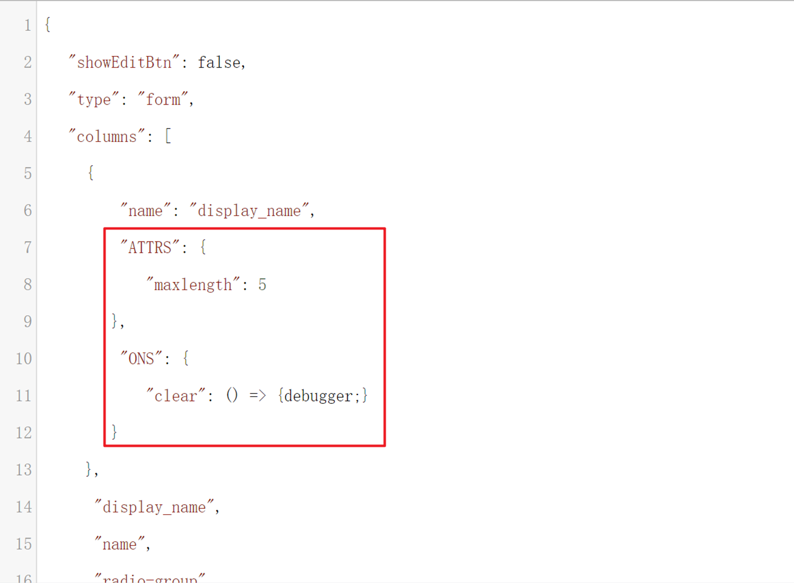

## 属性增强

使用平台组件时，未支持的属性（element-ui 文档上的属性在平台组件文档上的属性找不到时）使用 ATTRS：{ 属性名: 'xxxxx' }，
平台已支持的属性继续使用原来的用法。

```js
// 平台select组件没有提供'multiple-limit'属性，需要在ATTRS对象中传入
{
    type: 'select',
    name: 'select',
    text: '选择器',
    options: [
        { text: 'a', value: 1 },
        { text: 'b', value: 2 },
        { text: 'c', value: 3 }
    ],
    multiple: true,
    clearable: true,
    model: {
        select: [1]
    },
    ATTRS: {
        'multiple-limit': 2
    }
}
{
    type: 'radio-group',
    name: 'radio-group',
    text: '单选框',
    radioStyle: 'button',
    options: [
        { text: 'a', value: 1, ATTRS: [{xxx: 'xxx'}] }, // el-radio的属性
        { text: 'b', value: 2, ATTRS: [{xxx: 'xxx'}] }
    ],
    size: 'mini',
    ATTRS: { // el-radio-group的属性
        'text-color': 'red'
    }
}
```

## 事件

支持在组件传入 ONS 对象，对象里是 element-ui 的组件事件（events）

```js
{
    type: 'select',
    name: 'select',
    text: '选择器',
    options: [
        { text: 'a', value: 1 },
        { text: 'b', value: 2 }
    ],
    model: {
        select: [1]
    },
    ONS: {
        'remove-tag': (val) => {
            console.log(val)
        }
    }
}
```

## 视图配置


