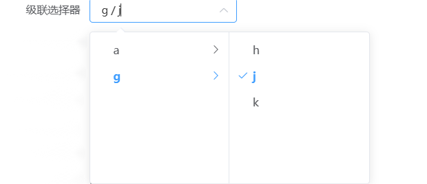

# 级联选择器



> 当一个数据集合有清晰的层级结构时，可通过级联选择器逐级查看并选择。

## 基本用法
```js
{
  type: 'cascader',
  name: 'cascader',
  text: '级联选择器',
  options: [{label: 'a', value: 1}],
  // 绑定change事件
  bind_on_changeHandler: (data) => { console.log(data) },
}
```
## Attributes
| 属性名 | 说明 | 类型 | 默认值 |
| ----- |----- |----- |----- |
|options |可选项数据源，键名可通过 Props 属性配置 |array |-  |
|props |配置选项，具体见下表 |object |-  |
|placeholder |输入框占位文本 |string |请选择  |
|filterable |是否可搜索选项 |boolean |-  |
|showAllLevels| 输入框中是否显示选中值的完整路径 | boolean | true | 


### Props
| 属性名 | 说明 | 类型 | 可选值 | 默认值 |
| ----- |----- |----- |----- |----- |
|expandTrigger |次级菜单的展开方式 |string |click / hover |click  |
|multiple |是否多选 |boolean |  |false  |
|emitPath |在选中节点改变时，是否返回由该节点所在的各级菜单的值所组成的数组，若设置 false，则只返回该节点的值 |boolean |  |true  |
|value |指定选项的值为选项对象的某个属性值 |string |  |value  |
|label |指定选项标签为选项对象的某个属性值 |string |  |label  |
|children |指定选项的子选项为选项对象的某个属性值 |string |  |children  |
|disabled |指定选项的禁用为选项对象的某个属性值 |string |  |disabled  |
|lazy |是否动态加载子节点，需与 lazyLoad 方法结合使用 |boolean |  |false  |
|lazyLoad |加载动态数据的方法，仅在 lazy 为 true 时有效	 |function(node, resolve)，node为当前点击的节点，resolve为数据加载完成的回调(必须调用)	 |  |   |
|checkStrictly|是否严格的遵守父子节点不互相关联(即是否可选择任意一级选项)|boolean |  | false |

## children
```js
{
  type: 'cascader',
  name: 'cascader',
  text: '级联选择器',
  options: [
    {
      label: 'a',
      value: 1,
      children: [
        {
          label: 'b',
          value: 2,
        }
      ]
    }
  ],
  getData: (vm) => {
    let params = {
      args:{
        filter:[],
        properties:['xxx','xxx'],
        order:'',
        useDisplayForModel:false
      },
      context:{'uid':'','lang':'zh_CN'},
      model:'xxx',
      tag:'master',
      service:'xxx',
      app:'xxx'
    };
    // 调接口获取选项数据
    const dataList = await vm.instance.Tech.metaApi.metaServe(
      params,{ base:vm?.instance?.$apiSevice?.base||vm?.tech?.apiHost }
    );
    // 将一维数组转换为树结构数据
    let tree = vm.instance.Tech.utils.arrayParseTree(
      dataList.data,
      {key:'id',children:'children',parentKey:'parent_id'},
      false,
      (a)=>{a.label=a.name;a.value=a.id}
    );
    vm.data.options = [];
    // 把选项数据添加到options中 或者return tree数据
    tree.forEach(item=>[vm.data.options.push(item)])
  },
  // 绑定change事件
  bind_on_changeHandler: (data) => { console.log(data) },
}

```

## lazyLoad
```js
{
  type: 'cascader',
  name: 'cascader',
  text: '级联选择器',
  options: [
    {
      label: 'a',
      value: 1
    }
  ],
  props:{
    lazy: true, // 懒加载
    lazyLoad (node, resolve) {  // 懒加载内容
    console.log(node.data.value); // 当前的节点，根据此次节点通过接口 查二级三级...
    let children = [ // 示例
        {
          label: 'b',
          value: '2'
        }
      ];
      resolve(children);
    }
  }
  // 绑定change事件
  bind_on_changeHandler: (data) => { console.log(data) },
}

```

## Events

| 事件名称          | 说明                                       | 回调参数                     |
| -----------------| ------------------------------------------ | ----------------------------|
| changeHandler    |  在选项变更时触发                            | (value: string | number)    |
| getData          | 获取选项数据                           | -                            |