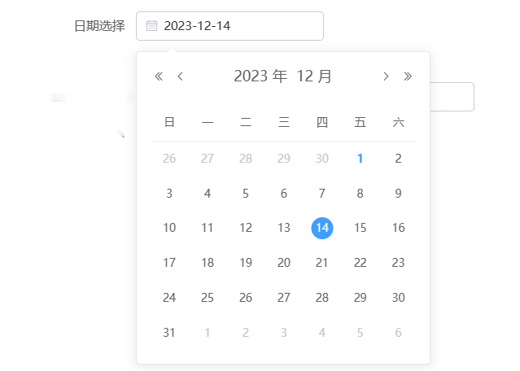
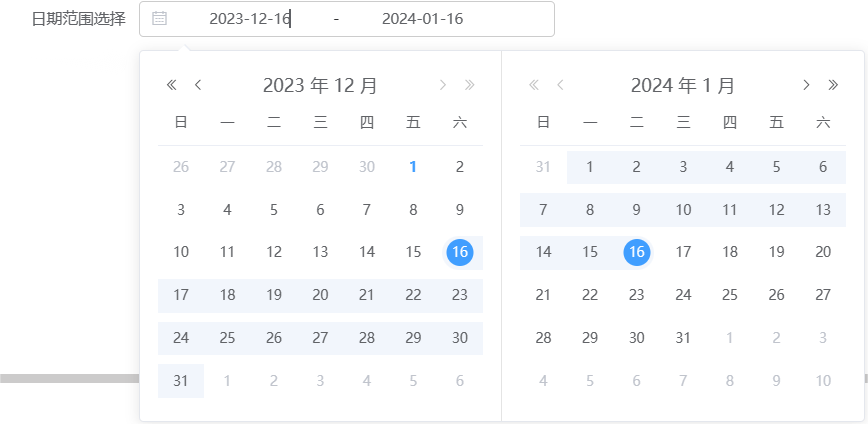
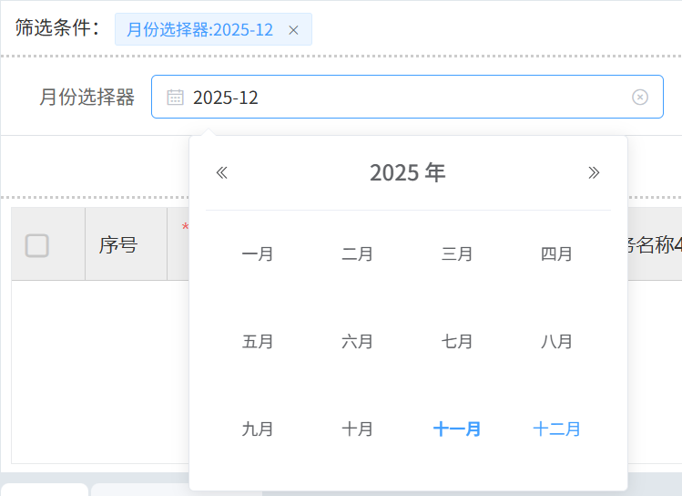
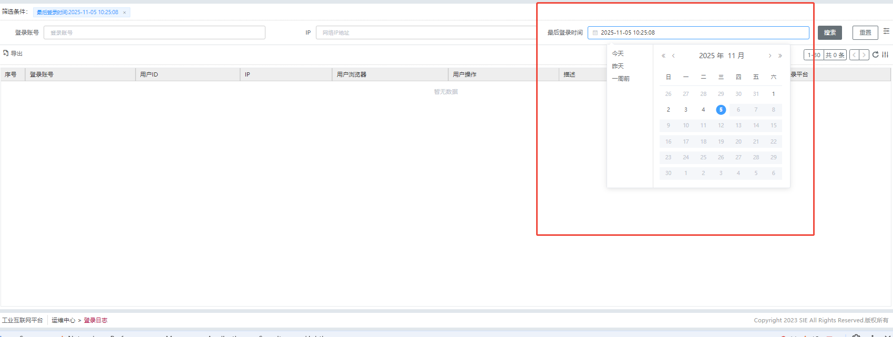

# 日期选择器

派生自[ElDatePicker](https://element.eleme.cn/#/zh-CN/component/date-picker)，因为框架自带 type 属性与 ElDatePicker 的属性 type 冲突，所以组件原属性 type 重命名为 pickerType

## 基本用法

### 日期选择

```js
// 日期选择
{
  "type": "datepicker",
  "pickerType": "date",
  "name": "date",
  "text": "日期选择",
  "placeholder": "请选择日期",
  "format": "yyyy-MM-dd",
  "defaultValueFn": "return new Date(window.Tech.moment().add(-3, 'd').startOf('day'))",// 返回Date，eg：日期默认三天前
  "bind_on_changeHandler": "(data) => { console.log(data) }",
}

```



### 日期范围选择

```js
// 日期范围选择
{
  "name": "daterange",
  "type": "datepicker",
  "widget": "daterange",
  "displayName": "日期范围选择",
  "dataType": "Date",//本字段如果在后端模型内不是 date 类型的话，需要再视图配置内指定
  "custom": true,
  "format": "yyyy-MM-dd",
  "valueFormat": "yyyy-MM-dd",
  "defaultValueFn":
      "return [new Date(window.Tech.moment().add(-3, 'd').startOf('day')), new Date(window.Tech.moment().startOf('day'))]", // 返回Date[]，eg：日期范围默认三天前到现在
},
```



### 月份选择器

```js
// 月份选择器
{
    "displayName": '月份选择器',
    "custom": true,
    "name": "serviceName",
    "type": "datepicker",
    "pickerType": "month",
    "valueFormat": "yyyy-MM",
    "format": "yyyy-MM",
    "dataType": "Date",//本字段如果在后端模型内不是 date 类型的话，需要再视图配置内指定
    "defaultValueFn": "return Tech.moment().add(1, 'month').format('YYYY-MM')",//设置默认值为当前时间的下个月
}
```



### pickerOptions

- 特有的选项,具体可配置选项参考 element 日期选择器
- disabledDate：禁用日期
- shortcuts: 快捷选项

```js
// 带快捷选项和禁用日期
{
  "type": 'datepicker',
  "pickerType": 'date',
  "format": 'yyyy-MM-dd',
  "name": 'last_login_time',
  "pickerOptions": {
    "disabledDate": (time) => {
      return time.getTime() > Date.now();
    },
    "shortcuts": [
      {
        "text": "今天",
        "onClick": (picker) => {
          picker.$emit('pick', new Date());
        }
      },
      {
        "text": "昨天",
        "onClick": (picker) => {
          const date = new Date();
          date.setTime(date.getTime() - 3600 * 1000 * 24);
          picker.$emit('pick', date);
        }
      },
      {
        "text": "一周前",
        "onClick": (picker) => {
          const date = new Date();
          date.setTime(date.getTime() - 3600 * 1000 * 24 * 7);
          picker.$emit('pick', date);
        }
      },
      // 用于范围选择器的快捷选项
      {
        text: '今年至今',
        onClick(picker) {
          const end = new Date();
          const start = new Date(new Date().getFullYear(), 0);
          picker.$emit('pick', [start, end]);
        }
      },
      // 用于范围选择器的快捷选项
      {
        text: '最近六个月',
        onClick(picker) {
          const end = new Date();
          const start = new Date();
          start.setMonth(start.getMonth() - 6);
          picker.$emit('pick', [start, end]);
        }
      }
    ]
  }
}
```



## Attributes

| 属性名         | 说明                                                                                     | 类型    | 默认值 | 可选值                                                                              |
| -------------- | ---------------------------------------------------------------------------------------- | ------- | ------ | ----------------------------------------------------------------------------------- |
| pickerType     | 显示类型                                                                                 | string  | date   | year/month/date/dates/months/years week/datetime/datetimerange/daterange/monthrange |
| format         | 输入框的格式                                                                             | string  | -      | 参考 element 日期选择器                                                             |
| defaultValueFn | 默认值                                                                                   | string  | -      |                                                                                     |
| placeholder    | 输入框占位文本                                                                           | string  | -      |                                                                                     |
| readonly       | 是否只读                                                                                 | boolean | false  |
| pickerOptions  | 特有的选项                                                                               | object  |        | 参考 element 日期选择器                                                             |
| 其他属性       | 请查看 [ElDatePicker](https://element.eleme.cn/#/zh-CN/component/date-picker#attributes) |         |        |                                                                                     |

## Events

| 事件名称      | 说明             | 回调参数       |
| ------------- | ---------------- | -------------- |
| changeHandler | 在日期变更时触发 | (data: object) |
