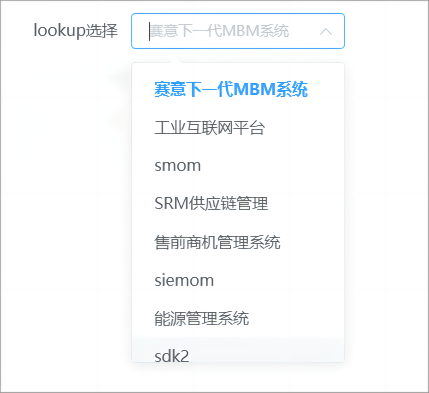

# lookup 选择器



## 基本用法

```js
{
  type: 'lookup',
  name: 'lookup',
  multiple: false,
  lookupConfig: {
    getData: () => {},
    paging: {}
  },
  bind_on_changeHandler: (data) => { console.log(data) },
  iscache:true,
  cache:''
}
```

## 后端视图中 lookup 修改入参

- 后端视图表单项字段中配置 arguments,内配置参考元模型

```js
{
      "displayName": "种类",
      "name": "xxxxx",
      "custom": true,
      "type": "lookup",
      "arguments": {
        "type": 'meta',
        "params": {
          "args": {
            "properties": [
              "name"
            ]
          },
          "service": "zzz",
          "model": "xxx"
        }
      },
      // 请求前修改参数的方法
       "reqPrep": "(vm, sendParams, config) => { sendParams.args.filter = [['receiptMark', '=', 2]]; return sendParams;}"
    },
```

- 示例配置
  仅作参考，具体业务具体定义

```js
  {
                      id: 'unit_lookup',
                      name: 'lookup组件',
                      type: 'form',
                      formConfig: {
                        inline: true,
                        labelPosition: 'right',
                        labelWidth: '120px'
                      },
                      ds_config: {
                        name: 'lookup',
                        type: 'meta',
                        method: 'service',
                        autoRequest: false,
                        options: {
                          params: {
                            model: 'meta_app_store',
                            service: 'lookup'
                          }
                        }
                      },
                      dataSource: {
                        lookup: [],
                        form: {
                          lookup: '',
                          lookup2: ''
                        }
                      },
                      items: [
                        {
                          type: 'lookup',
                          name: 'lookup',
                          text: 'lookup选择',
                          multiple: false,
                          arguments: {},
                          lookupConfig: {
                            bind_on_optionsUpdated: () => {},
                            getData: async (dataSource = {}, params, customFilter = [], f) => {
                              let res = await f.vm.request('lookup', {
                                service: 'lookup',
                                args: {
                                  field: 'product',
                                  limit: params.paging.end - params.paging.start + 2, // 21
                                  offset: params.paging.start - 1,
                                  keyword: params?.search || '' // 添加搜索参数
                                }
                              });

                              let items = [];
                              if (dataSource.transformRes) {
                                if (typeof params.transformRes === 'string') {
                                  dataSource.transformRes = new Function(
                                    'return ' + dataSource.transformRes
                                  )().bind(window);
                                }
                                items = dataSource.transformRes(res);
                              } else if (
                                Object.prototype.toString.call(res.data) === '[object Object]'
                              ) {
                                items = res.data.data.map((item) => {
                                  return {
                                    label: item[1],
                                    value: item[0]
                                  };
                                });
                              } else if (
                                Object.prototype.toString.call(res.data) === '[object Array]'
                              ) {
                                items = res.data.map((item) => {
                                  return {
                                    label: item.label,
                                    value: item.value
                                  };
                                });
                              }
                              return {
                                items
                              };
                            },
                            getCurVm: () => {},
                            paramApp: 'base',
                            paramModel: '',
                            paging: {
                              autoControll: true,
                              input: '1-20',
                              next: true,
                              prev: false,
                              totalCount: '···'
                            }
                          },
                          bind_on_changeHandler: (data) => {
                            console.log(data);
                          }
                        },
                        {
                          type: 'text',
                          text: '选择的值是',
                          bind_value: '$ds.form.lookup'
                        },
                        {
                          type: 'lookup',
                          name: 'lookup2',
                          text: 'lookup多选',
                          multiple: true,
                          lookupConfig: {
                            bind_on_optionsUpdated: () => {},
                            getData: async (dataSource = {}, params, customFilter = [], f) => {
                              let res = await f.vm.request('lookup', {
                                service: 'lookup',
                                args: {
                                  field: 'product',
                                  limit: params.paging.end - params.paging.start + 2, // 21
                                  offset: params.paging.start - 1,
                                  keyword: params?.search || '' // 添加搜索参数
                                }
                              });

                              let items = [];
                              if (dataSource.transformRes) {
                                if (typeof params.transformRes === 'string') {
                                  dataSource.transformRes = new Function(
                                    'return ' + dataSource.transformRes
                                  )().bind(window);
                                }
                                items = dataSource.transformRes(res);
                              } else if (
                                Object.prototype.toString.call(res.data) === '[object Object]'
                              ) {
                                items = res.data.data.map((item) => {
                                  return {
                                    label: item[1],
                                    value: item[0]
                                  };
                                });
                              } else if (
                                Object.prototype.toString.call(res.data) === '[object Array]'
                              ) {
                                items = res.data.map((item) => {
                                  return {
                                    label: item.label,
                                    value: item.value
                                  };
                                });
                              }
                              return {
                                items
                              };
                            },
                            getCurVm: () => {},
                            paramApp: 'base',
                            paramModel: '',
                            paging: {
                              autoControll: true,
                              input: '1-20',
                              next: true,
                              prev: false,
                              totalCount: '···'
                            }
                          }
                        },
                        {
                          type: 'text',
                          text: '选择的值是',
                          bind_value: '$ds.form.lookup'
                        }
                      ]
                    },

```

## Attributes

| 属性名       | 说明                        | 类型    | 默认值                                     |
| ------------ | --------------------------- | ------- | ------------------------------------------ |
| multiple     | 多选                        | boolean |                                            |
| collapseTags |  多选时是否将选中值按文字的形式展示 |boolean | false                                 |
| lookupConfig | 选择器配置，具体看下表      | object  | -                                          |
| arguments    | 元模型接口参数 可选参数     | object  | -                                          |
| reqPrep      | 请求前修改参数方法 可选参数 | object  | - "(vm,params,config) => {return params;}" |
| customFilter | 自定义筛选                  | array   | -                                          |
| iscache      | 是否开启本地缓存            | Boolean | false                                      |
| clearable    | 是否可清空                  | Boolean | true                                       |
| customOptions| 添加自定义选项              | Array | []                                       |

### LookupConfig

| 属性名  | 说明             | 类型                                                        | 默认值 |
| ------- | ---------------- | ----------------------------------------------------------- | ------ |
| getData | 获取 lookup 数据 | function(arguments, {config, paging, search}, customFilter) | -      |
| paging  | 分页             | object                                                      | -      |

## Events

| 事件名称          | 说明                                       | 回调参数                     |
| -----------------| ------------------------------------------ | ----------------------------|
| changeHandler    |  变更时触发                                 | (value: string | number)    |