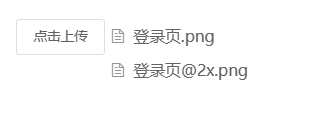
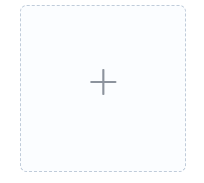

# 上传

> 通过点击或者拖拽上传文件


-上传文件（单选）


- 多选



-图片预览



上传成功后


鼠标放在图片上还支持预览和删除


## 基本用法

```js
{
  type: 'upload',
  name: 'upload',
  viewShow:true,//上传是否展示预览方式（图片）,一般只作用于上传文件为图片，配置viewShow时注意配置accept限制文件格式为图片。
  text: '上传',
  various: false,//配置这个属性需要配置items，可自行构造子节点形态
  // items:[]，
  content: '选择文件', // 多选时选择文件按钮内容
  multiple: false,
  accept:'.png,.jpeg,.bmp,.jpg,.png,.tif,.gif,.svg,.webp,.apng,.jpeg',
  limit: 1,
  autoUpload: true,//是否在选取文件后立即进行上传
  canDownload: false, // 是否可以下载
  showFileList: true, // 是否展示已上传文件列表
  handleSuccess: (response, file, fileList) => {},
  handleError: (err, file, fileList) => {},
  uploadApi: (param, uploadProgressEvent) => {
    // return Promise.resolve({
    //   result: {
    //     data: [param]
    //   }
    // })
    const paramsData = new FormData();
    paramsData.append('file', param.file);
    paramsData.append('model_id', tech_app.page.getNode('【填当前按钮节点id】').$ds._metaParamsModel);
    paramsData.append('uid', param.file.uid);
    paramsData.append('description', '');
    paramsData.append('bucketType', 'public'); // 按需配置，上传到minio公共桶；版本支持@tech/t-base: "^2.9.1-uat.001"
    return window.Tech.metaApi.metaUpload(paramsData, window.tech.apiHost, uploadProgressEvent);
    // 返回promise
    // param = {file: 文件对象, onSuccess, onError}
    // uploadProgressEvent 可选，用来测量操作进度的方法
  },
  downloadApi: (id) => {
     return window.Tech.metaApi.metaDownload(window.tech.apiHost, id);
    // 返回下载地址
    // id: 文件id
  },
  bind_on_handleSuccess: (vm) => {
    // file: 文件对象 fileList： 已上传文件数组 fileUidMap：文件uid与id的map类型数据
    const {file, fileList, fileUidMap} = vm.value
    console.log(vm.value)
    // 返回已上传成功的文件流列表
  },
  bind_on_handleRemove: (vm) => {
    console.log(vm.value)
    // 删除文件，返回已上传成功的文件流列表
  },
}
```

## Attributes

| 属性名        | 说明                                                        | 类型                               | 默认值 |
| ------------- | ----------------------------------------------------------- | ---------------------------------- | ------ |
| action        | 必选参数，上传的地址                                        | string                             | -      |
| multiple      | 是否支持多选文件                                            | boolean                            | -      |
| accept        | 接受上传的文件类型                                          | string                             | -      |
| limit         | 最大允许上传个数                                            | number                             | -      |
| handleSuccess | 文件上传成功时的钩子                                        | function(response, file, fileList) | -      |
| handleError   | 文件上传失败时的钩子                                        | function(err, file, fileList)      | -      |
| auto-upload   | 是否在选取文件后立即进行上传                                | boolean                            | true   |
| uploadApi     | 元模型文件上传 api，接收参数：{file}, (progressEvent) => {} | function                           | -      |
| downloadApi   | 文件下载 api，接收参数：id                                  | function                           | -      |
| viewShow      | 上传是否展示预览方式                                        | boolean                            | false  |
| various       | 上传组件是否可自行构造形态                                  | boolean                            | false  |
| showFileList  | 是否展示已上传文件列表                                      | boolean                            | true   |

# 文件预览

## 表格单元格内的文件预览

```js
 {
      "displayName": "文件编码",
      "name": "fileCode",
      "hidden": true,
      "type": "link",
      "href": "/snest/base/base_developer_center/ui_view_seed_menu?page=techFilePreview&fileId=039c020dy5erk"//文件id
      "href": "/snest/base/base_developer_center/ui_view_seed_menu?page=techFilePreview&filePath=xxx"//支持配置文件路径
    },

```

## 文件预览需要安装预览 App

(本地启动服务)

```js
"filePreview": {
     "master": {
       "tech-filePreview": "http://192.168.175.198:9999/webApps/tech-filePreview/1.0.0/config/app.json"
     }
   },

```

## 图片预览后端视图配置

```js

          {
            "label": "现场照片",
            "name": "photo",
            "custom": true,
            "viewShow": true,
            "accept": ".png"
          }
          ``
```
